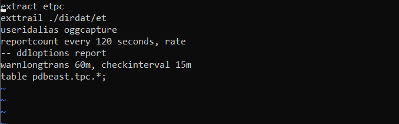

# MySql to Oracle

## Introduction

This lab is intended to give you familiarity with how to configure GG for database to database replication. If you are already familiar with GG, you can choose to skip this lab.
In this lab we will load data in MySQL database ‘ggsource’. The GG extract process ‘extmysql’ will
capture the changes from MySQL’s binary logs and write them to the local trail file. The pump process
‘pmpmysql’ will route the data from the local trail (on the source) to the remote trail (on the target). The replicat process ‘repmysql’ will read the remote trail files, and apply the changes to the MySQL database ‘ggtarget’

*Estimated Lab Time*: 60 minutes

### Objectives
Replication from relational source to a relational target using GoldenGate

### Prerequisites
This lab assumes you have:
- A Free Tier, Paid or LiveLabs Oracle Cloud account
- SSH Private Key to access the host via SSH
- You have completed:
    - Lab: Generate SSH Keys
    - Lab: Prepare Setup
    - Lab: Environment Setup
    - Lab: Configure GoldenGate

Time to Complete -
Approximately 60 minutes

## Task 1: - GoldenGate for Oracle Capture

1. Open a terminal session and enter GGSCI for the Oracle side


````
 <copy>ssh -i (sshkey) opc@xxx.xxx.xx.xxx</copy>
````
````
<copy>sudo su - oracle</copy>
````
````
<copy>cd $OGG_HOME
./ggsci</copy>
````

2. **Oracle data capture**

To configure the Oracle Integrated Extract:
Execute the GGSCI command:

````
<copy>edit param etpc</copy>
````
3. Enter the following settings:


````
	       <copy>extract etpc
          exttrail ./dirdat/et
          useridalias oggcapture
          reportcount every 120 seconds, rate
          ddloptions report
          warnlongtrans 60m, checkinterval 15m
          table pdbeast.tpc.*;</copy>

````

4. Add the parameter that will cause Integrated Extract to capture DDL operations that are of mapped scope.
Add the parameter that will cause Integrated Extract to encrypt its OGG Trail files.

5. Save and close the file.

**Data transmission to MySQL**

This is not technically required because the OGG and MySQL installations are on the same machine. However, if data is being transmitted over a LAN/WAN an Extract Data Pump is required.
To configure the Oracle to MySQL Extract Data Pump:

6. Execute the GGSCI command:

````
<copy>edit param pmysql</copy>
````

7. Enter the following settings:

````
<copy>extract pmysql
rmthost localhost, mgrport 7810
rmttrail ./dirdat/rt
reportcount every 120 seconds, rate
table pdbeast.tpc.*;</copy>
````

8. Add the RMTHOST option that will cause the Extract Data Pump to encrypt data transmissions with the aes256 algorithm.

9. Save and close the file.

**Oracle data apply**

To configure the Parallel Replicat:

10. Execute the GGSCI command

````
<copy>edit param rtpc</copy>
````

11. Enter the following settings:

````
<copy>replicat rtpc
useridalias ggapplywest
map_parallelism 3
split_trans_recs 1000
ddl include mapped
-- ddloptions report
reportcount every 120 seconds, rate
map pdbeast.tpc.*, target pdbwest.tpc.*;</copy>
````   

Add the parameters to auto-tune the number of Appliers; with a minimum of 3 and a maximum of 12

12. Save and close the file.

## Task 2: - GoldenGate MySQL Data Apply

**MySQL data apply**

To configure the Coordinated Replicat in the MySQL OGG environment:

1. Execute the GGSCI command

````
<copy>./ggsci</copy>
````

````
<copy>edit param rtpc</copy>
````

2. Enter the following settings:

````     
<copy>replicat rtpc
targetdb tpc@localhost:3306, useridalias ggapply
reportcount every 120 seconds, rate
usededicatedcoordinationthread
map pdbeast.tpc.categories, target "tpc"."categories", thread (20);
map pdbeast.tpc.categories_description, target "tpc"."categories_description", thread (20);
map pdbeast.tpc.customers, target "tpc"."customers", thread (20);
map pdbeast.tpc.customers_info, target "tpc"."customers_info", thread (20);
map pdbeast.tpc.customers_lkup, target "tpc"."customers_lkup", thread (20);
map pdbeast.tpc.next_cust, target "tpc"."next_cust", thread (20);
map pdbeast.tpc.next_order, target "tpc"."next_order", thread (20);
map pdbeast.tpc.orders_total, target "tpc"."orders_total", thread (20);
map pdbeast.tpc.orders, target "tpc"."orders", thread (1);
map pdbeast.tpc.orders_products, target "tpc"."orders_products", threadrange (2-4);
map pdbeast.tpc.orders_status_history, target "tpc"."orders_status_history", threadrange (6-7);
map pdbeast.tpc.products, target "tpc"."products", thread (20);
map pdbeast.tpc.products_description, target "tpc"."products_description", thread (20);
map pdbeast.tpc.products_to_categories, target "tpc"."products_to_categories", thread (20);
map pdbeast.tpc.test, target "tpc"."test", thread (20);</copy>
````

3. Enter "MAP" statements for the following

  - Operations for the table "tpc.orders" are to be applied by thread 1.
  - Operations for the table "tpc.orders_products" and to be ranged across threads 2, 3, and 4.
  - Operations for the table "tpc.orders_status_history" are to be ranged across threads 6 and 7.

4. Save and close the file.

5. Enable schema level supplemental logging in source.

6. To enable schema level supplemental logging in the source Oracle PDB:

7. Execute the GGSCI commands

````
<copy>./ggsci</copy>
````

````
<copy>dblogin useridalias oggcapture
add schematrandata pdbeast.tpc</copy>
````


## Task 3: - GoldenGate for Oracle Integrated Extract and Apply

1. **Oracle Integrated Extract:**

````
<copy>./ggsci</copy>
````
````
<copy>dblogin useridalias oggcapture</copy>
````

````
<copy>add extract etpc, integrated tranlog, begin now</copy>
````

````
<copy>register extract etpc, database, container (*)</copy>
````

````
<copy>add exttrail ./dirdat/et, extract etpc, megabytes 250</copy>
````

2. **Oracle Extract Data Pump:**

````
<copy>./ggsci</copy>
````

````
<copy>add extract pmysql, exttrailsource ./dirdat/et</copy>
````

````
<copy>add rmttrail ./dirdat/rt, extract pmysql, megabytes 250</copy>
````

3. **Oracle Parallel Apply**

````
<copy>./ggsci</copy>
````

````
<copy>dblogin useridalias ggapplywest</copy>
````

````
<copy>add replicat rtpc, parallel, exttrail ./dirdat/et, checkpointtable pdbwest.ggadmin.ggchkpoint</copy>
````

## Task 4: - GoldenGate for non-Oracle coordinated Replicat

**MySQL Coordinated Replicat**

````
<copy>./ggsci</copy>
````

````
<copy>dblogin sourcedb ggadmin@db-ora19-mysql:3306, useridalias ggrep</copy>
````

````
<copy>add replicat rtpc, coordinated, exttrail ./dirdat/rt</copy>
````

1. Start OGG and generate data
Start the OGG environment:

````
<copy>./ggsci</copy>
````

2. **Oracle:**

````
<copy>start er *</copy>
````   

3. **MySQL:**

````
<copy>start er *</copy>
````

4. Verify all OGG Groups are running.
Generate data


In the window connected to the database server:
Change to the "/Test_Software/Scripts/Oracle/orderentry" directory.

5. Login to the database as the user "tpc"

````
<copy>sqlplus tpc@pdbeast</copy>
````
When prompted enter the password: Oracle1

6. At the SQL> prompt, enter:

````
<copy>@gentrans.sql</copy>
````

Enter "100" at the prompt, and return.

## Task 5: - GoldenGate - Verify Replication

1. Verify data has been replicated

Check that all OGG Groups remain running.			

For any STOPPED or ABEND groups, view their report file to find the error.

````
<copy>./ggsci</copy>
````
2. **view report xxxx**

Use the ggsci "stats" command to see how many operations were processed by each Extract and Replicat.

3. **stats xxxx total**

Use the ggsci "view report" command to see how many operations were processed per second by each Extract and Replicat.

For MySQL,

4. use the ggsci command "info rtpc, detail" to see how many Replicats were spawned.

````
<copy>info rtpc, detail</copy>
````

On the database server:
5. Login to PDBWEST as ggadmin:
````
<copy>sqlplus ggadmin@pdbwest</copy>
````

When prompted enter the password: Oracle1

6. Execute the following query to see additional information about lag:  

````
<copy>set heap on
set wrap off
set line 300
column Extract format a9
column Data_Pump format a10
column Replicat format a9</copy>
````

  7. Execute the following query

````
<copy>select to_char(incoming_heartbeat_ts,'DD-MON-YY HH24:MI:SSxFF') Source_HB_Ts
incoming_extract Extract
extract (day from (incoming_extract_ts - incoming_heartbeat_ts))*24*60*60+
extract (hour from (incoming_extract_ts - incoming_heartbeat_ts))*60*60+
extract (minute from (incoming_extract_ts - incoming_heartbeat_ts))*60+
extract (second from (incoming_extract_ts - incoming_heartbeat_ts)) Extract_Lag
incoming_routing_path Data_Pump
extract (day from (incoming_routing_ts - incoming_extract_ts))*24*60*60+
extract (hour from (incoming_routing_ts - incoming_extract_ts))*60*60+
extract (minute from (incoming_routing_ts - incoming_extract_ts))*60+
extract (second from (incoming_routing_ts - incoming_extract_ts)) Data_Pump_Read_Lag
incoming_replicat Replicat
extract (day from (incoming_replicat_ts - incoming_routing_ts))*24*60*60+
extract (hour from (incoming_replicat_ts - incoming_routing_ts))*60*60+
extract (minute from (incoming_replicat_ts - incoming_routing_ts))*60+
extract (second from (incoming_replicat_ts - incoming_routing_ts)) Replicat_Read_Lag
extract (day from (heartbeat_received_ts - incoming_replicat_ts))*24*60*60+
extract (hour from (heartbeat_received_ts - incoming_replicat_ts))*60*60+
extract (minute from (heartbeat_received_ts - incoming_replicat_ts))*60+
extract (second from (heartbeat_received_ts - incoming_replicat_ts)) Replicat_Apply_Lag
extract (day from (heartbeat_received_ts - incoming_heartbeat_ts))*24*60*60+
extract (hour from (heartbeat_received_ts - incoming_heartbeat_ts))*60*60+
extract (minute from (heartbeat_received_ts - incoming_heartbeat_ts))*60+
extract (second from (heartbeat_received_ts - incoming_heartbeat_ts)) Total_Lag
from ggadmin.gg_heartbeat_history order by heartbeat_received_ts desc;</copy>
````

## Task 6: - GoldenGate - Replicate DDL

1. Replicate Oracle DDL
On the database server:

2. Login to PDBEAST as tpc:

````
<copy>sqlplus tpc@pdbeast</copy>
````

When prompted enter the password: Oracle1

3. Execute the following:

````
<copy>create table ddltest (
cola number(15,0) not null,
colb timestamp(6) not null,
colc varchar(100),
primary key (cola)
);
insert into ddltest values (1, CURRENT_TIMESTAMP, 'Row 1 insert');
insert into ddltest values (2, CURRENT_TIMESTAMP, 'Row 2 insert');
insert into ddltest values (3, CURRENT_TIMESTAMP, 'Row 3 insert');
insert into ddltest values (4, CURRENT_TIMESTAMP, 'Row 4 insert');
insert into ddltest values (5, CURRENT_TIMESTAMP, 'Row 5 insert');
commit;

update ddltest set colb=CURRENT_TIMESTAMP, colc='Row 3 update' where cola=3;
delete from ddltest where cola=2;
commit;</copy>
````

4. View the Oracle Replicat report file to validate the DDL was applied.
Execute the GGSCI "stats" command to see information for the table ddltest

````
<copy>stats rtpc, table pdbwest.tpc.ddltest</copy>
````

 5. Shutdown all Extracts and Replicats.

You may now *proceed to the next lab*.

## Learn More

* [Oracle GoldenGate for Big Data 19c | Oracle](https://www.oracle.com/middleware/data-integration/goldengate/big-data/)

## Acknowledgements
* **Author** - Brian Elliott, Data Integration November 2020
* **Contributors** - Madhu Kumar, Rene Fontcha, Andrew Hong
* **Last Updated By/Date** -Andrew Hong, Solution Engineer, March 2022


