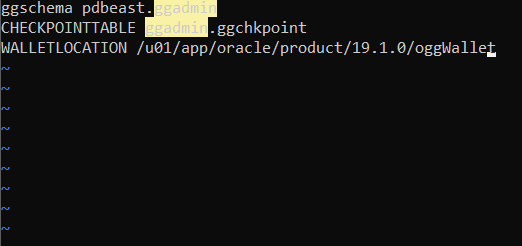
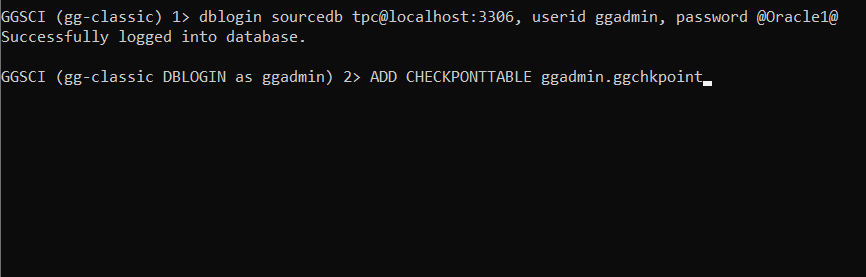
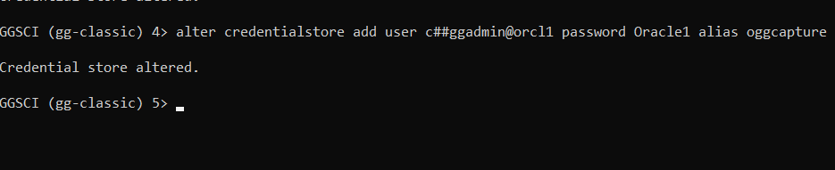
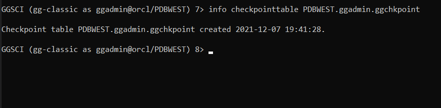
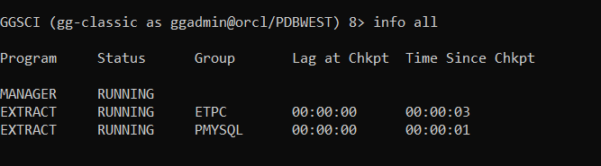
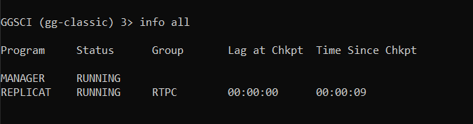

# Oracle to MySql

## Introduction

This lab is intended to give you familiarity with how to configure GG for database to database replication. If you are already familiar with GG, you can choose to skip this lab.
In this lab we will load data in MySQL database ‘ggsource’. The GG extract process ‘extmysql’ will
capture the changes from MySQL’s binary logs and write them to the local trail file. The pump process
‘pmpmysql’ will route the data from the local trail (on the source) to the remote trail (on the target). The replicat process ‘repmysql’ will read the remote trail files, and apply the changes to the MySQL database ‘ggtarget’

*Estimated Lab Time*: 60 minutes

### Objectives
Replication from relational source to a relational target using GoldenGate

### Prerequisites
This lab assumes you have:
- A Free Tier, Paid or LiveLabs Oracle Cloud account
- SSH Private Key to access the host via SSH
- You have completed:
    - Lab: Generate SSH Keys
    - Lab: Prepare Setup
    - Lab: Environment Setup
    - Lab: Configure GoldenGate

## Task 1: GoldenGate for Oracle

Open a terminal session


````
<copy>ssh -i (sshkey) opc@xxx.xxx.xx.xxx</copy>
````
````
<copy>sudo su - oracle</copy>
````
1. Create the folder /u01/app/oracle/product/19.1.0/oggWallet
````
<copy>mkdir /u01/app/oracle/product/19.1.0/oggWallet</copy>
````

2. GLOBALS configuration Oracle



In the GoldenGate home directory for Oracle, edit the file GLOBALS

````
<copy>vi /u01/app/oracle/product/19.1.0/gg/GLOBALS</copy>
````
Input the following parameters into the file GLOBALS

````
<copy>ggschema pdbeast.ggadmin
CHECKPOINTTABLE ggadmin.ggchkpoint
WALLETLOCATION /u01/app/oracle/product/19.1.0/oggWallet</copy>
````
3. GLOBALS configuration MySQL


In the Goldengate home directory for MySQL, edit the file GLOBALS
````
<copy>vi /u01/app/oracle/product/19.1.0/oggmysql/GLOBALS</copy>
````
Input the following parameters into the file GLOBALS

```
<copy>ggschema ggadmin
CHECKPOINTTABLE ggadmin.ggchkpoint
WALLETLOCATION /u01/app/oracle/product/19.1.0/oggWallet</copy>
```
## Task 2:- GoldenGate for non-Oracle (MySQL)

````
<copy>vi /u01/app/oracle/product/19.1.0/oggmysql/GLOBALS</copy>
````
Input the following parameters into the file GLOBALS

```
<copy>ggschema ggadmin
CHECKPOINTTABLE ggadmin.ggchkpoint
WALLETLOCATION /u01/app/oracle/product/19.1.0/oggWallet</copy>
```
## Task 2:- GoldenGate for non-Oracle (MySQL)

Open a terminal session. This session will be used for configuring the MySQL side
````
<copy>ssh -i (sshkey) opc@xxx.xxx.xx.xxx</copy>
````
````
<copy>sudo su - oracle</copy>
````

1. Configure MySQL target

Configure GG Home for MySQL
````
<copy>export OGG_HOME=/u01/app/oracle/product/19.1.0/oggmysql</copy>
````

Open GGSCI
````
<copy>cd $OGG_HOME
./ggsci</copy>
````
2. Log in to the database as ggadmin and add a checkpointtable



````
<copy>dblogin sourcedb tpc@localhost:3306, userid ggadmin, password @Oracle1@</copy>
````

````
<copy>ADD CHECKPOINTTABLE ggadmin.ggchkpoint</copy>
````

3. Start the GoldenGate Software Command Interpreter in another window for configuring the Oracle side
````
<copy>ssh -i (sshkey) opc@xxx.xxx.xx.xxx</copy>
````
````
<copy>sudo su - oracle</copy>
````
````
<copy>cd $OGG_HOME
./ggsci</copy>
````

4. **OGG Credential Store**

In GGSCI, create the OGG Credential Store by executing the command in both sessions:
````
<copy>add credentialstore</copy>
````

6. Add credentials on the Oracle side



````
<copy>alter credentialstore add user c##ggadmin@orcl password Oracle1 alias oggcapture</copy>

````
````
<copy>alter credentialstore add user ggadmin@pdbeast password Oracle1 alias ggapplyeast</copy>
````
````
<copy>alter credentialstore add user ggadmin@pdbwest password Oracle1 alias ggapplywest</copy>
````

7. Add credentials on the MySQL side
````
<copy>alter credentialstore add user ggadmin password @Oracle1@ alias oggcapture</copy>
````
````
<copy>alter credentialstore add user ggrep password @Oracle1@ alias ggapply</copy>
````


## Task 3:- OGG Master Key and Wallet

1. In the Oracle GGSCI, create the OGG Wallet.
Command:

````
<copy>CREATE WALLET</copy>
````

2. Add the OGG Masterkey to the wallet.

**Oracle GG**

````
<copy>open wallet</copy>
````
````
<copy>add masterkey</copy>
````
3.  Verify the Master Key and Wallet from the MySQL GGSCI instance.

````
<copy>dblogin sourcedb tpc@localhost:3306, userid ggadmin, password @Oracle1@</copy>
````

4. **MySQL:**

````
<copy>open wallet</copy>
````
````
<copy>info masterkey</copy>
````

5. **Oracle:**


````
<copy>open wallet</copy>
````

````
<copy>info masterkey</copy>
````

## Task 4:- GoldenGate Checkpoint Table
In SQLplus, make sure the pluggable databases PDBEAST and PDBWEST are open.

In the Oracle side terminal session:
````
<copy>sqlplus / as sysdba</copy>
````
````
<copy>show pdbs;</copy>
````
If the pluggable databases PDBEAST and PDBWEST are not in read write mode, set them to open:
````
<copy>alter pluggable database PDBEAST open;
alter pluggable database PDBWEST open;</copy>
````

1.  In GGSCI, create the OGG Replicat Checkpoint Table by executing the commands:

2. **Oracle**

Connect to the target database:
````
<copy>dblogin useridalias ggapplywest</copy>
````

3.  Create the table:
````
<copy>add checkpointtable pdbwest.ggadmin.ggchkpoint</copy>
````

````
<copy>info checkpointtable pdbwest.ggadmin.ggchkpoint</copy>
````

4. **Mysql**

5. Connect to the target database:

````
<copy>dblogin sourcedb ggadmin@localhost:3306, useridalias ggapply</copy>
````

6.  Create the table:
````
<copy>add checkpointtable</copy>
````

## Task 5:- GoldenGate Heartbeat

1.  OGG Heartbeat

In GGSCI, create and activate OGG Integrated Heartbeat

**Oracle**

2. Connect to the PDBEAST tenant:
````
<copy>dblogin useridalias ggapplyeast</copy>
````

3. Create the heartbeat source:

````
<copy>add heartbeattable</copy>
````		

4. Connect to the PDBWEST tenant:

````
<copy>dblogin useridalias ggapplywest</copy>
````

5. Create the heartbeat target:
````
<copy>add heartbeattable, targetonly</copy>
````

**MySQL**

6.  Connect to the ggadmin database:

````
<copy>dblogin sourcedb ggadmin@localhost:3306, useridalias oggcapture</copy>
````

7.  Create the heartbeat target:
````
<copy>add heartbeattable, targetonly</copy>
````
## Task 6:- GoldenGate Manager		  
**OGG Manager**

To configure the OGG Manager process in both the Oracle and MySQL OGG environments:

1.  Execute the GGSCI command:

````
<copy>edit param mgr</copy>
````

2. For Oracle, enter the following settings:
````
<copy>port 15000
dynamicportlist 15001-15025
purgeoldextracts ./dirdat/*, usecheckpoints, minkeepdays 1
accessrule, prog server, ipaddr *, deny
accessrule, prog mgr, ipaddr 127.0.0.1, pri 1, allow
lagreportminutes 30
laginfominutes 10
lagcriticalminutes 20
autorestart er *, RETRIES 12, WAITMINUTES 5, RESETMINUTES 60
startupvalidationdelay 2</copy>
````

3. For MySQL, enter the following settings:
````
<copy>edit param mgr</copy>
````
````
<copy>port 16000
dynamicportlist 16001-16025
purgeoldextracts ./dirdat/*, usecheckpoints, minkeepdays 1
accessrule, prog server, ipaddr 192.169.120.23, pri 1, allow
accessrule, prog replicat, ipaddr 127.0.0.1, pri 1, allow
accessrule, prog mgr, ipaddr 127.0.0.1, pri 1, allow
lagreportminutes 30
laginfominutes 10
lagcriticalminutes 20
autorestart er *, RETRIES 12, WAITMINUTES 5, RESETMINUTES 60
startupvalidationdelay 2</copy>
````

4. In each of the parameter files, add comments to describe each setting and what it does.

5. Save and close the file.

6. Start the OGG Manager
```
<copy>cd $OGG_HOME
./ggsci</copy>
```

## Task 7:- Startup GoldenGate

1. Oracle:
````
<copy>start mgr</copy>
````

````
<copy>info all</copy>
````
2. MySQL:
````
<copy>start mgr</copy>
````

````
<copy>info all</copy>
````

You may now *proceed to the next lab*.

## Learn More

* [Oracle GoldenGate 21.3 | Oracle](https://www.oracle.com/middleware/data-integration/goldengate/)

## Acknowledgements
* **Author** - Brian Elliott, , Data Integration November 2020
* **Contributors** - Madhu Kumar, Rene Fontcha, Andrew Hong
* **Last Updated By/Date** - Andrew Hong, Solution Engineer, March 2022
