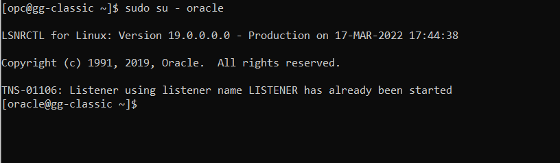
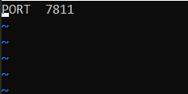
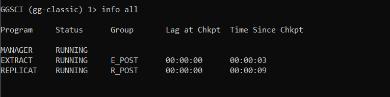

# PostgreSQL to PostgreSQL

## Introduction
This lab will show you how to setup an ***UniDirectional replication between PostgreSQL to PostgreSQL***.
This workshop will show you how to install a Oracle GoldenGate for PostgreSQL.  This workshop requires a compute instance running with PostgreSQL database and a Virtual Cloud Network (VCN).

*Estimated Lab Time*: 60 minutes

### About Oracle GoldenGate for PosgreSQL
With Oracle GoldenGate for PosgreSQL, you can perform initial loads and capture transactional data from supported PostgreSQL versions and replicate the data to a PostgreSQL database or other supported Oracle GoldenGate targets, such as an Oracle Database.

Oracle GoldenGate for PostgreSQL supports the mapping, manipulation, filtering, and delivery of data from other types of databases to a PostgreSQL database.

### Objectives
-   UniDirectional replication between PostgreSQL to PostgreSQL
-   Connect to compute instance

### Environment details

- GoldenGate for PostgreSQL
- PostgreSQL database V12
- GoldenGate Software location : /u01/software/postgres
- GoldenGate Home : /u01/ggpost/

### Prerequisites
This lab assumes you have:
- A Free Tier, Paid or LiveLabs Oracle Cloud account
- SSH Private Key to access the host via SSH
- You have completed:
    - Lab: Generate SSH Keys
    - Lab: Prepare Setup
    - Lab: Environment Setup

## Task 1: Installation of OGG for PostgreSQL

In this step you will install **Oracle GoldenGate for PostgreSQL** in new **"GoldenGate Home of the PostgreSQL"** directory.

-	From the terminal screen change to the ***GoldenGate Software*** directory location  

1. Unzip the **OGG for PostgreSQL package** in to directory **GoldenGate Home**

```
<copy>cd /u01/software/postgres/

unzip -d /u01/ggpost/  19100200714_ggs_Linux_x64_PostgreSQL_64bit.zip </copy>

Archive:  19100200714_ggs_Linux_x64_PostgreSQL_64bit.zip
inflating: /u01/ggpost/ggs_Linux_x64_PostgreSQL_64bit.tar
inflating: /u01/ggpost/OGG-19.1.0.0-README.txt
inflating: /u01/ggpost/release-notes-oracle-goldengate_19.1.0.200714.pdf
```

## Task 2:	Untar the GoldenGate executable

Go to the ***GoldenGate Home*** and untar the ***ggs_Linux_x64_PostgreSQL_64bit.tar*** executable.

```
<copy>cd /u01/ggpost/ </copy>
<copy>ll </copy>
total 333868
-rw-r--r--. 1 postgres postgres 341534720 Jul 13 08:36 ggs_Linux_x64_PostgreSQL_64bit.tar
-rw-r--r--. 1 postgres postgres      1413 Jan 31  2020 OGG-19.1.0.0-README.txt
-rw-r--r--. 1 postgres postgres    338530 Jul 13 20:43 release-notes-oracle-goldengate_19.1.0.200714.pdf

<copy>tar -xf ggs_Linux_x64_PostgreSQL_64bit.tar  </copy>
```

## **STEP 3**: Execute the ggsci commands from goldengate for postgreSQL home
1. Switch to Oracle user

 ```
 <copy>sudo su - oracle</copy>
 ```


2. Set environment variables
```<copy>LD_LIBRARY_PATH=/u01/app/oracle/product/19.3.0.0/db100/lib:/lib:/usr/lib:/u01/ggpost/lib
export OGG_HOME=/u01/ggpost</copy>
```
2. Execute the ggsci command from terminal

Execute remaining subdirectories in the installation location

```      
bash-4.2$ <copy> ./ggsci</copy>

Oracle GoldenGate Command Interpreter for PostgreSQL
Version 19.1.0.0.200714 OGGCORE_19.1.0.0.0OGGBP_PLATFORMS_200628.2141
Linux, x64, 64bit (optimized), PostgreSQL on Jun 29 2020 03:59:15
Operating system character set identified as UTF-8.

Copyright (C) 1995, 2019, Oracle and/or its affiliates. All rights reserved.


GGSCI (ogg-classic) 1>
```

```
GGSCI (ogg-classic) 1> <copy> create subdirs</copy>

Creating subdirectories under current directory /u01/ggpost

Parameter file                 /u01/ggpost/dirprm: created.
Report file                    /u01/ggpost/dirrpt: created.
Checkpoint file                /u01/ggpost/dirchk: created.
Process status files           /u01/ggpost/dirpcs: created.
SQL script files               /u01/ggpost/dirsql: created.
Database definitions files     /u01/ggpost/dirdef: created.
Extract data files             /u01/ggpost/dirdat: created.
Temporary files                /u01/ggpost/dirtmp: created.
Credential store files         /u01/ggpost/dircrd: created.
Masterkey wallet files         /u01/ggpost/dirwlt: created.
Dump files                     /u01/ggpost/dirdmp: created.
```

## Task 4:Edit the manager

1. Edit the manager parameter

The Manager process in each Oracle GoldenGate installation requires a dedicated port for communication between itself and other local Oracle GoldenGate processes.

```
GGSCI (ogg-classic) 2> <copy>edit params mgr</copy>

```
2. Append the ***port number*** as ***7811***  in the manager param file  
To specify this port, use the PORT parameter in the Manager parameter file.

```

<copy>PORT 7811</copy>

```

## Task 5:Start the manager
To start Manager from GGSCI, issue the following command.

```
GGSCI (ogg-classic) 4> <copy>start mgr</copy>
Manager started.

```
## Task 6: Manager status check
***info all*** will display the status  for all Manager

```
GGSCI (ogg-classic) 5> <copy>info all</copy>

Program     Status      Group       Lag at Chkpt  Time Since Chkpt

MANAGER     RUNNING
```

GGSCI (ogg-classic) 6>


## **STEP 7**: ODBC configuration

In this step you will add the databse connection details to communicate with source and target database.

From the terminal ,move to the ***GOldenGate Home*** directory and create a file called  ***odbc.ini***:

```
<copy>
cd /u01/ggpost/
vi odbc.ini
</copy>
```
Copy paste the below text in ***odbc.ini***.

```
<copy>
[ODBC Data Sources]
sourcedsn=DataDirect 7.1 PostgreSQL Wire Protocol
targetdsn=DataDirect 7.1 PostgreSQL Wire Protocol

[ODBC]
IANAAppCodePage=4
InstallDir=/u01/ggpost

[sourcedsn]
Driver=/u01/ggpost/lib/GGpsql25.so
Description=DataDirect 7.1 PostgreSQL Wire Protocol
Database=source
HostName=localhost
PortNumber=5432
LogonID=ggadmin
Password=Madhu_123


[targetdsn]
Driver=/u01/ggpost/lib/GGpsql25.so
Description=DataDirect 7.1 PostgreSQL Wire Protocol
Database=target
HostName=localhost
PortNumber=5432
LogonID=ggadmin
Password=Madhu_123
</copy>
```

Save the text using ***wq!***

## Task 7: Extract configuration

1. Enter into ***ggsci*** command prompt from the terminal

Oracle GoldenGate Software Command Interface (GGSCI) is the command interface between users and Oracle GoldenGate functional components.

```
 -bash-4.2$ <copy>./ggsci</copy>

Oracle GoldenGate Command Interpreter for PostgreSQL
Version 19.1.0.0.200714 OGGCORE_19.1.0.0.0OGGBP_PLATFORMS_200628.2141
Linux, x64, 64bit (optimized), PostgreSQL on Jun 29 2020 03:59:15
Operating system character set identified as UTF-8.

Copyright (C) 1995, 2019, Oracle and/or its affiliates. All rights reserved.


GGSCI (ogg-classic) 1>
```

2. Extract parameter creation

Opens a extract **E_POST** parameter file for editing in the default text editor.

```
GGSCI (ogg-classic) 1> <copy>edit params E_POST</copy>
```

3. Append the below lines

Copy the below content and update in the extract **E_POST** parameter file

```
<copy>EXTRACT E_POST
SOURCEDB sourcedsn USERID ggadmin, PASSWORD Madhu_123
EXTTRAIL ./dirdat/pa
TABLE public.*;</copy>
```

4. View the param file

Displays the contents of a **E_POST** parameter file in read-only mode on-screen.

```
GGSCI (ogg-classic) 2> <copy>view params E_POST</copy>

EXTRACT E_POST
SOURCEDB sourcedsn USERID ggadmin, PASSWORD Madhu_123
EXTTRAIL ./dirdat/pa
TABLE public.*;
```

5. Extract Registration

Login the source database to register the Extract group E_POST
```
GGSCI (ogg-classic) 3><copy> DBLOGIN SOURCEDB sourcedsn USERID ggadmin, PASSWORD Madhu_123</copy>

2020-08-20 12:37:20  INFO    OGG-03036  Database character set identified as UTF-8. Locale: en_US.UTF-8.

2020-08-20 12:37:20  INFO    OGG-03037  Session character set identified as UTF-8.
Successfully logged into database.
```

6. Registering the Extract for PostgreSQL

Register the Extract group E_POST with the database using the REGISTER EXTRACT command. This will create a replication slot. Make sure not to add the Extract before it is registered with the database.

```
GGSCI (ogg-classic as ggadmin@sourcedsn) 4> <copy>REGISTER EXTRACT E_POST</copy>

2020-08-20 12:38:16  INFO    OGG-25355  Successfully created replication slot 'e_post_f21eb07bf475178e' for Extract group E_POST 'E_POST' in database 'dvdrental'.
```

7. Enabling Supplemental Logging

Enable supplemental logging for the user tables to be captured from PostgreSQL.

```
GGSCI (ogg-classic as ggadmin@sourcedsn) 4> <copy>ADD TRANDATA public.* </copy>

2020-08-20 12:38:16  INFO    Logging of supplemental log data is enabled for table public.actor with REPLICA IDENTITY set to DEFAULT
```

8. Extract creation

Add the Extract to the Oracle GoldenGate installation.

```
GGSCI (ogg-classic as ggadmin@sourcedsn) 5> <copy>ADD EXTRACT E_POST, TRANLOG, BEGIN NOW</copy>
EXTRACT added.
```

9. Add extract trail file

Use ADD EXTTRAIL to create a trail for online processing on the local system and Associate it with an Extract group E_POST.

```
GGSCI (ogg-classic as ggadmin@sourcedsn) 6> <copy>ADD EXTTRAIL ./dirdat/pa, EXTRACT E_POST</copy>
EXTTRAIL added.
```

10. Start Extract

To start Extract from GGSCI, issue the following command.

```
GGSCI (ogg-classic as ggadmin@sourcedsn) 8> <copy>start E_POST</copy>

Sending START request to MANAGER ...
EXTRACT E_POST starting
```

11. Status of the Extact

Display the status  for Extract group E_POST

```
GGSCI (ogg-classic as ggadmin@sourcedsn) 10><copy> info E_POST</copy>

EXTRACT    E_POST    Last Started 2020-08-20 12:38   Status RUNNING
Checkpoint Lag       00:00:23 (updated 00:00:10 ago)
Process ID           16472
VAM Read Checkpoint  2020-08-20 12:38:26.694734

Replication Slot     e_post_f21eb07bf475178e is active with PID 16480 in database dvdrental
Slot Restart LSN     0/245BAF8
Slot Flush LSN       0/245BB30
Current Log Position 0/245BB30

GGSCI (ogg-classic as ggadmin@sourcedsn) 11>

```

## Task 8: Replication configuration

1. Edit Replicat parameter

Opens a extract **R_POST** parameter file for editing in the default text editor.

```
GGSCI (ogg-classic) 1>  <copy>EDIT PARAMS R_POST</copy>

```

2. Appended the below lines to R_POST
Copy the below content and update in the extract **R_POST** parameter file

```
<copy>REPLICAT R_POST
TARGETDB targetdsn USERID ggadmin, PASSWORD Madhu_123
MAP *.*, TARGET *.*;
</copy>
```

3. Login the target database

login to target database for the creating the replicat process

```
GGSCI (ogg-classic) 2> <copy>dblogin SOURCEDB  targetdsn USERID ggadmin, PASSWORD Madhu_123</copy>

2020-08-20 12:46:36  INFO    OGG-03036  Database character set identified as UTF-8. Locale: en_US.UTF-8.

2020-08-20 12:46:36  INFO    OGG-03037  Session character set identified as UTF-8.
Successfully logged into database.
```

4. Add checkpoint table

ADD CHECKPOINTTABLE to create a checkpoint table in the target database. Replicat uses the table to maintain a record of its read position in the trail for recovery purposes.

```
GGSCI (ogg-classic as ggadmin@targetdsn) 3>  <copy>add checkpointtable public.ggchk</copy>

Successfully created checkpoint table public.ggchk.

```
5. Add replicat process

ADD REPLICAT creates an online process group that creates checkpoints so that processing continuity is maintained from run to run.

```
GGSCI (ogg-classic as ggadmin@targetdsn) 4> <copy>ADD REPLICAT R_POST, EXTTRAIL ./dirdat/pa, CHECKPOINTTABLE public.ggchk</copy>
REPLICAT added.
```

6. Start Replicat

To start REPLICAT from GGSCI, issue the following command.

```
GGSCI (ogg-classic as ggadmin@targetdsn) 6> <copy>start REPLICAT R_POST</copy>

Sending START request to MANAGER ...
REPLICAT R_POST starting
```

7. Status of the replicat

Display the status  for REPLICAT  group R_POST

```
GGSCI (ogg-classic as ggadmin@targetdsn) 6> <copy>info R_POST</copy>

REPLICAT   R_POST    Last Started 2020-08-20 12:47   Status RUNNING
Checkpoint Lag       00:00:00 (updated 00:00:08 ago)
Process ID           17328
Log Read Checkpoint  File ./dirdat/pa000000000
                     First Record  RBA 0


GGSCI (ogg-classic as ggadmin@targetdsn) 7>
```
8. Get info on all processes

```
<copy>info all</copy>
```

## Task 9: Execuating  DML statments against source database

1. DML Operation :

Execute the command against the source database

```
<copy>psql postgres -h 127.0.0.1 -d source -f /var/lib/pgsql/gen_data.sql</copy>
```

***Output :***

```
-bash-4.2$ psql postgres -h 127.0.0.1 -d source -f /var/lib/pgsql/gen_data.sql
You are now connected to database "source" as user "postgres".
TRUNCATE TABLE
You are now connected to database "target" as user "postgres".
TRUNCATE TABLE
 region_id | region_name
-----------+-------------
(0 rows)

INSERT 0 1
INSERT 0 1
INSERT 0 1
INSERT 0 1
 region_id |      region_name
-----------+------------------------
         1 | Europe
         2 | Americas
         3 | Asia
         4 | Middle East and Africa
(4 rows)

UPDATE 1
UPDATE 1
 region_id |      region_name
-----------+------------------------
         3 | Asia
         4 | Middle East and Africa
         1 | CHANGE1
         2 | CHANGE2
(4 rows)

DELETE 1
DELETE 1
You are now connected to database "source" as user "postgres".
 region_id | region_name
-----------+-------------
(0 rows)

```

2. Stats output

Display statistics  of the both extract and replicat

```
-bash-4.2$ <copy>ggpost</copy>

Oracle GoldenGate Command Interpreter for PostgreSQL
Version 19.1.0.0.200714 OGGCORE_19.1.0.0.0OGGBP_PLATFORMS_200628.2141
Linux, x64, 64bit (optimized), PostgreSQL on Jun 29 2020 03:59:15
Operating system character set identified as UTF-8.

Copyright (C) 1995, 2019, Oracle and/or its affiliates. All rights reserved.


GGSCI (ogg-classic) 1><copy> stats *
</copy>

Sending STATS request to EXTRACT E_POST ...

Start of Statistics at 2020-11-08 15:48:56.

Output to ./dirdat/pa:

Extracting from public.regions to public.regions:

*** Total statistics since 2020-11-08 15:47:43 ***
        Total inserts                                      4.00
        Total updates                                      2.00
        Total deletes                                      2.00
        Total upserts                                      0.00
        Total discards                                     0.00
        Total operations                                   8.00

*** Daily statistics since 2020-11-08 15:47:43 ***
        Total inserts                                      4.00
        Total updates                                      2.00
        Total deletes                                      2.00
        Total upserts                                      0.00
        Total discards                                     0.00
        Total operations                                   8.00

*** Hourly statistics since 2020-11-08 15:47:43 ***
        Total inserts                                      4.00
        Total updates                                      2.00
        Total deletes                                      2.00
        Total upserts                                      0.00
        Total discards                                     0.00
        Total operations                                   8.00

*** Latest statistics since 2020-11-08 15:47:43 ***
        Total inserts                                      4.00
        Total updates                                      2.00
        Total deletes                                      2.00
        Total upserts                                      0.00
        Total discards                                     0.00
        Total operations                                   8.00

End of Statistics.

Sending STATS request to REPLICAT R_POST ...

Start of Statistics at 2020-11-08 15:48:57.

Replicating from public.regions to public.regions:

*** Total statistics since 2020-11-08 15:48:44 ***
        Total inserts                                      4.00
        Total updates                                      2.00
        Total deletes                                      2.00
        Total upserts                                      0.00
        Total discards                                     0.00
        Total operations                                   8.00

*** Daily statistics since 2020-11-08 15:48:44 ***
        Total inserts                                      4.00
        Total updates                                      2.00
        Total deletes                                      2.00
        Total upserts                                      0.00
        Total discards                                     0.00
        Total operations                                   8.00

*** Hourly statistics since 2020-11-08 15:48:44 ***
        Total inserts                                      4.00
        Total updates                                      2.00
        Total deletes                                      2.00
        Total upserts                                      0.00
        Total discards                                     0.00
        Total operations                                   8.00

*** Latest statistics since 2020-11-08 15:48:44 ***
        Total inserts                                      4.00
        Total updates                                      2.00
        Total deletes                                      2.00
        Total upserts                                      0.00
        Total discards                                     0.00
        Total operations                                   8.00

End of Statistics.

GGSCI (ogg-classic) 2>
```

You have reached *End of the lab*

## Learn More
* [GoldenGate with PostgreSQL](https://docs.oracle.com/en/middleware/goldengate/core/19.1/gghdb/using-oracle-goldengate-postgresql.html/")


## Acknowledgements
* **Author** -Madhu Kumar S, Data Integration Team, Oracle, November 2020
* **Contributors** - Brian Elliott, Meghana Banka, Rene Fontcha, Andrew Hong
* **Last Updated By/Date** - Andrew Hong, Solution Engineer, March 2022


