# Setup of GoldenGate Microservices for Replication

## Introduction

This hands-on lab is designed to demonstrate how Oracle GoldenGate 19c Microservices can be used to setup a replication environment by a mix of web page, shell scripts and Rest API interfaces.  All labs will use shell scripts to facilitate the building of the environment, at the same time provide insight into how to use the web pages and AdminClient.

The labs will walk the end-user through how to add all components of Oracle GoldenGate replication.  To do the instantiation of the target database, the end-user will be performing a data pump export and import.  All replication process will be started as they are built.

*Estimated Lab Time*: 45 mins

### About Oracle GoldenGate Microservices
Oracle GoldenGate offers high-performance, fault-tolerant, easy-to-use, and flexible real- time data streaming platform for big data environments. It easily extends customers’ real-time data integration architectures to big data systems without impacting the performance of the source systems and enables timely business insight for better decision making. This workshop focuses on **GoldenGate Real Time Data Capture** demonstrating four scenarios that you can use (both on-premise and in the cloud) to capture real time data changes from your sources.

### Lab Architecture


### Objectives

The objectives of the lab is to familiarize you with the process to create data replication objects that will allow you to replicate data realtime using GoldenGate Microservices while levergaring RestfulAPIs.

### Prerequisites
This lab assumes you have:
- A Free Tier, Paid or LiveLabs Oracle Cloud account
- SSH Private Key to access the host via SSH
- You have completed:
    - Lab: Generate SSH Keys (*Free-tier* and *Paid Tenants* only)
    - Lab: Prepare Setup (*Free-tier* and *Paid Tenants* only)
    - Lab: Environment Setup
    - Lab: Initialize Environment

In this lab we will setup GoldenGate Microservices

## Task 1: Creating Deployments – Atlanta and Boston

Deployments are a new concept in Oracle GoldenGate Microservices.
Deployments provide a siloed approach to splitting replication environments between applications, customers, or environments. This allows for greater control over the use of Oracle GoldenGate in larger environments.

<!-- 1.	Log in to ServiceManager’s HTML5 webpage using the following details.

    ```
    URL: <copy> https://localhost:16000 </copy>
    ```

    ```
    Username: <copy>oggadmin</copy>
    ```

    ```
    Password: <copy>Welcome1</copy>
    ```

     -->

1.	You should see “ServiceManager” under Deployments at the bottom of the page and the status should be set to “Running”.

    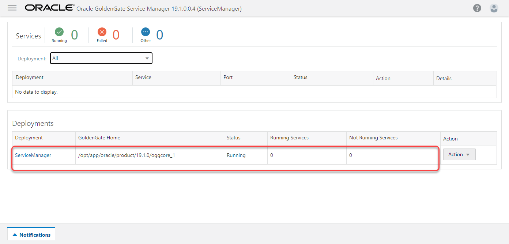

2.	Now switch back to the SSH Terminal session you started as user *oracle*, navigate to *`~/Desktop/Scripts/HOL/Lab2`*

    ```
    <copy>cd ~/Desktop/Scripts/HOL/Lab2</copy>
    ```

3.	To run the `create_deployment.sh` script, you will need to provide eight (8) command line parameters. Here is the template of the command:

    ```
    sh ./create_deployment.sh <Deployment Name> <Admin Password> <SMPort> <ASPort> <DSPort> <RSPort> <PMSPort> <PMSPortUDP>
    ```

    Each of the parameters will be used to replace items in the response file and build the Deployment and associated services. Each of the command line parameters corresponds to the following:
      - Deployment Name: Name of the deployment to be created  
      - Admin Password: Password used by the Security Role user for the ServiceManager  
      - SMPort: Port number of the ServiceManager (16000)  
      - ASPort: Port number of the Administration Service (16001)  
      - DSPort: Port number of the Distribution Service (16002)  
      - RSPort: Port number of the Receiver Service (16003)  
      - PMSPort: Port number of the Performance Metric Service (16004)  
      - PMSPortUDP: UDP port number for Performance Metric Service NoSQL Database connection (16005)

    ***Atlanta deployment creation***  

4.	Run the script using the following parameter values, to create the Atlanta Deployment:

    ```
    <copy>sh ./create_deployment.sh Atlanta Welcome1 16000 16001 16002 16003 16004 16005</copy>
    ```
    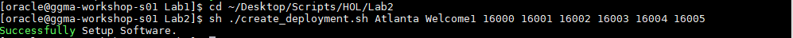

5.	Return to the browser and refresh the ServiceManager page. You should have one (1) new Deployment called Atlanta, with four (4) services listed.

    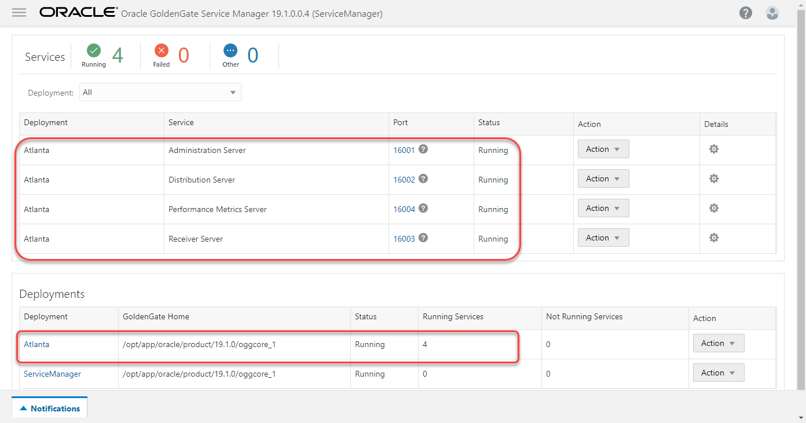

6.	Return to the Terminal Window where you ran the `create_deployment.sh` script and rerun the script again to create a 2nd Deployment (Boston), this time changing the Deployment name and all port numbers other than the ServiceManager (16000) port number.

    ***Boston deployment creation***

7. Run the script using the following parameter values, to create the Boston Deployment:

    ```
    <copy>sh ./create_deployment.sh Boston Welcome1 16000 17001 17002 17003 17004 17005 </copy>
    ```

    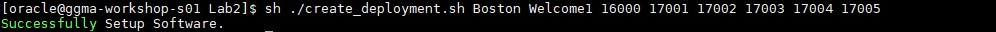

8.	Return to the browser and refresh the ServiceManager page again. You should now have two (2) Deployments with a total of eight (8) services running.

    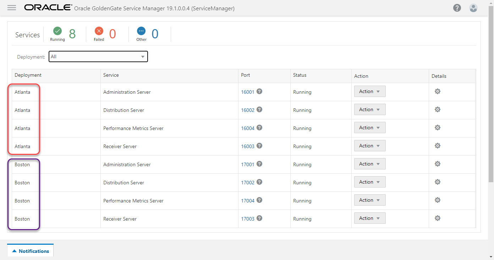

## Task 2: Configure Reverse Proxy

In this Task, you will configure the NGINX Reverse Proxy.  

*Note*:  Prior to configuring the reverse proxy, you have to have a self-signed certificate.  These certificates have already been created for you and are stored in `~/wallet`.  These are the same certificates that were used to setup the security for the ServiceManager and Deployments you created earlier.

After the completion of this task, accessing the Oracle GoldenGate Microservices HTML5 pages will be simpler.  

1.	From the SSH Terminal session as user *oracle*, navigate to `~/Desktop/Scripts/HOL/Lab3`

    ```
    <copy>cd ~/Desktop/Scripts/HOL/Lab3</copy>
    ```

2.	Execute the script.  This script will configure all items related to the Nginx Reverse Proxy

    *Note*: The configureNginx.sh script is making a call to the ReverseProxySettings utility that can be found under `$OGG_HOME/lib/util/reverseproxy`.  We provide this script to make it easier for you to configure the Nginx Reverse Proxy in your environment.

    ```
    <copy>sh ./configureNginx.sh oggadmin Welcome1  16000</copy>
    ```

    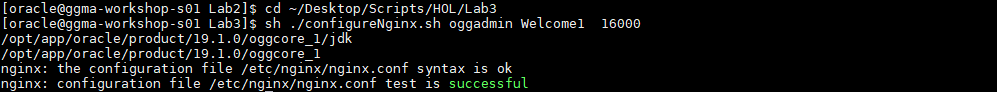

3.	Upon completion, return to your web browser. You should be able to access the ServiceManager page by only using the URL without a port number.

    ```
    <copy>https://localhost</copy>
    ```

    If this is the first time you access this address, you will need to click through some security exceptions page as it is using a self-signed certificate.  Once you get to the page, you will see below website.

    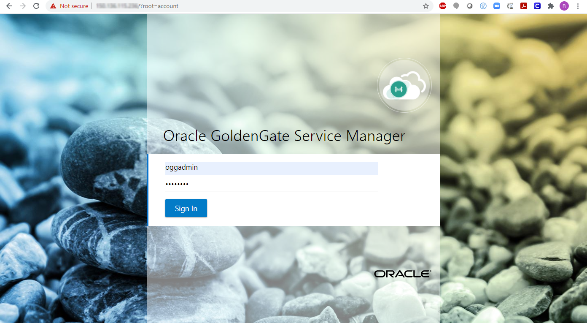

    Once you are able to access the ServiceManager by using the simpler URL, you have completed this task.

    **Extra Information:**

    Simplified URLs: The benefit of using the Reverse Proxy is that is makes the URLs simpler to use.  If you are so inclined, provide your browser a URL that models this:

    ```
    https://localhost/<deployment>/adminsrvr
    ```

    Where *deployment* is the name of a deployment you built earlier. In the example below using the Atlanta deployment, the URL would look like this:

    ```
    <copy>https://localhost/Atlanta/adminsrvr</copy>
    ```

    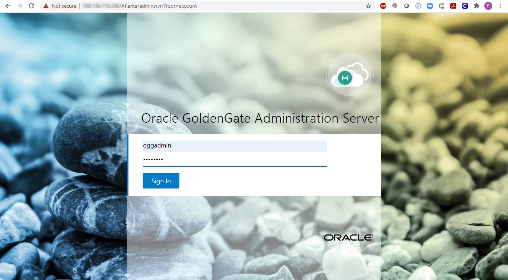

## Task 3: Create Credentials and Add Trandata
The scripts provided and executed in this step are meant to speed up the lab process. If you are interested in creating credentials and adding schematrandata from the portal or AdminClient, access the Administration Service (adminsrvr) and navigate go to `Context Menu -> Configuration -> Credentials -> click on the plus ( + )` sign.

In this step we will manually execute each step from the SSH terminal session.

1. Navigate to `~/Desktop/Scripts/HOL/Lab4`

    ```
    <copy>cd ~/Desktop/Scripts/HOL/Lab4</copy>
    ```

2. Create Credentials

    ```
    <copy>sh ./create_credential_GGAlias.sh Welcome1 16001 c##ggate@orcl ggate</copy>
    ```

    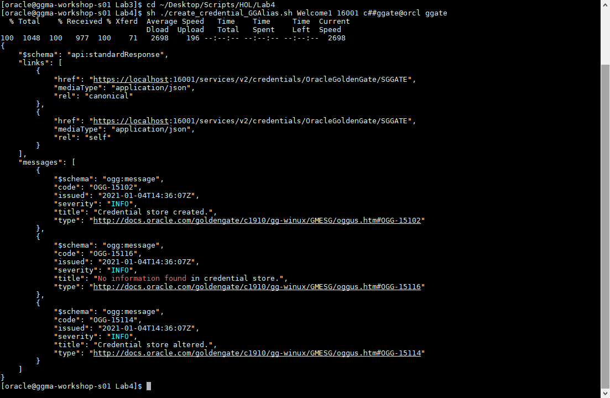


3. From a browser session to the Administration Service of your deployment as user *oggadmin*, validate the results.

    ```
    URL: <copy> https://localhost/Atlanta/adminsrvr </copy>
    ```

    ```
    Username: <copy>oggadmin</copy>
    ```

    ```
    Password: <copy>Welcome1</copy>
    ```

4. Click the Context Menu in the upper left, then select Configuration from the left pane

    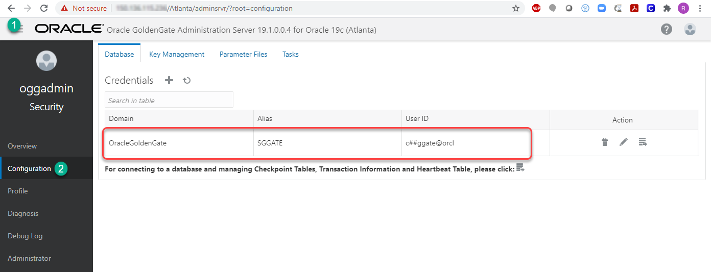

5. Next, we will enable schematrandata on the schema that we want to replicate.  In order to do this, you will need to run the `add_SchemaTrandata.sh` script.  

    ```
    <copy>sh ./add_SchemaTrandata.sh Welcome1 16001</copy>
    ```

    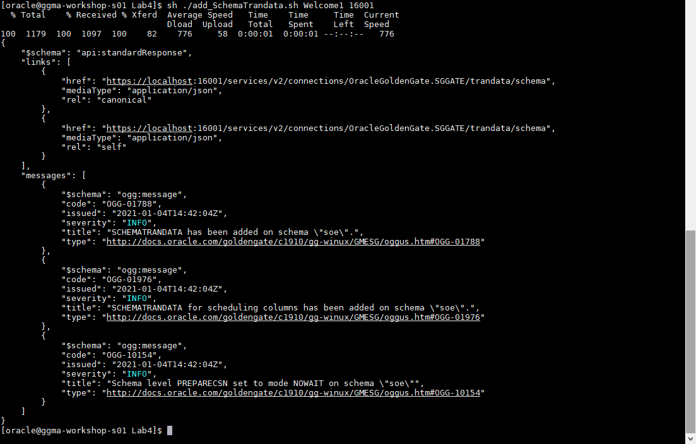

6. You can also check that SCHEMATRANDATA has been added from the `Administration Service -> Configuration` page as well.  Simply log in to the SGGATE alias.

    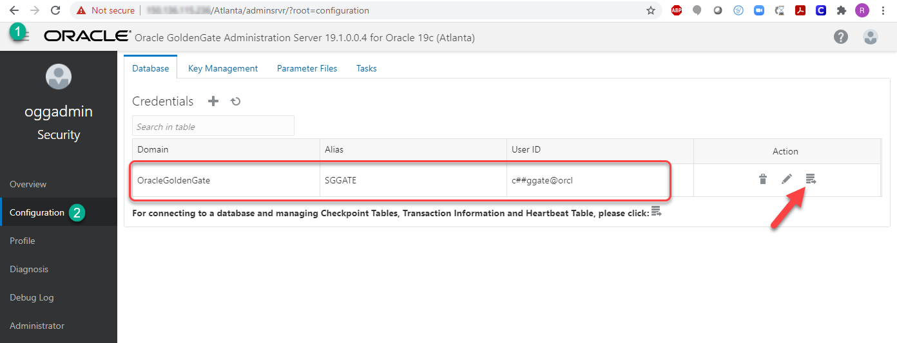

7.  Then, under “Trandata”, make sure that the magnifying glass and radio button for “Schema” are selected.  Enter “`oggoow19.soe`” into the search box and then select the magnifying glass to the right of the search box to perform the search.

    ```
    <copy>oggoow19.soe</copy>
    ```

    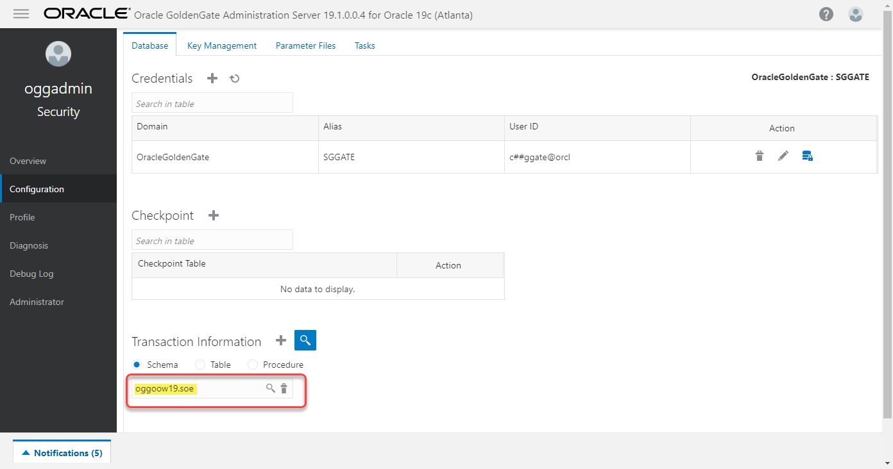

8.  After the search is performed, you will see a column that provides the number of tables enabled for supplemental logging within the “SOE” schema.

    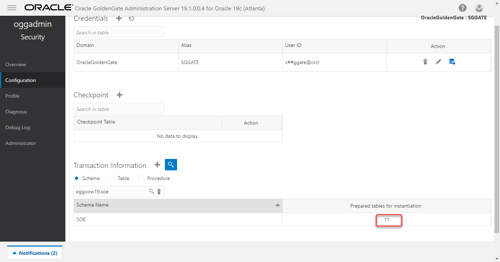

    You have now completed configuring schema level supplemental logging needed for use in the replication process

## Task 4: Create Oracle Replication Objects

1.	Add Extract for Atlanta Deployment

    ```
         <copy>cd ~/Desktop/Scripts/HOL/Lab5</copy>
    ```  

    ```
    <copy>sh ./add_Extract.sh Welcome1 16001 EXTSOE </copy>
    ```

    

2.	Switch back to the browser session to your Atlanta adminserver

     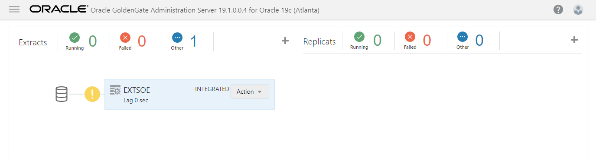

3. 	Create Distribution Path in Atlanta Deployment

    ```
    <copy>sh ./add_DistroPath.sh Welcome1 16002 SOE2SOE aa 17003 ab  </copy>
    ```

    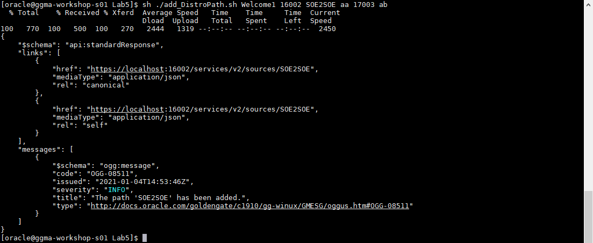

4. Validate your results from the browser by navigating to the path below as *oggadmin*

    ```
    <copy>https://localhost/Atlanta/distsrvr</copy>
    ```

    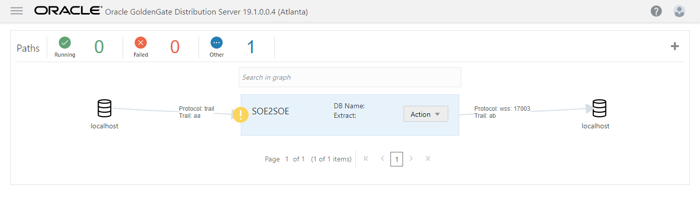

    Proceed below to add Replicat

5. Change directory to `~/Desktop/Scripts/HOL/Lab7`

    ```
    <copy>cd ~/Desktop/Scripts/HOL/Lab7 </copy>
    ```

6. 	Create Credentials and alias for the target database User

    ```
    <copy>sh ./create_credential_GGAlias.sh Welcome1 17001 ggate@oggoow191 ggate </copy>
    ```

    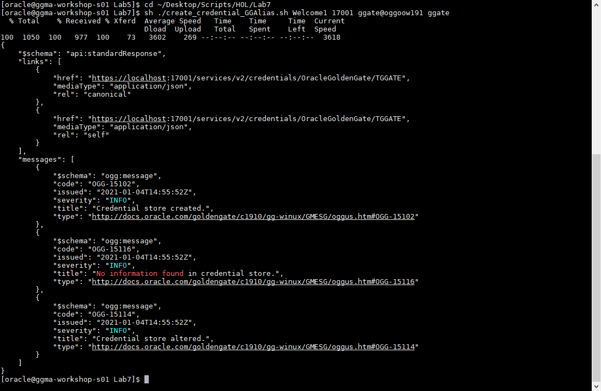

    ```
    <copy>https://localhost/Boston/adminsrvr/</copy>
    ```

    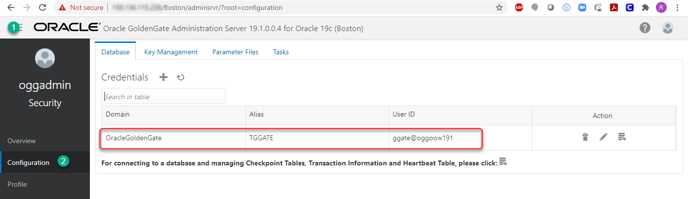

7. 	Create Checkpoint Table

    ```
    <copy>
    sh ./add_CheckpointTable.sh Welcome1 17001  
    </copy>
    ```

    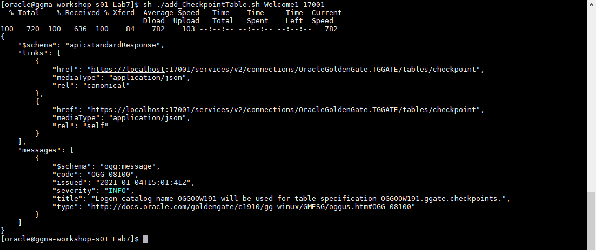

    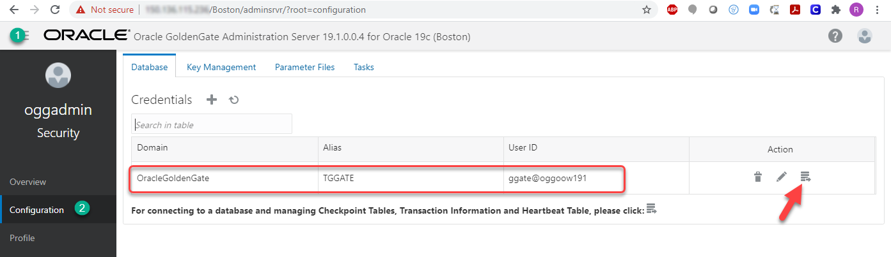


8. 	Create Replicat on Boston

    ```
    <copy>sh ./add_Replicat.sh Welcome1 17001 IREP  </copy>
    ```

    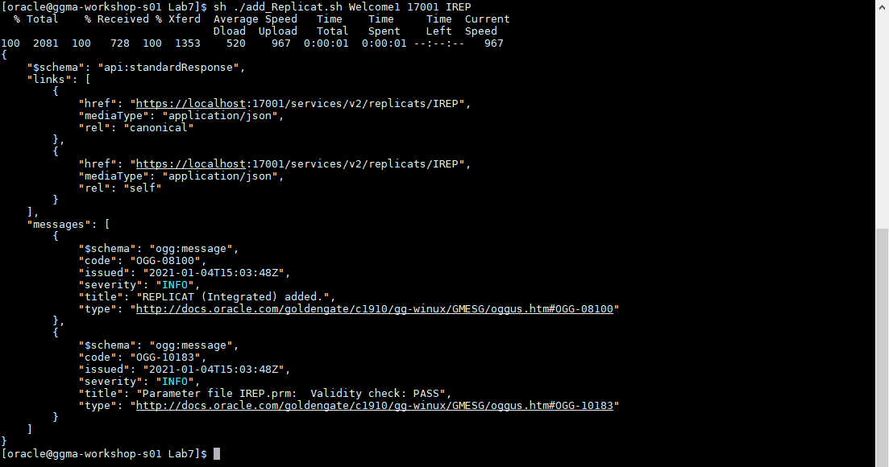

    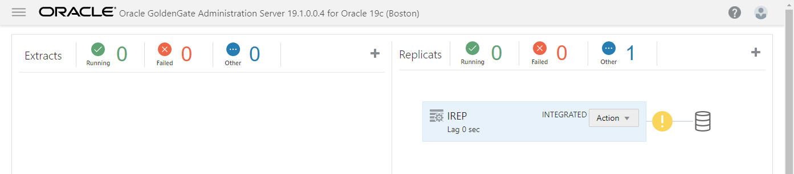

9. Start Extract, Distribution and Replicat

    ```
    <copy> cd ~/Desktop/Scripts/HOL/Lab8</copy>
    ```

    ```
    <copy>./start_replication.sh Welcome1 16001 EXTSOE 16002 SOE2SOE 17001 IREP</copy>
    ```

    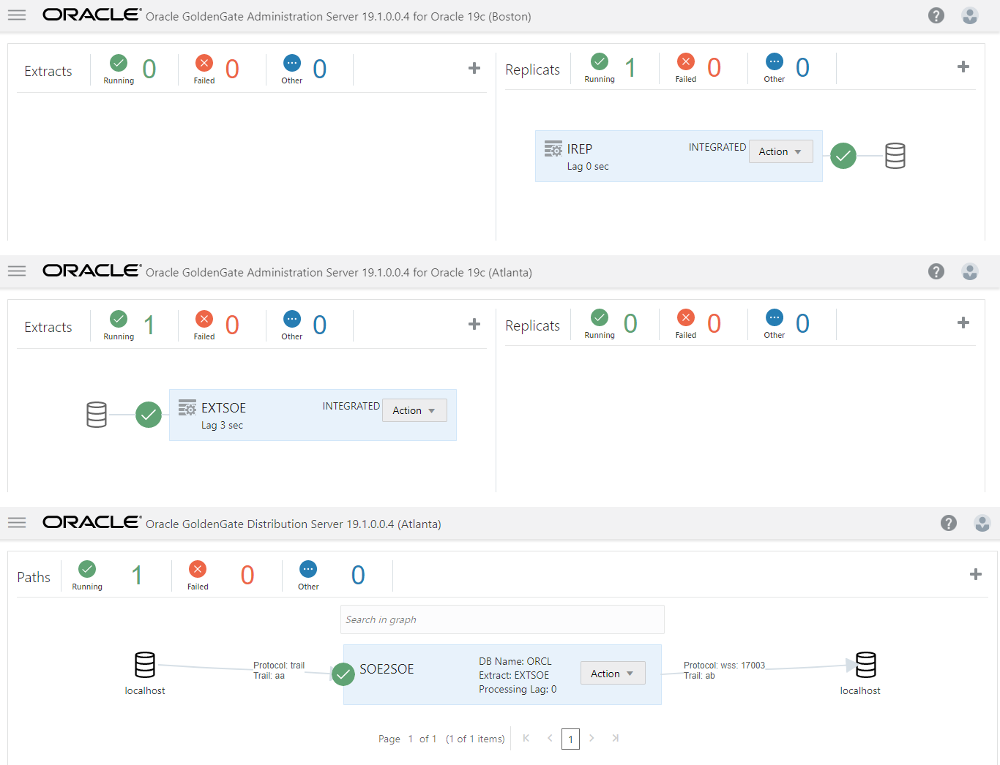

## Summary
The objectives of the lab was to familiarize you with the process to create data replication objects that will allow you to replicate data real-time using GoldenGate Microservices.

Oracle GoldenGate offers high-performance, fault-tolerant, easy-to-use, and flexible real- time data streaming platform. It easily extends customers’ real-time data integration architectures without impacting the performance of the source systems and enables timely business insight for better decision making.

You may now [proceed to the next lab](#next).

## Learn More

* [GoldenGate Microservices](https://docs.oracle.com/en/middleware/goldengate/core/19.1/understanding/getting-started-oracle-goldengate.html#GUID-F317FD3B-5078-47BA-A4EC-8A138C36BD59)

## Acknowledgements
* **Author** - Brian Elliott, Data Integration, November 2020
* **Contributors** - Zia Khan, Meghana Banka, Rene Fontcha
- **Last Updated By/Date** - Rene Fontcha, LiveLabs Platform Lead, NA Technology, April 2021
