# GoldenGate Microservices Active-Active

## Introduction
This lab will introduce you to Oracle GoldenGate for Microservices Workshop Architecture and High Availability / Disaster Recovery using Active-Active Technology.
Since we have already done multiple labs, this one will take what we used so far to script this using DB container reset scripts, SQL scripts to setup AutoCDR in the database, OGGCA silent deployment scripts and GG REST API scripts to do a rapid deployment.

*Estimated Lab Time*:  45 minutes

### Lab Architecture
  

### Objectives

- Rapid Deployment using:
  - OGGCA silent deployment scripts (remove and recreate deployments).
  - REST API to setup bi-directional GoldenGate replication between two databases.
  - SQL Scripts to setup up auto conflict detection and resolution in the database.

### Prerequisites
This lab assumes you have:
- A Free Tier, Paid or LiveLabs Oracle Cloud account
- You have completed:
    - Lab: Prepare Setup (*Free-tier* and *Paid Tenants* only)
    - Lab: Environment Setup
    - Lab: Initialize Environment
    - Lab: Create One-Way Replication

## Task 1:Generate Transactions with Swingbench

1. As user *oracle* from the SSH terminal session, navigate to `~/Desktop/Scripts/HOL/Lab8` and start Swingbench utility

     ```
    <copy>
    cd ~/Desktop/Scripts/HOL/Lab8
    ./start_swingbench.sh
    </copy>
    ```

    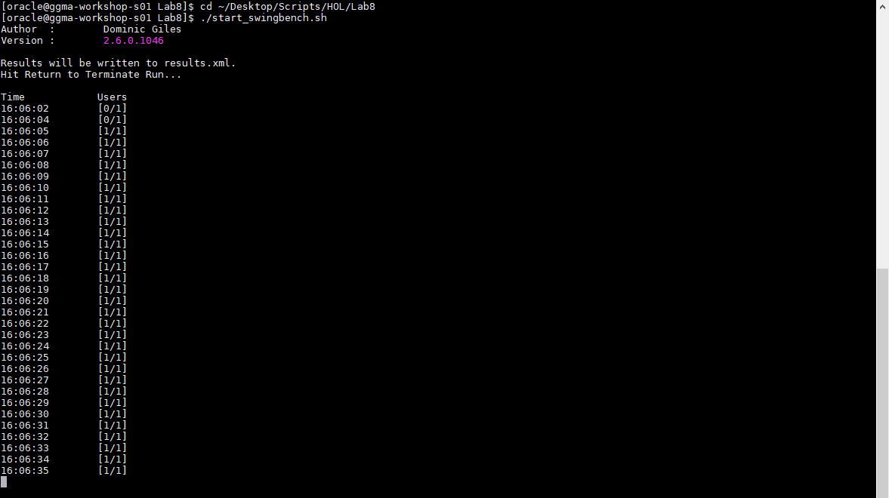

2. Open a browser tab session to the Performance Metrics Server for *Boston* Deployment

    ```
    <copy>https://localhost/Boston/pmsrvr</copy>
    ```

    ![](./images/h2.png "

3. Click on *IREP* Replicat to view detailed live performance metrics

    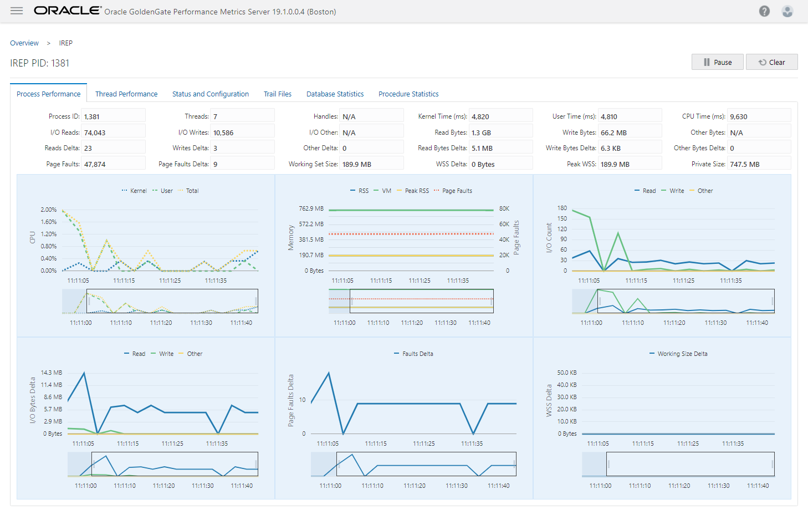

## Task 2: Configure Active-Active Replication

1. Navigate to `~/Desktop/Scripts/HOL/Lab9` and create credentials and alias for Boston GG User

    ```
    <copy>
    cd ~/Desktop/Scripts/HOL/Lab9/Build
    ./create_credential_GGAlias.sh Welcome1 17001 c##ggate@orcl ggate SGGATE2</copy>
    ```

    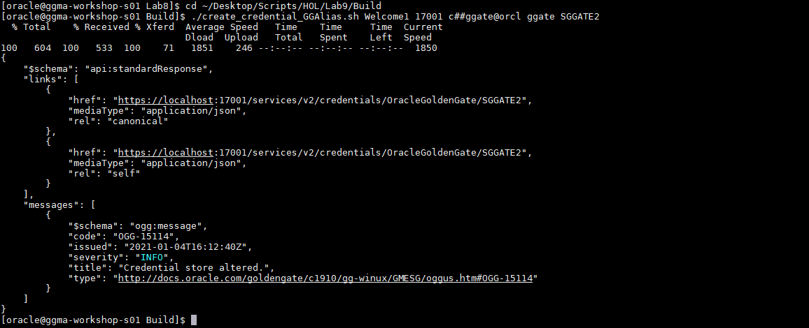

2. Go to the browser tab session of the Admin Server for *Atlanta* Deployment and validate

    ```
    <copy>https://localhost/Atlanta/adminsrvr</copy>
    ```
    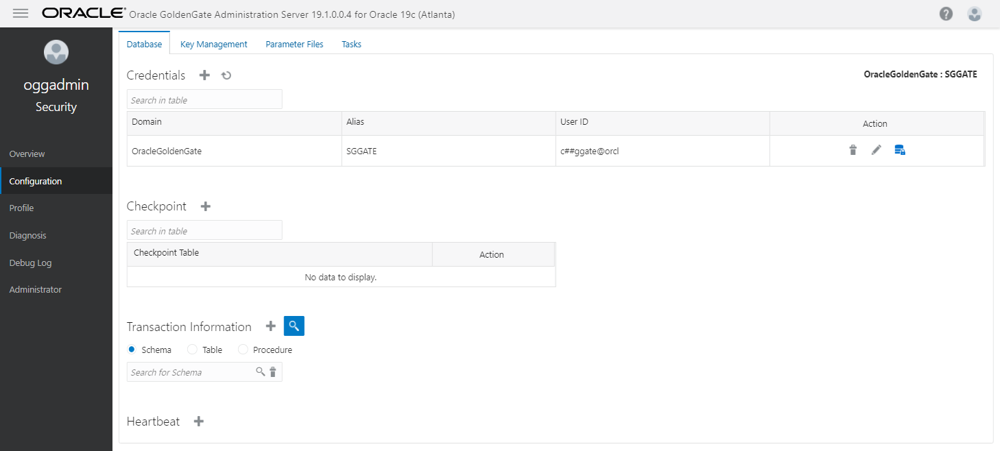

3. Navigate to `~/Desktop/Scripts/HOL/Lab9/Build` and run `create_credential_Protcol.sh`

    ```
    <copy>
    cd ~/Desktop/Scripts/HOL/Lab9/Build
    ./create_credential_Protcol.sh Welcome1 17001 oggadmin Welcome1 WSTARGET2
    </copy>
    ```
    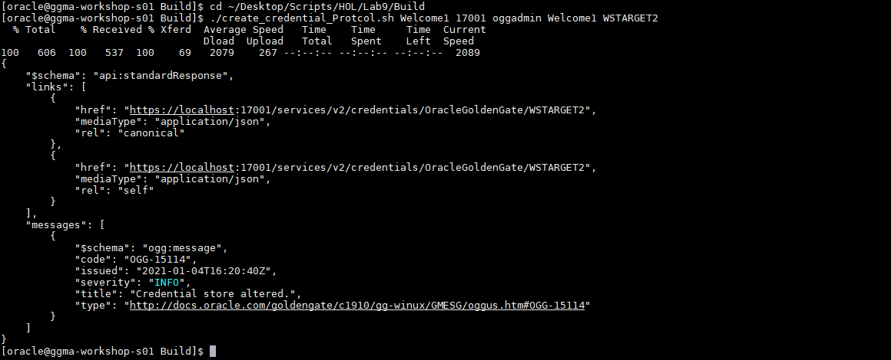

4. Go to the browser tab session of the Admin Server for *Boston* Deployment and validate

    ```
    <copy>https://localhost/Boston/adminsrvr</copy>
    ```
    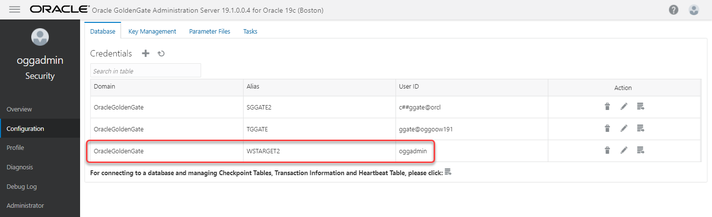

5. Add Schema Trandata for Boston schema SOE

    ```
    <copy>./add_SchemaTrandata_182.sh Welcome1 17001</copy>
    ```

    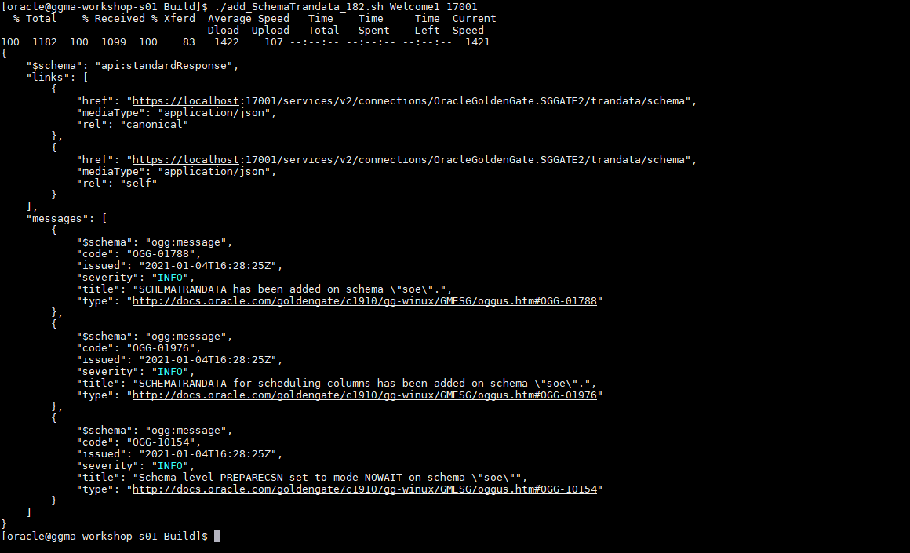

    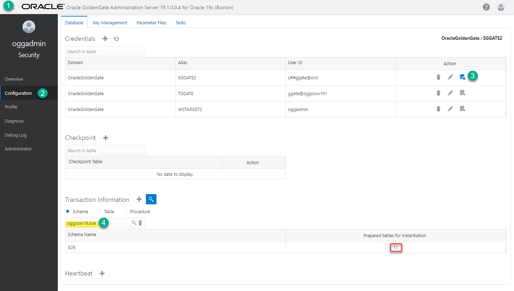

6. Add Extract to Boston Deployment

    ```
    <copy>./add_Extract2.sh Welcome1 17001 EXTSOE1  </copy>
    ```

    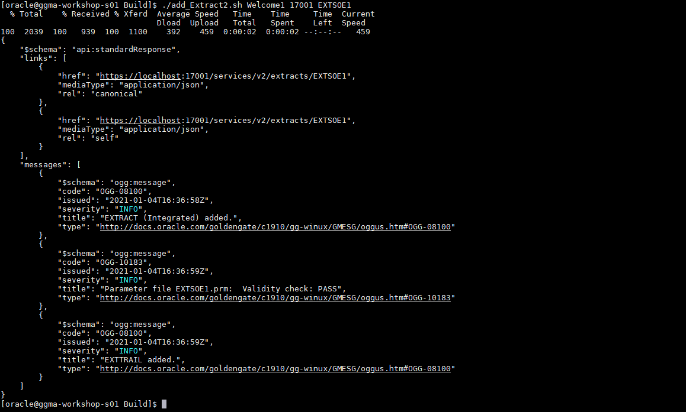

7. Go to the browser tab session of the Admin Server for *Boston* Deployment and validate

    ```
    <copy>https://localhost/Boston/adminsrvr</copy>
    ```

    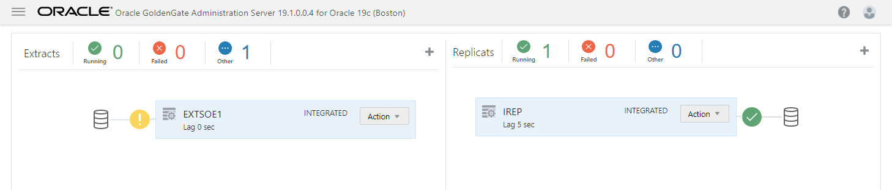

8. Add Distribution path from Boston to connect to Atlanta

    ```
    <copy>./add_DistroPath2.sh Welcome1 17002 SOE2SOE1 bb 16003 ba</copy>
    ```

    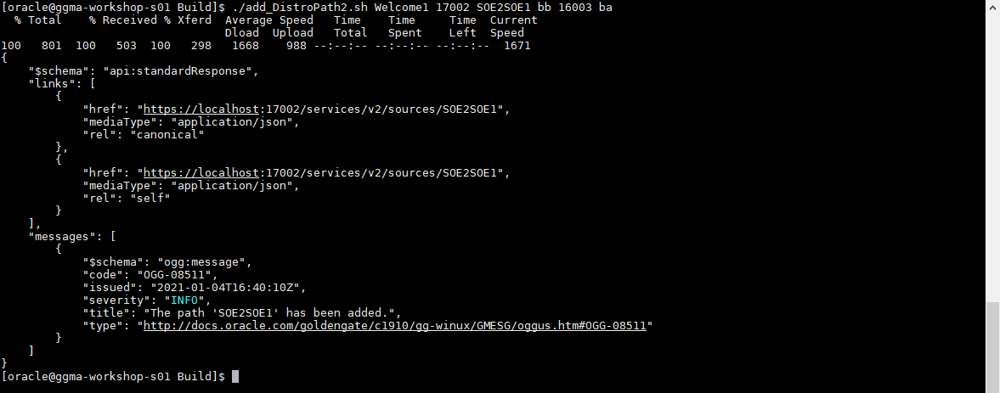

    ```
    <copy>https://localhost/Boston/distsrvr</copy>
    ```

    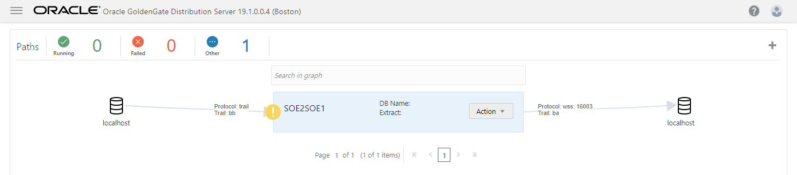

9. Create Alias

    ```
    <copy>./create_credential_GGAlias.sh Welcome1 16001 ggate@oggoow19 ggate TGGATE1</copy>
    ```

    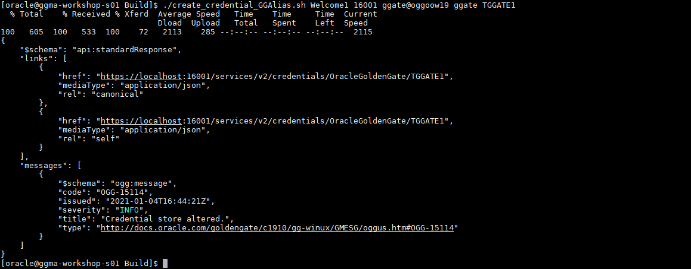

    ```
    <copy>https://localhost/Atlanta/adminsrvr</copy>
    ```

    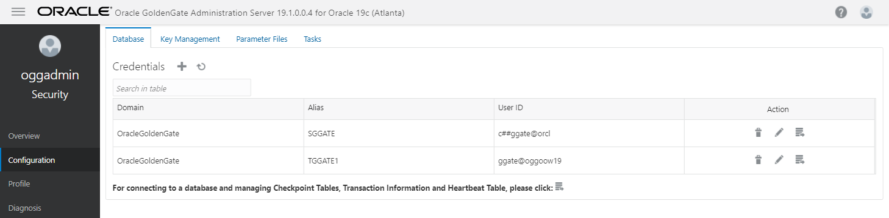

10. Create Checkpoint Table

    ```
    <copy>./add_CheckpointTable.sh Welcome1 16001 OracleGoldenGate.TGGATE1</copy>
    ```

    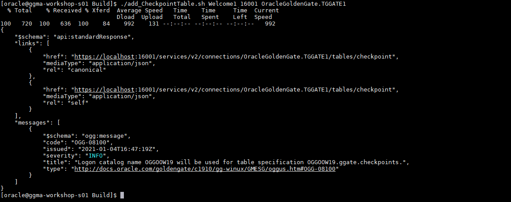

    ```
    <copy>https://localhost/Atlanta/adminsrvr</copy>
    ```

    

11. Create Replicat at Atlanta

    ```
    <copy>./add_Replicat1.sh Welcome1 16001 IREP1</copy>
    ```
    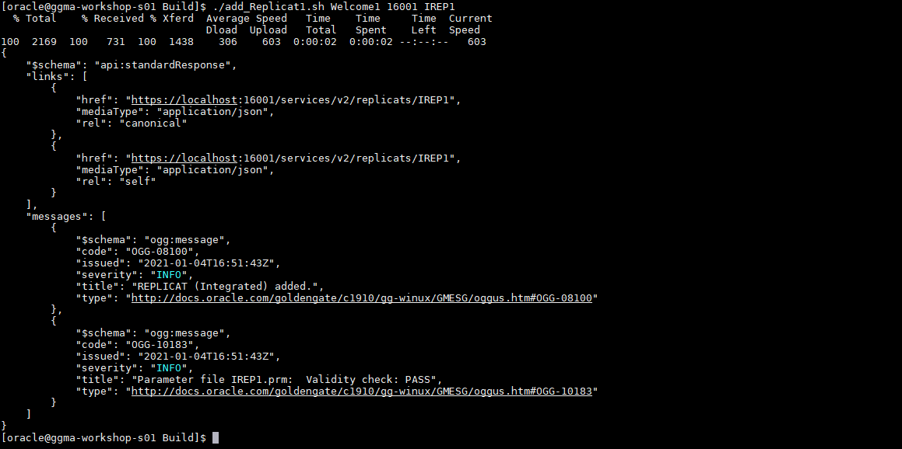

    ```
    <copy>https://localhost/Atlanta/adminsrvr</copy>
    ```
    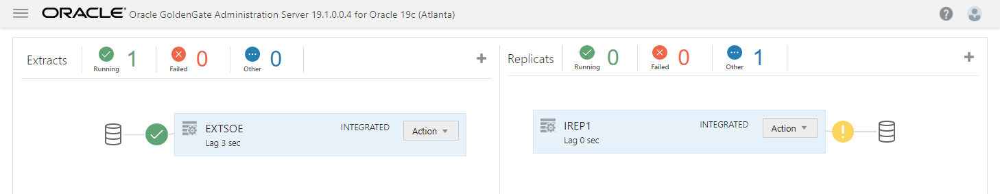


## Task 3: Setup Auto CDR

1.  Connect to database as sysdba and execute the scripts below to setup auto CDR on oggoow19 and oggoow191 database. The conflict detection and resolution configured by <b>ADD\_AUTO\_CDR</b> procedure is based on the timestamp. The entry with latest timestamp wins.

    ```
    <copy>
        sqlplus / as sysdba
    </copy>
    ```

    ```
    <copy>
    alter session set container=oggoow19;
    exec DBMS_GOLDENGATE_ADM.ADD_AUTO_CDR('soe','addresses');
    exec DBMS_GOLDENGATE_ADM.ADD_AUTO_CDR('soe','customers');
    exec DBMS_GOLDENGATE_ADM.ADD_AUTO_CDR('soe','orders');
    exec DBMS_GOLDENGATE_ADM.ADD_AUTO_CDR('soe','order_items');
    exec DBMS_GOLDENGATE_ADM.ADD_AUTO_CDR('soe','card_details');
    exec DBMS_GOLDENGATE_ADM.ADD_AUTO_CDR('soe','product_information');
    exec DBMS_GOLDENGATE_ADM.ADD_AUTO_CDR('soe','inventories');
    exec DBMS_GOLDENGATE_ADM.ADD_AUTO_CDR('soe','product_descriptions');
    exec DBMS_GOLDENGATE_ADM.ADD_AUTO_CDR('soe','warehouses');
    exec DBMS_GOLDENGATE_ADM.ADD_AUTO_CDR('soe','cdrdemo');
    prompt Done setting up AutoCDR
    </copy>
    ```

    ```
    <copy>
    alter session set container=oggoow191;
    </copy>
    ```

    ```
    <copy>
    exec DBMS_GOLDENGATE_ADM.ADD_AUTO_CDR('soe','addresses');
    exec DBMS_GOLDENGATE_ADM.ADD_AUTO_CDR('soe','customers');
    exec DBMS_GOLDENGATE_ADM.ADD_AUTO_CDR('soe','orders');
    exec DBMS_GOLDENGATE_ADM.ADD_AUTO_CDR('soe','order_items');
    exec DBMS_GOLDENGATE_ADM.ADD_AUTO_CDR('soe','card_details');
    exec DBMS_GOLDENGATE_ADM.ADD_AUTO_CDR('soe','product_information');
    exec DBMS_GOLDENGATE_ADM.ADD_AUTO_CDR('soe','inventories');
    exec DBMS_GOLDENGATE_ADM.ADD_AUTO_CDR('soe','product_descriptions');
    exec DBMS_GOLDENGATE_ADM.ADD_AUTO_CDR('soe','warehouses');
    exec DBMS_GOLDENGATE_ADM.ADD_AUTO_CDR('soe','cdrdemo');
    exit;
    echo "Done setting up AutoCDR"
    echo
    </copy>
    ```

    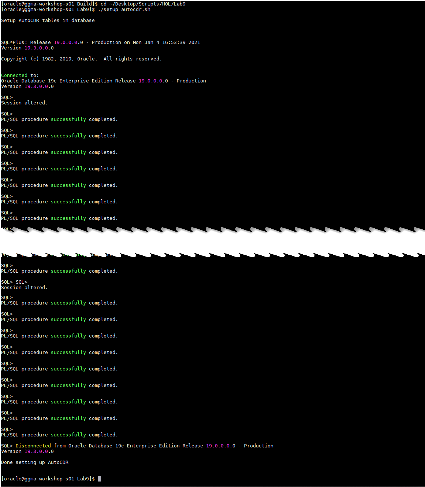

2. Search into ALL\_GG\_AUTO\_CDR\_TABLES to Verify tables on which auto CDR is done.

    sqlplus / as sysdba<br/>
    alter session set container=OGGOOW19;<br/>
    SELECT TABLE_NAME FROM ALL\_GG\_AUTO\_CDR\_TABLES;<br/>

    ```
    <copy>
    cd ~/Desktop/Scripts/HOL/cdrauto
    ./verifytable_cdr_bothdb.sh
    </copy>
    ```

    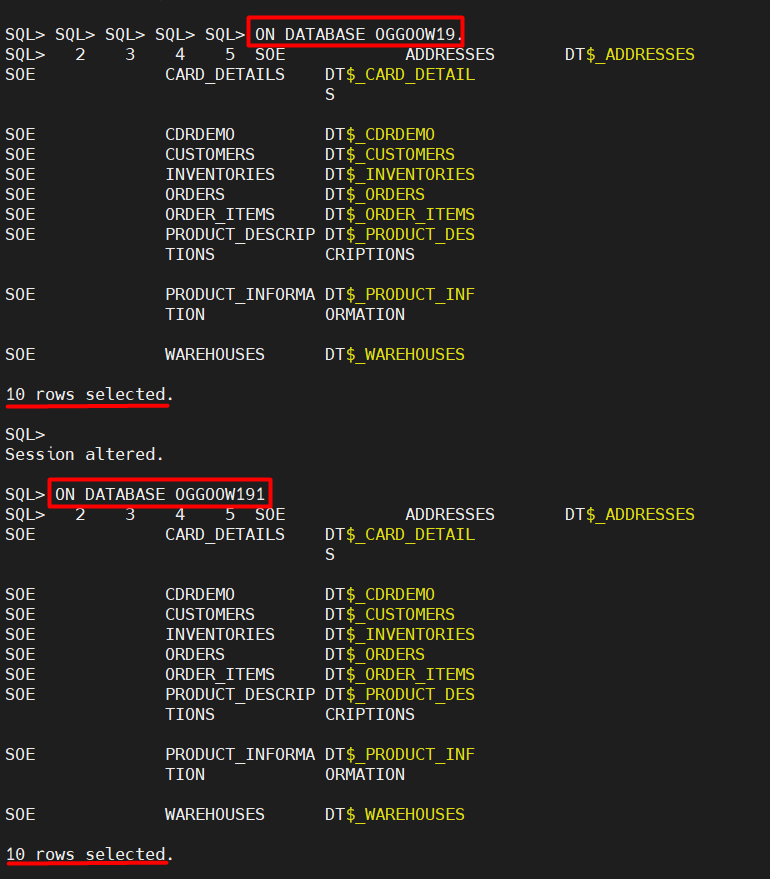


3. Start GoldenGate Processes

    ```
    <copy>
    cd ~/Desktop/Scripts/HOL/Lab9
    ./start_replication.sh Welcome1 17001 EXTSOE1 17002 SOE2SOE1 16001 IREP1</copy>
    ```

    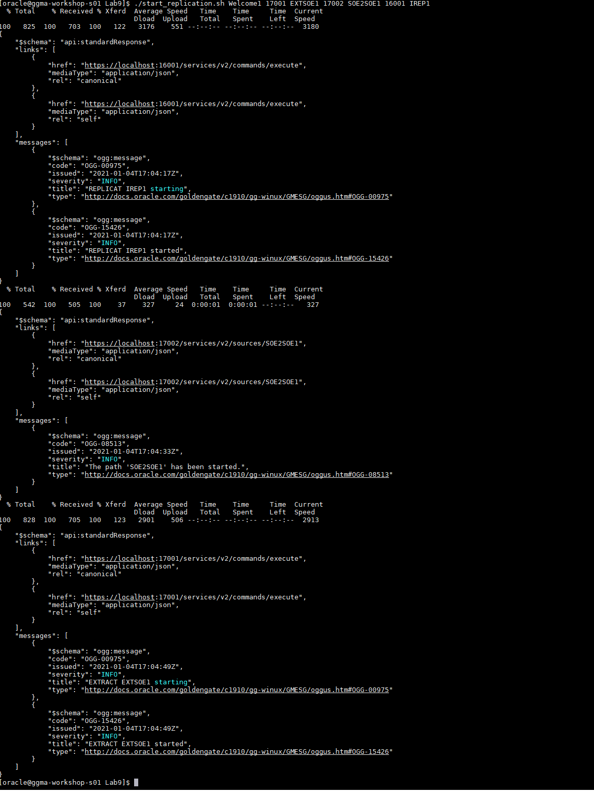


## Task 4: Generate Load with Swingbench

In this step we will use a script to invoke Swingbench to apply data to the source (Atlanta) and target (Boston) databases at the same time and then validate performance using the Performance Metric Service.

1. As user *oracle* from the SSH terminal session, navigate to `~/Desktop/Scripts/HOL/Lab9` and start Swingbench utility

     ```
    <copy>
    cd ~/Desktop/Scripts/HOL/Lab9
    ./start_swingbench.sh
    </copy>
    ```

    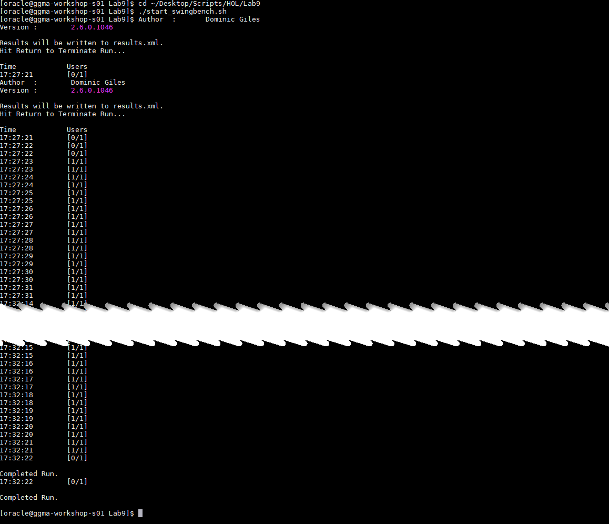

2. Go to the browser tab session of the Performance Metrics Server for *Atlanta* Deployment and select "*IREP1 > Database Statistics*" to validate

    ```
    <copy>https://localhost/Atlanta/pmsrvr</copy>
    ```

    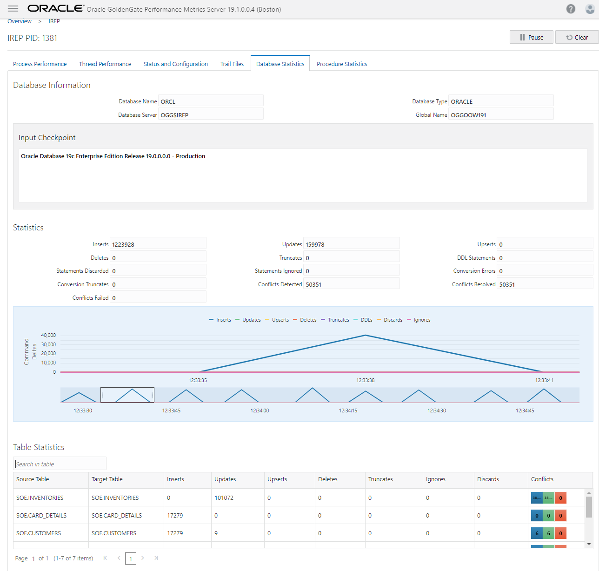

3. Go to the browser tab session of the Performance Metrics Server for *Boston* Deployment and select "*IREP > Database Statistics*" to validate

    ```
    <copy>https://localhost/Boston/pmsrvr </copy>
    ```

    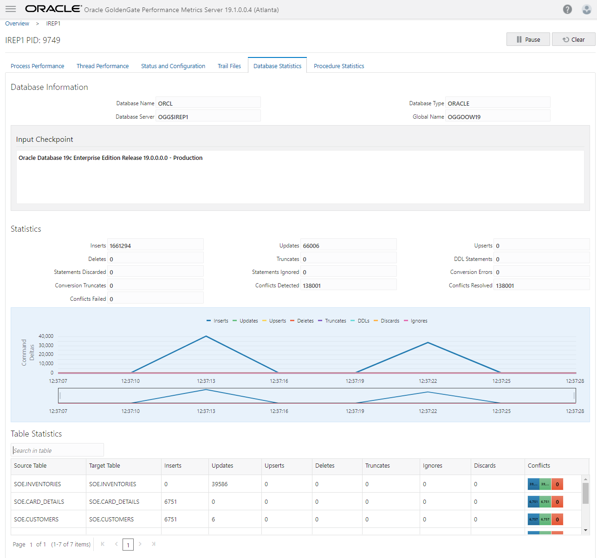

## Task 5: Remove Auto CDR from table

1. To remove auto cdr from the table, use <b>REMOVE\_AUTO\_CDR</b>  method of DBMS\_GOLDENGATE\_ADM package.

    ```
    <copy>
    sqlplus / as sysdba
    </copy>
    ```

    ```
    <copy>
    alter session set container=OGGOOW19;
    </copy>
    ```

     ```
    <copy>
    exec DBMS_GOLDENGATE_ADM.REMOVE_AUTO_CDR('soe','cdrdemo');
    </copy>
    ```

    ```
    <copy>
    alter session set container=OGGOOW191;
    </copy>
    ```
     ```
    <copy>
    exec DBMS_GOLDENGATE_ADM.REMOVE_AUTO_CDR('soe','cdrdemo');
    </copy>
    ```
    ```
    <copy>
    exit
    </copy>
    ```


2. Search into ALL\_GG\_AUTO\_CDR\_TABLES to Verify if CDR is removed from CDRDEMO table or not.

    ```
    <copy>
    cd ~/Desktop/Scripts/HOL/cdrauto
    ./verifytable_cdr_bothdb.sh
    </copy>
    ```

    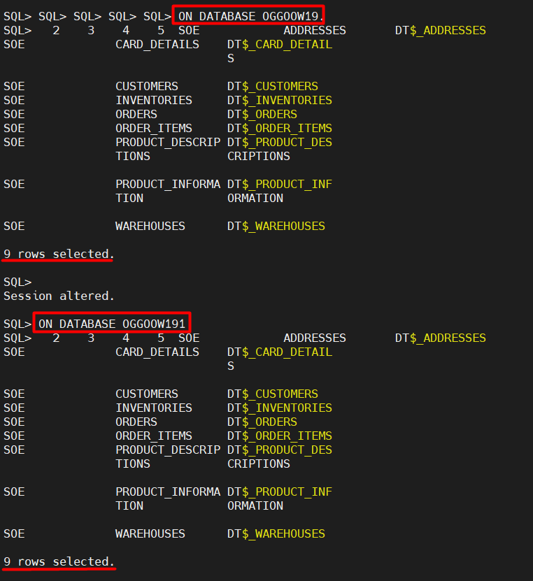

You may now [proceed to the next lab](#next).

## Learn More

* [GoldenGate Microservices](https://docs.oracle.com/en/middleware/goldengate/core/19.1/understanding/getting-started-oracle-goldengate.html#GUID-F317FD3B-5078-47BA-A4EC-8A138C36BD59)

## Acknowledgements
* **Author** - Madhu Kumar S., Data Integration, December 2020
* **Contributors** - Brian Elliott, Meghana Banka, Rene Fontcha
- **Last Updated By/Date** - Rene Fontcha, LiveLabs Platform Lead, NA Technology, January 2021
