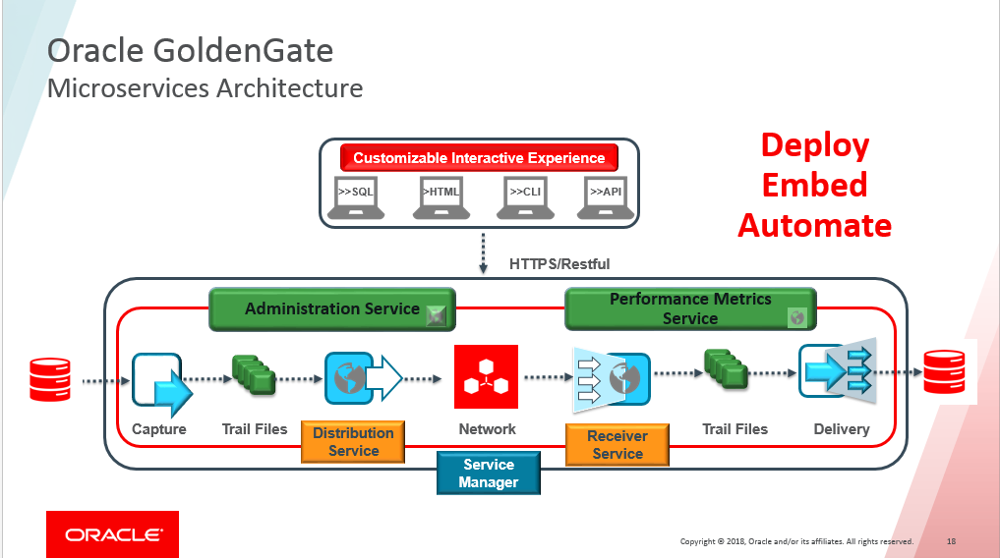

# Introduction

This hands-on lab is designed to demonstrate how Oracle GoldenGate 19c Microservices can be used to setup a replication environment by a mix of web page, shell scripts and Rest API calls.  For ease of execution, all commands to be executed are provided in shell scripts staged on the instance.

The labs will walk the end-user through how to add all components of Oracle GoldenGate replication.

*Estimated Lab Time*: 4 hours

### About Oracle GoldenGate Microservices
Oracle GoldenGate offers high-performance, fault-tolerant, easy-to-use, and flexible real- time data streaming platform for big data environments. It easily extends customers’ real-time data integration architectures to big data systems without impacting the performance of the source systems and enables timely business insight for better decision making. This workshop focuses on **GoldenGate Real Time Data Capture** demonstrating four scenarios that you can use (both on-premise and in the cloud) to capture real time data changes from your sources.

### Lab Architecture


KEY FEATURES

Non-invasive, real-time transactional data streaming while applying target transformations

KEY BENEFITS

- Improve IT productivity in integrating with data management systems.
- Use real-time data in big data analytics for more timely and reliable insight
- Improve operations and customer experience with enhanced business insight
- Minimize overhead on source systems to maintain high performance

Oracle GoldenGate Microservices real-time data streaming platform also allows customers to keep their data reservoirs up to date with their production systems.

### Objectives
The objectives of the labs is to familiarize you with the process to create data replication objects that will allow you to replicate data real-time using GoldenGate Microservices while leveraging Restful APIs.

### Prerequisites
* An Oracle Free Tier, Always Free, Paid or LiveLabs Cloud Account
* A general understanding of database and data replication concepts using Oracle GoldenGate

### Passwords

The passwords for all accounts are:

```
Database Accounts (sys/system, etc..): Welcome1
GoldenGate Users (c##ggate, ggate): ggate
GoldenGate Admin(oggadmin): Welcome1
```  

You may now [proceed to the next lab](#next).

## Learn More

* [GoldenGate Microservices](https://docs.oracle.com/en/middleware/goldengate/core/19.1/understanding/getting-started-oracle-goldengate.html#GUID-F317FD3B-5078-47BA-A4EC-8A138C36BD59)

## Acknowledgements
* **Author** - Brian Elliott, Data Integration Team, Oracle, November 2020
* **Contributors** -Zia Khan, Meghana Banka, Rene Fontcha
- **Last Updated By/Date** - Rene Fontcha, LiveLabs Platform Lead, NA Technology, April 2021
