# GoldenGate Microservices Transformations

## Introduction

This lab is intended to give you familiarity with how to configure GG for database to database replication transformations. GoldenGate is Non-invasive, real-time transactional data streaming
secured, reliable and fault-tolerant in data delivery. It is easy to install, configure and maintain real-time changed data.
It is easily extensible and flexible to stream transformed data to other relational targets

*Estimated Lab Time*:  30 minutes

### Lab Architecture


### Objectives

To use GoldenGate to perform transformations on the data during the replication process. Even though GoldenGate is primarily a real time data replication tool, it does have the ability to create data transformations. In this lab we will create sample transformations to showcase this feature of GoldenGate.


### Prerequisites
This lab assumes you have:
- A Free Tier, Paid or LiveLabs Oracle Cloud account
- You have completed:
    - Lab: Prepare Setup
    - Lab: Environment Setup
    - Lab: Initialize Environment
    - Lab: Create One-Way Replication

In this lab we will setup GoldenGate Microservices Transformations

## Task 1: Preparation for Data Transformations
1. From the SSH terminal session as user *oracle* connecting to your VM instance, launch SQLPLUS and connect as `gate/gate` to PDB `OGGOOW191`

    ```
    <copy>sqlplus ggate/ggate@oggoow191</copy>
    ```

2.	Alter Customer Table `SOE.CUSTOMERS` and add new column `CUSTOMER_NAME` :

    ```
    <copy>ALTER TABLE SOE.CUSTOMERS  ADD (CUSTOMER_NAME VARCHAR2(40) );</copy>
    ```

    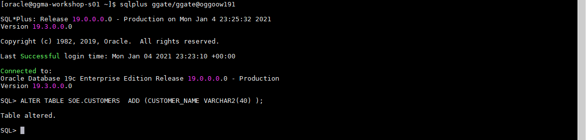

3.	Create Table `SOE.LOGON_AUDIT` for testing the OGG environmental variables and tokens

    ```
    <copy>
    CREATE TABLE "SOE"."LOGON_AUDIT"
           (     "LOGON_ID" NUMBER ,
                 "CUSTOMER_ID" NUMBER,
                 "LOGON_DATE" DATE,
                 "HOST" VARCHAR2(40),
                 "GG_GROUP" VARCHAR2(40),
                 "OSUSER" VARCHAR2(40),
                 "DOMAIN" VARCHAR2(40),
                 "BA_IND" VARCHAR2(40),
                 "COMMIT" VARCHAR2(40),
                 "POS" VARCHAR2(40),
                 "RBA" VARCHAR2(40),
                 "TABLENAME" VARCHAR2(40),
                 "OPTYPE" VARCHAR2(40)
           ) ;
    </copy>
    ```

    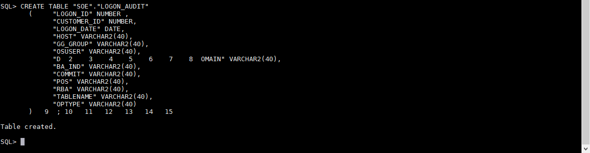

## Task 2: Concatenating the source *m* columns into target single *n* columns
The picture below represents the summary of the transformations we will be performing in this step

  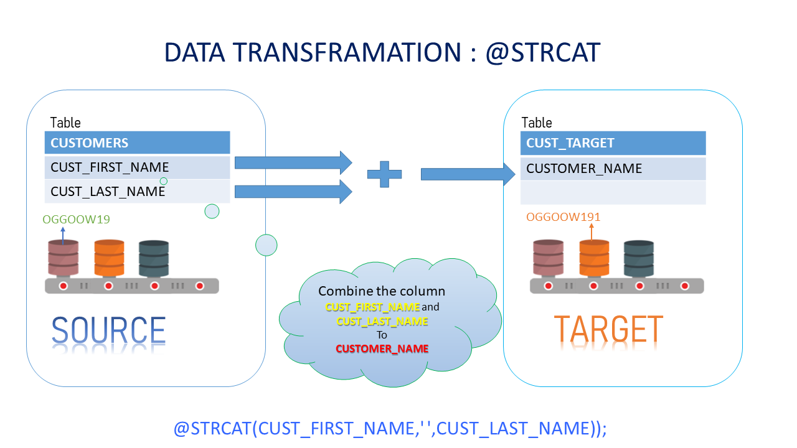

1. Go to the browser tab session of the Admin Server for *Boston* Deployment

    ```
    <copy>https://localhost/Boston/adminsrvr</copy>
    ```

2. Update REPLICAT IREP parameters by adding the attributes to concatenate `CUST_FIRST_NAME` and `CUST_LAST_NAME` and mapping the combined result into `CUSTOMER_NAME` in the target table. Add the following, after commenting the already existing map statement for CUSTOMERS table with *”--“* or simply delete all previous mappings.

    ```
    <copy>
    MAP OGGOOW19.SOE.CUSTOMERS, TARGET oggoow191.SOE.CUSTOMERS, KEYCOLS(customer_id), &
             COLMAP (USEDEFAULTS,CUSTOMER_NAME =@STRCAT(CUST_FIRST_NAME,' ',CUST_LAST_NAME));
    </copy>
    ```

    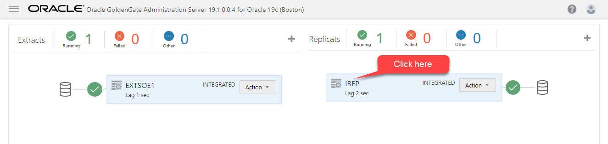

    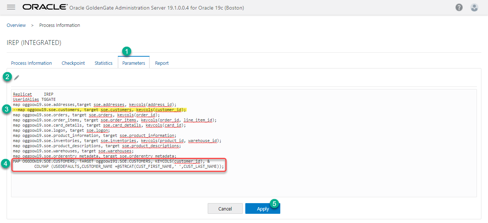

3. From the same browser session, Restart (stop/start) Replicat IREP from the drop-down `Action` menu

    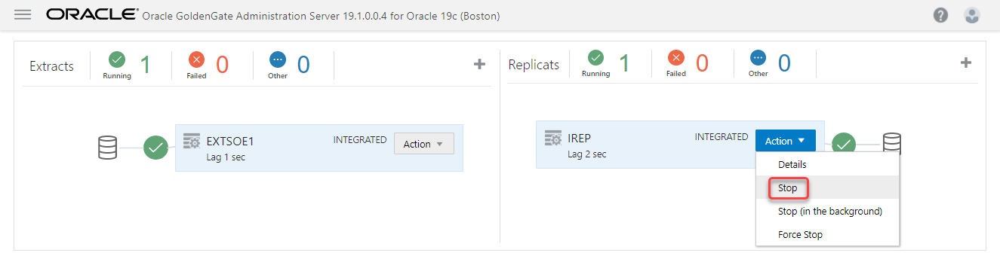

    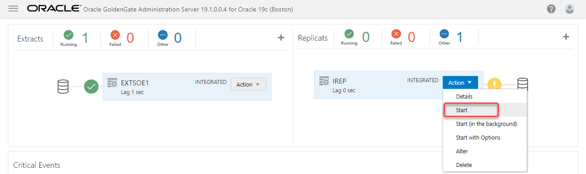

4. From your SSH terminal session as user *oracle* connecting to your VM instance, launch SQLPLUS and connect as `gate/gate` to source PDB `OGGOOW19` and insert data into customer table.

    ```
    <copy>sqlplus ggate/ggate@oggoow19</copy>
    ```

    ```
    <copy>
    INSERT INTO SOE.CUSTOMERS VALUES (12345678,'LARRY','ELLISON','NY','NEW YORK','5000','LARRY@ORACLE.COM','365','15-OCT- 11','BUSINESS','MUSIC','4-JAN-61','Y','N','2767122','126219999');
    commit;

    </copy>
    ```

    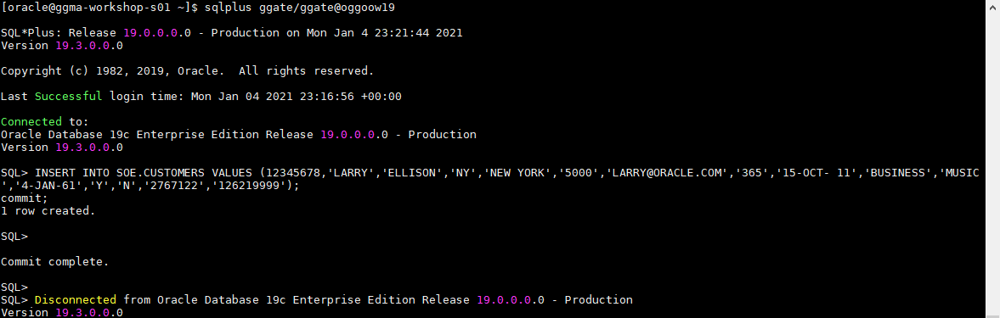

5. Query target table `CUSTOMER` on PDB `OGGOOW191` to validate the transformation expected

    ```
    <copy>sqlplus ggate/ggate@oggoow191</copy>
    ```

    ```
    <copy>
    Col CUST_FIRST_NAME format a15
    Col CUST_LAST_NAME  format a15
    Col CUSTOMER_NAME format a15

    select CUST_FIRST_NAME,CUST_LAST_NAME,CUSTOMER_NAME
      from SOE.CUSTOMERS
     where customer_id=12345678;
    </copy>
    ```

    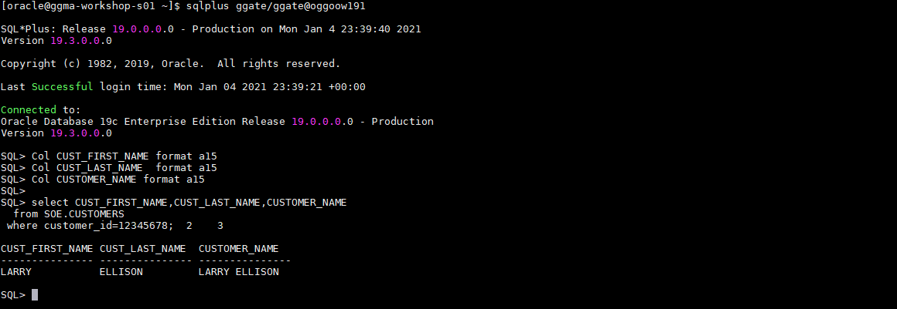

## Task 3: Masking a Source Data Field

In this step we will mask the email ID field extracted at the source and replace it with a dummy email post replication at the target

  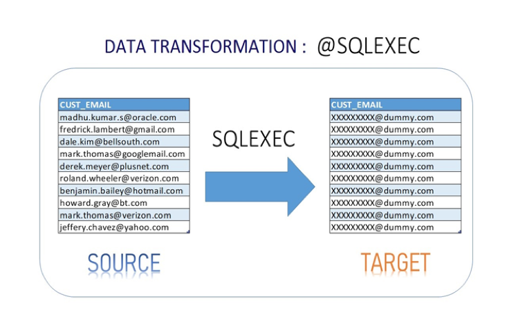

1. Go to the browser tab session of the Admin Server for *Boston* Deployment

    ```
    <copy>https://localhost/Boston/adminsrvr</copy>
    ```

2. Update REPLICAT IREP parameters by adding the attributes to pass customer email to *`SQLEXEC()`* for execution of stored procedure and mapping it back to the target table. Add the following, after commenting the already existing map statement for CUSTOMERS table with *"--"* or simply delete all previous mappings.

    ```
    <copy>
    MAP oggoow19.SOE.CUSTOMERS, TARGET oggoow191.SOE.CUSTOMERS, keycols(customer_id), &
    SQLEXEC (SPNAME P_MAIL, PARAMS (code_param = CUST_EMAIL)), &
    COLMAP (USEDEFAULTS, CUST_EMAIL = P_MAIL.desc_param,CUSTOMER_NAME =@STRCAT(CUST_FIRST_NAME,CUST_LAST_NAME));    
    </copy>
    ```

    

    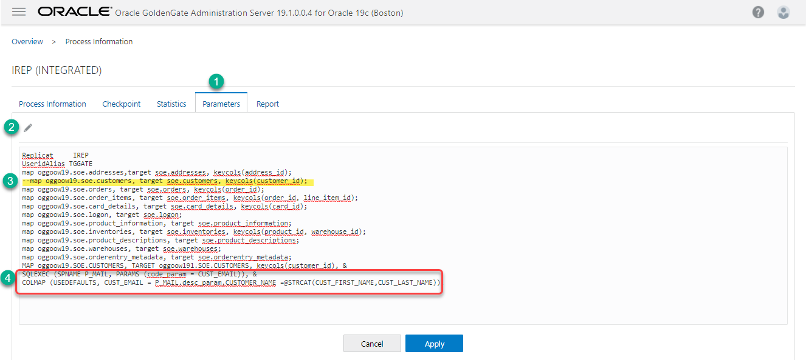

3. As user *oracle* from the SSH terminal session, launch SQLPLUS into Target Database (OGGOOW191) as *`ggate/ggate`*

    ```
    <copy>sqlplus ggate/ggate@oggoow191</copy>
    ```

4. Run the following to Create a required stored procedure under GGATE user. This will be used in the SQLEXEC call in the mapping statement.

    ```
    <copy>
    CREATE  OR REPLACE FUNCTION F_MAIL(CODE_PARAM IN VARCHAR2)  
       	RETURN VARCHAR2  
       	IS DESC_PARAM VARCHAR2(100);
       	BEGIN  
       	RETURN 'XXXXXXXXX@dummy.com';  
    	  END;
    /
    CREATE OR REPLACE PROCEDURE  P_MAIL (CODE_PARAM IN VARCHAR2,DESC_PARAM  OUT VARCHAR2)
     IS  
     begin
     select F_MAIL('CODE_PARAM')
        into DESC_PARAM
        from dual;    
      end;
      	 /
    </copy>
    ```

    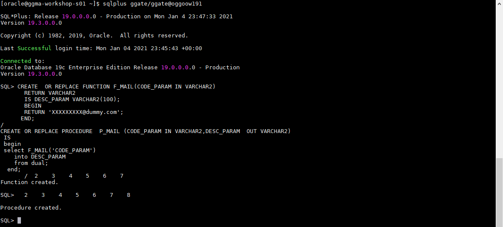

5. Test out `F_MAIL` procedure and verify results

    ```
    <copy>
    select F_MAIL('MADHU') from dual;
    </copy>
    ```

    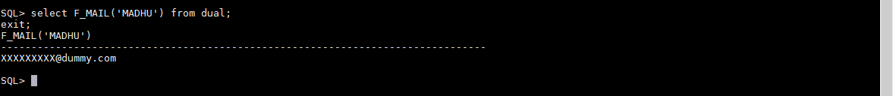

6. From the same browser session, Restart (stop/start) Replicat IREP from the drop-down `Action` menu

    

    

7. As user *oracle* from another SSH terminal session, launch SQLPLUS into Source Database (OGGOOW19) as *`ggate/ggate`*  and update data on the protected `CUST_EMAIL` column of CUSTOMER table.

    ```
    <copy>sqlplus ggate/ggate@oggoow19</copy>
    ```

    ```
    <copy>
    update soe.customers  set CUST_EMAIL='alberto.may@hotmail.com' where CUSTOMER_ID=562;
    update soe.customers  set CUST_EMAIL='andrew.king@virgin.com' where CUSTOMER_ID=563;
    update soe.customers  set CUST_EMAIL='francisco.simpson@msn.com' where CUSTOMER_ID=564;
    update soe.customers  set CUST_EMAIL='kenneth.martin@aol.com' where CUSTOMER_ID=565;
    update soe.customers  set CUST_EMAIL='steven.jackson@virgin.com' where CUSTOMER_ID=566;
    update soe.customers  set CUST_EMAIL='terry.nguyen@googlemail.com' where CUSTOMER_ID=567;
    update soe.customers  set CUST_EMAIL='dewey.duran@ntlworld.com' where CUSTOMER_ID=568;
    update soe.customers  set CUST_EMAIL='leroy.snyder@msn.com' where CUSTOMER_ID=569;
    update soe.customers  set CUST_EMAIL='tracy.guerrero@yahoo.com' where CUSTOMER_ID=570;
    commit;
    </copy>
    ```

    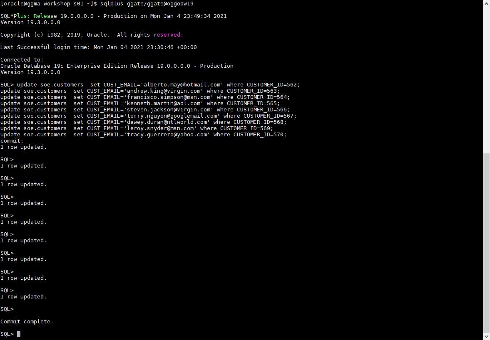

8. From your SQLPLUS session connected to the target database (`OGGOOW191`) validate that the static masking of the emails plainly added at the source has occurred on Target in table `soe.customers`.

    ```
    <copy>sqlplus ggate/ggate@oggoow191</copy>
    ```

    ```
    <copy>select CUST_EMAIL from soe.customers where customer_ID between 562 and 570;</copy>
    ```

    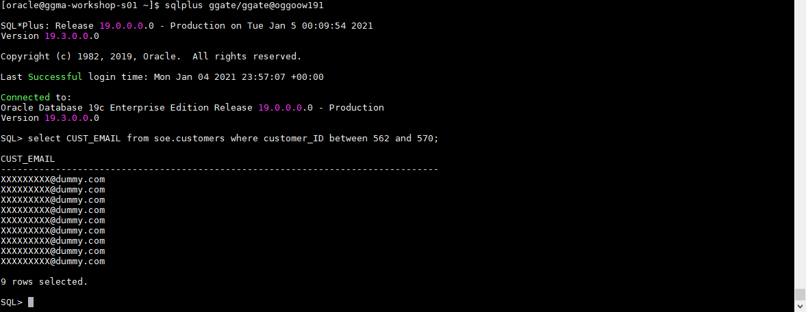

## Task 4: Using Environment Variables/Tokens

1. Go to the browser tab session of the Admin Server for *Boston* Deployment

    ```
    <copy>https://localhost/Boston/adminsrvr</copy>
    ```

2. Update IREP Replicat parameters by adding the attributes to map the Environment Variables to the audit table. Add the following after `*useridalias` command :

    ```
    <copy>
    map oggoow19.SOE.LOGON, TARGET oggoow191.SOE.LOGON_AUDIT, KEYCOLS(LOGON_ID), &
    COLMAP (USEDEFAULTS,&  
      host=@GETENV('GGENVIRONMENT','HOSTNAME'),&  
      gg_group=@GETENV ('GGENVIRONMENT','GROUPNAME'),&  
      osuser=@GETENV ('GGENVIRONMENT','OSUSERNAME'),&  
      domain=@GETENV ('GGENVIRONMENT','DOMAINNAME'),&  
      ba_ind=@GETENV ('GGHEADER','BEFOREAFTERINDICATOR'),&  
      commit=@GETENV ('GGHEADER','COMMITTIMESTAMP'),&  
      pos=@GETENV ('GGHEADER','LOGPOSITION'),&  
      rba=@GETENV ('GGHEADER','LOGRBA'),&  
      tablename=@GETENV ('GGHEADER','TABLENAME'),&  
      optype=@GETENV ('GGHEADER','OPTYPE'));
    </copy>
    ```

    

    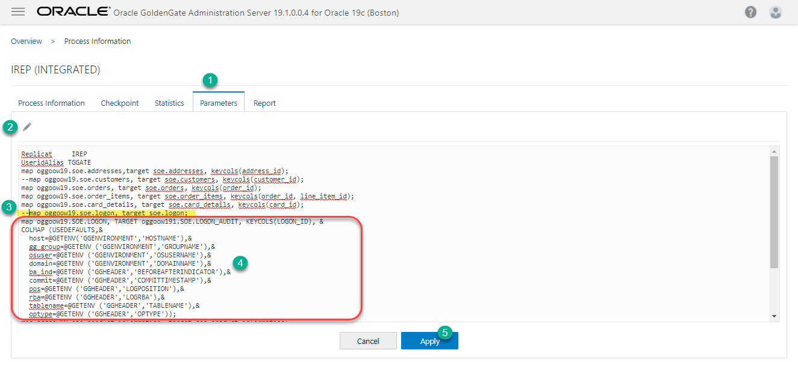

3. From the same browser session, Restart (stop/start) Replicat IREP from the drop-down `Action` menu

    

    

4.	From your SQLPLUS session connected to the source database (OGGOOW19) add a few records to `soe.logon`

    ```
    <copy>sqlplus ggate/ggate@oggoow19</copy>
    ```
    ```
    <copy>
    insert into soe.logon values ('48092713',130159,sysdate);
    insert into soe.logon values ('48092714',130160,sysdate);
    insert into soe.logon values ('48092715',130161,sysdate);
    commit;
    </copy>
    ```

    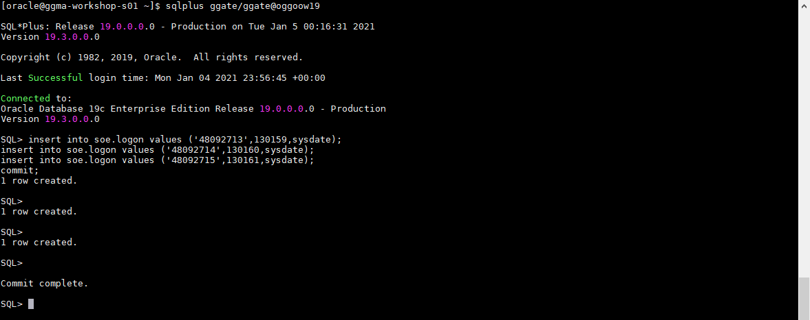

5.	From your SQLPLUS session connected to the target database (OGGOOW191) query the table `SOE.LOGON_AUDIT` to validate the expected results

   ```
   <copy>sqlplus ggate/ggate@oggoow191</copy>
   ```
   ```
   <copy>
   col DOMAIN for a7
   col BA_IND for a10
   col COMMIT for a30
   col GG_GROUP for a10
   col POS   for a10
   col TABLENAME for a20
   col OPTYPE for a8
   col RBA  for a10
   col HOST for a25
   col GG_GROUP for a5
   col OSUSER for a10
   col DOMAIN for a10
   set pages 333 lines 333
   show con_name
   show user
   select * from SOE.LOGON_AUDIT;
   exit;
   </copy>
   ```

   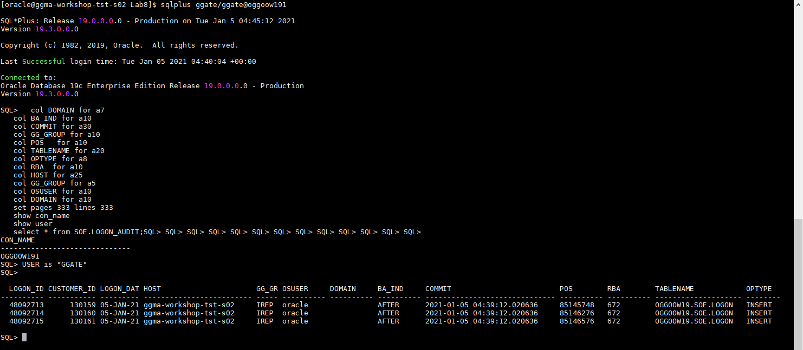

### Summary

Oracle GoldenGate offers high-performance, fault-tolerant, easy-to-use, and flexible real- time data streaming platform. It easily extends customers’ real-time data integration architectures without impacting the performance of the source systems and enables timely business insight for better decision making.

You may now [proceed to the next lab](#next).

## Learn More

* [GoldenGate Microservices](https://docs.oracle.com/en/middleware/goldengate/core/19.1/understanding/getting-started-oracle-goldengate.html#GUID-F317FD3B-5078-47BA-A4EC-8A138C36BD59)

## Acknowledgements
* **Author** - Madhu Kumar S. Data Integration, December 2020
* **Contributors** - Brian Elliott, Rene Fontcha
- **Last Updated By/Date** - Rene Fontcha, LiveLabs Platform Lead, NA Technology, January 2021
