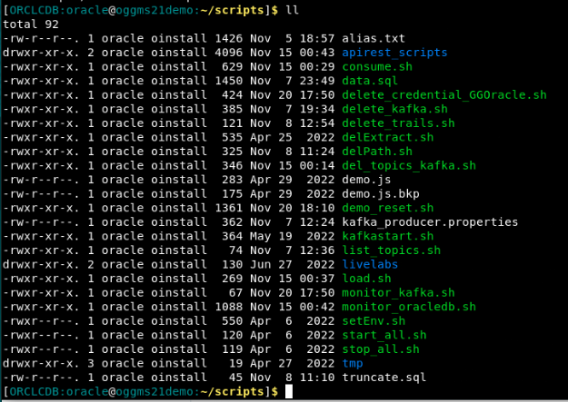

# Discover the Environment

## Introduction

In this lab we will walk through the different components that have already been installed and configured in this lab:

- An Oracle database 21c
- An Apache Kafka setup
- Oracle GoldenGate comprising a number of elements:

    - GG for Oracle
    - GG for Distributed Applications and Analytics (GG for Big Data)
    - GG for non-Oracle

We'll take a look at the current situation of these components and how to interact with them.

The default way to interact with the environment is using a single browser window running a Linux desktop through noVNC.  No extra tools on the side of your desktop are necessary in this case.  At the end of this lab page we'll also offer an alternative access, using a remote secure shell on your laptop and direct access to the GoldenGate consoles from a local browser.  Some extra setup is required for this configuration.

*Estimated Lab Time*:  10 minutes

### Lab Architecture


### Objectives

Understanding the different components that were pre-installed, how to access these throught the various available interfaces, and how to reset the lab in case of issues.


### Prerequisites

This lab assumes you have:

- A Free Tier, Paid or LiveLabs Oracle Cloud account
- You have completed:

    - Lab: Prepare Setup (*Free-tier* and *Paid Tenants* only)
    - Lab: Environment Setup

## Task 1: Using the noVNC interface

1. In the previous step you should have received the URL that opens the noVNC desktop in your browser.  At the initial start of the environment, you should see two browser windows:

- On the left side this tutorial,
- On the right side the login screen for the GoldenGate Service Manager

2. Besides these 2 windows you will also need 2 terminal windows to interact through the command line with some utilities.

- Click on the **Activities** button in the upper left corner, and select the 3rd "Terminal" icon.


You will be logged in as user **Oracle**, with access to a set of scripts to interact with the various components. You can see the relevant environment variables in the header.


3. In the course of the lab we'll ask you run multiple commands in parallel, so you should open up a second Terminal window.

- Click on the **Terminal** icon on the top right, and select **New Window**


This will open a second Terminal window.  Arrange the 4 window in a convenient way to easily navigate between them.

4. Discovering the scripts at  your disposal

We'll take a look at the various scripts we'll use in the rest of this lab

- move in the scripts directory

```
<copy>cd scripts</copy>
```

- List the content of this directory

```
<copy>ll</copy>
```



Some of the scripts we'll use in this tutorial:

- **load.sh**: a script to generate a continuous flow of inserts into the EMPLOYEES table of the SOURCE_APP schema of the Oracle database
- **monitor_oracle.sh**: a script to track the inserts into the the table EMPLOYEES
- **monitor_kafka.sh**: read the kafka topic EMPLOYEES where we'll be inserting the changes coming from the Oracle Database.
- **demo_reset.sh**: completely reset the lab environment to restart the lab execution.  You can use this script to restart the lab execution with a fresh setup.

5. Direct access to the Oracle database

- You can access the Oracle database using **sqlplus** from the command line. Below 2 alternative database users at your disposal:

```
<copy>sqlplus c##ggadmin/Welcome#123 </copy>
<copy>sqlplus sys/Welcome#123 as sysdba </copy>
```

- Use the ```exit``` command to quit your sqlplus session.

6. Accessing kafka

- You can list the available kafka topics with the below command:

```
<copy>/opt/kafka/bin/kafka-topics.sh --list --bootstrap-server localhost:9092</copy>
```

Running this command at this point in the tutorial will not return any values, as we have not created a topic yet.

## Task 2: Accessing the GoldenGate Management consoles

Return to the browser window that was open on the right, showing the **GoldenGate Service Manager** login screen.

- You will use **localhost** as the GoldenGate instance is running on this local environment.
- Port 10000 is the port configured for the **Service Manager**.

1. Click on the *Username* field and provide the credentials below to login.

    ```
    Username: <copy>oggadmin</copy>
    ```

    ```
    Password: <copy>oggadmin</copy>
    ```

    

3. Confirm successful login:

    

    If successful, the page above is displayed and as a result your environment is now ready.

- You can see the various **deployment types** that were already configured on this environment for GoldenGate.


    

- For each deployment type you can access the different services associated with the Deployment:

    - Administration Service
    - Distribution Service
    - Performance Metrics Service
    - Receiver Service

In the interest of time and for ease of execution, all prerequisite tasks to prepare the database for GoldenGate replication have already been performed on your VM instance. This includes:

- Enabling Archive Log Mode
- Enabling Supplemental Logging
- Setting DB parameter `enable_goldengate_replication` to  true
- Creating GoldenGate users in the database


**You may now [proceed to the next lab](#next)**, or alternatively investigate other ways to access the environment below:

## OPTIONAL Task 3: Accessing the environment without noVNC

In some cases you might want to access the GoldenGate consoles and the terminal windows directly from your laptop.  This allows for easier cut and paste of commands, and a better graphical experience.  In this Task we'll explain you the steps required for this setup

1. Start a remote shell to access the machine

    In order to enable this, you need to have the private key corresponding to the public key used when creating the OCI Compute instance.

    With this key available, you can run a remote shell of you choice - for example putty on windows or ssh on Mac.  Below an axample to access the console via a mac shell:

```
<copy>ssh -i yourprivatekey opc@123.123.123.123</copy>
```

- replace *youprivatekey* with a valid path to the private key corresponding to the public key specified during the instance creation
- replace the IP address 123.123.123.123 with the public IP address of your compute instance.  This is the same IP used to access the noVNC console.

2. Once you are logged in as user **opc** you need to sudo to user **oracle** to be able to run the lab commands:

```
<copy>sudo su - oracle</copy>
```

3. Access to the GoldenGate consoles

- Access the GoldenGate Service Manager through your local brower on your desktop, using the IP address and the port 10000 :

    ```
    <copy>http://123.123.123.123:10000</copy>
    ```

    As before, replace the IP address with -real public IP address of your Compute instance.

You may now [proceed to the next lab](#next).

## Learn More

- [GoldenGate Microservices](https://docs.oracle.com/en/middleware/goldengate/core/19.1/understanding/getting-started-oracle-goldengate.html#GUID-F317FD3B-5078-47BA-A4EC-8A138C36BD59)

## Acknowledgements

- **Author** - Jan Leemans, December 2023
- **Contributors** - Carmelo Millan
- **Last Updated By/Date**
