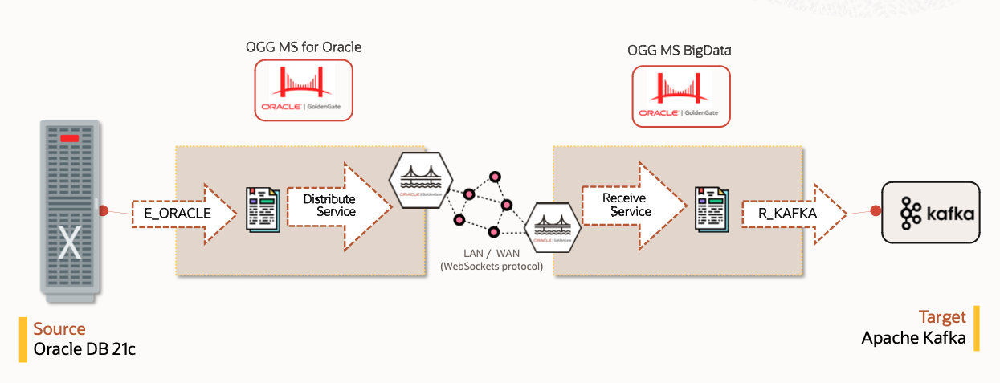

# Introduction

This hands-on lab is designed to demonstrate how Oracle GoldenGate 23ai can be used to setup a replication environment from an Oracle database towards a Apache Kafka target.

You will be using a pre-configured environment that comprises all components for running this setup: GoldenGate 23ai for Oracle and GoldenGate 23ai for Distributed Applications and Analytics (previously known as GG for Big Data), as well as an Oracle 21c database and an Apache Kafka.

We will simulate continuous transactions in the Oracle database “SOURCE_APP”.”EMPLOYEES” table, capture these transactions, send them to the Distributed Data and Analytics deployment, and deliver them in real-time to a Kafka topic.

The labs will walk you through all the steps to configure all the components of Oracle GoldenGate replication.

*Estimated Lab Time*: 2 hours

## About Oracle GoldenGate 23ai

Oracle GoldenGate offers high-performance, fault-tolerant, easy-to-use, and flexible real- time data streaming platform for a wide range of environments. It easily extends customers’ real-time data integration architectures to Analytics systems without impacting the performance of the source systems and enables timely business insight for better decision making. This workshop focuses on **GoldenGate Real Time Data Capture** demonstrating how you can use such a setup (both on-premise and in the cloud) to capture real time data changes from your sources.

We upgraded this lab in September 2024 to use the GoldenGate 23ai version of GoldenGate.

### Lab Architecture



KEY FEATURES

Non-invasive, real-time transactional data streaming while applying target transformations

KEY BENEFITS

- Improve IT productivity in integrating with data management systems.
- Use real-time data in Analytics for more timely and reliable insight
- Improve operations and customer experience with enhanced business insight
- Minimize overhead on source systems to maintain high performance

Oracle GoldenGate real-time data streaming platform also allows customers to keep their data reservoirs up to date with their production systems.

### Objectives

The objectives of the labs is to familiarize you with the process to create data replication objects that will allow you to replicate data real-time using GoldenGate while leveraging Restful APIs.

### Prerequisites

- An Oracle Free Tier, Always Free, Paid or LiveLabs Cloud Account
- A general understanding of database and data replication concepts using Oracle GoldenGate

### Passwords

The passwords for all accounts are:

```
Database Accounts (sys/system, etc..): <copy>Welcome#123</copy>
GoldenGate Database Users (c##ggate, ggate): <copy>Welcome#123</copy>
GoldenGate Admin(oggadmin): <copy>oggadmin</copy>
```

You may now **proceed to the next lab**.

## Learn More

* [GoldenGate Microservices](https://docs.oracle.com/en/middleware/goldengate/core/23/coredoc/overview-oracle-goldengate.html#GUID-3B1EF969-4A36-4338-820E-16F82B5C646D)

## Acknowledgements

- **Author** - Jan Leemans, December 2023
- **Contributors** -Carmelo Millan
- **Last Updated** - Jan Leemans, August 2024
