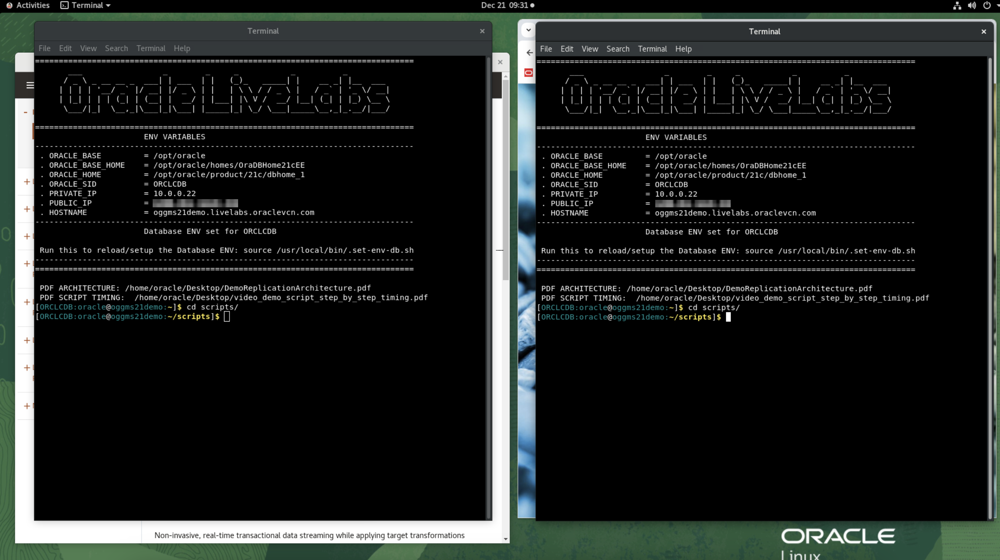
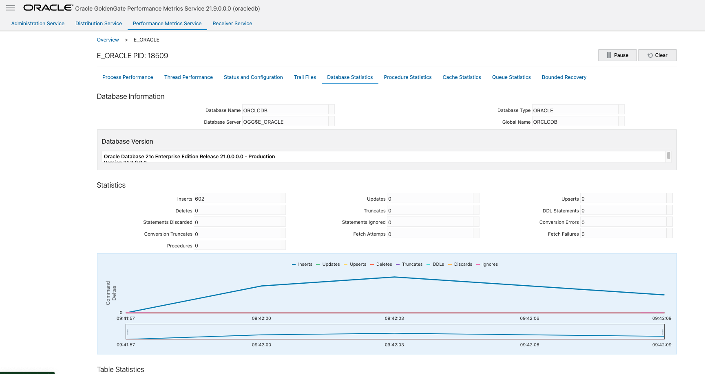

# Run a simulation and observe the results

## Introduction

This lab will demonstrate how to monitor an active replication through the various consoles of the GoldenGate environment and using a number of shell scripts to simulate activity on the source database.

*Estimated Lab Time*:  15 minutes

### Lab Architecture

  

### Objectives

- Run a script to simulate activity on the Source database
- Observe the target Kafka stream and see the database transactions being replicated
- Observe the various dashboards of GoldenGate that allow to monitor the activity

### Prerequisites

This lab assumes you have:

- A Free Tier, Paid or LiveLabs Oracle Cloud account
- You have completed:

    - Lab: Prepare Setup (*Free-tier* and *Paid Tenants* only)
    - Lab: Environment Setup
    - Lab: Discovery of the environment
    - Lab: Setup of the replication between Oracle and Kafka

## Task 1:Generate Transactions on the Oracle database

To simulate an active application interacting with a database, we'll be using a shell script that will inject records into the database during 5 minutes.

1. Return to the 2 **Terminal** windows we've opened in the beginning of this lab

    - If necessary reorganize the 2 windows to be side by side

    

    - Ensure you are logged in as user **oracle**
    - Change directory in both terminal windows to the **scripts** subdirectory

      ```
      <copy>cd scripts</copy>
      ```
2. Run the **load.sh** script to start injecting data into the Oracle database:

    ```
    <copy>
    sh load.sh
    </copy>
    ```
    You should see an output as in the below image:

   

3. Observe the transactions being inserted into the database: in the **second Terminal** window, run the monitor command to observe the database insertions:

      ```
      <copy>
      sh monitor_oracle.sh
      </copy>
      ```

    - You can see the counter increasing
    - Interrupt the monitor script with the key combination **Ctrl-C**

    


4. List the available Kafka topics:

    ```
    <copy>
    sh list_topics.sh
    </copy>
    ```

    

5. List the events on the Kafka topic **EMPLOYEES**

    ```
    <copy>
    sh monitor_kafka.sh
    </copy>
    ```

    

    You can see the database records represented in JSON being made available in the Kaka stream.

## Task 2: Observe the various GoldenGate dashboards

We'll return to the browser window with the GoldenGate Administration Service

1. Open the GoldenGate Administration Service on port 10000
2. Select the **oracledb** deployment
3. Open the **Administration Service**
4. Click on the name of the Extract: **E_ORACLE**

    

5. Now select the tab called **Statistics**

    

    You should see some records already inserted, and you can use the **Refresh** button to see the counter increase.

6. Click on the tab **Performance Metrics Service** on the very top of the window to see much more detailed information

    You get a visual representation of the various services associated with the deployment **oracledb**.  In this case we are interested in the **Extract** process

    

7. Click on the box **Extract Running**

    

    You can see various dashboards associated with the different entities you might be interested in: Process Performance, Trail Files, Database Statistics, etc.

    

8. Click on the various tabs to see the statistics

    

9. We can also look at the statistics on the receiving end.

    - Open the browser window with the GoldenGate Administration Service on port 10000
    - Select the deployment **bigdata**
    - Click on the service **Performance Metrics Service** on port 10203

        

10. Select the **Replicat** process

    

11. Observe the various dashboards you have available: Process Performance, Trail Files, and more.

    

    

**Congratulations, you have reached the end of this Lab !**

## Learn More

- [GoldenGate Microservices](https://docs.oracle.com/en/middleware/goldengate/core/19.1/understanding/getting-started-oracle-goldengate.html#GUID-F317FD3B-5078-47BA-A4EC-8A138C36BD59)

## Acknowledgements

- **Author** - Jan Leemans, December 2023
- **Contributors** - Carmelo Millan
- **Last Updated By/Date**
