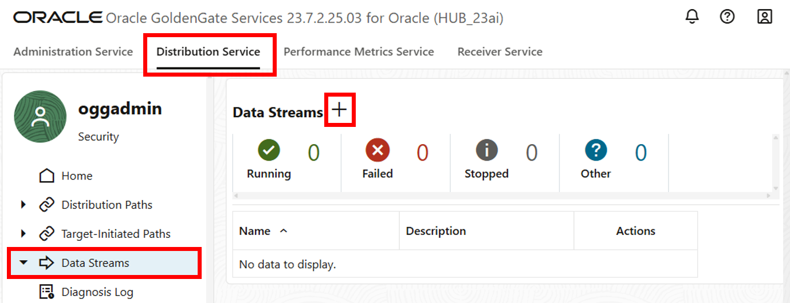
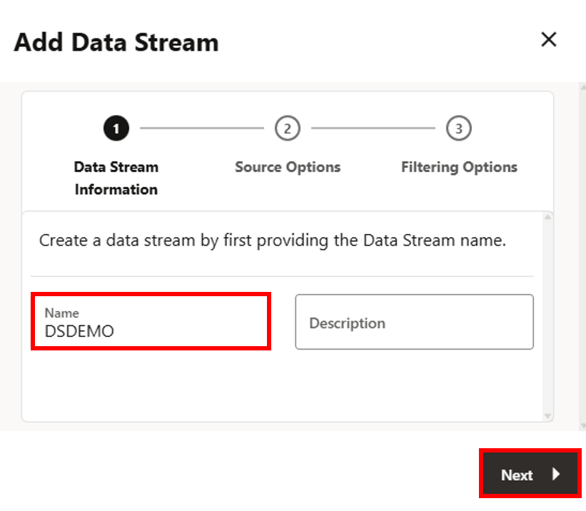
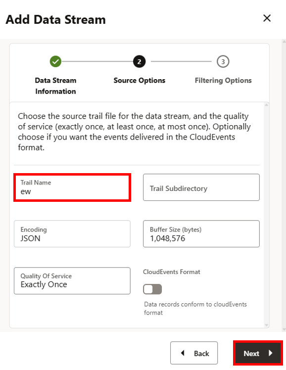
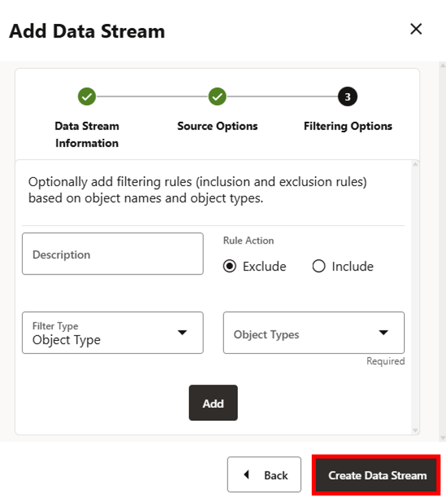
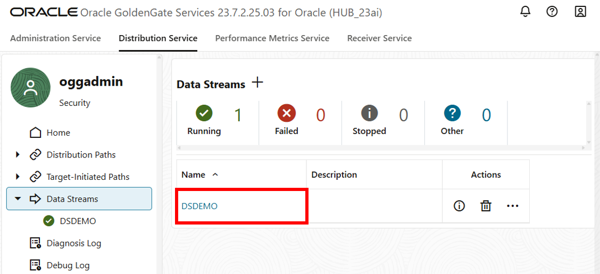
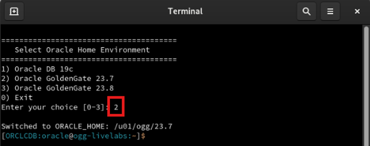
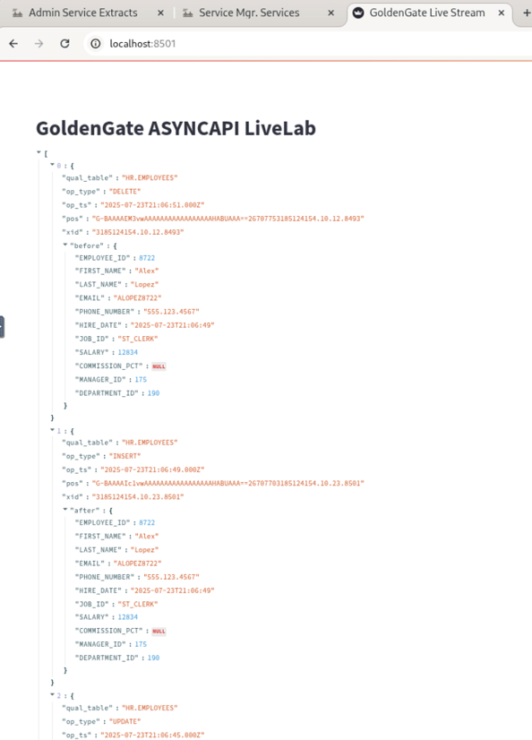

# Create an AsyncAPI Workflow

## Introduction

do we have an intro?

Estimated time: 20 minutes

### Objectives

In this lab, you will:
* do we have objectives?

## Task 1: Create the Publisher Stream

1. In the GoldenGate deployment console service menu bar, click **Distribution Service**.

2. In the navigation menu, click **Data Streams**, and then click **Add Data Stream** (plus-icon).

    

3. The Add Data Stream panel consists of three pages. On the Data Stream Information page, for Name, enter **DSDEMO**, and then click **Next**.

    

4. On the Source Options page, for Trail Name, enter the two-character name of the trail that was created by the Change Data Extract EWEST, which is `ew`, and then click **Next**.

    

5. On the Filtering Options page, leave the fields as they are, and click **Create Data Stream**.

    

    

    The creation of the Publisher is complete.

## Task 2: Create the Subscriber

1. Open the Terminal and enter option `2`.

    

2. Enter the following into the command prompt:

    ```
    <copy>nohup streamlit run ~/asyncapi_web_consumer.py > asyncapi_web_consumer.log 2>&1 &</copy>
    ```

3. Open the Chrome Browser at [http://localhost:8501](hhttp://localhost:8501).

    

    If you run into any issues with the WebUI component, you can enter following into the command line interface manually:

    ```
    <copy>ps -ef | grep streamlit</copy>
    ```
    ```
    <copy>kill -9 170787</copy>
    ```
    ```
    <copy>python3 asyncapi_consumer.py</copy>
    ```
You may now **proceed to the next lab**.

## Acknowledgements
* **Author** - Katherine Wardhana, User Assistance Developer
* **Contributors** - Mack Bell, Senior Principal Product Manager & Alex Lima, Database Product Management
* **Last Updated By/Date** - Katherine Wardhana, August 2025