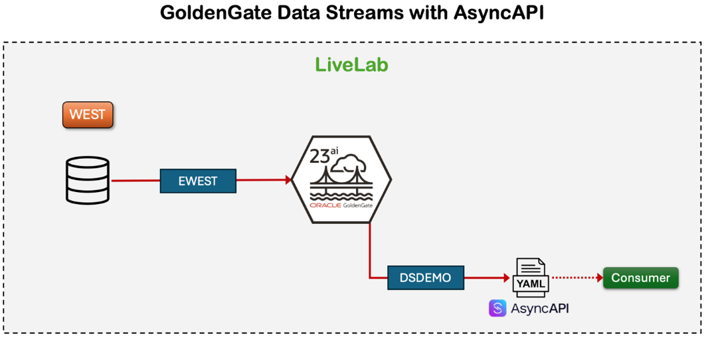

# Create an AsyncAPI Workflow

## Introduction

GoldenGate Data Streams provides a REST-based, language-agnostic streaming interface that enables any client application, regardless of programming language or platform, to subscribe to real-time change data. With GoldenGate 23ai, you can easily create a data stream from your database capture process, then build subscriber applications that consume, display, and process change events in JSON events.

In this lab, you use Oracle GoldenGate Data Streams to capture change events directly from an Oracle Database and deliver them as JSON-formatted messages over a Publish/Subscribe (Pub/Sub) interface defined by AsyncAPI.

   

Estimated time: 10 minutes

### Objectives

In this lab, you:
* Create a GoldenGate Data Stream from a running database capture.
* Implement a web-based subscriber tool to connect to the stream via WebSocket.
* Visualize and simulate real-time JSON event consumption in a browser.


## Task 1: Create the Publisher Stream

1. In the GoldenGate console service menubar, click **Distribution Service**.

2. In the navigation menu, click **Data Streams**. On the Data Streams page, click **Add Data Stream** (plus-icon).

    

3. The Add Data Stream panel consists of three pages. On the Data Stream Information page, for Name, enter **DSDEMO**, and then click **Next**.

    

4. On the Source Options page, for Trail Name, enter the two-character name of the trail that was created by the Change Data Extract EWEST, which is `ew`, and then click **Next**.

    

5. On the Filtering Options page, leave the fields as they are, and click **Create Data Stream**.

    

    

    The creation of the Publisher is complete.

## Task 2: Create the Subscriber

1. Open the Terminal and enter option `2`.

    

2. Enter the following command prompt to send the output to a webpage, allowing you to view real-time change events as they occur live:

    ```
    <copy>nohup streamlit run ~/asyncapi_web_consumer.py > asyncapi_web_consumer.log 2>&1 &</copy>
    ```

3. Open the Chrome Browser at [http://localhost:8501](http://localhost:8501).

    

    If you run into any issues with the WebUI component, you can enter following into the command line interface manually:

    ```
    <copy>ps -ef | grep streamlit</copy>
    ```
    ```
    <copy>kill -9 170787</copy>
    ```
    ```
    <copy>python3 asyncapi_consumer.py</copy>
    ```

You may now **proceed to the next lab**.

## Acknowledgements
* **Author** - Katherine Wardhana, User Assistance Developer
* **Contributors** - Mack Bell, Senior Principal Product Manager & Alex Lima, Database Product Management
* **Last Updated By/Date** - Katherine Wardhana, August 2025