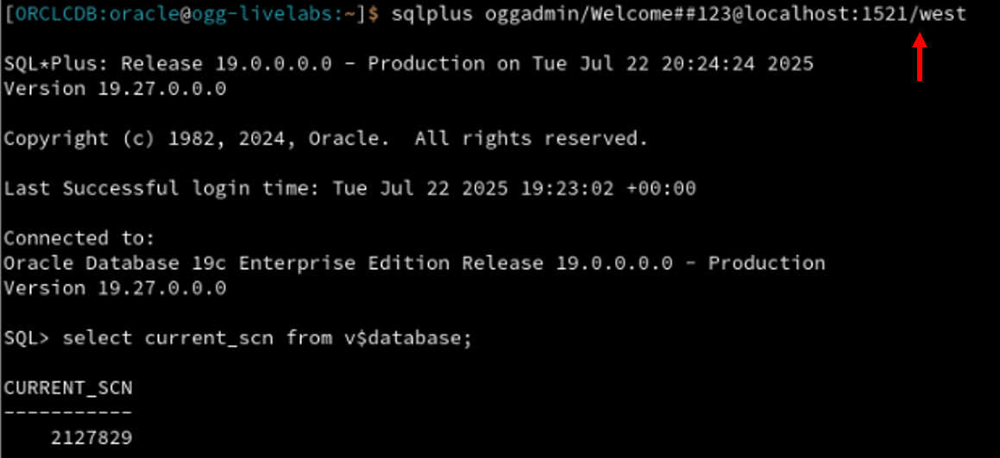
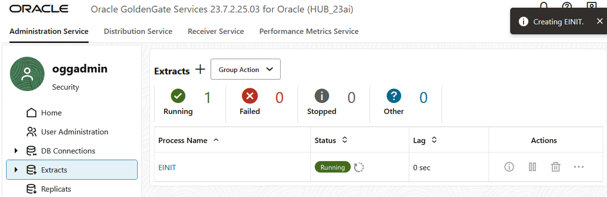

# Replicate data from West to East

## Introduction

In this lab you will create and run an Initial Load Extract and Replicat pair to seed the East database with the West database’s data and create a Change Data Capture Extract and Replicat pair to process the continual DML transactions. The current System Change Number (SCN) in the West database will be used by the Initial Load Extract to only extract records ‘as of’ the SCN and then the Change Data Capture Extract will be positioned to start capturing records after the SCN value, ensuring that there are no duplicate records replicated to the target database as well allowing the West database to remain online without having to take an application outage. 

Estimated time: 20 minutes

   

### About Extracts and Replicats

An Extract is a process that extracts or captures data from a source database. A Replicat is a process that delivers data to a target database. There are two primary types of Extracts for the Oracle Database: Initial Load Extract which selects records from the base tables, and Integrated Extract which captures change data from the redo log.

As for Replicats, for the Oracle Database there are numerous options each with their own advantages. For this lab we will use a Parallel Replicat for both the initial load Replicat and the change data Replicat.

### Objectives

In this lab, you will:
* Query the West database to determine the positioning SCN for both the Initial Load Extract and the Change Data Extract
* Create an Initial Load Extract for the West database that selects records from the HR tables up to a given SCN
* Create a Parallel Replicat to deliver the initial load data to the East database
* Create a change data Integrated Extract for the West database and position it to start capturing data after the given SCN
* Create a second Parallel Replicat process to deliver the change data to the East database

## Task 1:  Determine Current SCN from West database

1. In the VCN Terminal, enter the following command to view the menu options:

    ```
    <copy>menu</copy>
    ```

2. When prompted to enter your choice, enter `1` to access the Oracle DB 19c Home Environment.

    

3. Enter the following command to interact with the Oracle Database :

    ```
    <copy>sqlplus "oggadmin/Welcome##123@localhost:1521/west" @get_current_scn.sql</copy>
    ```

    

## Task 2: Create an Initial Load Extract for the West database

In this task, you will create an Initial Load Extract to read the records from the **HR** tables, up to the SCN determined in Task 1.  The records are then written to a series of files (EXTFILE) which will then be read by a Replicat and inserted into the target East database, completing the instantiation process.

1. In the navigation menu, click **Extracts**. Click **Add Extract** (plus icon). 

    

2. The Add Extract panel consists of two pages. On the Extract information page, complete the following fields, and then click **Next**:
    * For Extract Type, select **Initial Load Extract**.
    * For Process Name, enter **EINIT**, and optionally add a description. 

    

3. On the Parameter File page, in the text area, add a new line to the existing text and add the following:

    ```
    <copy>EXTRACT EINIT
    USERIDALIAS WEST DOMAIN OracleGoldenGate
    EXTFILE ei MEGABYTES 250 PURGE
    TABLEEXCLUDE HR.EMP_DETAILS_VIEW
    TABLE HR.*; SQLPREDICATE "AS OF SCN 123456"; </copy>
    ```

4. Click **Create and Run**. You return to the Extracts page, where you can find your newly created UAEXT Extract after a few moments.

    

    The status updates to Running.
    

## Task 3: Create an Initial Load Replicat for the East database
This task creates a Parallel Replicat that will deliver the Initial Load records from the **EINIT** Extract, to the East database.

1. In the navigation menu, click **Replicats**, and then click **Add Replicat** (plus sign). 

    

2. The Add Replicat panel consists of four pages. On the Replicat Information page, complete the following fields, and then click **Next**:
    * For Replicat Type, select **Parallel Replicat**.
    * For Parallel Replicat Type, select **Nonintegrated**.
    * For Process Name, enter **RNIT**, and optionally add a description.

    

3. On the Replicat Options page, complete the following fields, and then click **Next**:
    * For Replicat Trail **Name**, enter **ei**.
    * For Domain, select **OracleGoldenGate** from the dropdown.
    * For Alias, select **EAST** from the dropdown.
    * For Checkpoint Table, select **"GGADMIN"."CHECKPOINTTABLE"** from the dropdown.

    

4. On the Managed Options page, leave the fields as they are, and then click **Next**.

    

5. On the Parameter File page, in the text area, replace **MAP *\.\*, TARGET \*.\*;** with the following script:

    ```
    <copy>MAP HR.*, TARGET HR.*;</copy>
    ```

6. Click **Create and Run**.

    

    The status updates to Running.

    

7. In the navigation menu, click **Extracts** and verify that the **EINIT** Extract has updated to a **Stopped** status. Ensure that the Initial Load Replicat has processed all records captured by the Extract.

    > **Note:** The Initial Load Extract will stop automatically once it has completed. However, the Initial Load Replicat will continue to run.

    

8. In the navigation menu, click **Replicats**, expand the **RINIT** Replicat, and select **Checkpoint**. 

    Note the value of the Offset in the row **Current**, and then click **Refresh**. If the Replicat has finished processing all rows from the trail, the **Offset** value will remain unchanged after several refreshes. This typically indicates that the initial load process is complete.

    

9. Return to the **Replicats** page, and **Pause** the **RINIT** Replicat.

    

## Task 4: Create a Change Data Extract for the West database

In this task, you will create a change data Extract to read new transactions from the West database that have occurred after the SCN that was used by the Initial Load Extract. The records are written to a series of trail files which will then be read by a Replicat and delivered into the target East database. 

1. In the navigation menu, click **Extracts**, and then click **Add Extract** (plus icon).

    

2. The Add Extract panel consists of four pages. On the Extract information page, complete the following fields, and then click **Next**:

    * For Extract Type, select **Integrated Extract**.
    * For Process Name, enter **EWEST**, and optionally add a description. 

    

3. On the Extract Options page, complete the following fields, and then click **Next**:  
    * For Domain, select **OracleGoldenGate** from the dropdown.
    * For Alias, select **WEST** from the dropdown.
    * For Extract Trail Name, enter **ew**.

    

4. On the Managed Options page, leave the fields as they are, and then click **Next**.

    
    
5. On the Parameter File page, in the text area, add a new line to the existing text and add the following:

    ```
    <copy>TABLE HR.*;</copy>
    ```

6. Click **Create**.

    

7. Once the Extract has been created, click the **Actions** button for the **EWEST** Extract, and then select **Start with Options**.

    

8. On the Start Extract with Options panel, complete the following fields, and then click **Submit**:
    * For Start Point, select **After CSN** from the dropdown.
    * For CSN, enter the value of the SCN value derived from Task 1.

    

    The status updates to Running.

    

## Task 5: Create a Change Data Replicat for the East database

1. In the navigation menu, click **Replicats**, and then click **Add Replicat** (plus icon).

    

2. The Add Replicat panel consists of four pages. On the Replicat Information page, complete the following fields, and then click **Next**:
    * For Replicat Type, select **Parallel Replicat**.
    * For Parallel Replicat Type, select **Nonintegrated**.
    * For Process Name, enter **REAST**.

    

3. On the Replicat Options page, complete the following fields, and then click **Next**:
    * For Replicat Trail **Name**, enter **ew**.
    * For Domain, select **OracleGoldenGate** from the dropdown.
    * For Alias, select **EAST** from the dropdown.
    * For Checkpoint Table, select **"GGADMIN"."CHECKPOINTTABLE"** from the dropdown.

    

4. On the Managed Options page, leave the fields as they are, and then click **Next**.

    

5. On the Parameter File page, in the text area, replace **MAP *\.\*, TARGET \*.\*;** with the following script:

    ```
    <copy>MAP HR.*, TARGET HR.*;</copy>
    ```

6. Click **Create**.

    

7. 

## Task 6: Verify Initial Load and Start REAST Replicat

1. I have a few questions....

You may now **proceed to the next lab**.

## Learn more

* [Before Adding Extract and Replicat Processes](https://docs.oracle.com/en/middleware/goldengate/core/23/coredoc/configure-ogg-adding-extract-and-replicat.html#GUID-C1044A4D-945E-4080-B79C-74FA9D004143)
* [Registering Extract for Oracle](https://docs.oracle.com/en/middleware/goldengate/core/23/coredoc/extract-oracle-registering-extract.html)
* [Access Extract Details](https://docs.oracle.com/en/middleware/goldengate/core/23/coredoc/extract-access-extract-details.html)
* [About Distribution Service](https://docs.oracle.com/en/middleware/goldengate/core/23/coredoc/distribute-distribution-service.html)
* [About Replicat](https://docs.oracle.com/en/middleware/goldengate/core/23/coredoc/replicat-replicat.html)

## Acknowledgements
* **Author** - Katherine Wardhana, User Assistance Developer
* **Contributors** - Mack Bell, Senior Principal Product Manager & Alex Lima, Database Product Management
* **Last Updated By/Date** - Katherine Wardhana, August 2025