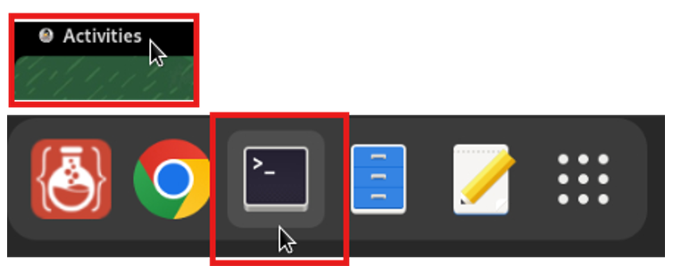
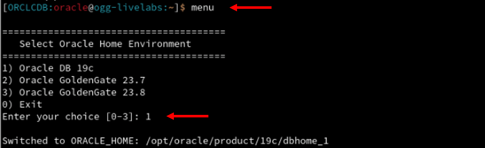
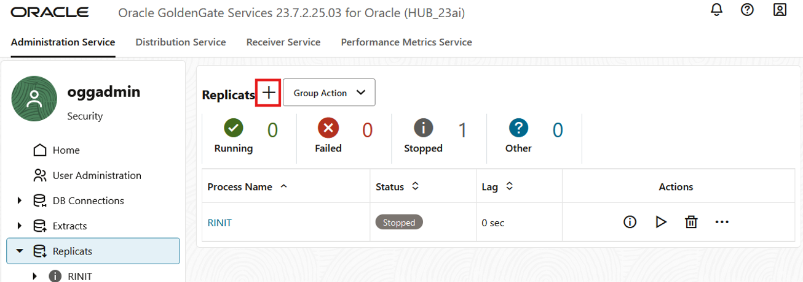

# Replicate data from West to East

## Introduction

In this lab, you create and run an Initial Load Extract and Replicat pair to seed the East database from the West database. You also configure a Change Data Capture Extract (CDC) and Replicat pair to process the ongoing DML transactions. 

The Initial Load Extract uses the current System Change Number (SCN) from the West database to retrieve only those records that exist ‘as of’ that SCN. To ensure that the target database doesn't replicate duplicate records, position the CDC Extract to start capturing records after the current SCN. This keeps the West database online without the need for an application outage.

Estimated time: 20 minutes

   

### Objectives

In this lab, you:
* Query the West database to determine the positioning SCN for both the Initial Load Extract and the Change Data Extract
* Create an Initial Load Extract for the West database that selects records from the HR tables up to a given SCN
* Create a Parallel Replicat to deliver the initial load data to the East database
* Create a change data Integrated Extract for the West database and position it to start capturing data after the given SCN
* Create a second Parallel Replicat process to deliver the change data to the East database

## Task 1:  Determine Current SCN from West database

Use `sqlplus` to connect to the West database and retrieve the current database SCN. This SCN serves two purposes, for the Initial Load Extract to capture all records up to and including that SCN, and to position the Change Data Extract to begin capturing active DML operations from that SCN onward.

1. In your VNC environment, select **Activities** from the upper left of the console and then select **Terminal** from the Applications bar.

    

2. In the Terminal, enter the following command to view the menu options:

    ```
    <copy>menu</copy>
    ```

3. When prompted, enter `1` to access the Oracle DB 19c Home Environment.

    

4. Enter the following command to interact with the Oracle Database:

    ```
    <copy>sqlplus "ggadmin/Welcome##123@localhost:1521/west" @get_current_scn.sql</copy>
    ```

5. Record the value of the **current database SCN**, as it will be required for upcoming tasks.

    

## Task 2: Create an Initial Load Extract for the West database

Create an Initial Load Extract (EINIT) that reads records from the **HR** tables in the West database, up to the SCN identified in Task 1. The records are then written to a series of files (EXTFILE), which is then read by a Replicat (RINIT) and inserted into the target East database, completing the initial load process.

### About Extracts and Replicats

An Extract is a process that captures data from a source database. A Replicat is responsible for delivering that data to a target database. 

There are two primary types of Extracts for the Oracle Database: 
* Initial Load Extract, which selects records directly from the base tables.
* Integrated Extract, which captures change data from the redo logs.

As for Replicats, Oracle offers numerous options, each with their own advantages depending on the use case. In this, lab we use a Parallel Replicat for both the Initial Load Replicat and the Change Data Replicat.

1. Back in the WebUI, in the navigation menu, click **Extracts**. On the Extracts page, click **Add Extract** (plus icon). 

    

2. The Add Extract panel consists of two pages. On the Extract information page, complete the following fields, and then click **Next**:
    * For Extract Type, select **Initial Load Extract**.
    * For Process Name, enter **EINIT**, and optionally add a description. 

    

3. On the Parameter File page, add a new line to the text area and enter the following. Replace `<insert SCN>` with the SCN recorded from Task 1, step 5:

    ```
    <copy>USERIDALIAS WEST DOMAIN OracleGoldenGate
    EXTFILE ei MEGABYTES 250 PURGE
    TABLEEXCLUDE HR.EMP_DETAILS_VIEW
    TABLE HR.*; SQLPREDICATE "AS OF SCN <insert SCN>"; </copy>
    ```

4. Click **Create and Run**. You return to the Extracts page, where you can find your newly created EINIT Extract after a few moments.

    

    The EINIT Extract will run and then stop.

5. In the left navigation, expand the EINIT Extract, and then select **Report**. Review the report output to confirm the Inital Load completed successfully. 

    

    

## Task 3: Create an Initial Load Replicat for the East database
This task creates a Parallel Replicat that delivers the Initial Load records from the **EINIT** Extract, to the East database.

1. In the navigation menu, click **Replicats**. On the Replicats page, click **Add Replicat** (plus sign). 

    

2. The Add Replicat panel consists of four pages. On the Replicat Information page, complete the following fields, and then click **Next**:
    * For Replicat Type, select **Parallel Replicat**.
    * For Parallel Replicat Type, select **Nonintegrated**.
    * For Process Name, enter **RNIT**, and optionally add a description.

    

3. On the Replicat Options page, complete the following fields, and then click **Next**:
    * For Replicat Trail **Name**, enter **ei**.
    * For Domain, select **OracleGoldenGate** from the dropdown.
    * For Alias, select **EAST** from the dropdown.
    * For Checkpoint Table, select **"GGADMIN"."CHECKPOINTTABLE"** from the dropdown.

    

4. On the Managed Options page, leave the fields as they are, and then click **Next**.

    

5. On the Parameter File page, in the text area, replace **MAP *\.\*, TARGET \*.\*;** with the following script:

    ```
    <copy>MAP HR.*, TARGET HR.*;</copy>
    ```

6. Click **Create and Run**.

    

    The status updates to Running.

    

7. In the navigation menu, click **Extracts** and verify that the **EINIT** Extract status is **Stopped**. Ensure that the Initial Load Replicat has processed all records captured by the Extract.

    > **Note:** The Initial Load Extract will stop automatically once it has completed. However, the Initial Load Replicat will continue to run.

    

8. In the navigation menu, click **Replicats**, expand the **RNIT** Replicat, and select **Checkpoint**. 

    Note the value of the Offset in the row **Current**, and then click **Refresh**. When the **Offset** value  remains unchanged after several refreshes, this indicates that the Replicat has finished processing all rows from the trail and the initial load process is complete.

    

9. In the navigation menu, under **RNIT**, select **Statistics**. The number of inserts should match the EINIT Extract report output.

10. Return to the **Replicats** page, and **Stop** the **RNIT** Replicat.

    

## Task 4: Create a Change Data Extract for the West database

Create a change data Extract to read new transactions from the West database that occurred after the SCN that was used by the Initial Load Extract. The records are written to a series of trail files which the Replicat will read and deliver to the target East database. 

1. In the navigation menu, click **Extracts**. On the Extracts page, click **Add Extract** (plus icon).

    

2. On the Extract information page, complete the following fields, and then click **Next**:

    * For Extract Type, select **Integrated Extract**.
    * For Process Name, enter **EWEST**, and optionally add a description. 

    

3. On the Extract Options page, complete the following fields, and then click **Next**:  
    * For Domain, select **OracleGoldenGate** from the dropdown.
    * For Alias, select **WEST** from the dropdown.
    * For Extract Trail Name, enter **ew**.

    

4. On the Managed Options page, leave the fields as they are, and then click **Next**.

    
    
5. On the Parameter File page, in the text area, add a new line to the existing text and add the following:

    ```
    <copy>TABLE HR.*;</copy>
    ```

6. Click **Create**. Do **not** click **Create and Run**.

    

7. On the Extracts page, for the **EWEST** Extract process, click **Actions for EWEST** (ellipsis icon), and then select **Start with Options**.

    

8. In the Start Extract with Options panel, complete the following fields, and then click **Submit**:
    * For Start Point, select **After CSN** from the dropdown.
    * For CSN, enter the value of the SCN value derived from Task 1, step 5.

    

    The status updates to Running.

    

## Task 5: Create a Change Data Replicat for the East database

1. In the navigation menu, click **Replicats**. On the Replicats page, click **Add Replicat** (plus icon).

    

2. On the Replicat Information page, complete the following fields, and then click **Next**:
    * For Replicat Type, select **Parallel Replicat**.
    * For Parallel Replicat Type, select **Nonintegrated**.
    * For Process Name, enter **REAST**.

    

3. On the Replicat Options page, complete the following fields, and then click **Next**:
    * For Replicat Trail **Name**, enter **ew**.
    * For Domain, select **OracleGoldenGate** from the dropdown.
    * For Alias, select **EAST** from the dropdown.
    * For Checkpoint Table, select **"GGADMIN"."CHECKPOINTTABLE"** from the dropdown.

    

4. On the Managed Options page, leave the fields as they are, and then click **Next**.

    

5. On the Parameter File page, in the text area, replace **MAP *\.\*, TARGET \*.\*;** with the following script:

    ```
    <copy>MAP HR.*, TARGET HR.*;</copy>
    ```

6. Click **Create and Run**.

    

    The status updates to Running.
    

7. In the navigation menu, click **Replicats**, expand the **REAST Replicat**, and select **Statistics**. As you click **Refresh**, you can observe the record counts updating as new data is being replicated from the West to East database.

    

You may now **proceed to the next lab**. 

## Learn more

* [Before Adding Extract and Replicat Processes](https://docs.oracle.com/en/middleware/goldengate/core/23/coredoc/configure-ogg-adding-extract-and-replicat.html#GUID-C1044A4D-945E-4080-B79C-74FA9D004143)
* [Registering Extract for Oracle](https://docs.oracle.com/en/middleware/goldengate/core/23/coredoc/extract-oracle-registering-extract.html)
* [Access Extract Details](https://docs.oracle.com/en/middleware/goldengate/core/23/coredoc/extract-access-extract-details.html)
* [About Distribution Service](https://docs.oracle.com/en/middleware/goldengate/core/23/coredoc/distribute-distribution-service.html)
* [About Replicat](https://docs.oracle.com/en/middleware/goldengate/core/23/coredoc/replicat-replicat.html)

## Acknowledgements
* **Author** - Katherine Wardhana, User Assistance Developer
* **Contributors** - Mack Bell, Senior Principal Product Manager & Alex Lima, Database Product Management
* **Last Updated By/Date** - Jenny Chan, September 2025