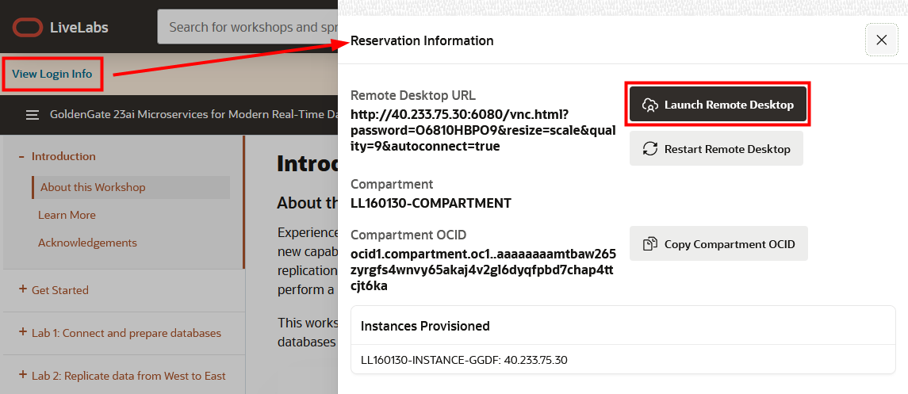
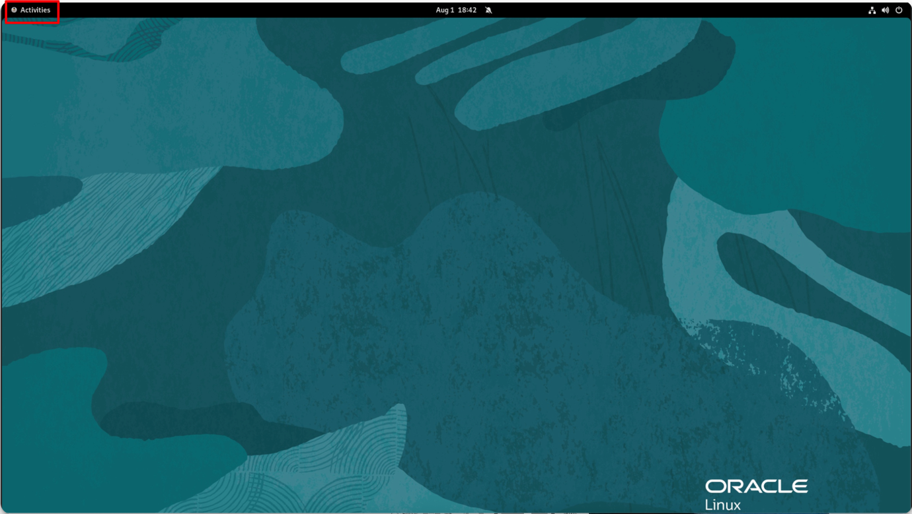
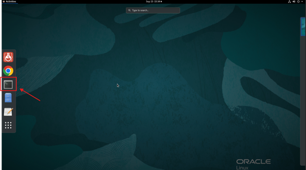
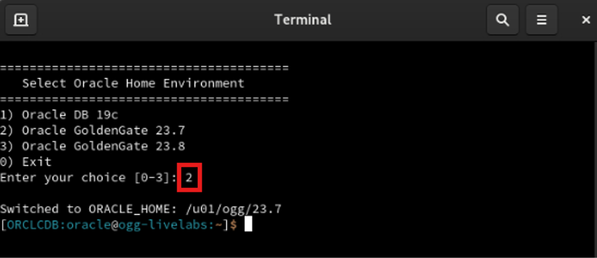
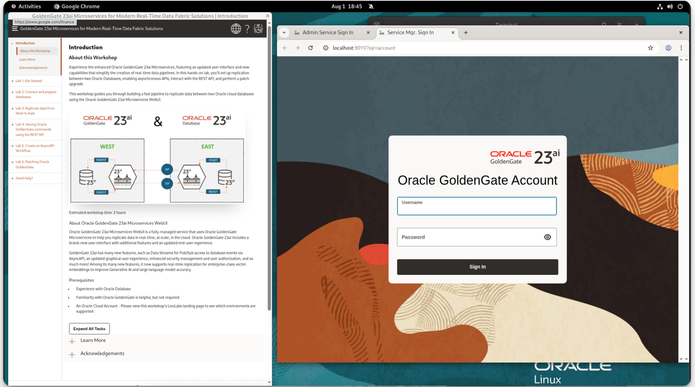

# Get Started - Hands-On Lab
## Introduction

Welcome to the **GoldenGate 23ai Microservices for Modern Real-Time Data Fabric Solutions** Hands-on Lab! To begin the workshop, you’ll need to connect to a virtual system that has been assigned specifically to you. This connection will be established through your web browser using a VNC (Virtual Network Computing) session to access your remote lab environment.

We’ll guide you step-by-step on where to find your connection details and how to connect to your system.

Estimated Time: 5 minutes

### Objectives

In this lab, you:

* Locate the connection information for your lab environment
* Connect to the lab environment

## Task 1: Locate the connection information for your lab environment

1.  At the top of these lab instructions, click **View Login Info**.

2.  In the Reservation Informaton panel, review the information provided, and then click **Launch Remote Desktop**. A noVNC connection opens in your web browser.

    

## Task 2: Connect to the lab environment

1.  After the VNC connection is established and the desktop appears, click the **Activities** button in the top-left of the screen.

    

2.  In the Activities toolbar, select **Terminal** to open a new Terminal session.

    

3.  A preset script has been loaded in the Terminal to configure the correct environment for this workshop. Enter option `2`, to select Oracle GoldenGate 23.7 as a Home Environment, then press **Enter** to begin.

    

    Your lab instructions, the GoldenGate Service Manager, and Admin Service are now available to you in Remote Desktop. 

    

You may now **proceed to the next lab.**

## Acknowledgements
* **Author** - Katherine Wardhana, User Assistance Developer
* **Contributors** - Mack Bell, Senior Principal Product Manager & Alex Lima, Database Product Management
* **Last Updated By/Date** - Jenny Chan, September 2025