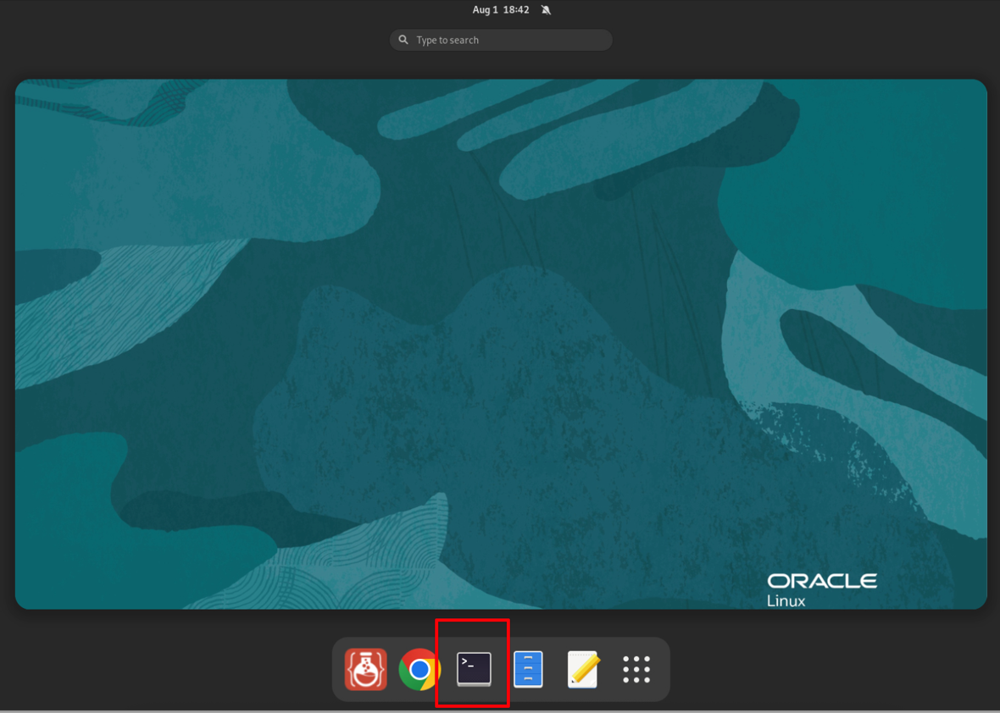

# Connection Instructions - Hands-On Lab
## Introduction

Welcome to the **GoldenGate 23ai Microservices for Modern Real-Time Data Fabric Solutions** Hands-on Lab! To begin the workshop, you’ll need to connect to a virtual system that has been assigned specifically to you. This connection will be established through your web browser using a VNC (Virtual Network Computing) session to access your remote lab environment.

We’ll guide you step-by-step on where to find your connection details and how to connect to your system.

Estimated Time: 5 minutes

### Objectives

* Obtain connection information to your lab environment

## Task 1: Connect to the Lab Environment

1. Locate the connection URL for your assigned environment, then open it in your web browser to access the system.

2. After the VNC connection is established and the desktop appears, click the **Activities** button in the top-left of the screen.

    

3. Select the **Terminal** icon to open a new Terminal session.

    

4. A preset script has been loaded in the Terminal to configure the correct environment for this workshop. Enter option `2`, to select Oracle GoldenGate 23.7 as a Home Environment, then press **Enter** to begin.

    

5. This will launch the step-by-step instructions for this Hands-on Lab, along with a browser window with tabs for he Oracle GoldenGate Service Manager and Admin Service pages.

    

You may now **proceed to the next lab.**

## Acknowledgements
* **Author** - Katherine Wardhana, User Assistance Developer
* **Contributors** - Mack Bell, Senior Principal Product Manager & Alex Lima, Database Product Management
* **Last Updated By/Date** - Katherine Wardhana, August 2025