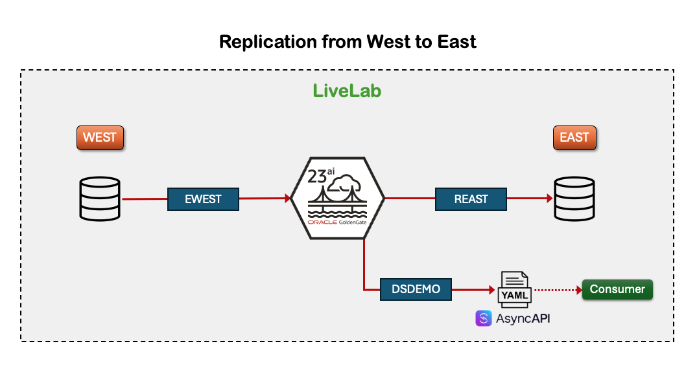

# Introduction

## About this Workshop

Experience the enhanced Oracle GoldenGate 23ai Microservices, featuring an updated user interface and new capabilities that simplify the creation of real-time data pipelines. In this hands-on lab, you'll set up replication between two Oracle Databases, enabling asynchronous APIs, interact with the REST API, and perform a patch upgrade.

This workshop guides you through building a fast pipeline to replicate data between two Oracle cloud databases using the Oracle GoldenGate 23ai Microservices WebUI.

   

Estimated workshop time: 2 hours

### About Oracle GoldenGate 23ai Microservices WebUI

Oracle GoldenGate 23ai Microservices WebUI is a fully-managed service that uses Oracle GoldenGate Microservices to help you replicate data in real-time, at scale, in the cloud. Oracle GoldenGate 23ai includes a brand-new user interface with additional features and an updated end-user experience.

GoldenGate 23ai has many new features, such as Data Streams for Pub/Sub access to database events via AsyncAPI, an updated graphical user experience, enhanced security management and user authorization, and so much more! Among its many new features, it now supports real-time replication for enterprise-class vector embeddings to improve Generative AI and large language model accuracy. 

### Prerequisites

* Experience with Oracle Database
* Familiarity with Oracle GoldenGate is helpful, but not required
* An Oracle Cloud Account - Please view this workshop's LiveLabs landing page to see which environments are supported

## Connect to the Lab Environment

1. Locate the connection URL for your assigned environment, then open it in your web browser to access the system.

2. After the VNC connection is established and the desktop appears, click the **Activities** button in the top-left of the screen.

    

3. Select the **Terminal** icon to open a new Terminal session.

    

4. A preset script has been loaded in the Terminal to configure the correct environment for this workshop. Enter option `2`, to select Oracle GoldenGate 23.7 as a Home Environment, then press **Enter** to begin.

    

5. This will launch the step-by-step instructions for this Hands-on Lab, along with a browser window with tabs for he Oracle GoldenGate Service Manager and Admin Service pages.

    

You may now **proceed to the first lab.**

## Learn More

* [Overview of Oracle GoldenGate 23ai](https://docs.oracle.com/en/middleware/goldengate/core/23/index.html)
* [Oracle GoldenGate Microservices Architecture Documentation](https://docs.oracle.com/en/middleware/goldengate/core/23/coredoc/overview-oracle-goldengate.html#GUID-3B1EF969-4A36-4338-820E-16F82B5C646D)
* [GoldenGate 23ai General Availability](https://blogs.oracle.com/dataintegration/post/announcing-goldengate-23ai)

## Acknowledgements
* **Author** - Katherine Wardhana, User Assistance Developer
* **Contributors** -  Mack Bell, Senior Principal Product Manager & Alex Lima, Database Product Management
* **Last Updated By/Date** - Katherine Wardhana, August 2025
