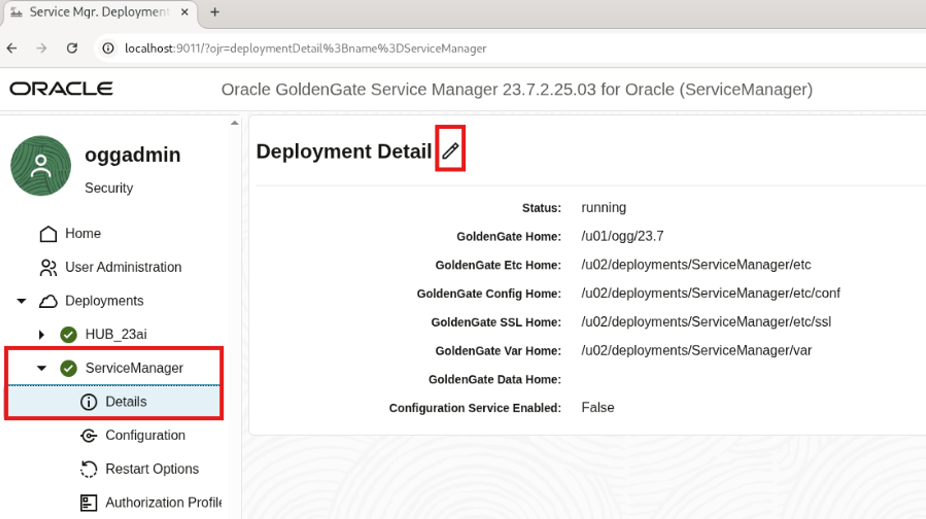

# Patch Oracle GoldenGate

## Introduction

Installing patches is critical to the continued functionality and support of Oracle GoldenGate and is highly recommended by the Oracle GoldenGate product team to review and apply the most recent cumulative patch.  New patches are generally released every three to four months and are available at [support.oracle.com](https://support.oracle.com). As well, the following [Oracle Data Integration](https://blogs.oracle.com/dataintegration/post/how-to-obtain-the-latest-oracle-goldengate-microservices-architecture-bundle-patches) post is updated whenever a new patch is available for the different supported versions of Oracle GoldenGate. 

Patching Oracle GoldenGate has never been easier when using the Microservices Architecture.   An out-of-place patching protocol can be followed that allows GoldenGate administrators to install a complete patched version side by side with the previous installation, and then easily switch the GoldenGate Deployment(s) and Service Manager to the new GoldenGate Home.

   

Estimated time: 20 minutes

### Objectives

In this lab, you will:
* Patch Oracle GoldenGate 23.7 to Oracle GoldenGate 23.8

## Task 1: Install Oracle GoldenGate 23.8

In this lab, a complete patched version of Oracle GoldenGate 23.8 has been installed in a separate GoldenGate Home. However, if you were setting this up in your own environment, you would download and install the patched version from [support.oracle.com](https://support.oracle.com). Look for a package that matches your database and operating system, and includes **Complete Install** in the Description field. For example, the highlighted package below is the complete patch installation of Oracle GoldenGate 23.8 for Linux, for the Oracle Database:
    

## Task 2: Stop the GoldenGate processes

1. In order to patch the current GoldenGate 23.7 environment, it is necessary to stop all running GoldenGate processes. In the navigation menu, click **Extracts**.

2. Click **Stop** for the EWEST Extract. To patch the current GoldenGate 23.7 environment, you must first stop running all GoldenGate processes.  

    

3. In the navigation menu, click **Replicats**.

4. Click **Stop** for the REAST Replicat.  

    

## Task 3: Switch Deployments to the new GoldenGate 23.8 version

1. Open a browser tab to the Service Manager at [http://localhost:9011](http://localhost:9011), if it is not already open, and log in with the oggadmin/Welcome##123.  

    

2. Expand the **Deployments** navigation menu, and select the **HUB_23ai** deployment.  

3. On the Deployment Details page, select **Alter Deployment** (pencil icon).

    

4. The Edit Deployment Detail popup appears. For GoldenGate Home, enter **/u01/ogg/23.8**, and then click **Submit**.

    

5. Expand the **Deployments** navigation menu again, and select the **ServiceManager** deployment.

6. On the Deployment Details page, select **Alter Deployment** (pencil icon).  

    

7. The Edit Deployment Detail popup appears. For GoldenGate Home, enter **/u01/ogg/23.8**, and then click **Submit**.

    

8. In the navigation menu, click **Home**.

9. In the **HUB_23ai** deployment Action menu, select **Stop**.

    

10. After the **HUB_23ai** deployment status changes to **Stopped**, in the Service Manager deployment Action menu, click **Restart**.

    

11. After the Service Manager restarts, reload the page to see that the Service Manager is now running with the GoldenGate 23.8 version.

    

12. In the **HUB_23ai** deployment Action menu, select **Start**. In the Confirm Action dialog, click **OK**.

    

13. After the HUB 23ai deployment status updates to **Running**, expand the **Deployments** navigation menu, and select the **HUB_23ai** deployment.

14. In the **HUB_23ai** Services page, select **Administration Service**.

    

15. If prompted, log in using oggadmin as the Username and x as Password.

16. Once connected you can restart the **EWEST** Extract and the **REAST** Replicat.  

    

The GoldenGate Service Manager and HUB_23ai deployment were both successfully patched from version 23.7 to 23.8.

**This completes the Oracle GoldenGate Hands-on Lab.  Thank you for your participation and enjoy the rest of your week and safe travels.**

## Acknowledgements
* **Author** - Katherine Wardhana, User Assistance Developer
* **Contributors** - Mack Bell, Senior Principal Product Manager & Alex Lima, Database Product Management
* **Last Updated By/Date** - Katherine Wardhana, August 2025