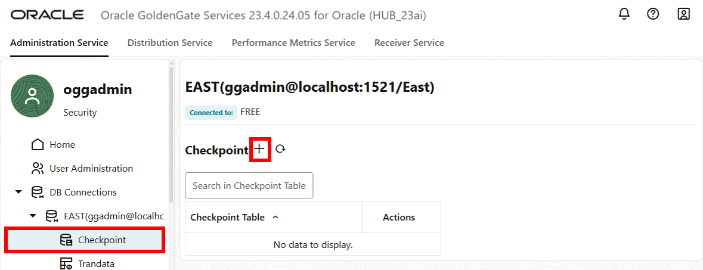

# Connect and prepare databases
## Introduction

This lab guides you step by step through launching the Oracle GoldenGate 23ai Microservices WebUI, creating connections to the source (West) and target (East) databases, enable supplemental logging (Trandata) to the source database, create a Checkpoint table to the target database, and configuring Heartbeat tables on both databases.

Estimated time: 20 minutes

   

### About DB Connections

DB Connections allow you to create and manage the login credentials needed to connect to your databases and manage Checkpoint tables, supplemental logging (TRANDATA), and Heartbeat tables.

### About Checkpoint table and Trandata

A Checkpoint table is created in the target database to provide fault tolerance for the Replicat process. Trandata enables the unconditional logging of primary keys and the conditional supplemental logging of all unique and foreign keys for the specified table. Adding Trandata is required for the source database.

### Objectives

In this lab, you will:
* Log in to the Oracle GoldenGate 23ai Microservices WebUI
* Create a Connection to the East and West databases
* Add Trandata and the heartbeat tables to the West database
* Add a checkpoint table and the heartbeat tables to the East database

## Task 1: Add DB Connection to East database

1. In the navigation menu and click **DB Connections**.

    

2. Click **Add DB Connection** (plus icon).

    

3. A Credentials panel will appear, complete the following fields, and then click **Submit**:
    * For Credential Alias, enter **EAST**.
    * For User ID, enter **ggadmin@localhost:1521/East**. 
    * For Password, paste the **Global Password** from the Reservation Information. Verify the password. 

    

4. Click **Connect to database**. If successful, you are directed to the Checkpoint page. 

    

## Task 2: Add a Checkpoint table and Heartbeat table

1. In the navigation menu, click **Checkpoint**. In the Checkpoint page, click **Add Checkpoint** (plus icon).

    

2. A Checkpoint Table panel appears. For Checkpoint Table, enter **ggadmin.checkpointtable**, and then click **Submit**.

    

3. The new Checkpoint table appears in the list.

    

4. In the navigation menu, click **Heartbeat**. Click **Add Heartbeat** (plus icon).

    

5. An Add Heartbeat Table panel appears. Enable the **Target Only** option for the EAST database connection and keep the remaining fields as they are, and then click **Submit**.

    

6. The Heartbeat page refreshes with the new settings.

    

## Task 3: Add DB connection to West database

1. In the navigation menu and click **DB Connections**, and click **Add DB Connection** (plus icon) to add the West database connection.

    

2. A Credentials panel will appear, complete the following fields, and then click **Submit**:
    * For Credential Alias, enter **WEST**.
    * For User ID, enter **ggadmin@localhost:1521/West**. 
    * For Password, paste the **Global Password** from the Reservation Information. Verify the password.

    

3. Click **Connect to database**. If successful, you are directed to the Checkpoint menu.

    

## Task 4: Add Trandata information and a Heartbeat table

The West database will be used as the source database and no Checkpoint table is required. However, Trandata is required and you will create the Heartbeat tables.

1. In the navigation menu, click **Trandata**, and then click **Add TRANDATA** (plus icon).

    

2. For Schema Name, enter **HR**.  Leave the other fields as they are and then click **Submit**.

    

3. To verify, enter **HR** into the Search field and click **Search**. The HR schema appears in the search results.

    

You may now **proceed to the next lab.**

## Learn more

* [Add Database Connections](https://docs.oracle.com/en/middleware/goldengate/core/23/coredoc/extract-add-and-alter-database-connections.html#GUID-45112AEE-19[…]3AE-18571BFA831B)
* [Add TRANDATA](https://docs.oracle.com/en/middleware/goldengate/core/23/coredoc/configure-ogg-adding-extract-and-replicat.html#GUID-5848749D-282E-4DA9-9D65-00C34ED5F3BF)
* [Add a Checkpoint Table](https://docs.oracle.com/en/middleware/goldengate/core/23/coredoc/configure-ogg-adding-extract-and-replicat.html#GUID-5640BC36-4AC0-4570-A7DA-DC7BBFBDC1EB)
* [Add Heartbeat Table](https://docs.oracle.com/en/middleware/goldengate/core/23/coredoc/configure-ogg-adding-extract-and-replicat.html#GUID-45112AEE-1909-42F4-A3AE-18571BFA831B)

## Acknowledgements
* **Author** - Katherine Wardhana, User Assistance Developer
* **Contributors** -  Mack Bell, Senior Principal Product Manager & Alex Lima, Database Product Management
* **Last Updated By/Date** - Katherine Wardhana, August 2025