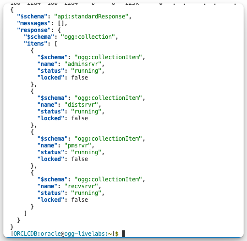

# Issuing Oracle GoldenGate commands using the REST API

## Introduction

Oracle GoldenGate 23ai is built on the Microservices Architecture and supports management and monitoring via three interfaces: the WebUI, the command-line interface (Admin Client), and the REST API. The REST API provides an excellent method for Engineering and DevOps teams to use scriptable REST calls to connect to the GoldenGate services and its processes.

   

Estimated time: 10 minutes

### Objectives

In this lab, you will:
* Learn how interact with the GoldenGate REST API by issuing `curl` commands

## Task 1: Enter `curl` commands in Terminal

At this stage in the lab, you’ve used the Oracle GoldenGate WebUI to create processes and review their status and related information. For this lab, we'll demonstrate how to use the REST API to issue `curl` commands that interact directly with GoldenGate services. You'll query the status of existing processes and create a new database connection, then verify your changes visually in the WebUI.

1. Select **Activities** from the upper left of the console and then choose the **Terminal** icon at the bottom center.

2. When you open the Terminal, a preset terminal is presented which has four options to choose. Enter option `2`.

    

3. Enter the following into the command line one by one:

    * Service Status: The “status” field of the output shows the current status of the services.
    ```
    <copy>curl --location 'http://localhost:9011/services/v2/deployments/HUB_23ai/services' \
    --netrc-file ~/.ogg_netrc.sh | jq .response </copy>
    ```
    
    
    * Deployment Information:  Shows status and path information for the deployment.
    ```
    <copy>curl --location 'http://localhost:9011/services/v2/deployments/HUB_23ai' \
    --netrc-file ~/.ogg_netrc.sh | jq .response</copy>
    ```

    * Extract Information: Shows the configuration information for the given Extract.
    ```
    <copy>curl --location --request GET 'http://localhost:9012/services/v2/extracts/EWEST' \
    --netrc-file ~/.ogg_netrc.sh | jq .response</copy>
    ```
    ```
    <copy># Extract Status
    curl –location 'http://localhost:9012/services/v2/extracts/EWEST/info/status' \
    --netrc-file ~/.ogg_netrc.sh | jq .response</copy>
    ```
    ```
    <copy># Extract Checkpoint
    curl –location 'http://localhost:9012/services/v2/extracts/EWEST/info/checkpoints' \
    --netrc-file ~/.ogg_netrc.sh | jq .response</copy>
    ```
    ```
    <copy># View ggserr.log file 
    curl –location 'http://localhost:9012/services/v2/messages' \
    --netrc-file ~/.ogg_netrc.sh | jq .response | tail -300</copy>
    ```
    ```
    <copy># View List of Extract Report Files
    curl --location 'http://localhost:9012/services/v2/extracts/EWEST/info/reports' \
    --netrc-file ~/.ogg_netrc.sh | jq .response</copy>
    ```
    ```
    <copy># View the current Extract report file
    curl --location 'http://localhost:9012/services/v2/extracts/EWEST/info/reports/EWEST.rpt' \
    --netrc-file ~/.ogg_netrc.sh | jq .response</copy>
    ```
    ```
    <copy># LAG ALL
    curl --location --request POST 'http://localhost:9012/services/v2/commands/execute' \
    --header 'Content-Type: application/json' \
    --netrc-file ~/.ogg_netrc.sh \
    --data '{
        "name":"report",
        "reportType":"lag",
        "thresholds":[
            {
                "type":"info",
                "units":"seconds",
                "value":0
            },
            {
                "type":"critical",
                "units":"seconds",
                "value":5
            }
        ]
    }' | jq .response</copy>
    ```
    ```
    <copy># Replicat Information
    curl --location --request GET 'http://localhost:9012/services/v2/replicats/REAST' \
    --netrc-file ~/.ogg_netrc.sh | jq .response</copy>
    ```
    ```
    <copy># Replicat status
    curl --location 'http://localhost:9012/services/v2/replicats/REAST/info/status' \
    --netrc-file ~/.ogg_netrc.sh | jq .response</copy>
    ```
    ```
    <copy># View Replicat current Report File
    curl --location 'http://localhost:9012/services/v2/replicats/REAST/info/reports/REAST.rpt' \
    --netrc-file ~/.ogg_netrc.sh | jq .response</copy>
    ```
    ```
    <copy># Check the statistics
    curl --location --request POST 'http://localhost:9012/services/v2/extracts/EWEST/command' \
    --netrc-file ~/.ogg_netrc.sh \
    --data '{
        "command": "STATS",
        "arguments": "HOURLY"
    }'</copy>
    ```
4. Next, enter the following `curl` command to create a new database connection using the REST API, then open the browser to view the new connection:

    ```
    <copy># Create a database connection (This is the only change example)
    curl --location --request POST 'http://localhost:9012/services/v2/credentials/OracleGoldenGate/WestDB' \
    --netrc-file ~/.ogg_netrc.sh \
    --data-raw '{
        "userid": "ggadmin@localhost:1521/west",
        "password": "Welcome##123"
    }'</copy>
    ```

## Task 2: Make REST Calls to Create New Objects

In this task, we will use the REST API to issue `curl` commands to create objects that can then be viewed from the WebUI.

1. Enter the following `curl` command to create a new database connection using the REST API, then open the Administration Service browser tab to view the new connection. You may have to refresh the DB Connections to see the new entry:

    ```
    <copy>curl --location --request POST 'http://localhost:9012/services/v2/credentials/OracleGoldenGate/WestDB' \
        --netrc-file ~/.ogg_netrc.sh \
        --data-raw '{
            "userid": "ggadmin@localhost:1521/west",
            "password": "Welcome##123"
        }' | jq</copy>
    ```

    

    

2. Enter the following command to delete the database connection you just created:

    ```
    <copy>curl --location --request DELETE
    'http://localhost:9012/services/v2/credentials/OracleGoldenGate/WestDB' \
        --netrc-file ~/.ogg_netrc.sh | jq 'del(.links)'</copy>
    ```

    

3. Enter the following command to view the connection that has been deleted and view the remaining DB Connections:

    ```
    <copy>curl -s --location 
    'http://localhost:9012/services/v2/credentials/OracleGoldenGate' \
        --netrc-file ~/.ogg_netrc.sh \
    | jq 'del(.links) | .response.items |= map(del(.links))' </copy>
    ```

    

You may now **proceed to the next lab**.

## Acknowledgements
* **Author** - Katherine Wardhana, User Assistance Developer
* **Contributors** - Mack Bell, Senior Principal Product Manager & Alex Lima, Database Product Management
* **Last Updated By/Date** - Katherine Wardhana, August 2025