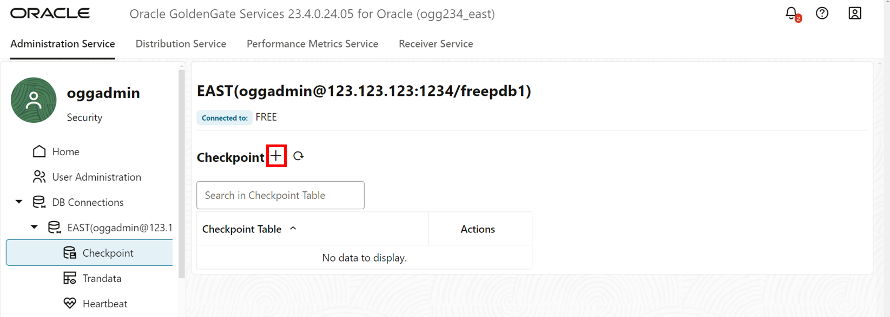
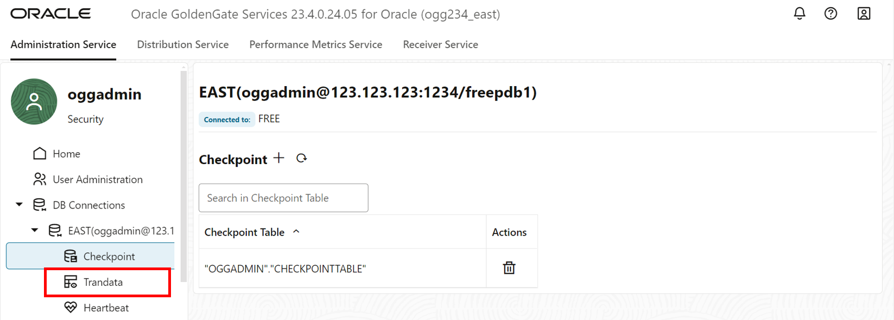
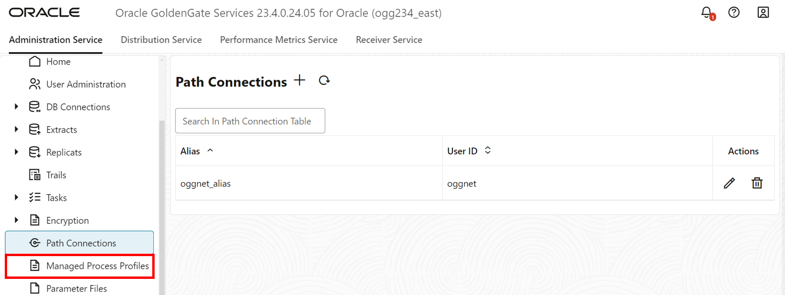
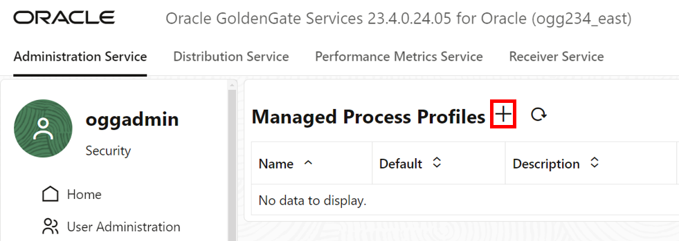

# Replication East to West

## Introduction

This lab walks you through the steps to create a connection to a source database, add transaction information, add a checkpoint table, create a path connection, and create a custom-managed profile in the Oracle GoldenGate East 23ai Microservices WebUI.

Estimated time: 20 minutes

### About Checkpoint table and Trandata

A Checkpoint table is created to add a fault tolerance into the replication process. GoldenGate Extract, and Replicat processes record their read and write positions to maintain a record of its read position in the trail for recovery purposes. A Trandata enables the unconditional logging of the primary key and the conditional supplemental logging of all unique and foreign key of the specified table.

### About Custom-managed Profile

A Custom-managed profile provides the name of the auto start and auto restart profile. You can select the default or custom options.

### Objectives

In this lab, you will:
* Create a Connection to the East Source database
* Add transaction data and a checkpoint table
* Create a custom-managed Profile

## Task 1: Create a Connection to the East Source database

1. Return to the East Microservices WebUI. In the navigation menu and click **DB Connections**.

    

2. Click **Add DB Connection**.

    

3. A Credentials panel will appear. For Credential Alias, enter **EAST**.

4. For User Alias, paste the **db\_east\_private\_connection** value from the Reservation Information. 

5. For password, paste the **Global Password** from the Reservation Information. Verify the password. 

6. Click **Submit**.

    

7. Click **Connect to database**.

    

8. You are directed to the Checkpoint page. Click **Add Checkpoint**.

    

9. A Checkpoint Table panel appears. For Checkpoint Table, enter **oggadmin.checkpointtable**.

10. Click **Submit**.

    

## Task 2: Create Trandata and a Checkpoint table

1. In the navigation menu, click **Trandata**.

    

2. Click **Add TRANDATA**.

    

3. A Trandata panel appears. For Schema Name, enter **HR**. Click **Submit**.

    

4. To verify, enter **HR** into the Search field and click Search.

    

5. In the navigation menu, click **Heartbeat**. Click **Add Heartbeat**.

    

6. An Add Heartbeat Table panel appears. Keeps the fields as is and click **Submit**.

    

## Task 3: Create a custom-managed Profile

1. In the navigation menu, click **Managed Process Profiles**.

    

2. Click **Add Profile**.

    

3. An Add Managed Process Settings Profile panel appears. For Profile Name, enter **east-profile**.

4. Select the Default Profile toggle.

5. Select the Auto Start toggle.

6. Select the Auto Restart toggle.

7. Click **Submit**.

    

You may now **proceed to the next lab.**

## Learn more

* [Managing deployments](https://docs.oracle.com/en/cloud/paas/goldengate-service/ebbpf/index.html)
* [Managing connections](https://docs.oracle.com/en/cloud/paas/goldengate-service/mcjzr/index.html)

## Acknowledgements
* **Author** - Katherine Wardhana, User Assistance Developer
* **Contributors** -  Alex Lima, Database Product Management
* **Last Updated By/Date** - Katherine Wardhana, July 2024