# Replicate data from East to West

## Introduction

Now that replication is established and verified from the source database to the target database, you can set up bidirectional replication from the target to the source. This lab walks you through the steps create and run an Extract on the target, and create and run a Replicat on the source in the Oracle Cloud Infrastructure (OCI) GoldenGate Deployment Console.

Estimated time: 20 minutes

### About Extracts, Distribution Paths, and Target Initiated Paths 

An Extract is a process that extracts, or captures, data from a source database. 

### Objectives

In this lab, you will:
* Add and run an Extract
* Add and run a Distribution Path
* Add and run a Target Initiated Path

## Task 1:  Add and run an Extract

1. In the navigation menu, click **Extracts**.

    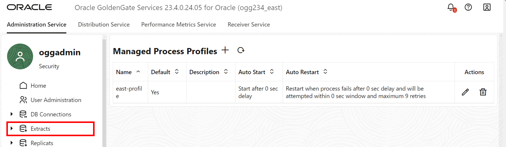

2. Click **Add Extract**.

    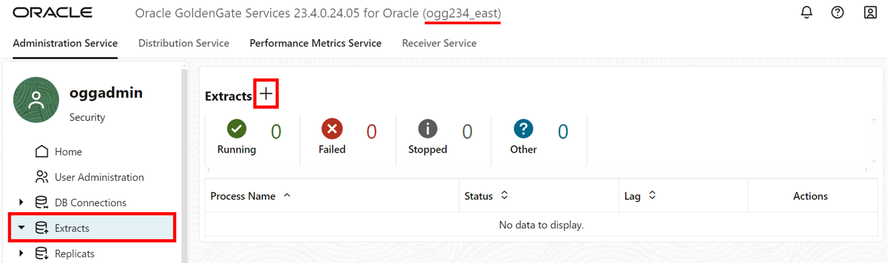

3. The Add Extract panel consists of five pages. On the Extract information page, for Extract Type, select **Integrated Extract**.

4. For Process Name, enter **EEAST** and optionally, a description.

5. Click **Next**.

    

6. On the Extract Options page, under Source Credentials, for Domain, select **OracleGoldenGate** from the dropdown.

7. For Alias, select **EAST** from the dropdown.

8. Under Extract Trail, for Name, enter **ee**.

9. Click **Next**.

    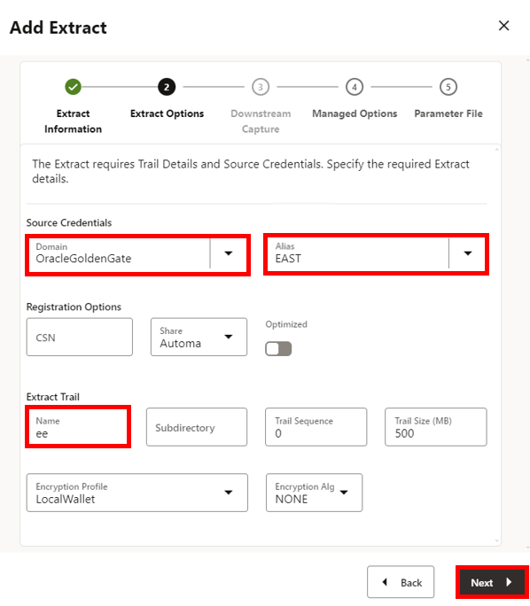

10. On the Managed Options page, for Profile Name, select **east-profile** from the dropdown.

11. Click **Next**.

    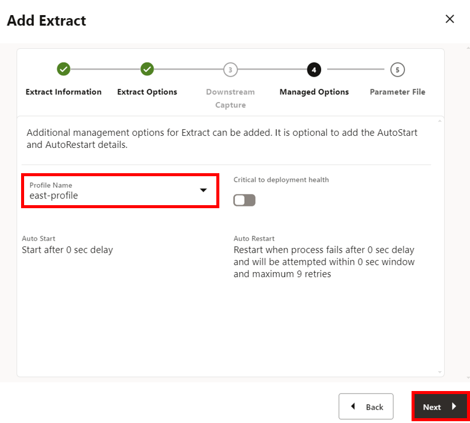

12. On the Parameter File page, in the text area, add a new line to the existing text and add the following:

    ```
    <copy>TRANLOGOPTIONS EXCLUDETAG 00
    DDL INCLUDE MAPPED
    table HR.*;</copy>
    ```

13. Click **Create**. 

    

    You return to the GoldenGate 23ai Microservices WebUI Home page.

14. In the EEAST **Action** menu, select **Start**. In the Confirm Action dialog, click **OK**. 

    

## Task 2: Create a Distribution Path to West Deployment

1. On the top navigation menu, click **Distribution Service**. 

    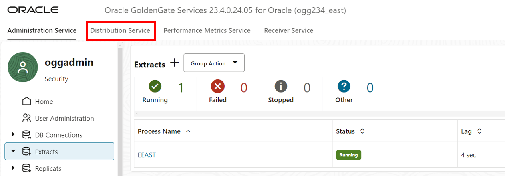

2. Click **Add Distribution Path**. 

    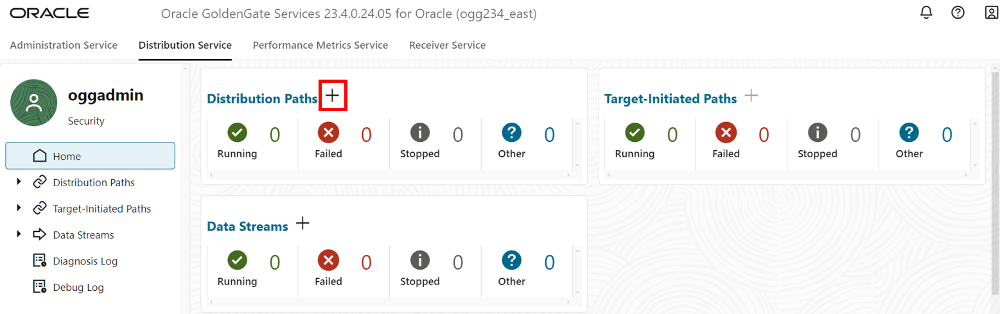

3. The Add Path panel consists of seven pages. On the Path Information page, for Name, enter **DPEAST**. 

4. Click **Next**.

    

5. On the Source Options page, for Source Extract, select **EEAST** from the dropdown.

6. For Trail Name, **ee** should automatically populate the field.

7. For Generated Source URI, keep as is.

8. Click **Next**.

    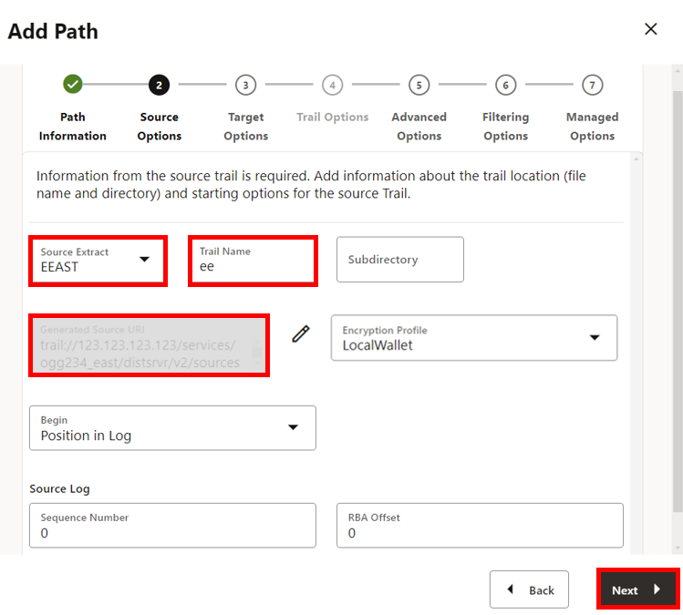

9. On the Target Options page, for Target Host, paste the **ogg-west-public\_ip** value from the Reservation Information. 

10. For Port Number, enter **9014**.

11. For Trail Name, enter **de**.

12. For Alias, enter **oggnet\_alias**.

13. Click **Next**.

    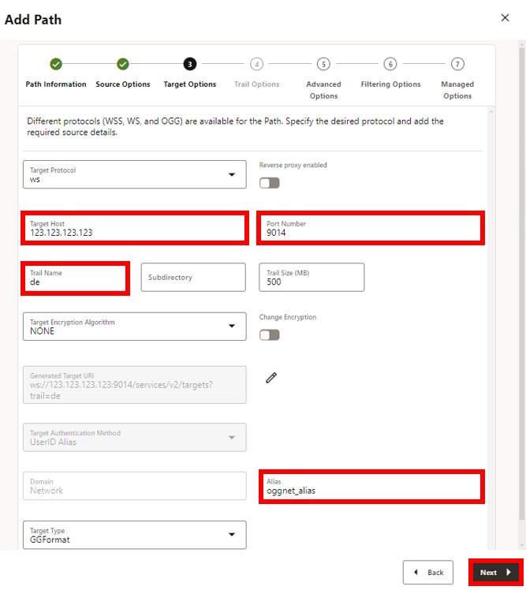
    
14. On the Advanced Options page, leave the fields as is, and click **Next**.

    

15. On the Filtering Options page, leave the fields as is, and click **Next**.

    

16. On the Managed Options page, leave the fields as is, and click **Create Path**.

    

    You return to the Distribution Service page.

17. On the left hand navigation menu, click **Distribution Paths**.

18. In the DPEAST **Action** menu, select **Start**. In the Confirm Action dialog, click **OK**.

    

## Task 3: Create Target Initiated Path from East Deployment 

1. On the top navigation menu, click **Receiver Service**. 

    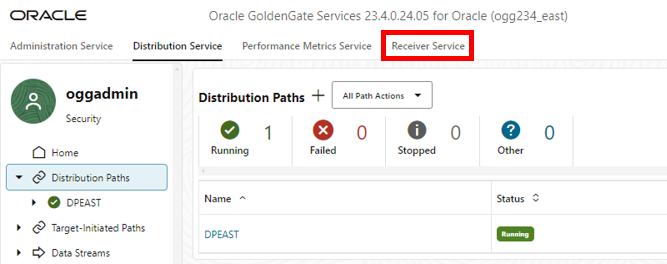

2. Click **Add Target-Initiated Path**. 

    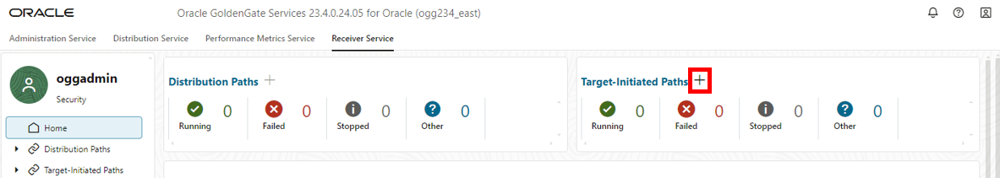

3. The Add Path panel consists of seven pages. On the Path Information page, for Name, enter **TPEAST**.

    

4. On the Source Options page, for Source Host, paste the **ogg-east-public_ip** value from the Reservation Information. 

5. For Port Number, enter **9014**.

6. For Trail Name, enter **de**.

7. For For Alias, enter **oggnet_alias**.

8. Click **Next**.

    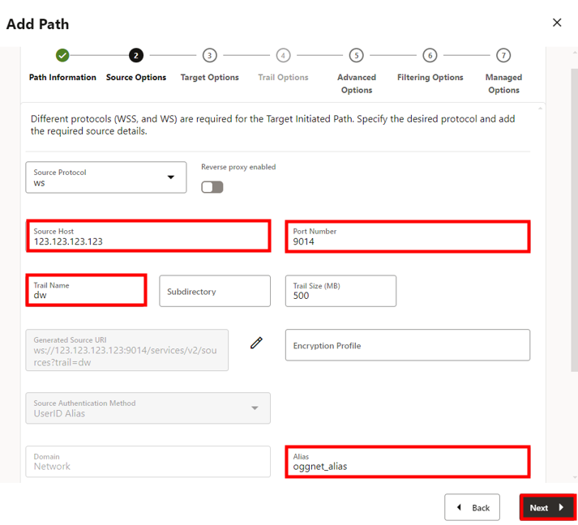

9. On the Target Options page, for Target Options, for Trail Name, enter **ee**.

10. Click **Next**.

    

11. On the Advanced Options page, leave the fields as is, and click **Next**.

    

12. On the Filtering Options page, leave the fields as is, and click **Next**.

    

13. On the Managed Options page, leave the fields as is, and click **Create Path**.

    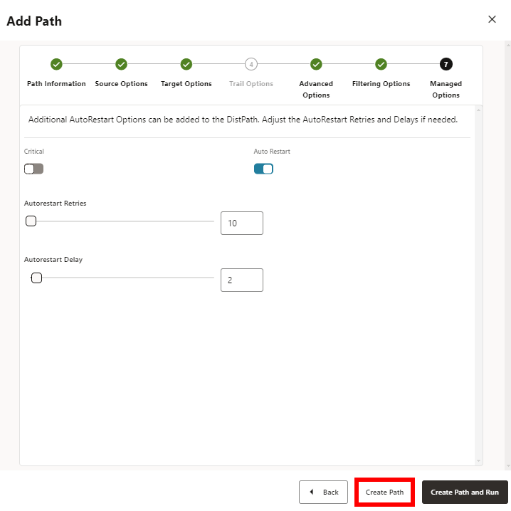

14. On the left hand navigation menu, click **Target-Initiated Paths**.

15. In the TPEAST **Action** menu, select **Start**. In the Confirm Action dialog, click **OK**. 

    

You may now **proceed to the next lab.**

## Learn more

* [Managing deployments](https://docs.oracle.com/en/cloud/paas/goldengate-service/ebbpf/index.html)
* [Managing connections](https://docs.oracle.com/en/cloud/paas/goldengate-service/mcjzr/index.html)

## Acknowledgements
* **Author** - Katherine Wardhana, User Assistance Developer
* **Contributors** -  Alex Lima Gray, Database Product Management
* **Last Updated By/Date** - Katherine Wardhana, July 2024