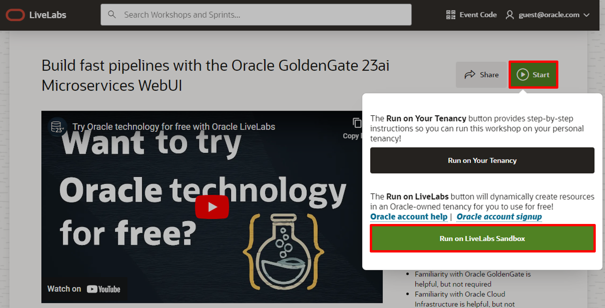
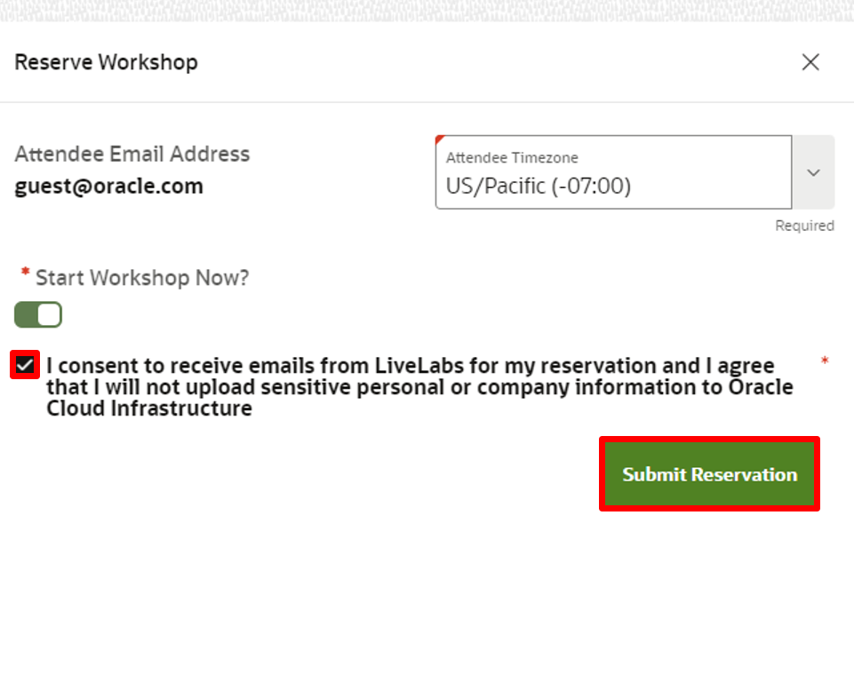
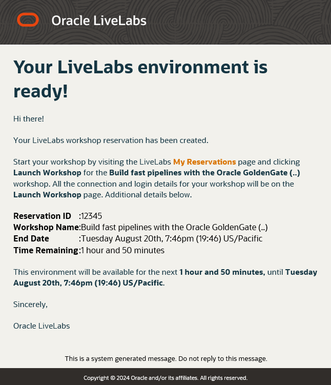
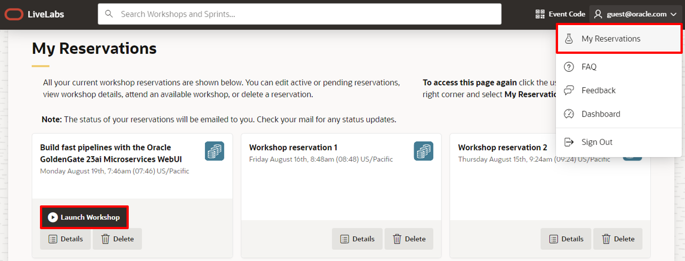
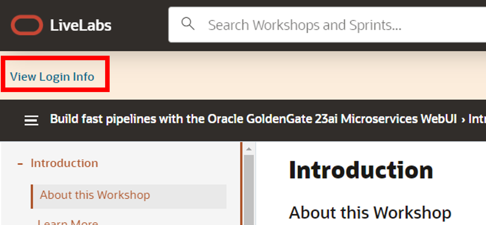
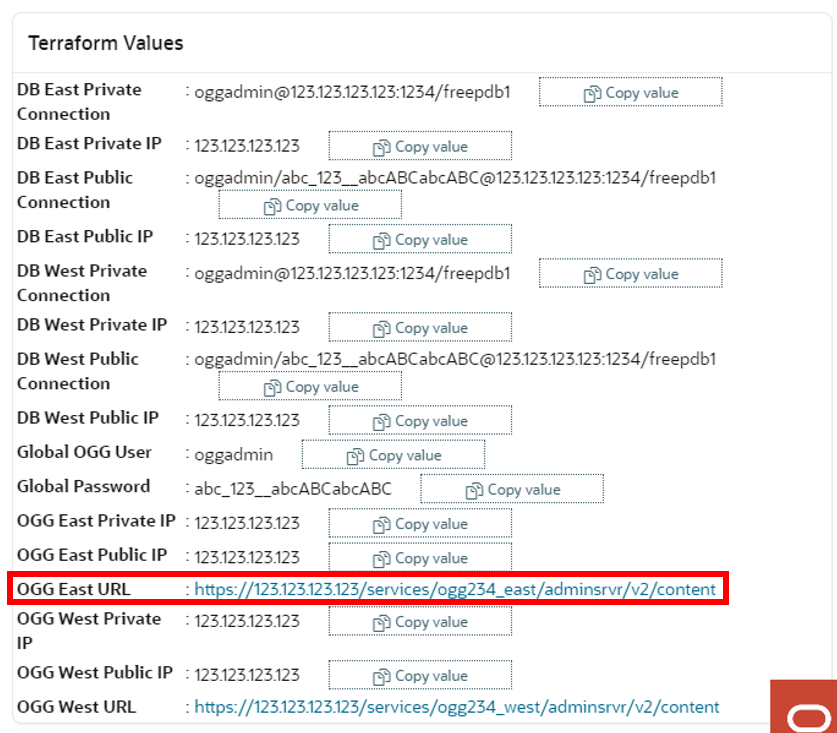
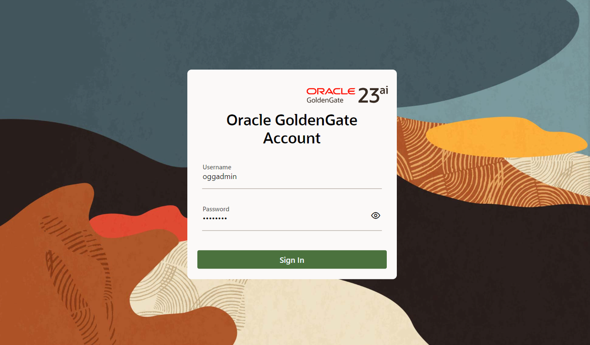

# Get started - LiveLabs login
## Introduction

Welcome to your LiveLabs Sandbox environment. In order to start your workshop, you need to login to our LiveLabs Sandbox.

In this lab, we are going to show you where you can find the login information and how to log in to the LiveLabs Sandbox.

Estimated Time: 5 minutes

### Objectives

* View login information to LiveLabs Sandbox
* Login to LiveLabs Sandbox

## Task 1: View Login Information

1. To create a reservation, click **Start**, and then **Run on LiveLabs Sandbox**.

    

2. To confirm the reservation, you must consent to receive emails from LiveLabs. More than that, you can select the time when to start the workshop.

    

3. You'll receive emails updating you on the status of your reservation, including one notifying you that your environment is ready to use.

    

4. Log in to LiveLabs. Click your username, and then **My Reservations**. On the My Reservations page, click **Launch Workshop** for the environment you want to use.

    

5. In your lab instructions, click **View Login Info**.

    

6. On the Reservation Information page, under Terraform Values, click on the **OGG East URL** link to access the Oracle GoldenGate East 23ai Microservices WebUI console.

    

    > **NOTE:** If you see “Your connection is not private” or its variations, for the purposes of this lab, proceed to access the website.

7.  To log in to the Oracle GoldenGate East 23ai Microservices WebUI console, enter **oggadmin** for Username and paste the **Global Password** from the Reservation Information for Password, and then click **Sign In**. 

    > **NOTE:** If using the LiveLab Sandbox environment, copy the deployment password from the Terraform output section of **View Login Info**.

    

    After you log in successfully, you're brought to the Oracle GoldenGate 23ai deployment console home page. Here, you can access the GoldenGate Administration, Performance Metrics, Distribution, and Receiver Services, as well as add Extracts and Replicats for your data replication tasks.

You may now **proceed to the next lab.**

## Acknowledgements
* **Author** - Katherine Wardhana, User Assistance Developer
* **Contributors** -  Alex Lima, Database Product Management
* **Last Updated By/Date** - Katherine Wardhana, August 2024