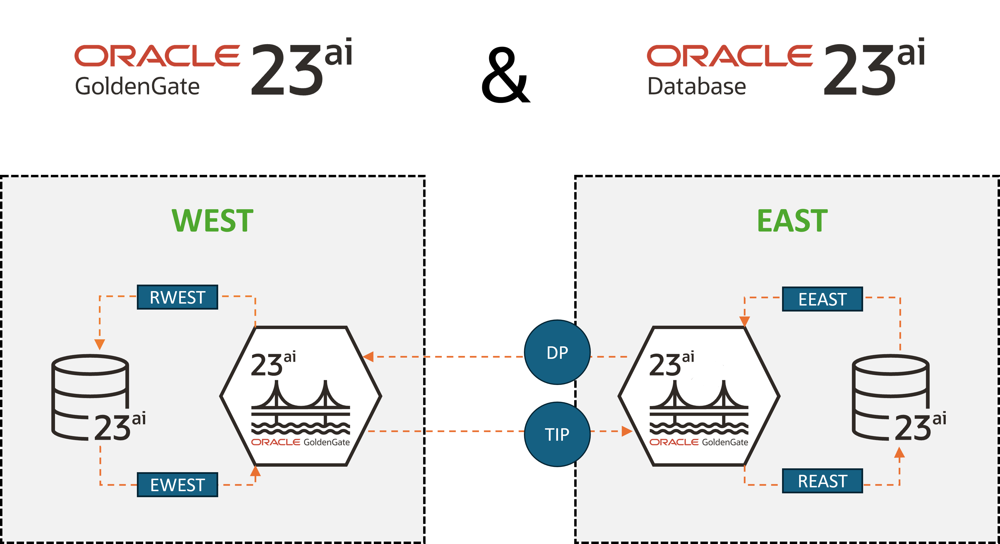

# Introduction

## About this Workshop

Oracle GoldenGate is the market leading technology for real-time heterogeneous data integration and building global transactional data fabrics. This workshop guides how to build fast pipelines both ways using Oracle GoldenGate 23ai Microservices WebUI.

   

we're doing bidrectional or two-way replication ...

Estimated workshop time: 2 hours

### About Oracle GoldenGate 23ai Microservices WebUI

Oracle GoldenGate 23ai Microservices WebUI is a fully-managed service that uses Oracle GoldenGate Microservices to help you replicate data in real time, at scale, in the cloud.

Oracle GoldenGate Microservices Architecture has been introduced since Oracle GoldenGate version 12.3. With each new release, Oracle has improved the Microservices architecture. Oracle GoldenGate 23ai includes a brand-new user interface with additional features and an updated end user experience.

all new releases... list 3 things

### Prerequisites

* Experience with Oracle Database
* Familiarity with Oracle GoldenGate is helpful, but not required
* An Oracle Cloud Account - Please view this workshop's LiveLabs landing page to see which environments are supported

## Learn More

* [Overview of Oracle GoldenGate 23ai](https://docs.oracle.com/en/middleware/goldengate/core/23/index.html)
* [Oracle GoldenGate Microservices Architecture Documentation](https://docs.oracle.com/en/middleware/goldengate/core/23/coredoc/overview-oracle-goldengate.html#GUID-3B1EF969-4A36-4338-820E-16F82B5C646D)
* [GoldenGate 23ai General Availability](https://blogs.oracle.com/dataintegration/post/announcing-goldengate-23ai)

## Acknowledgements
* **Author** - Katherine Wardhana, User Assistance Developer
* **Contributors** -  Alex Lima, Database Product Management
* **Last Updated By/Date** - Katherine Wardhana, July 2024
