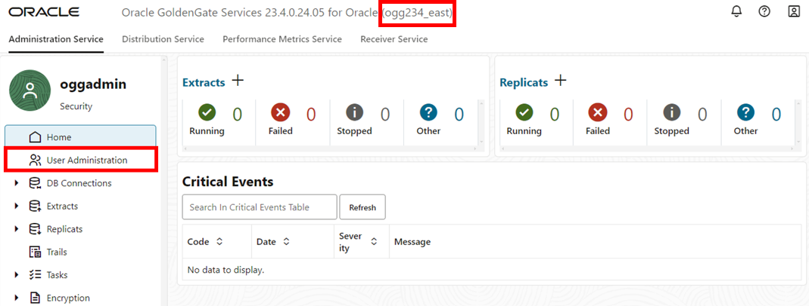
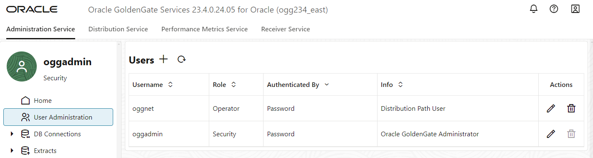
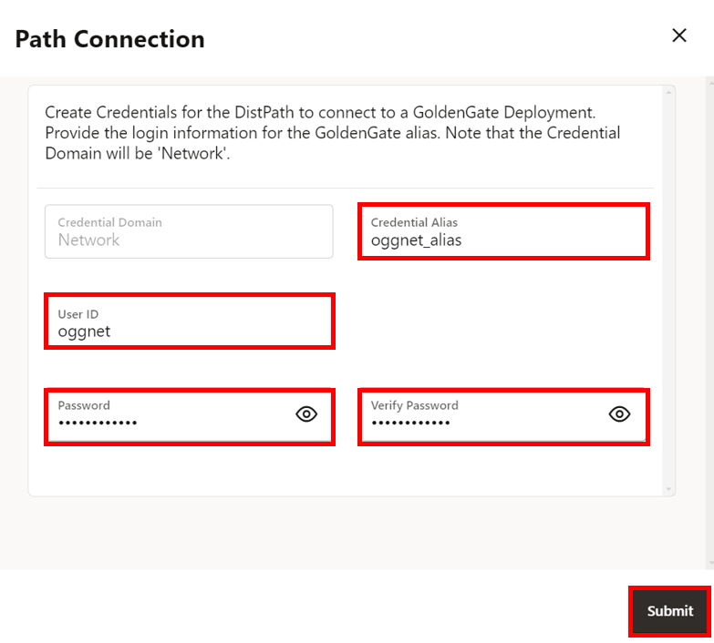
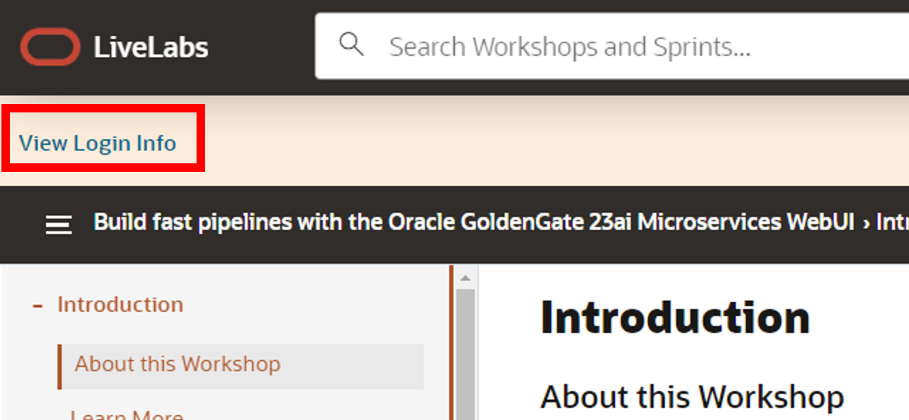
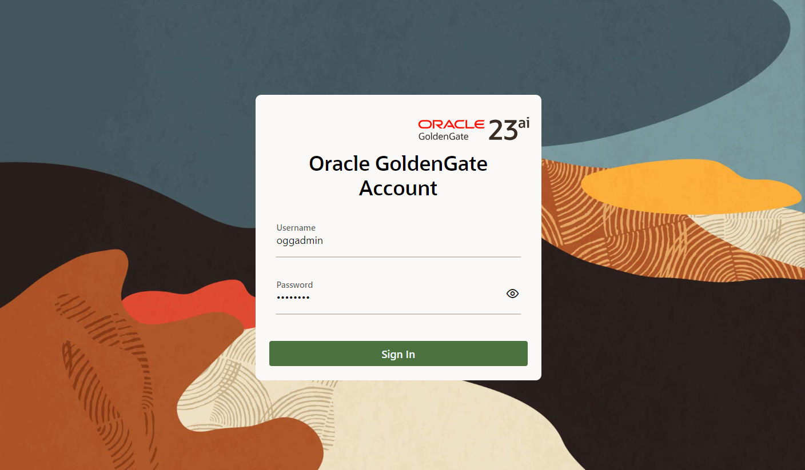

# Launch console, create new User Administrators, and create Path Connections

## Introduction

This lab walks you through the steps to launch the Oracle GoldenGate 23ai Microservices WebUI, create new user administrators, and create Path Connections.

You will log in to the Oracle GoldenGate 23ai Microservices WebUI for both the West and East console to perform a replication process on both deloyments. You will create a user on the target deployment so it can be used to log in the other source deployment and make changes. You will also create a Path Connection to create an alias user for the target deployment which will be used for bidirection on both deployments. 

Estimated time: 30 minutes

### Objectives

In this lab, you will:
* Log in to the Oracle GoldenGate 23ai Microservices WebUI
* Create New User Administrators
* Create Path Connections

## Task 1: Launch the Oracle GoldenGate East 23ai Microservices WebUI

1. In your lab instructions, click **View Login Info**.

    

2. On the Reservation Information page, click on the **ogg\_east\_url** link to access the Oracle GoldenGate East 23ai Microservices WebUI console.

3.  To log in to the Oracle GoldenGate East 23ai Microservices WebUI console, enter **oggadmin** for User name and the password, and then click **Sign In**. 

    > **NOTE:** If using the LiveLab Sandbox environment, copy the deployment password from the Terraform output section of **View Login Info**.

    

    After you log in successfully, you're brought to the Oracle GoldenGate 23ai deployment console home page. Here, you can access the GoldenGate Administration, Performance Metrics, Distribution, and Receiver Services, as well as add Extracts and Replicats for your data replication tasks.

## Task 2: Create a New User Administrator in the East Microservices WebUI

1. Open the navigation menu and then click **User Administration**.

    

2. Click **Add New User**.

    

3. A Create new User pop up will appear. For the Authenticated By dropdown, select **Password**.

4. For the Role dropdown, select **Operator**.

5. For Info, enter **Distribution Path User**.

6. For Username, enter **oggnet**.

7. For password, paste the Global Password from the Reservation Information. Verify the password. 

8. Click **Submit**.

    

9. The user you created appears in the Users list.

    

## Task 3: Create a Path Connection

1. In the navigation menu, click **Path Connections**, and chen Click **Add Path Connection**.

    

2. A Path Connection panel appears. For Credential Alias, enter **oggnet_alias**.

3. For User ID, enter **oggnet**.

4. For password, paste the Global Password from the Reservation Information. Verify the password. Click **Submit**.

    

Keep the East WebUI console open.

## Task 4: Create a new User Admistrator and Path Connection in the West 23ai WebUI

1. In your lab instructions, click **View Login Info**.

    

2. On the Reservation Information page, click on the **ogg\_west\_url** link to access the Oracle GoldenGate West 23ai Microservices WebUI console.

3.  To log in to the Oracle GoldenGate West 23ai Microservices WebUI console, enter **oggadmin** for User name and the password, and then click **Sign In**. 

    > **NOTE:** If using the LiveLab Sandbox environment, copy the deployment password from the Terraform output section of **View Login Info**.

    

    After you log in successfully, you're brought to the Oracle GoldenGate 23ai deployment console home page. Here, you can access the GoldenGate Administration, Performance Metrics, Distribution, and Receiver Services, as well as add Extracts and Replicats for your data replication tasks.

4. Repeat tasks 2 and 3 above to create a new User Admistrator and new Path Connection on the West console.
Keep the West WebUI console open.

You may now **proceed to the next lab.**

## Learn more

* [Managing deployments](https://docs.oracle.com/en/cloud/paas/goldengate-service/ebbpf/index.html)
* [Managing connections](https://docs.oracle.com/en/cloud/paas/goldengate-service/mcjzr/index.html)

## Acknowledgements
* **Author** - Katherine Wardhana, User Assistance Developer
* **Contributors** -  Alex Lima, Database Product Management
* **Last Updated By/Date** - Katherine Wardhana, July 2024