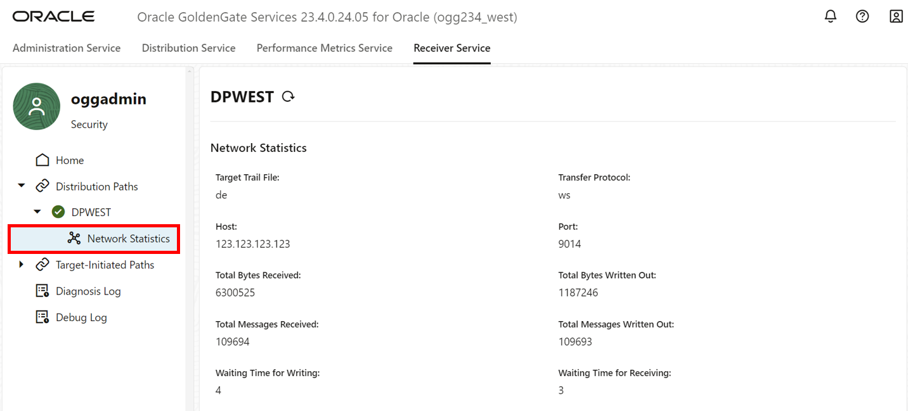

# Review Configuration

## Introduction

In this lab, you learn to monitor the Extract and Replicat processes that were created and run in the previous labs.

Estimated time: 10 minutes

### About Performance Monitoring

Monitoring the performance of your GoldenGate instance ensures that your data replication processes are running smoothly and efficiently. You can monitor performance in the Oracle GoldenGate 23ai Microservices WebUI.

### Objectives

In this lab, you will:
* Review the Oracle GoldenGate Microservices, such as, Administration Service, Distribution Service, Performance Metrics Service, and Receiver Service.
* View charts and statistics using the Performance Metrics Server in the Oracle GoldenGate 23ai Microservices WebUI.

### Prerequisites

* This lab assumes that you completed all preceding labs

## Task 1: Review Extract details

1. On the top navigation, select **Administration Service** and then select **Extracts**.

2. On the Extracts page, select **EEAST**.

    

3. On the **Extract** screen, view the process details such as Encryption, and Status.

    

4. On the **Checkpoint** screen, view the Input Checkpoints, and Output Checkpoints.

    

5. On the **Statistics** screen, view the Data Definition Language (DDL) and Table Statistics. You can organize the statistics based on total, daily, or hourly.

    

6. On the **Parameters** screen, view the parameters in use.

    

7. On the **Cache Manager Statistics** screen, view the Cache Statistics, and Objects Pool Statistics. You can view the Global Statistics under Runtime Statistics or Cumulative Statistics.

    

8. On the **Report** screen, view the Report Files and Discard Files.

    

9. On the **Integrated Diagnostics** screen, view and add Integrated Diagnostics.

    

## Task 2: Review Replicat details

1. On the top navigation, select **Administration Service** and then select **Replicats**.

2. On the Replicats page, select **RWEST**.

    

3. On the **Replicat** screen, view the process details such as Encryption, and Status.

    

4. On the **Checkpoint** screen, view the Input Checkpoints, and Output Checkpoints.

    

5. On the **Statistics** screen, view the Data Definition Language (DDL) and Table Statistics. You can organize the statistics based on total, daily, or hourly.

    

6. On the **Parameters** screen, view the parameters in use.

    

7. On the **Report** screen, view the Report Files and Discard Files.

    

8. On the **Heartbeat** screen, view the Heartbeat Information and Latest Heartbeats. Click **See History** to view the replicat's Heartbeats History.

    

## Task 3: Navigate Distribution Service

1. On the top navigation, select **Distribution Service** and then select **Distribution Paths**.

2. On the Distribution Paths page, select **DPEAST**.

    

3. On the **Path Information** screen, view the Basic Information, Filter Rules, Encryption, and Advanced Options.

    

4. On the **Path Statistics** screen, view the LCR Table, DDL Table, and Statistics Table. 

    

## Task 4: Navigate Performance Metrics Service

1. On the top navigation, select **Performance Metrics Service**.

    

2. Click **Services**, view the status of all the processes.

    

3. Click **Services**, view the status of all the processes.

    

## Task 5: Navigate Receiver Service

1. Open the **East** Microservices WebUI.

2. On the top navigation menu, click **Receiver Service**, and then on the left navigation menu, click **Target-Initiated Paths**. 

3. On the Target-Initiated Path page, click **TPEAST**.

    

4. On the **Path Information** screen, view the Basic Information, Filter Rules, Encryption, and Advanced Options.

    

5. On the **Path Statistics** screen, view the LCR Table, DDL Table, and Statistics Table. 

    

6. Open the **West** Microservices WebUI.

7. On the top navigation menu, click **Receiver Service**, and then on the left navigation menu, click **Distribution Paths**. 

8. On the Distribution Path page, click **DPWEST**.

    

9. On the **Network Statistics** screen, view the Basic Information, Filter Rules, Encryption, and Advanced Options.

    

You may now **proceed to the next lab.**

## Learn more

* [Monitor Processes from the Performance Metrics Service](https://docs.oracle.com/en/middleware/goldengate/core/23/coredoc/monitor-performance-metrics-server.html)

## Acknowledgements
* **Author** - Katherine Wardhana, User Assistance Developer
* **Contributors** -  Alex Lima, Database Product Management
* **Last Updated By/Date** - Katherine Wardhana, August 2024