# Replication West to East

## Introduction

In this lab, you learn to...

Estimated time: 20 minutes

### About the Extract process
An Extract is a process that extracts, or captures, data from a source database.

### Objectives
In this lab, you learn to:
* Log in to the Oracle GoldenGate 23ai Microservices WebUI
* Create a New User Administrator
* Create a Connection to the East Source database
* Add transaction data and a checkpoint table
* Create a Path Connection
* Create a custom-managed Profile

### Prerequisites

* This lab assumes that you completed all preceding labs
* Your deployment is in the Active state.

## Task 1: Launch the Oracle GoldenGate West 23ai Microservices WebUI

1. In your lab instructions, click **View Login Info**.

    

2. On the Reservation Information page, click on the **ogg\_west\_url** link to access the Oracle GoldenGate West 23ai Microservices WebUI console.

3.  To log in to the Oracle GoldenGate West 23ai Microservices WebUI console, enter **oggadmin** for User name and the password, and then click **Sign In**. 

    > **NOTE:** If using the LiveLab Sandbox environment, copy the deployment password from the Terraform output section of **View Login Info**.

    

    After you log in successfully, you're brought to the Oracle GoldenGate 23ai deployment console home page. Here, you can access the GoldenGate Administration, Performance Metrics, Distribution, and Receiver Services, as well as add Extracts and Replicats for your data replication tasks.

## Task 2: Create a New User Administrator

1. Open the navigation menu and then click **User Administration**.

    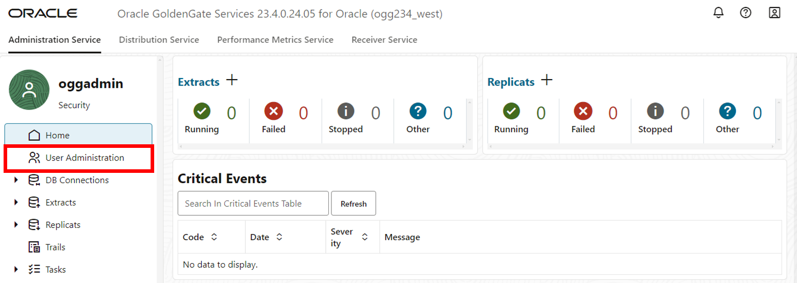

2. Click **Add New User**.

    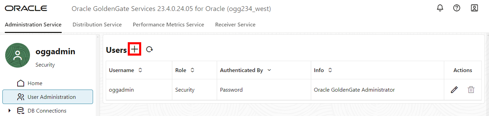

3. A Create new User pop up will appear. For the Authenticated By dropdown, select **Password**.

4. For the Role dropdown, select **Operator**.

5. For Info, enter **Distribution Path User**.

6. For Username, enter **oggnet**.

7. For password, paste the Global Password from the Reservation Information. Verify the password. Click **Submit**.

    

8. The user you created appears in the Users list.

    

## Task 3: Create a Connection to the East Source database and a Checkpoint table

1. Open the navigation menu and then click **DB Connections**.

    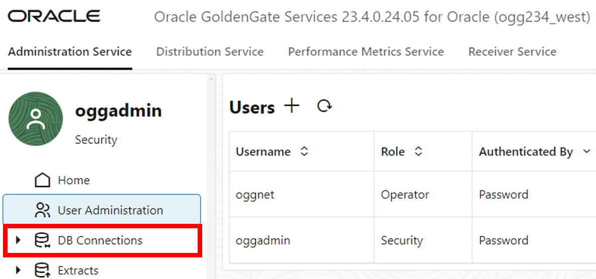

2. Click **Add DB Connection**.

    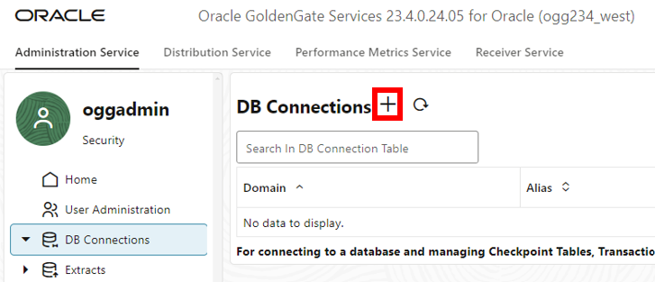

3. A Credentials panel will appear. For Credential Alias, enter **EAST**.

4. For User Alias, paste the **db\_west\_private\_connection** value from the Reservation Information. 

5. For password, paste the **Global Password** from the Reservation Information. Verify the password. 

6. Click **Submit**.

    

7. Click **Connect to database**.

    

8. You are directed to the Checkpoint page. Click **Add Checkpoint**.

    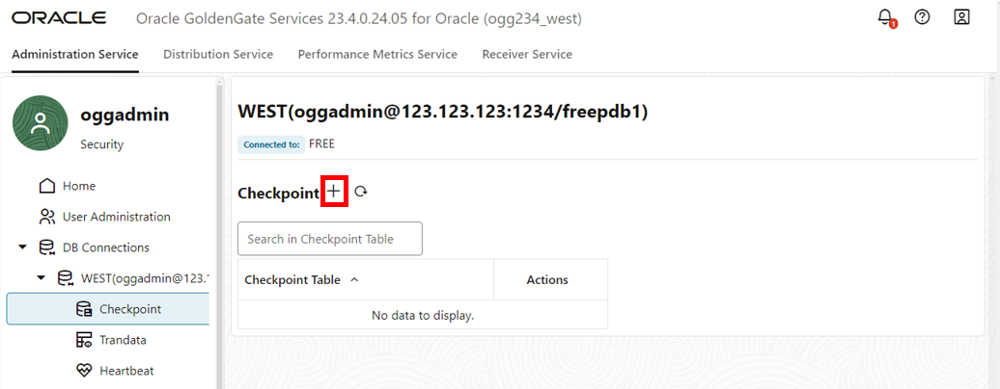

9. A Checkpoint Table panel appears. For Checkpoint Table, enter **oggadmin.checkpointtable**. 

10. Click **Submit**.

    

## Task 4: Create Trandata and a Checkpoint table

1. In the navigation menu, click **Trandata**.

    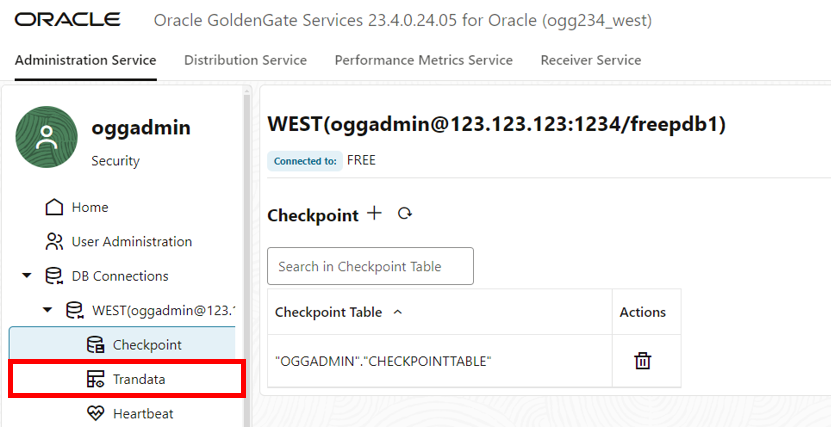

2. Click **Add TRANDATA**.

    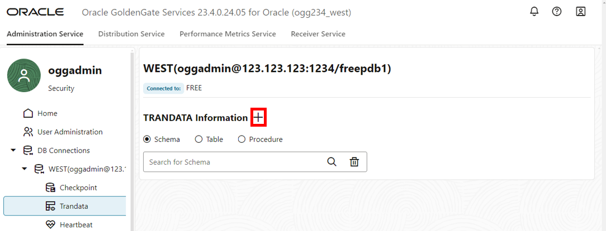

3. A Trandata panel appears. For Schema Name, enter **HR**. Click **Submit**.

    

4. To verify, enter **HR** into the Search field and click Search.

    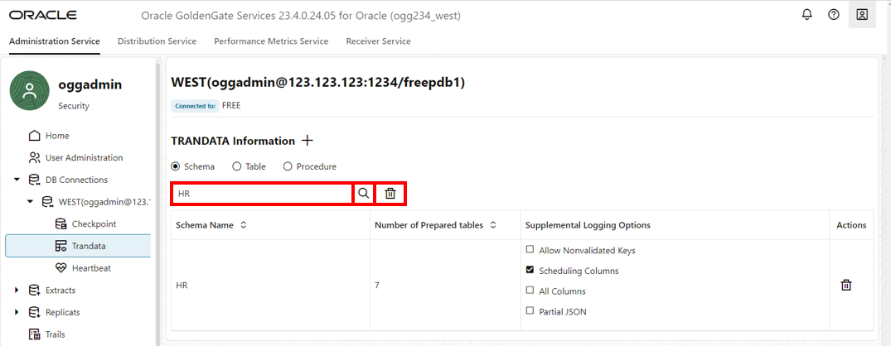

5. In the navigation menu, click **Heartbeat**. 

6. Click **Add Heartbeat**.

    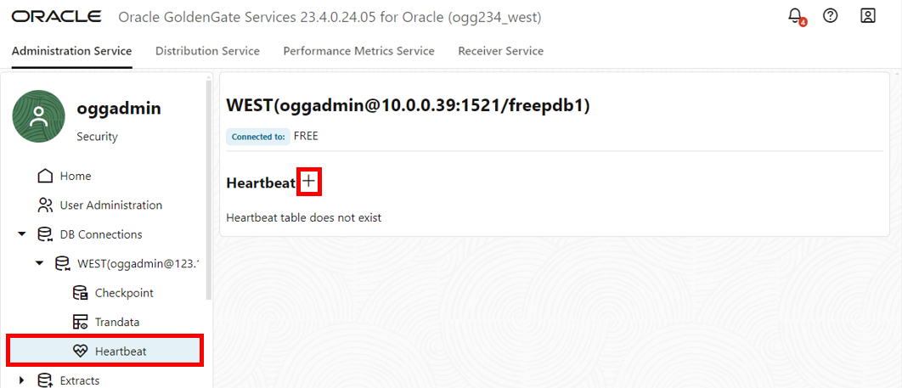

7. An Add Heartbeat Table panel appears. Keeps the fields as is and click **Submit**.

    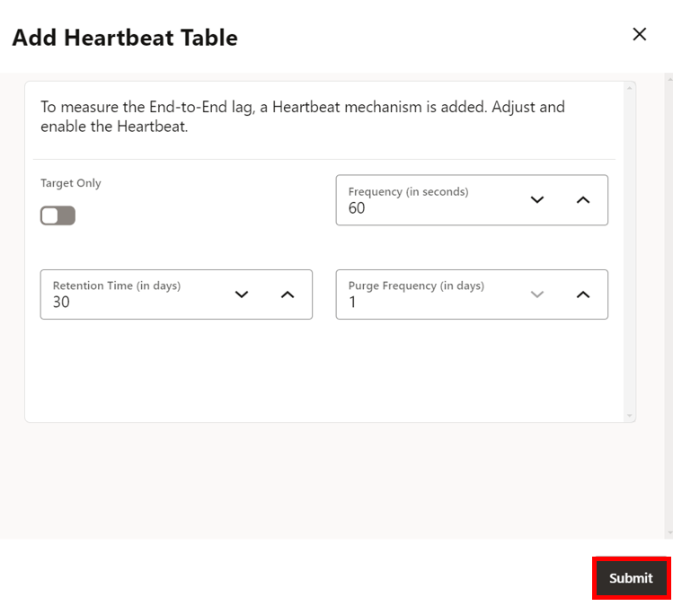

## Task 5: Create a Path Connection
1. In the navigation menu, click **Path Connections**.

    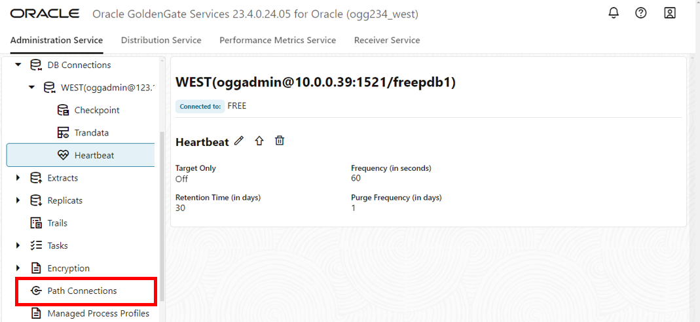

2. Click **Add Path Connection**.

    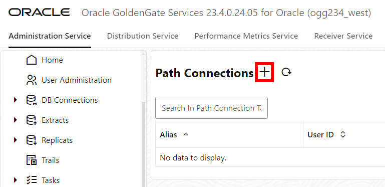

3. A Path Connection panel appears. For Credential Alias, enter **oggnet_alias**.

4. For User ID, enter **oggnet**.

5. For password, paste the Global Password from the Reservation Information. Verify the password. Click **Submit**.

    

## Task 6: Create a custom-managed Profile

1. In the navigation menu, click **Managed Process Profiles**.

    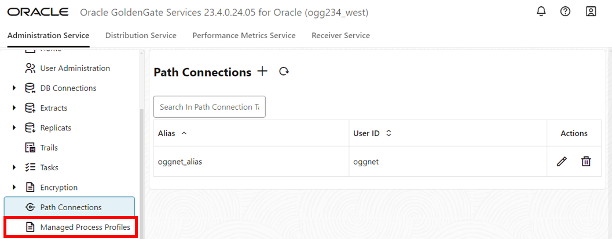

2. Click **Add Profile**.

    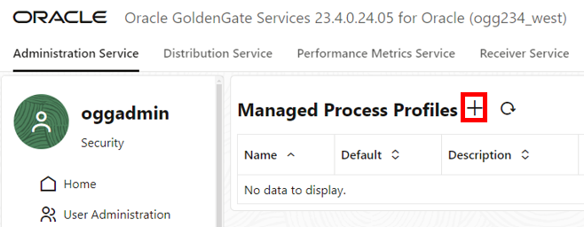

3. An Add Managed Process Settings Profile panel appears. For Profile Name, enter **west-profile**.

4. Select the Default Profile toggle.

5. Select the Auto Start toggle.

6. Select the Auto Restart toggle.

7. Click **Submit**.

    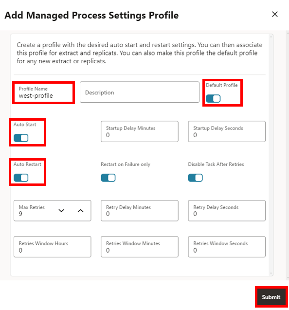

You may now **proceed to the next lab.**

## Learn more

* [Add an Extract for Oracle Database](https://docs.oracle.com/en/cloud/paas/goldengate-service/eeske/index.html)

## Acknowledgements
* **Author** - Katherine Wardhana, User Assistance Developer
* **Contributors** -  Alex Lima Gray, Database Product Management
* **Last Updated By/Date** - Katherine Wardhana, July 2024
