# Replicate data from West to East

## Introduction

In this lab, you learn to...

Estimated time: 20 minutes

### About Extracts, Distribution Paths, and Replicats 

An Extract is a process that extracts, or captures, data from a source database. 

### Objectives

In this lab, you will:
* Add and run an Extract
* Add and run a Distribution Path
* Add and run a Target Initiated Path

## Task 1:  Add and run an Extract

1. In the navigation menu, click **Extracts**.

    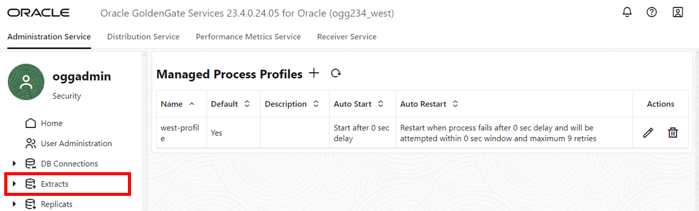

2. Click **Add Extract**.

    

3. The Add Extract panel consists of five pages. On the Extract information page, for Extract Type, select **Integrated Extract**.

4. For Process Name, enter **EWEST** and optionally, a description.

5. Click **Next**.

    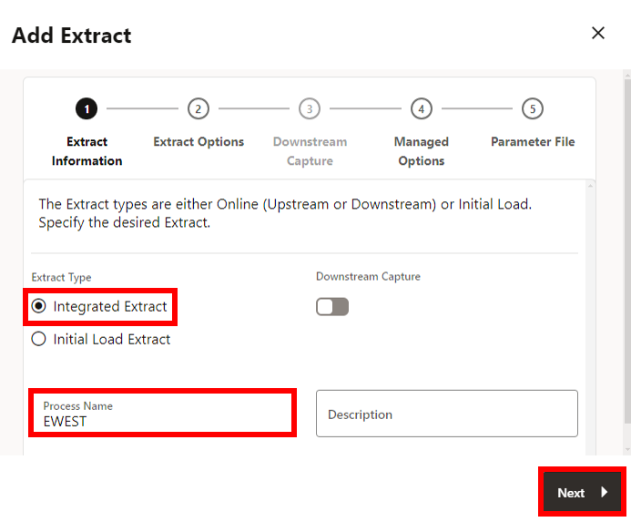

6. On the Extract Options page, under Source Credentials, for Domain, select **OracleGoldenGate** from the dropdown.

7. For Alias, select **WEST** from the dropdown.

8. Under Extract Trail, for Name, enter **ew**.

9. Click **Next**.

    

10. On the Managed Options page, for Profile Name, select **east-profile** from the dropdown.

11. Click **Next**.

    

12. On the Parameter File page, in the text area, add a new line to the existing text and add the following:

    ```
    <copy>TRANLOGOPTIONS EXCLUDETAG 00
    DDL INCLUDE MAPPED
    table HR.*;</copy>
    ```

13. Click **Create**. 

    

    You return to the GoldenGate 23ai Microservices WebUI Home page.

14. In the EWEST **Action** menu, select **Start**. In the Confirm Action dialog, click **OK**. 

    

## Task 2: Create a Distribution Path to West Deployment

1. On the top navigation menu, click **Receiver Service**. 

    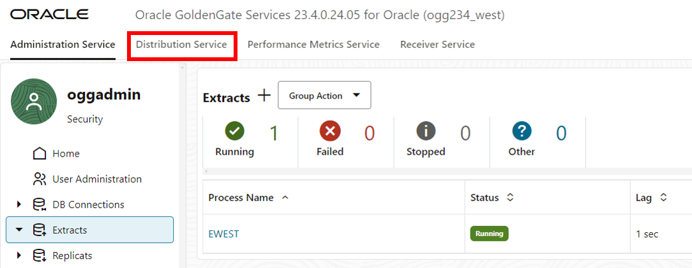

2. Click **Add Distribution Path**. 

    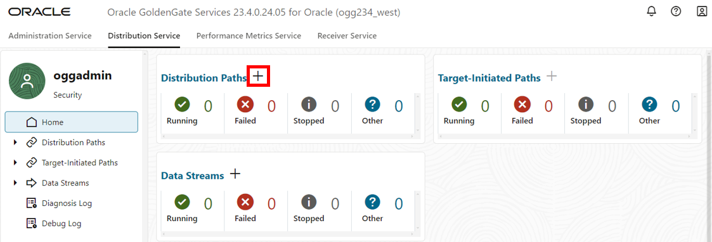

3. The Add Path panel consists of seven pages. On the Path Information page, for Name, enter **DPWEST**. 

4. Click **Next**.

    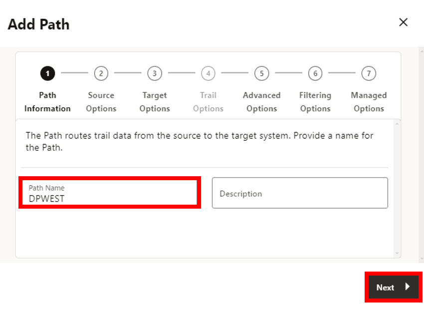

5. On the Source Options page, for Source Extract, select **EWEST** from the dropdown.

6. For Trail Name, select **ew** from the dropdown.

7. Click **Next**.

    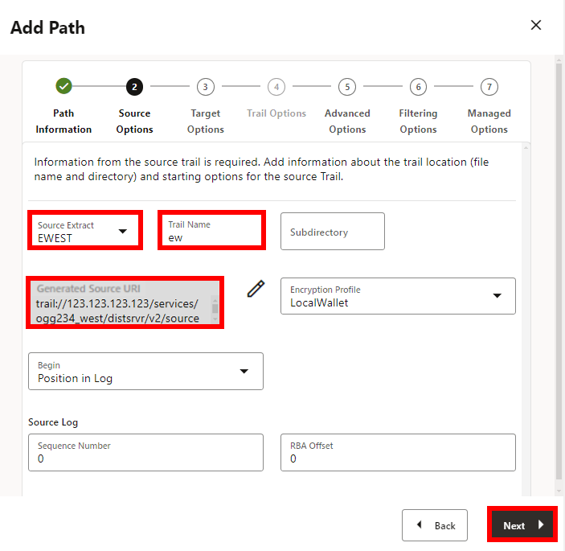

8. On the Target Options page, for Target Host, enter the **ogg-west-public\_ip** value from the Reservation Information. 

6. For Port Number, enter **9014**.**

7. For Trail Name, enter **dw**.

8. For Alias, enter **oggnet\_alias**.

9. Click **Next**.

    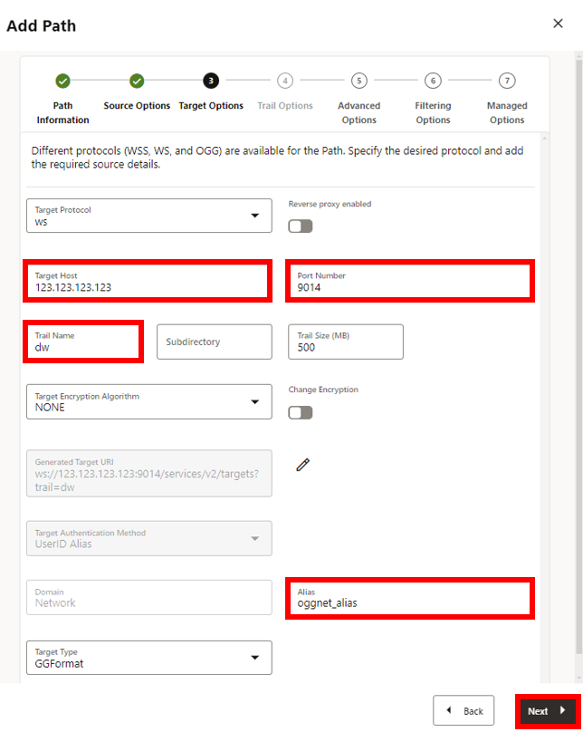

10. On the Advanced Options page, leave the fields as is, and click **Next**.

    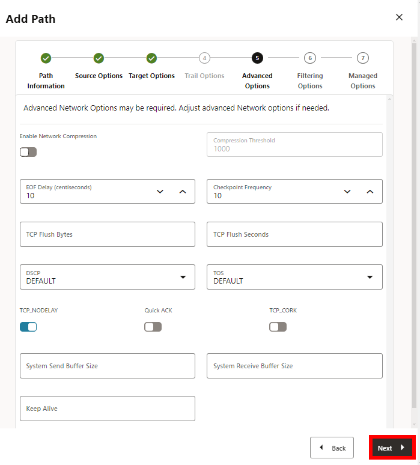

11. On the Filtering Options page, leave the fields as is, and click **Next**.

    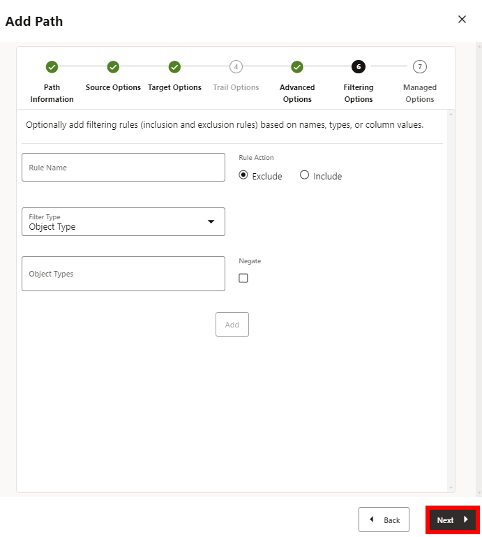

12. On the Managed Options page, leave the fields as is, and click **Create Path**.

    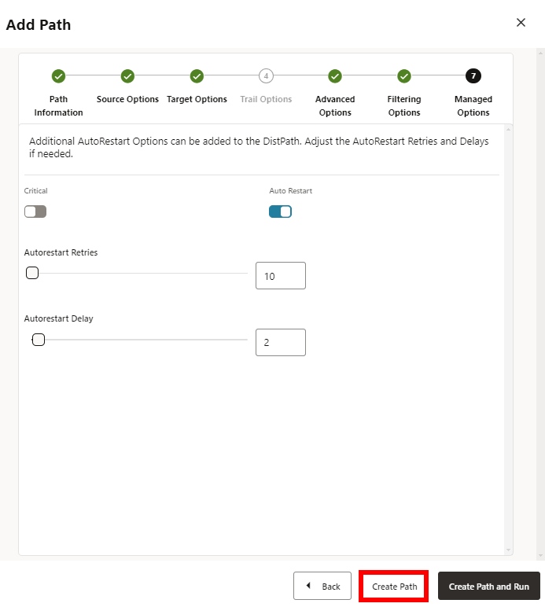

13. On the left hand navigation menu, click **Distribution Paths**.

14. In the DPWEST **Action** menu, select **Start**. In the Confirm Action dialog, click **OK**.

    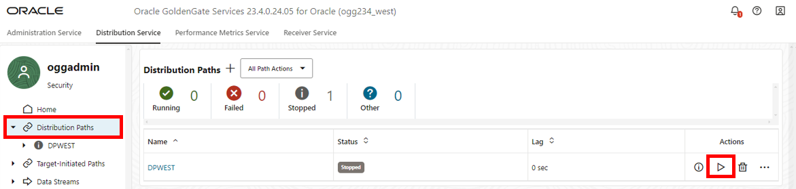

## Task 3: Create a Replicat to apply to the East target database

1. Open the navigation menu and then click **Replicats**.

    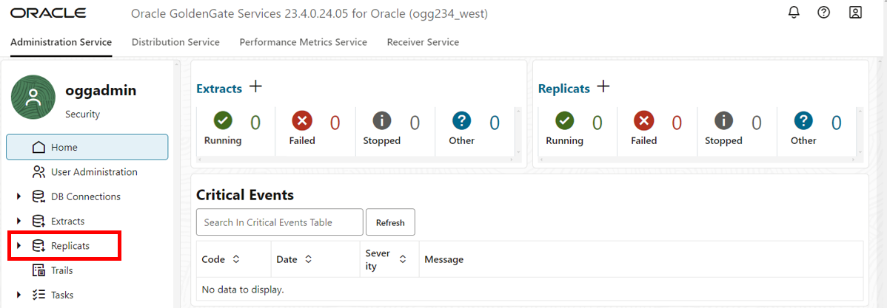

2. Click **Add Replicat**.

    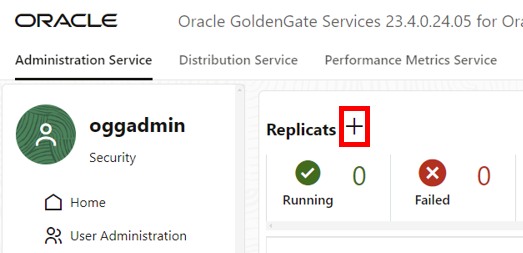

3. The Add Replicat panel consists of four pages. On the Replicat information page, for Replicat Type, select **Parallel Replicat**.

4. For Parallel Replicat Type, select **Nonintegrated**.

5. For Process Name, enter **RWEST**.

6. Click **Next**.

    

7. On the Replicat Options page, for Replicat Trail, enter **de**.

8. For Domain, select **OracleGoldenGate** from the dropdown.

9. For Alias, select **WEST** from the dropdown.

10. For Checkpoint Table, select **"OGGADMIN"."CHECKPOINTTABLE** from the dropdown.

11. Click **Next**.

    

12. On the Managed Options page, for Profile Name, select **west-profile** from the dropdown.

13. Click **Next**.

    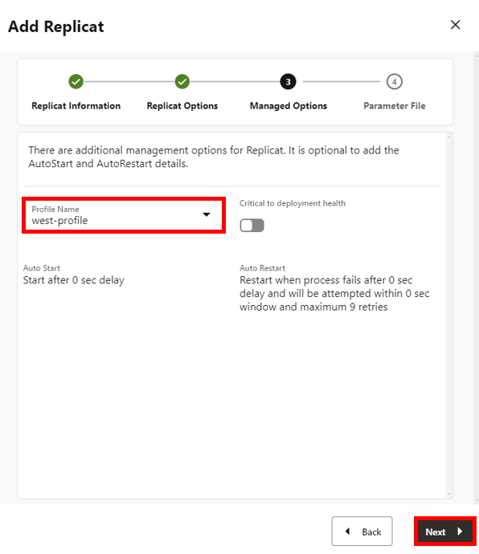

14. On the Parameter File page, in the text area, replace **MAP *.*, TARGET *.*;** with the following script:

    ```
    <copy>DDL INCLUDE MAPPED
    MAP HR.*, TARGET HR.*;</copy>
    ```
15. Click **Create**.

    

16. In the RWEST **Action** menu, select **Start**. In the Confirm Action dialog, click **OK**. 

    

You may now **proceed to the next lab.**

## Learn more

* [Add an Extract for Oracle Database](https://docs.oracle.com/en/cloud/paas/goldengate-service/eeske/index.html)

## Acknowledgements
* **Author** - Katherine Wardhana, User Assistance Developer
* **Contributors** -  Alex Lima Gray, Database Product Management
* **Last Updated By/Date** - Katherine Wardhana, July 2024
