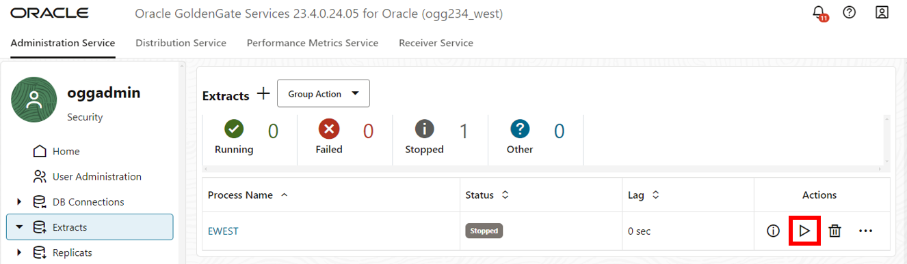

# Replicate data from West to East

## Introduction

This lab walks you through the steps create and run an Extract, create an run a Distribution Path, and create and run a Replicat.

Estimated time: 20 minutes

### About Extracts, Distribution Paths, and Replicats 

An Extract is a process that extracts, or captures, data from a source database. A Distribution Path is a source-to-destination configuration that uses the Distribution Service to send data in a distributed environment. A Replicat is a process that delivers data to a target database.

### Objectives

In this lab, you will:
* Add and run an Extract process to capture data
* Add and run a Distribution Path to send data
* Add and run a Replicat process to consume the trail file received from the East database

## Task 1:  Add and run an Extract

1. Make sure you're on the the **West** Microservices WebUI. In the navigation menu, click **Extracts**.

2. Click **Add Extract**.

    

3. The Add Extract panel consists of five pages. On the Extract information page, complete the following fields, and then click **Next**:
    * For Extract Type, select **Integrated Extract**.
    * For Process Name, enter **EWEST** and optionally, a description.

    

4. On the Extract Options page, complete the following fields, and then click **Next**: 
    * For Domain, select **OracleGoldenGate** from the dropdown.
    * For Alias, select **WEST** from the dropdown.
    * For Name, enter **ew**.

    

5. On the Managed Options page, for Profile Name, select **east-profile** from the dropdown, and then click **Next**.

    

6. On the Parameter File page, in the text area, add a new line to the existing text and add the following:

    ```
    <copy>TRANLOGOPTIONS EXCLUDETAG 00
    DDL INCLUDE MAPPED
    table HR.*;</copy>
    ```

7. Click **Create**. 

    

8. In the EWEST **Action** menu, select **Start**. In the Confirm Action dialog, click **OK**. 

    

## Task 2: Add an East Oracle GoldenGate user

1. Open the navigation menu and then click **User Administration**.

2. Click **Add New User**. 

    

3. A Create new User pop up will appear, complete the following fields, and then click **Submit**:  
    * For the Authenticated By dropdown, select **Password**.
    * For the Role dropdown, select **Operator**.
    * For Info, enter **Distribution Path User**.
    * For Username, enter **oggnet**.
    * For password, paste the Global Password from the Reservation Information. Verify the password. 

    

4. The user you created appears in the Users list. 

## Task 3: Add a Path Connection

1. In the navigation menu, click **Path Connections**, and then Click **Add Path Connection**.

    

2. A Path Connection panel appears, complete the following fields, and then click **Submit**:  
    * For Credential Alias, enter **oggnet\_alias**.
    * For User ID, enter **oggnet**.
    * For password, paste the Global Password from the Reservation Information. Verify the password. 

    

## Task 4: Add a Target-Initiated path on East Oracle GoldenGate

1. Switch to the **East** Microservices WebUI.

2. On the top navigation menu, click **Receiver Service**, and then click **Add Target-Initiated Path**. 

    

3. The Add Path panel consists of seven pages. On the Path Information page, for Name, enter **TPEAST**, and then click **Next**.

    

4. On the Source Options page, complete the following fields, and then click **Next**:
    * For Source Host, paste the **ogg-west-public\_ip** value from the Reservation Information.
    * For Port Number, enter **9013**.
    * For Trail Name, enter **dw**.
    * For For Alias, enter **oggnet\_alias**.

    

5. On the Target Options page, for Trail Name, enter **ee**, and then click **Next**.

    

6. On the Advanced Options page, leave the fields as is, and click **Next**.

    

7. On the Filtering Options page, leave the fields as is, and click **Next**.

    

8. On the Managed Options page, leave the fields as is, and click **Create Path**.

    

9. On the left hand navigation menu, click **Target-Initiated Paths**.

10. In the TPEAST **Action** menu, select **Start**. In the Confirm Action dialog, click **OK**.

    

## Task 5: Add a Replicat on East deployment

1. Open the top navigation menu, click **Administration Service**. Click **Add Replicat**.

    

2. The Add Replicat panel consists of four pages. On the Replicat Information page, complete the following fields, and then click **Next**:
    * For Replicat Type, select **Parallel Replicat**.
    * For Parallel Replicat Type, select **Nonintegrated**.
    * For Process Name, enter **REAST**.

    

3. On the Replicat Options page, complete the following fields, and then click **Next**:
    * For Replicat Trail, enter **ee**.
    * For Domain, select **OracleGoldenGate** from the dropdown.
    * For Alias, select **EAST** from the dropdown.
    * For Checkpoint Table, select **"OGGADMIN"."CHECKPOINTTABLE** from the dropdown.

    

4. On the Managed Options page, for Profile Name, select **east-profile** from the dropdown.

    

5. On the Parameter File page, page, in the text area, replace **MAP ., TARGET .;** with the following script:

    ```
    <copy>DDL INCLUDE MAPPED
    MAP HR.*, TARGET HR.*;</copy>
    ```
6. Click **Create**.

    

7. In the navigation menu, click **Replicats**.

8. In the REAST **Action** menu, select **Start**. In the Confirm Action dialog, click **OK**. 

    

You may now **proceed to the next lab.**

## Learn more

* [Add an Extract for Oracle Database](https://docs.oracle.com/en/cloud/paas/goldengate-service/eeske/index.html)

## Acknowledgements
* **Author** - Katherine Wardhana, User Assistance Developer
* **Contributors** -  Alex Lima, Database Product Management
* **Last Updated By/Date** - Katherine Wardhana, July 2024
