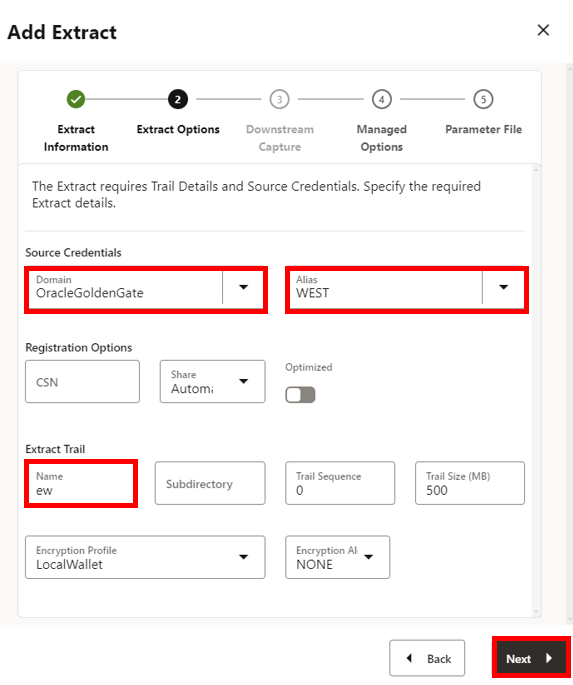
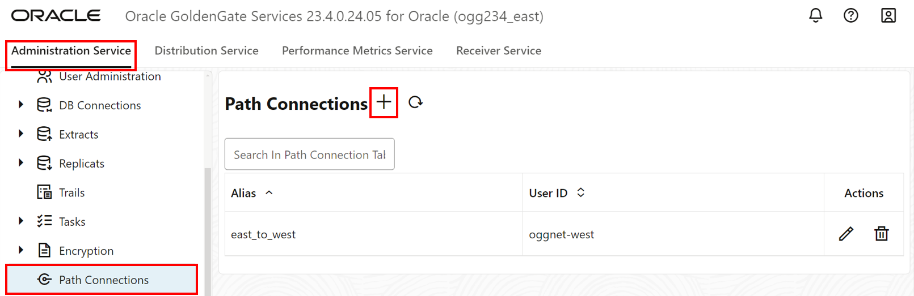

# Replicate data from West to East

## Introduction

In this lab, you create and run an Extract, add a User Administrator, create a Path Connection, create and run a Target-Initiated Path, and create and run a Replicat that replicates data in the opposite direction from West to East.

Estimated time: 20 minutes

   

### About Extracts, Target-Initiated Paths, and Replicats

An Extract is a process that extracts or captures data from a source database. A Target-initiated path enables the Receiver Service to initiate a path to the Distribution Service on the target deployment and pull trail files. A Replicat is a process that delivers data to a target database.

### About User Administrators

Authorization in Oracle GoldenGate relies on user roles. As a User Administrator, you can choose and assign various user roles when creating Oracle GoldenGate users. These roles include a User, an Operator, an Administrator, and a Security.

### About a Path Connection

A Path Connection creates Credentials for the DistPath to connect to a GoldenGate Deployment. You will need to provide the login information for the GoldenGate alias. 

### Objectives

In this lab, you will:
* Add and run an Extract process to capture data
* Create a Path Connections
* Create a new User Administrator
* Add and run a Target-Initiated Path to pull trail files
* Add and run a Replicat process to consume the trail file received from the East database

## Task 1:  Add and run an Extract

1. Make sure you're on the the **West** Microservices WebUI. In the navigation menu, click **Extracts**.

2. Click **Add Extract** (plus icon).

    

3. The Add Extract panel consists of five pages. On the Extract information page, complete the following fields, and then click **Next**:
    * For Extract Type, select **Integrated Extract**.
    * For Process Name, enter **EWEST** and optionally, a description.

    

4. On the Extract Options page, complete the following fields, and then click **Next**: 
    * For Domain, select **OracleGoldenGate** from the dropdown.
    * For Alias, select **WEST** from the dropdown.
    * For Name, enter **ew**.

    

5. On the Managed Options page, for Profile Name, select **west-profile** from the dropdown, and then click **Next**.

    

6. On the Parameter File page, in the text area, add a new line to the existing text and add the following:

    ```
    <copy>TRANLOGOPTIONS EXCLUDETAG 00
    DDL INCLUDE MAPPED
    table HR.*;</copy>
    ```

7. Click **Create**. 

    

8. The EWEST Extract appears. In the EWEST **Action** menu, select **Start**. In the Confirm Action dialog, click **OK**. 

    

## Task 2: Add a Path Connection
A Path Connection creates Credentials for the West Distribution Service to connect to the East Receiver Service. 

1. Switch to the **East** Microservices WebUI. On the top navigation menu, click **Administration Service**.

2. In the navigation menu, click **Path Connections**, and then click **Add Path Connection** (plus icon).

    

3. In the Path Connection panel, complete the following fields, and then click **Submit**:  
    * For Credential Alias, enter **west\_to\_east**.
    * For User ID, enter **oggnet-west**.
    * For Password, paste the Global Password from the Reservation Information. Verify the password. 

    

    The path connection you created appears in the Path Connections list.

    

## Task 3: Add a Target-Initiated Path on East Oracle GoldenGate

1. On the top navigation menu, click **Receiver Service**, and then click **Add Target-Initiated Path** (plus icon). 

    

3. The Add Path panel consists of seven pages. On the Path Information page, for Path Name, enter **TPEAST**, and then click **Next**.

    

4. On the Source Options page, complete the following fields, and then click **Next**:
    * For Source Host, paste the **OGG West Private IP** value from the Reservation Information.
    * For Port Number, enter **9013**.
    * For Trail Name, enter **ew**.
    * For For Alias, enter **west\_to\_east**.

    

5. On the Target Options page, for Trail Name, enter **dw**, and then click **Next**.

    

6. On the Advanced Options page, leave the fields as they are, and click **Next**.

    

7. On the Filtering Options page, leave the fields as they are, and click **Next**.

    

8. On the Managed Options page, leave the fields as they are, and click **Create Path**.

    

9. On the left hand navigation menu, click **Target-Initiated Paths**.

10. In the TPEAST **Action** menu, select **Start**. In the Confirm Action dialog, click **OK**.

    

## Task 4: Add a Replicat on East deployment

1. Open the top navigation menu, click **Administration Service**. Click **Add Replicat** (plus icon).

    

2. The Add Replicat panel consists of four pages. On the Replicat Information page, complete the following fields, and then click **Next**:
    * For Replicat Type, select **Parallel Replicat**.
    * For Parallel Replicat Type, select **Nonintegrated**.
    * For Process Name, enter **REAST**.

    

3. On the Replicat Options page, complete the following fields, and then click **Next**:
    * For Name, enter **dw**.
    * For Domain, select **OracleGoldenGate** from the dropdown.
    * For Alias, select **EAST** from the dropdown.
    * For Checkpoint Table, select **"OGGADMIN"."CHECKPOINTTABLE"** from the dropdown.

    

4. On the Managed Options page, for Profile Name, select **east-profile** from the dropdown.

    

5. On the Parameter File page, page, in the text area, replace **MAP *\.\*, TARGET \*.\*;** with the following script:

    ```
    <copy>DDL INCLUDE MAPPED
    MAP HR.*, TARGET HR.*;</copy>
    ```
6. Click **Create**.

    

7. In the navigation menu, click **Replicats**.

8. In the REAST **Action** menu, select **Start**. In the Confirm Action dialog, click **OK**. 

    

You may now **proceed to the next lab.**

## Learn more

* [Before Adding Extract and Replicat Processes](https://docs.oracle.com/en/middleware/goldengate/core/23/coredoc/configure-ogg-adding-extract-and-replicat.html#GUID-C1044A4D-945E-4080-B79C-74FA9D004143)
* [Registering Extract for Oracle](https://docs.oracle.com/en/middleware/goldengate/core/23/coredoc/extract-oracle-registering-extract.html)
* [Access Extract Details](https://docs.oracle.com/en/middleware/goldengate/core/23/coredoc/extract-access-extract-details.html)
* [About Target-Initiated Distribution Paths](https://docs.oracle.com/en/middleware/goldengate/core/23/coredoc/distribute-target-initiated-distribution-paths.html)
* [About Replicat](https://docs.oracle.com/en/middleware/goldengate/core/23/coredoc/replicat-replicat.html)

## Acknowledgements
* **Author** - Katherine Wardhana, User Assistance Developer
* **Contributors** -  Alex Lima, Database Product Management
* **Last Updated By/Date** - Katherine Wardhana, August 2024
