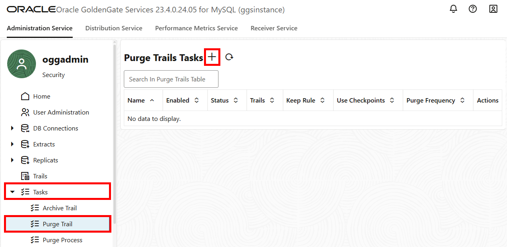

# Monitor Extracts and Replicats

## Introduction

This lab walks you through the steps to verify and monitor the Extract and Replicat processes created and run in this workshop, and how to maintain the trail files generated by these processes.

Estimated time: 10 minutes

### About Performance Monitoring

Monitoring the performance of your GoldenGate instance ensures that your data replication processes are running smoothly and efficiently. You can monitor performance in both the Oracle Cloud Infrastructure (OCI) GoldenGate Deployment Console as well as in the Oracle Cloud Console on the Deployment Details page.

### Objectives

In this lab, you will:
* Perform inserts to the source database
* View charts and statistics using the Performance Metrics Server in the GoldenGate deployment console
* Create and run a Purge task

### Prerequisites

In order to complete this lab, you should have completed the preceding labs.

## Task 1: Perform inserts to the source database

1.  Return to the Oracle Cloud console and use the navigation menu (hamburger icon) to navigate back to **Databases**, **DB Systems**, and then **SourceMySQL**.

2.  On the SourceMySQL details page, copy the **Private IP Address**.

3.  Open the Oracle Cloud console navigation menu and navigate to **Identity & Security**, and then click **Bastion**.

4.  On the **Bastions** page, select your Bastion to view its details.

5.  Under **Sessions**, click **Create session**.

    >**NOTE:** If you already have a session running for your SourceMySQL DB system, you can skip to step 14.

6.  In the Create session panel, select **SSH port forwarding session** from the session type dropdown.

7.  For **IP address**, paste the Private IP Address you copied from the SourceMySQL details page.

8.  For **Port**, change the value to `3306`.

8. For SSH key, you can either upload an existing SSH public key, or generate a new SSH key pair.

10. Click **Create session**.

11. After the session is Active, select Copy SSH command from the **Action** menu.

12. Click on the Developer Tools menu on the navigation bar, and select **Cloud Shell**.

    

13. After the cloud shell session is active, paste the SSH command from your bastion session. Ensure that you replace the `<privateKey` and `<localPort>` values.

    >**NOTE:** If you generated a new SSH key pair in step 10, you must first upload your private key to Cloud Shell using the Cloud Shell Settings menu, and change the permission on the key (`chmod 600 <privateKey>`).

14. Enter the following command to start MySQL Shell.

    >**NOTE:** If using a Bastion session, replace localhost with the private IP of the MySQL database.

    ```
    <copy>mysqlsh admin@localhost:3306 --sql</copy>
    ```

15.  Enter the following inserts:

    ```
    <copy>use SRC_OCIGGLL;
Insert into SRC_OCIGGLL.SRC_CITY (CITY_ID,CITY,REGION_ID,POPULATION) values (1000,'Houston',20,743113);
Insert into SRC_OCIGGLL.SRC_CITY (CITY_ID,CITY,REGION_ID,POPULATION) values (1001,'Dallas',20,822416);
Insert into SRC_OCIGGLL.SRC_CITY (CITY_ID,CITY,REGION_ID,POPULATION) values (1002,'San Francisco',21,157574);
Insert into SRC_OCIGGLL.SRC_CITY (CITY_ID,CITY,REGION_ID,POPULATION) values (1003,'Los Angeles',21,743878);
Insert into SRC_OCIGGLL.SRC_CITY (CITY_ID,CITY,REGION_ID,POPULATION) values (1004,'San Diego',21,840689);
Insert into SRC_OCIGGLL.SRC_CITY (CITY_ID,CITY,REGION_ID,POPULATION) values (1005,'Chicago',23,616472);
Insert into SRC_OCIGGLL.SRC_CITY (CITY_ID,CITY,REGION_ID,POPULATION) values (1006,'Memphis',23,580075);
Insert into SRC_OCIGGLL.SRC_CITY (CITY_ID,CITY,REGION_ID,POPULATION) values (1007,'New York City',22,124434);
Insert into SRC_OCIGGLL.SRC_CITY (CITY_ID,CITY,REGION_ID,POPULATION) values (1008,'Boston',22,275581);
Insert into SRC_OCIGGLL.SRC_CITY (CITY_ID,CITY,REGION_ID,POPULATION) values (1009,'Washington D.C.',22,688002);
commit;</copy>
    ```

16.  In the MySQLDeployment console, click the **Extract name (CDCEXT)**, and then click **Statistics**. Verify that **SRC\_OCIGGLL.SRC\_CITY** is listed with 10 inserts.

    

17.  Go back to the Overview screen, click the **Replicat name (RCDC)**, and then click **Statistics**. Verify that **SRC\_OCIGGLL.SRC\_CITY** is listed with 10 inserts.

    

18. On OCI PostgreSQL, log in into the **TargetPG** Database using the admin client.

19. Enter the following query to verify that the 10 new entries inserted in Step 4 appear on the target table:

    ```
    <copy>set search_path to srcmirror_ociggll;
    select * from src_city where city_id > 999;
    </copy>
    ```
    

## Task 2: Using the Performance Metrics Server

1.  In the MySQLDeployment console, click **Performance Metrics Server**, and then click **CDCEXT**.

    

    > **Note:** You can also view performance details for the Administration, Distribution, and Receiver Servers, as well as any processes created.

2.  Click **Database Statistics**.

    

    Here, you can view the real time database statistics, such as Inserts, Updates, Deletes, and so on.

4.  Repeat steps 1-3 in ADWDeployment to view a snapshot of the Replicat's (named **Rep** in our lab) Database Statistics.

## Task 3: Create a Purge task

1.  In the MySQLDeployment console, on the left navigation menu click **Tasks**.

2.  On the **Configuration** screen, click **Tasks**, and then click **Add Purge Trail Task** (plus icon). The **Create a new Purge Trials task** form appears.

    

3.  On the Create a new Purge Trails task dialog page, complete the following fields, and then click **Submit**:
    * For **Name**, enter a name.
    * For **Trail**, enter the name of a Trail file, and then press **ENTER**. For example, in this workshop, our Extract Trail file is called C1.
    * For **Keep Rule**, select **Number of Files** from the dropdown, and then enter `1`. This indicates that one Trail file will be kept, while all others are purged.
    * For **Purge Frequency**, select **Hours** from the dropdown, and then enter `1`. This indicates that this Purge task will run every hour.

    

You may now **proceed to the next lab.**

## Learn more

* [Monitor performance using the Oracle Cloud console](https://docs.oracle.com/en/cloud/paas/goldengate-service/vddvk/index.html#articletitle)

## Acknowledgements
- **Author** - Katherine Wardhana, User Assistance Developer
- **Contributors** -  Shrinidhi Kulkarni, GoldenGate Product Manager
- **Last Updated by** - Katherine Wardhana, June 2025
