# Replicate data from target to source

## Introduction

Now that replication is established and verified from the source database to the target database, you can set up bidirectional replication from the target to the source. This lab walks you through the steps create and run an Extract on the target and create and run a Replicat on the source in the Oracle Cloud Infrastructure (OCI) GoldenGate Deployment Console.

Estimated time: 30 minutes

### About Extracts and Replicats

An Extract is a process that extracts, or captures, data from a source database. A Replicat is a process that delivers data to a target database.

### Objectives

In this lab, you will:
* Add and run an Extract
* Add and run a Replicat
* Verify the replication from OCI PostgreSQL to Heatwave MySQL

### Prerequisites

This lab assumes that you completed all preceding labs, and your deployment is in the Active state.

## Task 1: Add and run an Extract (PostgreSQL deployment)

1. In the navigation menu, click **DB Connections**.

2. On the **DB Connections** page, click **Connect to database OCIPGSQL**. If successful, you are directed to the Checkpoint page.

    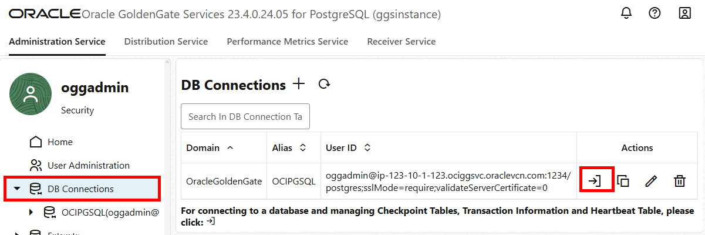

3.  On the Checkpoint page, click **Add Checkpoint** (plus icon).

    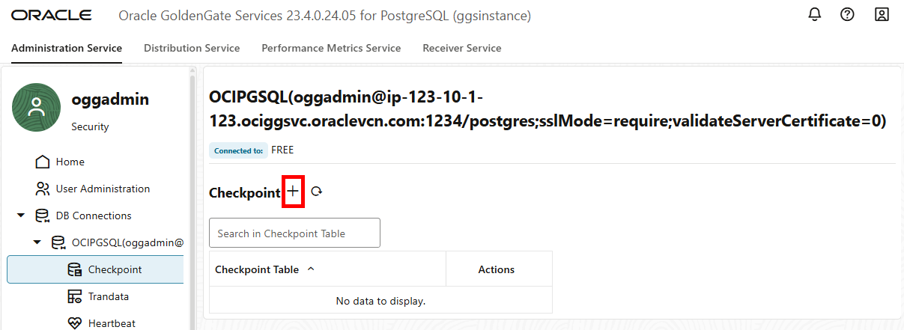

4.  For Checkpoint Table, enter `ggs.chkpt`, and then click **Submit**.

    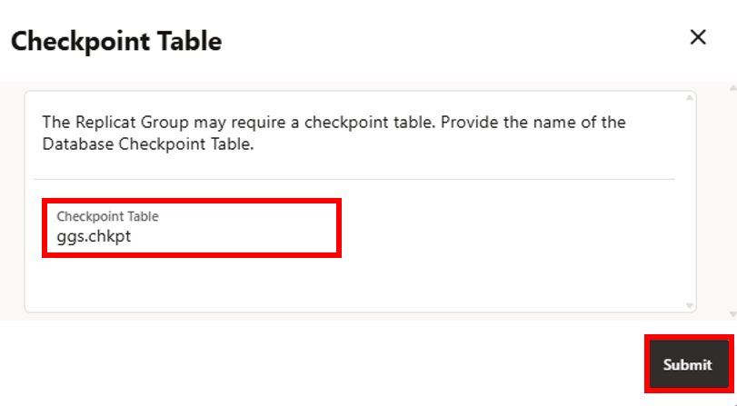

5. The new Checkpoint table appears in the list. In the navigation menu, click **Trandata**.

6. Click **Add TRANDATA** (plus icon).

    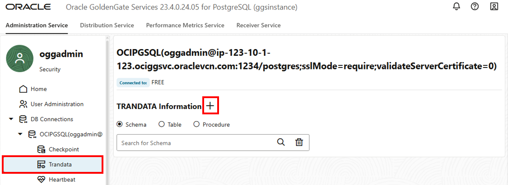

7.  In the Trandata panel, enter **SRCMIRROR_OCIGGLL.\***, enable **All Columns**, and then click **Submit**.

    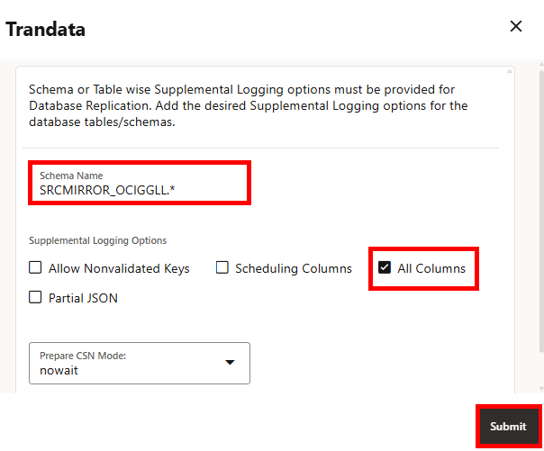

8.  To verify, enter **SRCMIRROR_OCIGGLL.\*** into the Search for Schema field and click **Search**. `SRCMIRROR_OCIGGLL.*` contains 8 tables that are prepared for instantiation.

    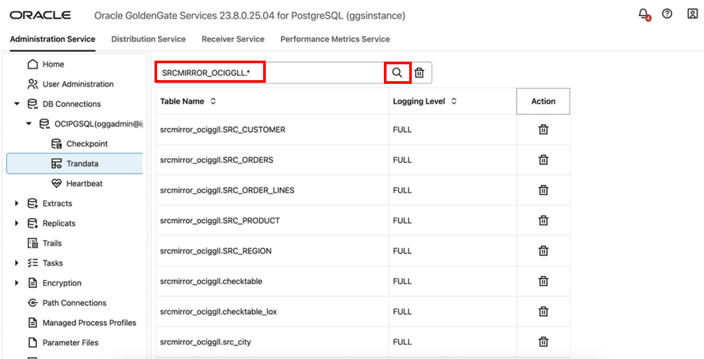

9. In the navigation menu, click **Extracts**.

10.	On the Extracts page, click **Add Extract** (plus icon).

    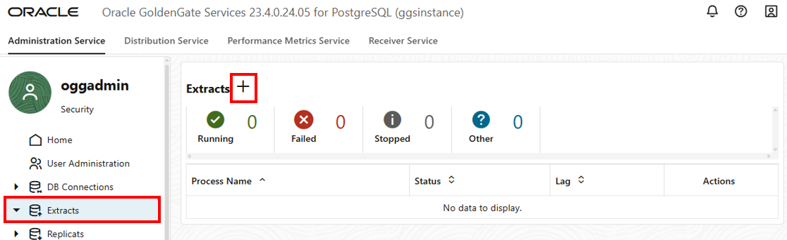

11. The Add Extract panel consists of four pages. On the Extract Information page, complete the following fields, and then click **Next**:

    * For Extract Type, select **Change Data Capture Extract**.
    * For Process Name, enter **EXTPG**.

    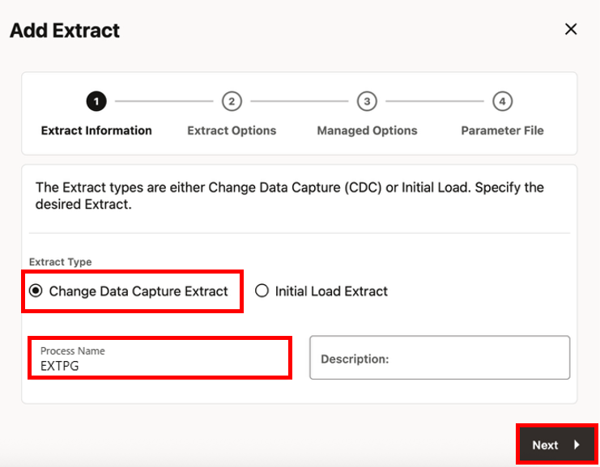

12. On the Extract Options page, complete the following fields and then click **Register**. Then, click **Next**:

    * For **Extract Trail** Name, enter **PG**.
    * From the **Domain** dropdown, select **OracleGoldenGate**.
    * From the **Alias** dropdown, select **OCIPGSQL**.

    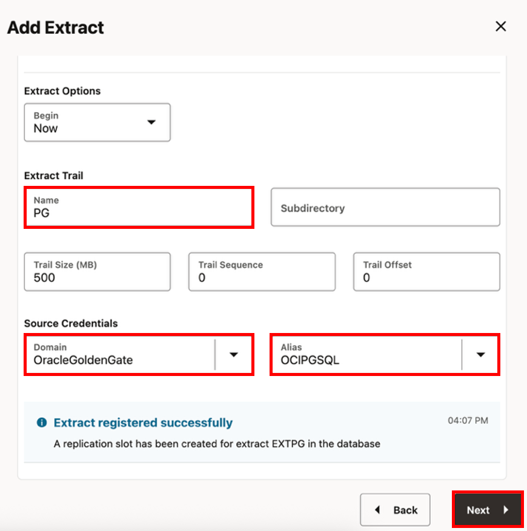

13. On the Managed Options page, enable **Critical to deployment health**, and then click **Next**.

    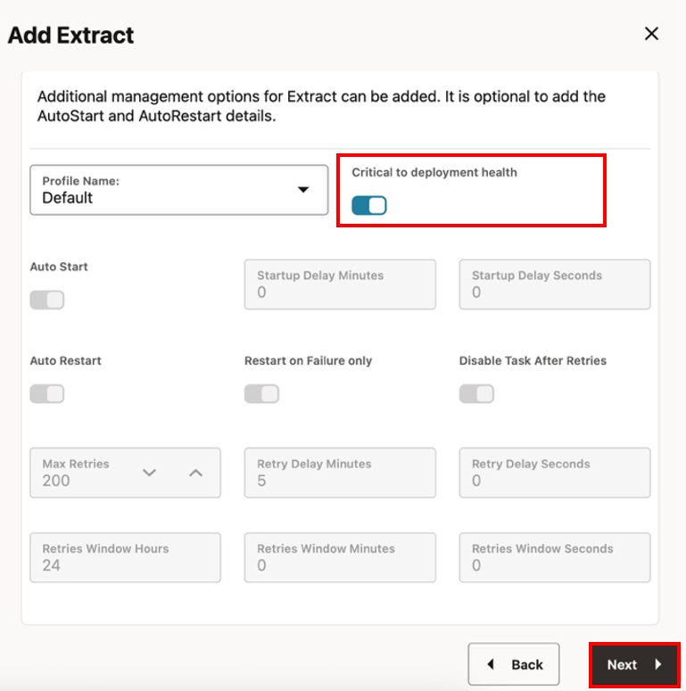

14. On the Parameter File page, in the text area, add a new line to the existing text, add the following, and then click **Create and Run**:

    ```
    <copy>-- Exclude changes made by GGADMIN 
    tranlogoptions excludeuser oggadmin
    TRANLOGOPTIONS EXCLUDEFILTERTABLE ggs.chkpt
    -- Table list for capture 
    TABLE SRCMIRROR_OCIGGLL.*; 
    </copy>
    ```

    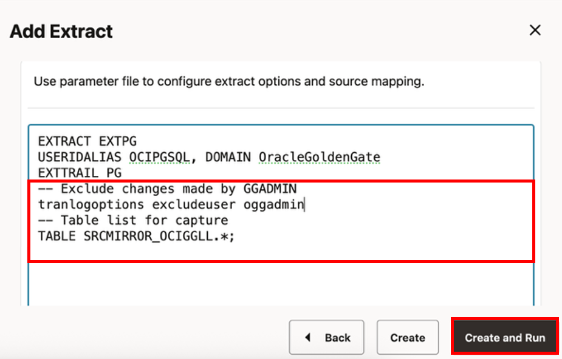

    The EXTPG extract process appears after a few moments.

    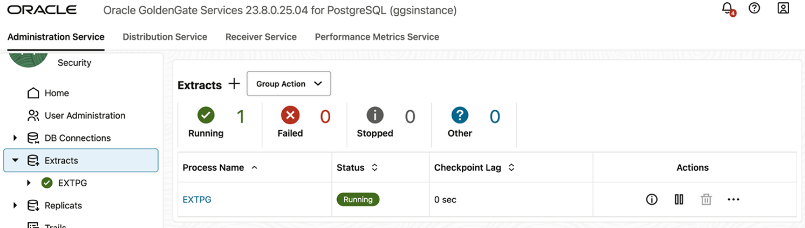

## Task 2: Create a GoldenGate connection

The Oracle GoldenGate connection type lets you to connect to other Oracle GoldenGate deployments. Create a connection to the Oracle GoldenGate deployment that initiates enable connectivity between deployments.

1.  On the Connections page, click **Create Connections**.

2.  In the Create Connection panel, for Name, enter `GGSPGtoMySQL`.

3. From the Compartment dropdown, select **&lt;USER&gt;-COMPARTMENT**.

4. From the Type dropdown, select **GoldenGate**.

5. Under **Database details**, choose **Select GoldenGate deployment**.

6. Select a **Compartment** from the dropdown. Select the MySQL Deployment (`MySQLDeployment`) from the Deployment dropdown.

7.  For Database username, enter `oggadmin`.

8. Select a **Compartment** from the dropdown. For Database user password secret select **LLSecret** from the dropdown.

9. Click **Create**.

    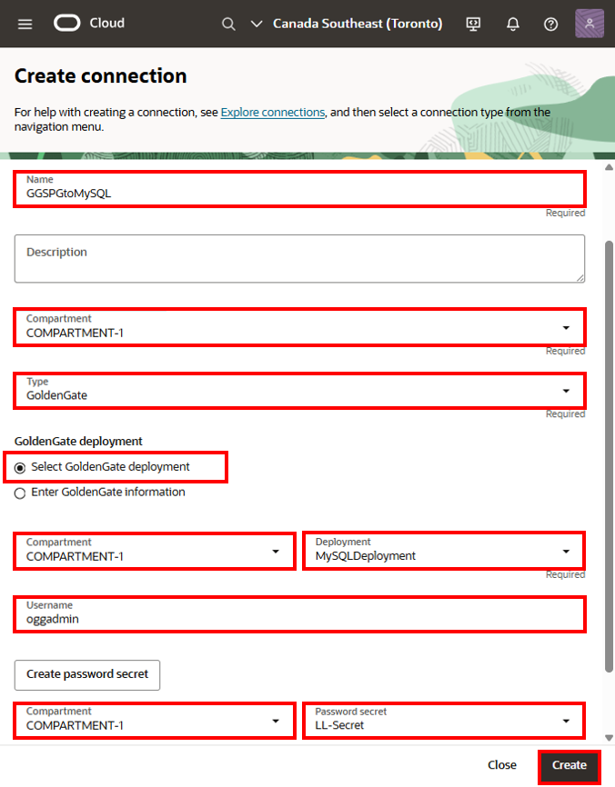

10. After the connection is active, on its details page, click **Assigned deployments**.

11.	Click **Assign deployment**.

12.	In the Assign deployment dialog, select the source OCIPGDeployment Deployment, and then click **Assign deployment**.

    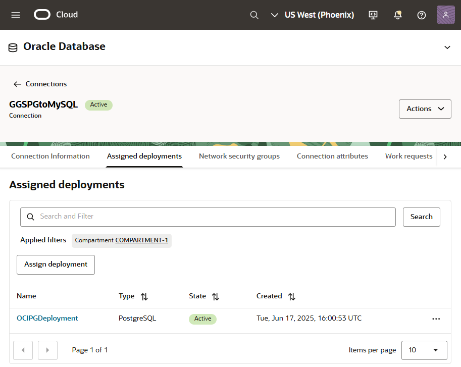

Return to the Connections page.

## Task 3: Create an OCI GoldenGate user for the Distribution Paths

1. In the Oracle Cloud console, on the Deployments page, select the target MySQL deployment to view its details.

2. On the deployment details page, click **Launch console**.

    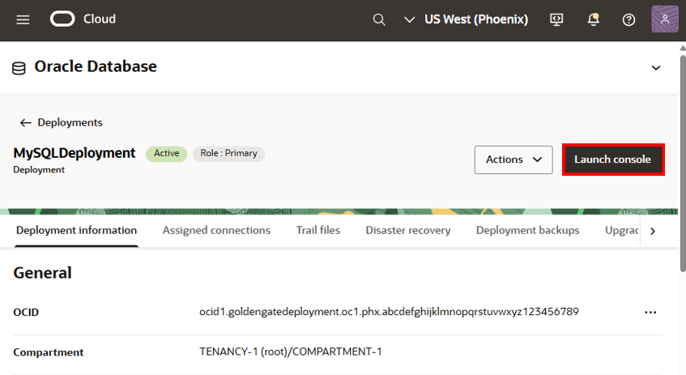

3. On the OCI GoldenGate deployment console sign in page, enter `oggadmin` for User Name, enter the password, and then click **Sign In**.

    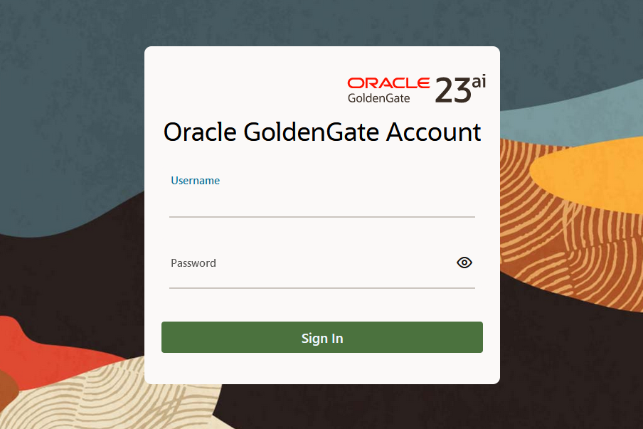

4. Open the navigation menu, and then click **User Administration**.

5. Click **Add New User** (plus icon).

    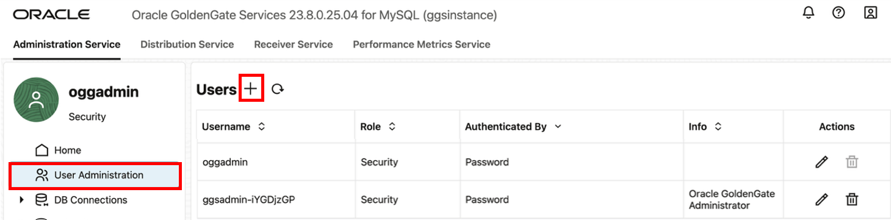

6. Complete the fields as follows, and then click **Submit**:

    * For **Authenticated By**, select **Password**.
    * For **Role**, select **Operator**.
    * For **Username**, enter `ggsnet`.
    * Enter a password for this user, and then enter it again for verification.

    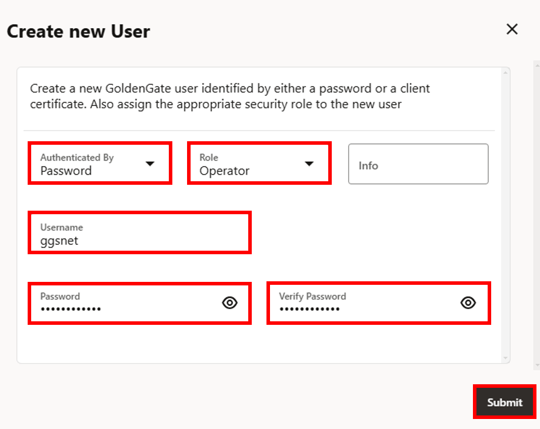

    The `ggsnet` user appears in the Users list.

7. In the source PostgreSQL GoldenGate deployment console, open the navigation menu and then click **Path Connections**.

8. On the Path Connections page, click **Add Path Connection** (plus icon)

    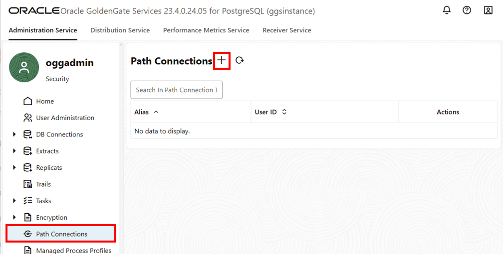

9. Complete the fields as follows, and then click **Submit**:

    * For **Credential Alias**, enter `dpuser`.
    * For **User ID**, enter `ggsnet`.
    * For **Password**, enter the password from Step 6.

    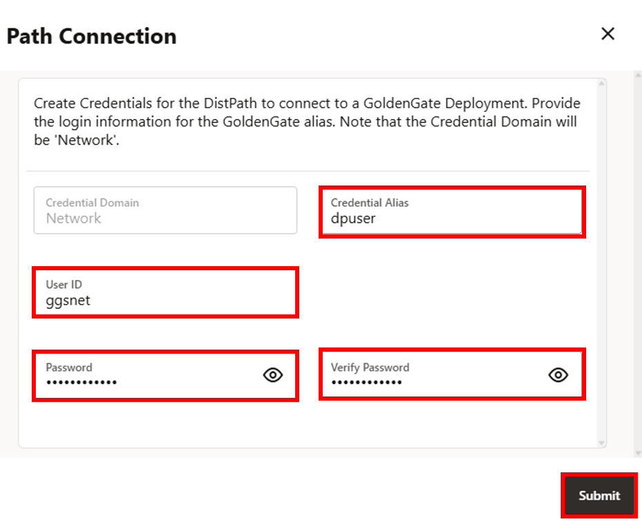

    The credential appears in the Credentials list.

## Task 4: Create the Distribution Path for the Initial Load Extract

1.  In the PostgreSQL OCI GoldenGate deployment console, click **Distribution Service**.

2.  On the Distribution Service Overview page, click **Add Distribution Path** (plus icon).

    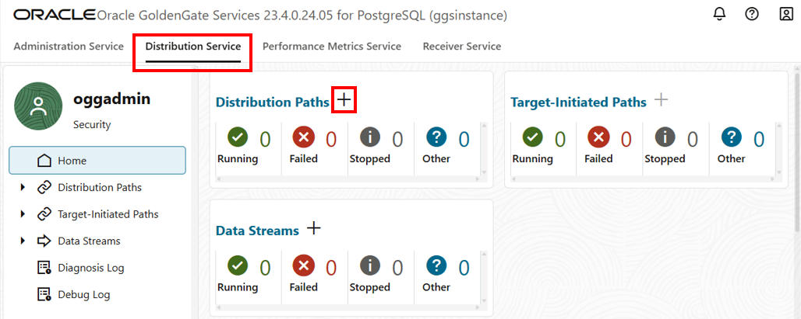

3. The Add Path panel consists of six pages. On the Path Information page, for **Name**, enter **PGCDCDP**, and then click **Next**.

    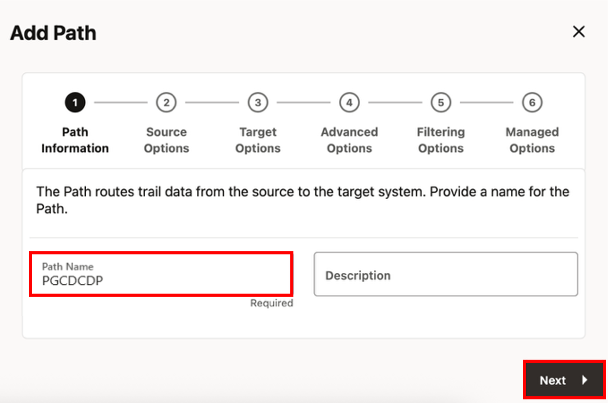

4. On the Source Options page, complete the following fields, and then click **Next**:

    * For **Source Extract**, select **PGEXT** from the dropdown.
    * For **Trail Name**, `PG` should automatically populate the field.

    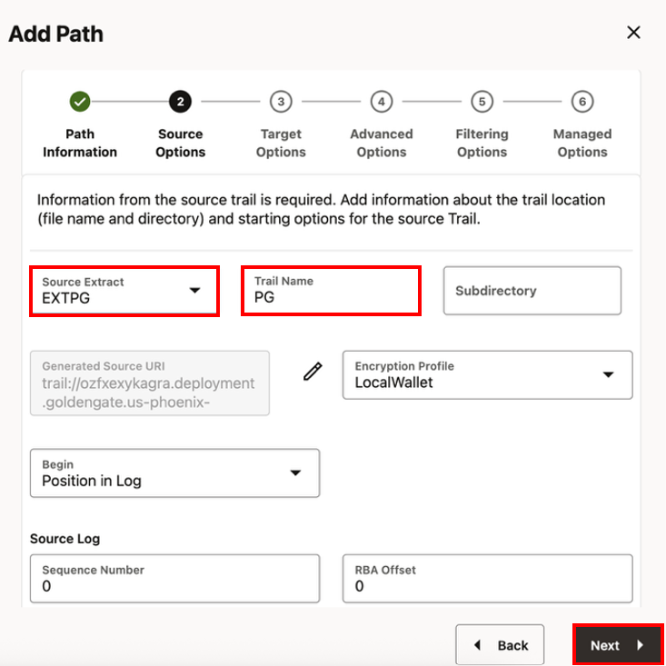

5. On the Target Options page, complete the following fields, and then click **Next**:

    * Select **wss** as **Target Protocol**.
    * Enable **Reverse proxy enabled**.
    * For **Target Host** , enter the target MySQL OCI GoldenGate deployment console URL, without the https:// or any trailing slashes. You can copy the console URL from the MySQL Deployment details page.
    * For **Deployment Name**, enter **gginstance**.
    * For **Port Number**, enter **443**.
    * For **Trail Name**, enter  **MY**. 
    * For **Alias**, enter **dpuser**.

6. On the Advanced Options page, leave the fields with default values, and click **Next**.

    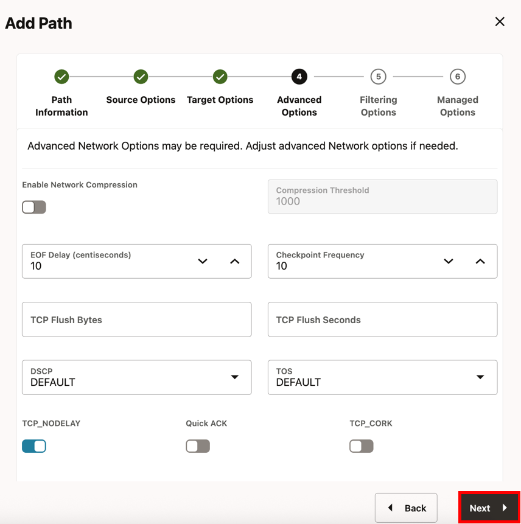

7. On the Filtering Options page, leave the fields with default values, and click **Next**.

    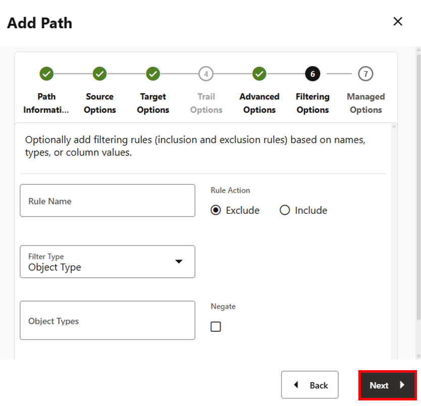

8. On the Managed Options page, leave the fields with default values, and click **Create Path and Run**.

    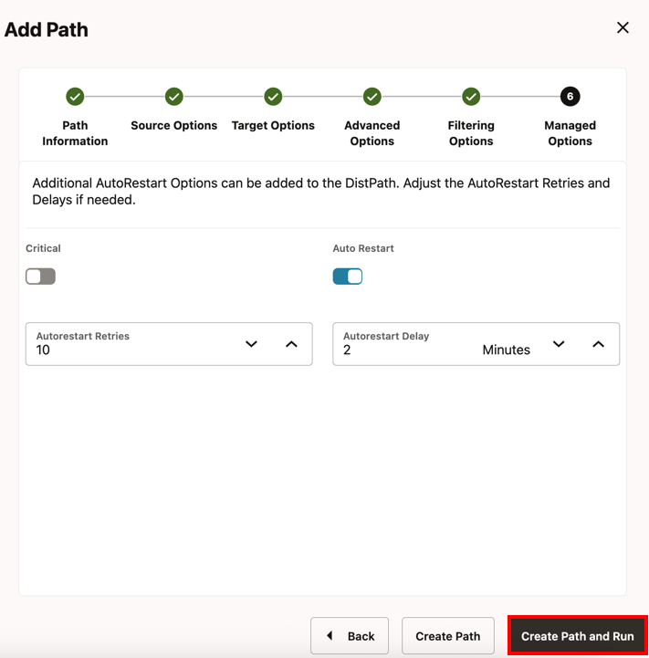

    You return to the Distribution Service Overview page where you can review the path created. 

9. In the target MySQL OCI GoldenGate deployment console, click **Receiver Service** to review the Receiver Path created as a result of creating the **PGCDCDP** Distribution Path.

## Task 5: Add and run the Replicat (MySQL deployment)

1.	In the navigation menu, click **DB Connections**.

2.	On the DB Connections page, click **Connect to database SourceMySQL**. If successful, you are directed to the Checkpoint page.

    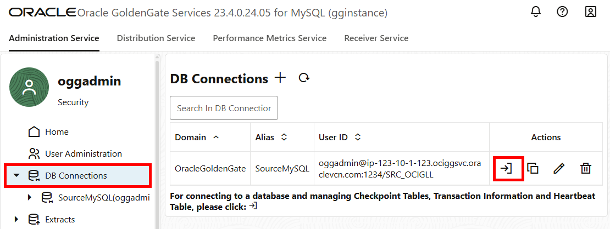

3. On the Checkpoint page, click **Add Checkpoint** (plus icon).

    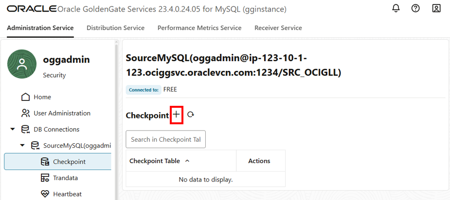

4. For **Checkpoint Table**, enter `SRC_OCIGGLL.CHKPT`, and then click **Submit**.

    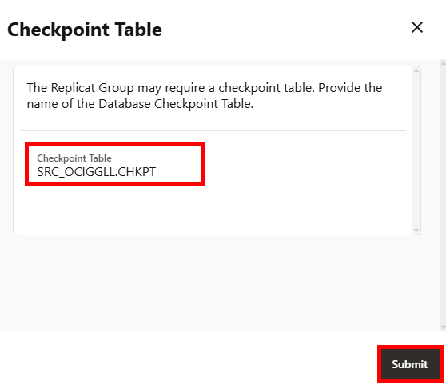

5. In the navigation menu, click **Replicats**.

6. On the Replicats page, click **Add Replicat** (plus icon).

    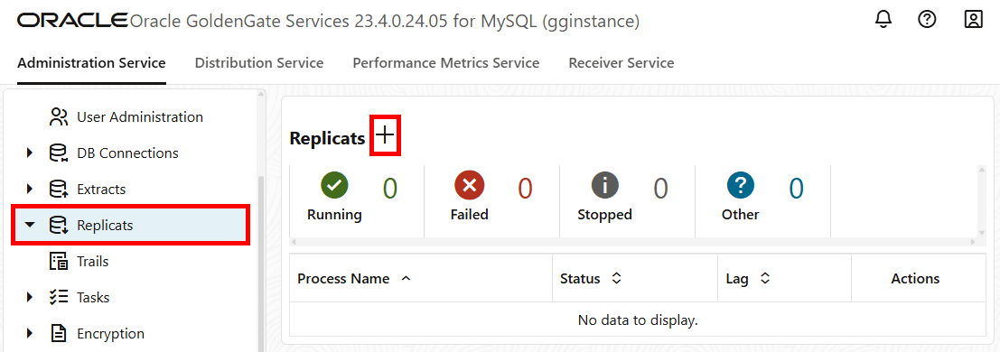

7. The Add Replicat panel consists of four pages. On the Replicat Information page, select **Classic Replicat**, enter `REPMYSQL` for Process Name, and then click **Next**.

    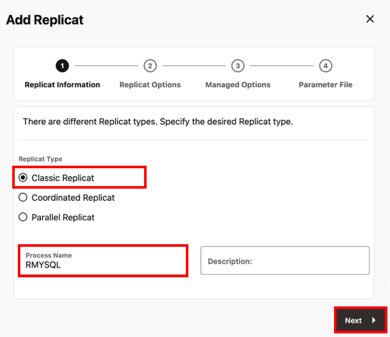

8. On the Replicat Options page, complete the following fields, and then click **Next**:

    * For Replicat Trail **Name**, enter `MY`.
    * From the Target Credential **Domain** dropdown, select **OracleGoldenGate**.
    * From the Target Credential **Alias** dropdown, select **SourceMySQL**.
    * For Checkpoint Table, enter `SRC_OCIGGL.CHKPT`.

    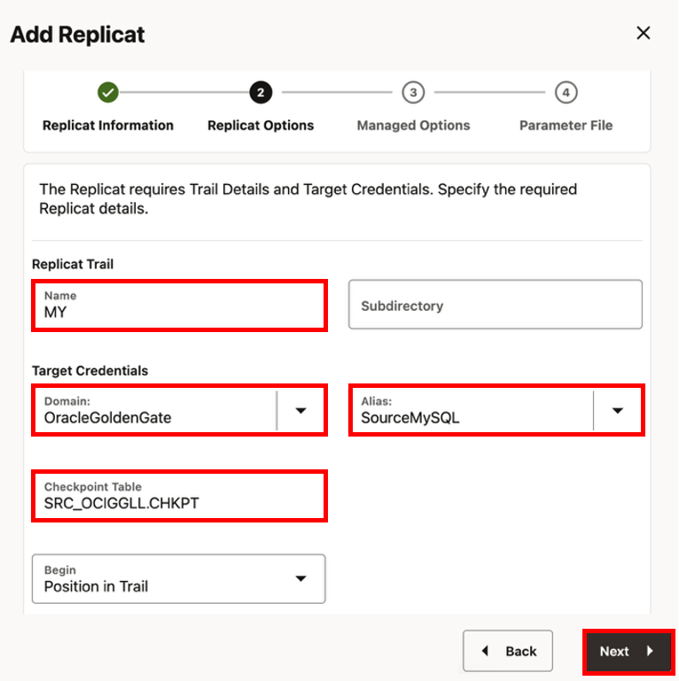

9. On the Managed Options page, enable **Critical to deployment health**, and then click **Next**.

    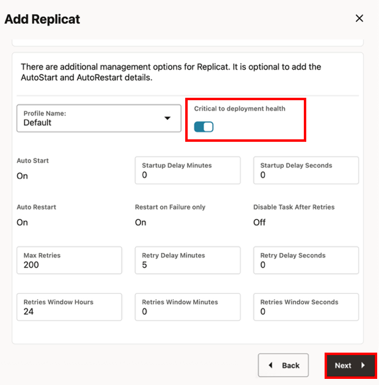

10. On the Parameter File page, in the text area, replace **MAP \*.\*, TARGET \*.\*;** with the following:

    ```
    <copy>MAP SRCMIRROR_OCIGGLL.*, TARGET SRC_OCIGGLL.*;
    </copy>
    ```

11. Click **Create and Run**. The new Replicat appears after a few moments.

    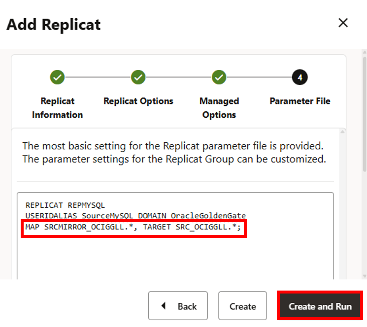

## Task 6: Perform Inserts into the PostgreSQL database

1. In the Oracle Cloud console navigation menu, click **Databases**, and then click **DB Systems** under PostgreSQL.

    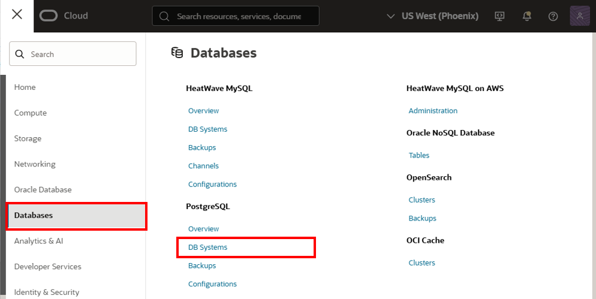

2. On the Database systems page, click **TargetPG**.

3. On the PostgreSQL database (TargetPG) Details page, click **Launch admin client**. Select the Bastion created earlier, and then click **Launch**.

    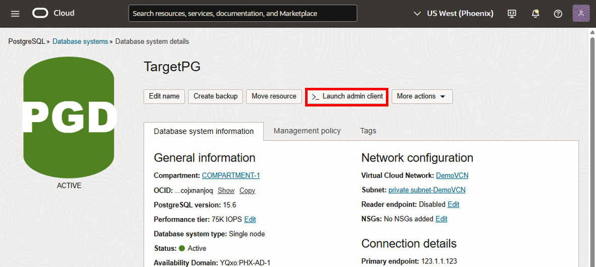

4. On the PostgreSQL admin client, for enter **oggadmin** for **user name**, enter **postgres** for **database name**, and enter the user oggadmin **password**.

    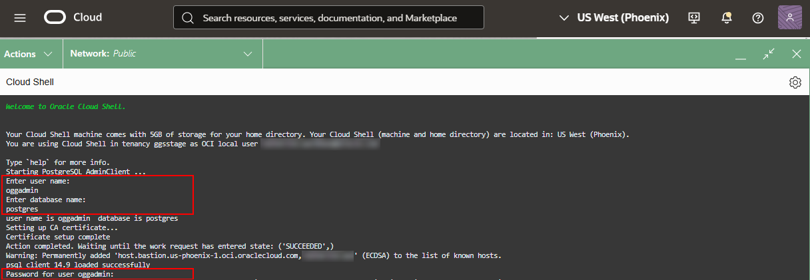

5. Run the following command using the PostgreSQL admin client:

    ```
    <copy>Insert into SRCMIRROR_OCIGGLL.SRC_CITY (CITY_ID,CITY,REGION_ID,POPULATION) values (2000,'Houston',20,743113);
    Insert into SRCMIRROR_OCIGGLL.SRC_CITY (CITY_ID,CITY,REGION_ID,POPULATION) values (2001,'Dallas',20,822416);
    Insert into SRCMIRROR_OCIGGLL.SRC_CITY (CITY_ID,CITY,REGION_ID,POPULATION) values (2002,'San Francisco',21,157574);
    Insert into SRCMIRROR_OCIGGLL.SRC_CITY (CITY_ID,CITY,REGION_ID,POPULATION) values (2003,'Los Angeles',21,743878);
    Insert into SRCMIRROR_OCIGGLL.SRC_CITY (CITY_ID,CITY,REGION_ID,POPULATION) values (2004,'San Diego',21,840689);
    Insert into SRCMIRROR_OCIGGLL.SRC_CITY (CITY_ID,CITY,REGION_ID,POPULATION) values (2005,'Chicago',23,616472);
    Insert into SRCMIRROR_OCIGGLL.SRC_CITY (CITY_ID,CITY,REGION_ID,POPULATION) values (2006,'Memphis',23,580075);
    Insert into SRCMIRROR_OCIGGLL.SRC_CITY (CITY_ID,CITY,REGION_ID,POPULATION) values (2007,'New York City',22,124434);
    Insert into SRCMIRROR_OCIGGLL.SRC_CITY (CITY_ID,CITY,REGION_ID,POPULATION) values (2008,'Boston',22,275581);
    Insert into SRCMIRROR_OCIGGLL.SRC_CITY (CITY_ID,CITY,REGION_ID,POPULATION) values (2009,'Washington D.C.',22,688002);

    </copy>
    ```

5. In the PostgreSQL GoldenGate deployment console, click **Extracts**, then **Extract (EXTPG)**, and then click **Statistics**. Verify that **SRCMIRROR\_OCIGGLL.SRC\_CITY** is listed with 10 inserts.

    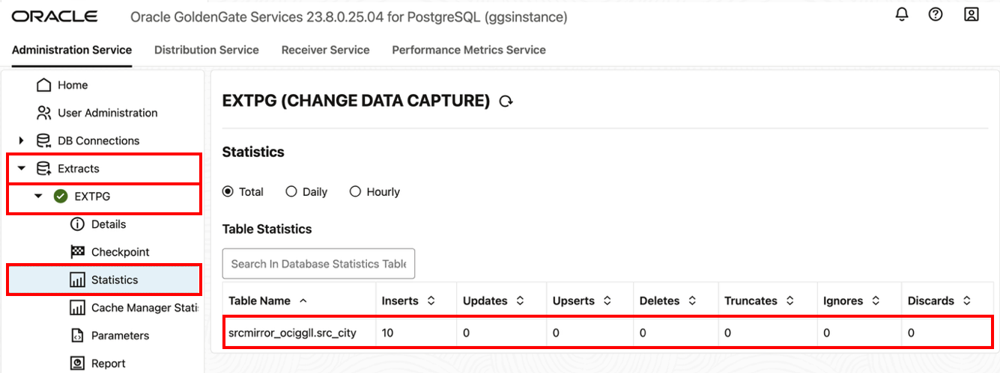

6. Go to the MySQL GoldenGate deployment console, click the **Replicat (REPMYSQL)**, and then click **Statistics**. Verify that **SRCMIRROR\_OCIGGLL.SRC\_CITY** is listed with 10 inserts.

    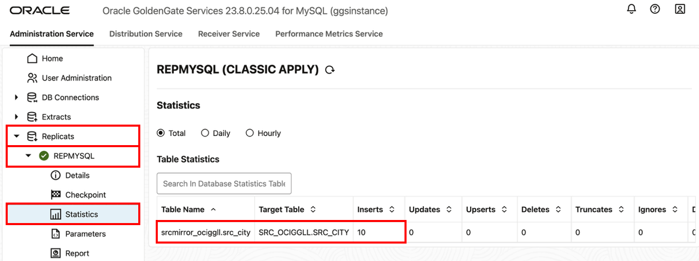

7. Query the target MySQL database to query the replicated rows.

You have completed this lab.

## Learn more

* [Create a data replication deployment](https://docs.oracle.com/en/cloud/paas/goldengate-service/llyhq/#GUID-899C1348-58CA-43EE-B775-EAD3B365A7A9)
* [Connect to Oracle Autonomous Database](https://docs.oracle.com/en/cloud/paas/goldengate-service/tqrlh/)
* [Assign a connection to a deployment](https://docs.oracle.com/en/cloud/paas/goldengate-service/llyhq/#GUID-69F7C944-DD31-40FA-8589-4CB5113E74D0)

## Acknowledgements
- **Author** - Katherine Wardhana, User Assistance Developer
- **Contributors** -  Shrinidhi Kulkarni, GoldenGate Product Manager
- **Last Updated by** - Katherine Wardhana, June 2025