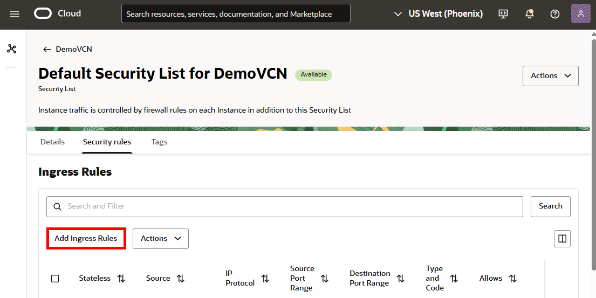

# Set up the environment

## Introduction

This lab walks you through the steps to create the resources required to complete this workshop. You'll learn to create a VCN and subnet, a bastion, provision HeatWave MySQL on OCI and OCI PostgreSQL instances, and load data into the databases.

Estimated time: 30 minutes

### Objectives

-  Provision a VCN and subnet
-  Create a bastion
-  Provision, connect, and load data into a HeatWave MySQL system
-  Provision, connect, load target schemas into an OCI PostgreSQL database instance.
-  Create a deployment

### Prerequisites

* Have completed the Get Started lab and sign up for Free Tier/Log in to Oracle Cloud.
* For IAM-enabled tenancies, ensure that you [configure Identity domains for OCI GoldenGate](https://docs.oracle.com/en/cloud/paas/goldengate-service/mkmbs/#GUID-DD9C1BF8-69FE-4C9A-A2D1-74C73550ED65).
* For non-IAM enabled tenancies, ensure that you ensure that you first [set up your Vault](https://docs.oracle.com/en-us/iaas/Content/KeyManagement/Tasks/managingvaults_topic-To_create_a_new_vault.htm#createnewvault). [Learn more about Vault service](https://docs.oracle.com/en-us/iaas/Content/KeyManagement/Concepts/keyoverview.htm).

> **Note:** You may see differences in account details (eg: Compartment Name is different in different places) as you work through the labs. This is because the workshop was developed using different accounts over time.

In this section, you will provision a VCN and subnet, MySQL and OCI PostgreSQL instances, and load data to use with OCI GoldenGate.

## Task 1: Create a VCN and subnet

1.  Open the **Navigation Menu**, navigate to **Networking**, and select **Virtual Cloud Networks**.

	

2.  On the **Virtual Cloud Networks in &lt;compartment-name&gt;** page, click **Actions**, and then select **Start VCN Wizard** from the dropdown.

	

3.  In the Start VCN Wizard panel, select **Create VCN with Internet Connectivity**, and then click **Start VCN Wizard.**

    

4.  In the Create VCN with internet connectivity panel, on the Configuration page, enter a name for the VCN, select a compartment, and then click **Next**.

    

5.  Verify the configuration, and then click **Create**.

    

6. Select the VCN you just created. On the VCN Details page, select **Subnet**. You can see both a Public and Private subnet were created.

7. Select the **Public** subnet.

    

8. On the Public subnet page, click **Security**, and then select the default security list.

    

9.	On the Default Security List page, click **Add Ingress Rules**.

    

10.	In the **Add Ingress Rules** panel, select **CIDR** for **Source Type**.

11.	Enter `0.0.0.0/0` for **Source CIDR**.

12.	For IP Protocol, select **TCP**.

13.	For Destination Port Range, enter `3306`.

14.	For Description, enter `For MySQL access`, and then click **Add Ingress Rules**.

    

## Task 2: Create a HeatWave MySQL System

1. In the Oracle Cloud console navigation menu, click **Databases**, and then click **DB Systems** under HeatWave MySQL.

	

2.  On the MySQL DB Systems page, click **Create DB System**.

	

3. On the Create DB system page, select **Development or testing**

4.  For **Create in Compartment**, select a compartment in which to create the MySQL DB system.

5.  For **Name**, leave the default, or replace the default with a name of your choice. For example, `SourceMySQL`.

6.  (Optional) For Description, enter a description for the MySQL DB system.

	

7.  Under **Create administrator credentials**, for Username, enter `ggadmin`, and then enter a password for the admin user. Take note of this password.

8.  Select **Standalone**.

9.  Under **Configure networking**, select the **VCN** and **Subnet** created in Task 1.

10.  Click **Create**.

	

	You returned to the DB Systems page where the MySQL DB System you created appears. It will take a few minutes for the system to become Active.

11. On the DB System details page, under Resources, select **Endpoints**. 

12. In the Endpoints section, select the listed endpoint.

	

13. On the DB system details endpoint page, under **Primary DB system endpoint information**, copy the **Private IP Address** onto an external document.

	

## Task 3A: Create a bastion and session

> **Note:** Create a bastion and session only if your OCI GoldenGate deployment and MySQL Heatwave system are **not** located in the same region. If they're in the same Home region, skip to Task 3B.

1.  In the Oracle Cloud console navigation menu, click **Identity & Security**, and then click **Bastion**.

	

2.  On the Bastions page, click **Create bastion**.

	

3.  In the Create bastion panel, for **Name**, leave the default or replace the default with the name of your choice.

4.  Under **Configure networking**, select the VCN and subnet in which your MySQL DB system resides.

5.  For **CIDR block allowlist**, enter `0.0.0.0/0` and then select **Add to list** in the dropdown menu to add it.

6. Select **Enable FQDN and SOCKS5**. It is required to connect to the OCI PostgreSQL database instance.

7.  Click **Create bastion**. The bastion appears in the Bastion list and takes a few minutes to become Active.

	

8.  After the bastion is Active, select it to view its details.

9.  On the **BastionMySQL** page, click **Sessions** from the navigation bar. 

10. On the Sessions page, click **Create session**.

	

11.  In the Create session panel, for **Session type**, select **SSH port forwarding session** from the dropdown.

12. For **Session name**, enter a name.

13. For **Connect to target host by using**, select **IP address**.

14. For IP address, paste the private IP address copied from the SourceMySQL database details page in Task 2 Step 11.

15. For port, enter `3306`.

	

16. Under Add SSH Key, you can upload an existing key or generate a new SSH key pair.

	>**Note:** If you select **Generate SSH key pair**, ensure that you download and save the private key.

17. Click **Create session**. The session takes a few minutes to become Active.

18. After the session is Active, select **Copy SSH command** from the session's Action (three dots) menu.

	

## Task 3B: Using CloudShell to connect to the private network

If you're working within the same Home region for OCI GoldenGate and MySQL Heatwave, then you can use CloudShell to connect to the private network.

1.  After your OCI MySQL DB system becomes active, click **Developer tools** in the Oracle Cloud console global header, and then select **Cloud Shell**.

	

2.  After Cloud Shell opens and initializes, click **Network: Public**, and then select **Ephemeral Private Network Setup**.

	

3.  Select the VCN and Subnet your OCI MySQL DB system uses, and then click **Use as active network**.

4.  After Cloud Shell is connected to the private network, enter the following command to connect to the MySQL database:

	> **Note:** Ensure that you replace `<mysql-db-privateIP>` with the private IP of your MySQL database.

		<copy>mysqlsh admin@<mysql-db-privateIP>:3306 --sql</copy>

## Task 4: Load data into the MySQL DB System

1. Download and run the sample data script.

	 [seedSRCOCIGGL_MySQL.sql](https://objectstorage.us-phoenix-1.oraclecloud.com/n/axvzt5deuijx/b/LiveLab_Bidirectional_MySQL_PostgreSQL/o/seedSRCMIRROROCIGGL_PostgreSQL.sql)

2. Copy and paste the sample data script from `seedSRCOCIGGL_MySQL.sql` into Cloud Shell.

3. To view the list of tables created, enter `SHOW TABLES;` into Cloud Shell.

4. Create the ggadmin user using the following script. Ensure that you replace &lt;`ggadmin-password`&gt; with a valid password:

    ```
    <copy>CREATE USER 'oggdmin' IDENTIFIED BY '<ggadmin-password>';
	GRANT SELECT, REPLICATION SLAVE, REPLICATION CLIENT, SHOW VIEW, CREATE, CREATE VIEW EVENT, INSERT, UPDATE, DROP,EXECUTE, DELETE ON *.* TO 'oggadmin';  </copy>
    ```

5. Close Cloud Shell.

## Task 5: Create an OCI PostgreSQL System

1. In the Oracle Cloud console navigation menu, click **Databases**, and then click **DB Systems** under PostgreSQL.

	

2.  On the PostgreSQL DB Systems page, click **Create PostgreSQL Database system**.

	

3. The Create PostgreSQL Database system page consists of three pages. On the Select creation type page, select **Create new Database system**, and then click **Next**.

	

4. On the Configure Database system page, for **Database system name**, enter **TargetPG**.

5. For **PostgreSQL major version**, select **15** from the dropdown.

	

6. Under Database system, for Data placement, select the **Availability Domain-specific** radio button, and then select an Availability Domain.

	

7. Under Hardware configuration, for **Shape filter**, select **Flex**.

8. For **Shape name**, select **PostgreSQL.VM.Standard.E4.Flex**. 

9. Provide the minimum OCPU and count Memory i.e. 2 OCPU and 32 GB Memory.

10. Under Configure extensions, click **Create new configurations and extensions**.

	

11. On the Create configuration dialog, enter the following, and then click **Create**: 

	* For **Name**, enter **OCIPG15**.
	* For **PostgreSQL major version**, select **15**.
	* For **Configuration shape type**, select **Flex**.
	* For **Shape series**, select **Intel**.
	* For **Shape name**, select **PostgreSQL.VM.Standard3.Flex**.
	* For **User variables**, select these Variable name and Variable values:
		* wal_level = logical
		* max\_wal\_senders = 1  
		* track\_commit\_timestamp = 1
		* max\_wal\_size = 102400
	* For **PostgreSQL extensions**, select **vector**.

	

	

12. For **Configuration and extensions**, select the **OCIGGPG15**.

13. Under Network configuration, select the same VCN and subnet created earlier.

	

14. Provide username as **oggadmin** and password by selecting input password radio button. Take note of the password, you will need it later in this lab.

15. Click **Next**.

	

16. On the Review and create page, review the configuration, and then click **Submit**.

17. After the instance becomes Active, click **Launch admin client** to connect to OCI PostgreSQL database instance.

	

18. Select the Bastion created earlier from dropdown and click **Submit**.

19. When prompted, enter the username and password as provided while creating the PostgreSQL database system and enter the database name as **Postgres**.

20. Download and run the sample data script.

	 [OCIPostgreSQL\_DDLOCIPostgreSQL\_DDL](https://objectstorage.us-phoenix-1.oraclecloud.com/n/axvzt5deuijx/b/OCIADWwallet/o/OCIPostgreSQL_DDLOCIPostgreSQL_DDL.rtf)

21. Run the following command using the PostgreSQL admin client:

    ```
    <copy>ALTER USER oggadmin WITH REPLICATION;
	GRANT ALL PRIVILEGES ON DATABASE postgres TO oggadmin;
	GRANT ALL ON SCHEMA ggs to oggadmin;  </copy>
    ```

22. Copy and run the following commands from seed TGTOCIMIRROR\_OCIGGL\_PostgreSQL.sql. The Script Output tab displays confirmation messages.

23. Run the following command to confirm the list of tables created for the SRCMIRROR\_OCIGGLL schema:

    ```
    <copy>SELECT * FROM information_schema.tables WHERE table_schema = 'srcmirror_ociggll';  </copy>
    ```

You may now **proceed to the next lab.**

## Acknowledgements

- **Author** - Katherine Wardhana, User Assistance Developer
- **Contributors** -  Shrinidhi Kulkarni, GoldenGate Product Manager
- **Last Updated by** - Katherine Wardhana, August 2025
- **PAR Expiration date** - February 2030