# Migrate HR Application

## Introduction

Oracle Application Express (APEX) is a feature of Oracle Database, including the Autonomous Data Warehouse (ADW) and Autonomous Transaction Processing (ATP) services. We successfully have migrated our on-premise database to ATP, and now we will need to migrate the APEX Application to that database.

*Estimated time*: 25 minutes

### Objectives

* Setup Oracle APEX Workspace with wizard
* Import HR application
* Explore APEX pages and components

### What is an APEX Workspace?
An APEX Workspace is a logical domain where you define APEX applications. Each workspace is associated with one or more database schemas (database users) which are used to store the database objects, such as tables, views, packages, and more. APEX applications are built on top of these database objects.

### Prerequisites

* This lab assumes that you completed all preceding labs.

## **Task 1**: Create an APEX workspace
In this part, you will create an APEX workspace in the target *Autonomous Transaction Processing* database.

1. You already have a pre-created APEX environment in Oracle Autonomous database but not configured. Open your Target ATP in web browser Click on **Tools** tab, in which you will see **Oracle Application Express** link. Click on **Open APEX** button.

    

2. Enter the ADMIN user password and click **Sign In to Administration**.

    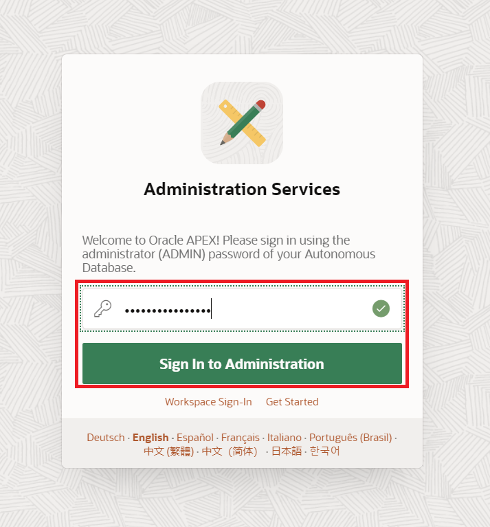

3. When you sign-in first time, it will ask you to create a workspace, click **Create Workspace**.

    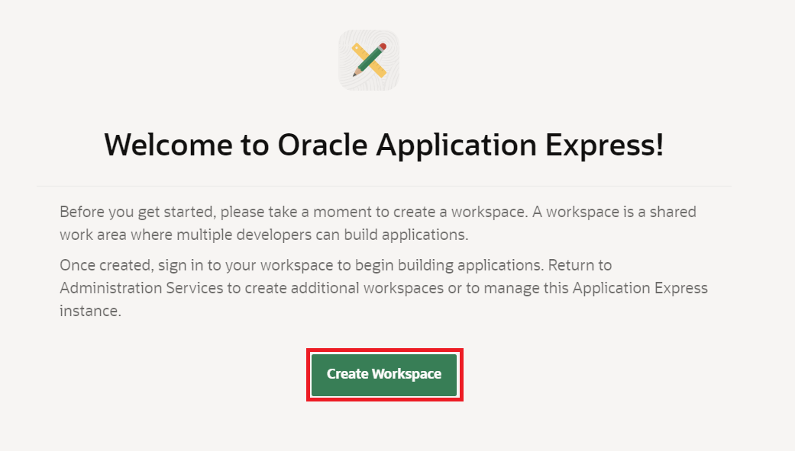

4. In the Create Workspace dialog, we will use information in the below table:

    | Property | Value |
    | --- | --- |
    | Database User | HR |
    | Password | **`GG##lab12345`** |
    | Workspace Name | HR_APP |

    > **NOTE:** Workspace ID will be automatically generated for you, ignore and click **Create Workspace**.

    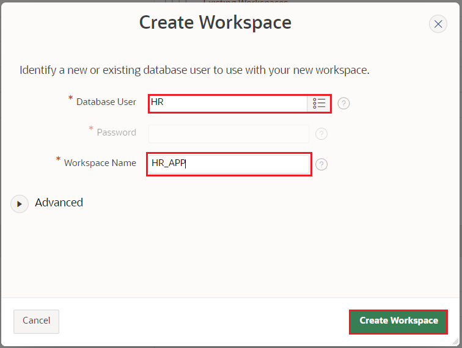

5. In the APEX Instance Administration page, click the **HR_APP** link in the success message. This will redirect you to the APEX sign-in page.

    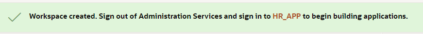

6. On the APEX Workspace log in page, your username and workspace name is same. Enter **`GG##lab12345`** for the password and then click **Sign In**.

    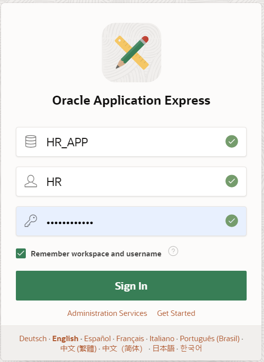

7. You need to configure APEX user password for application authorization. Click on **Set APEX account password**.

    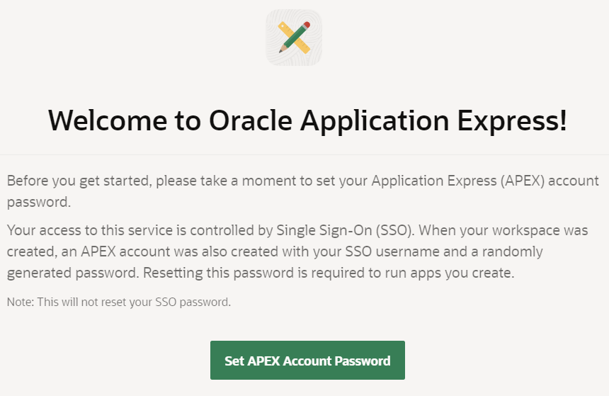

8. Set an email address as **hr@example.com**, enter **`GG##lab12345`** in password fields. Click on **Apply Changes** to save.

    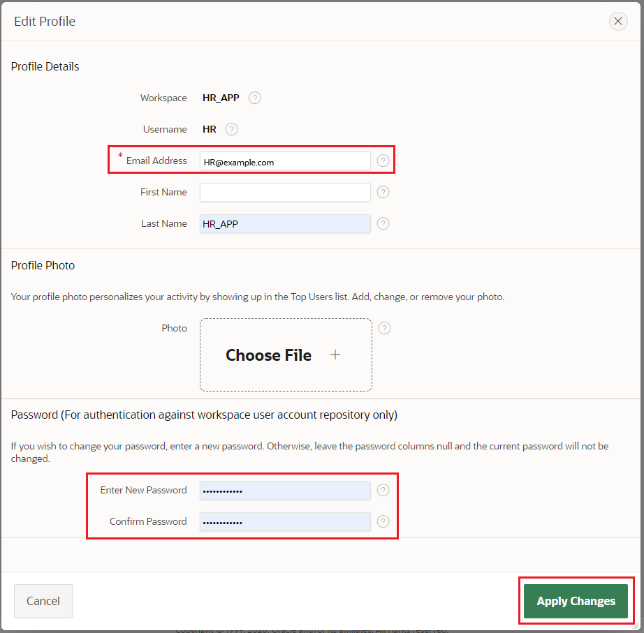


## **Task 2**: Import HR app in APEX workspace

1. After you successfully logged in to the newly created APEX workspace and updated the APEX password, you may explore that there are many components and tools included in the APEX workspace. Now let's import our HR application. Click on **App Builder** on the APEX workspace homepage.

    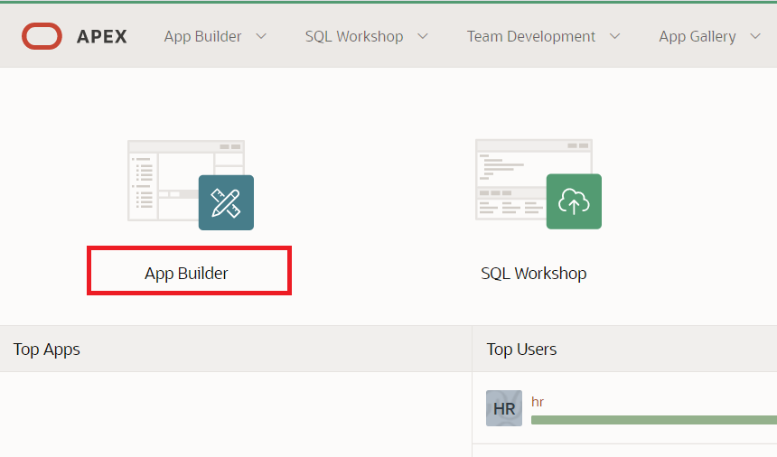

2. Click **Import** to start the wizard.

    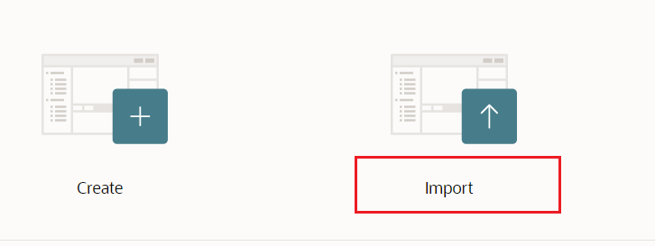

3. Download our sample HR application **[from here](./files/f103.sql)**. Make sure to save this file with the correct extension **.sql** not txt!

4. Make sure you choose the **File Type** as Database Application. Then click on **Drag and Drop** area and choose the downloaded file. Click the **Next** button to proceed.

    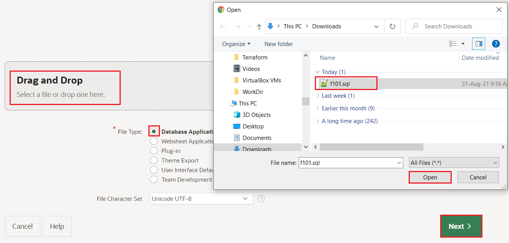

5. Click **Next** button.

    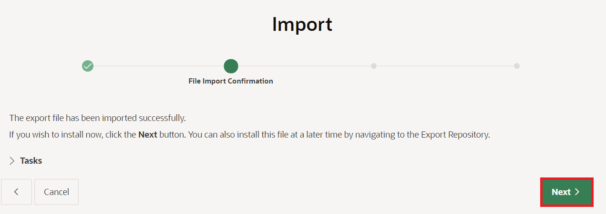

6. Double check **Parsing Schema** and **Build Status** selections are the same as the below, then **Next** button.

    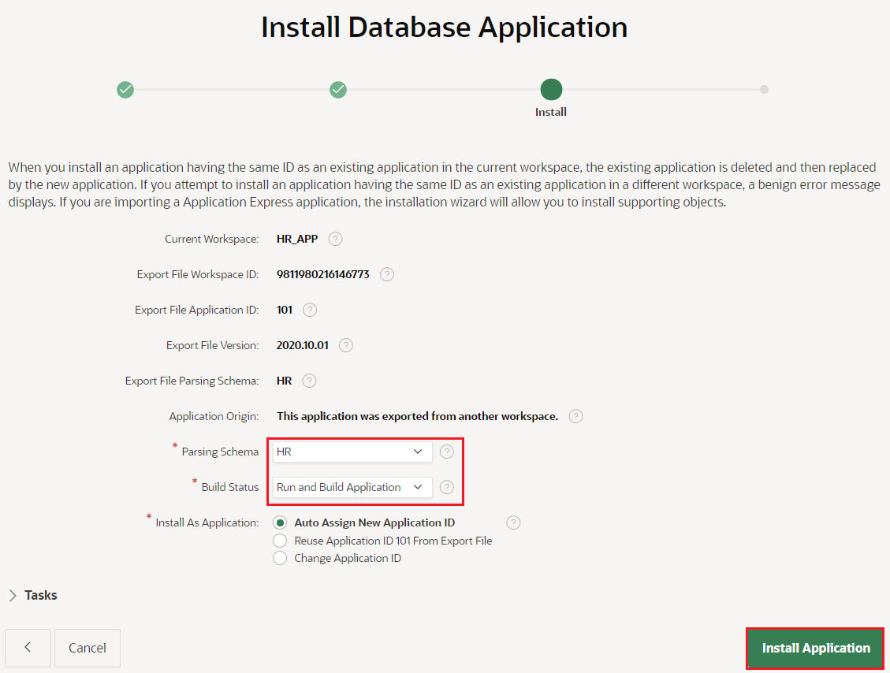

7. Installation of the application will take only few seconds.

    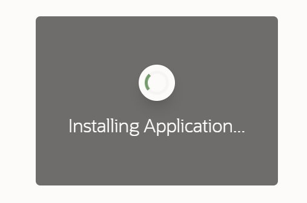

8. Once it is ready, you will see the successfully installed report. Click on the **Run Application** option and this will open in a new tab.

    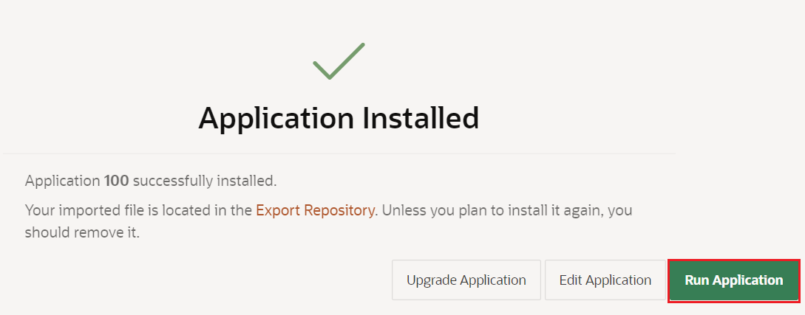

9. Provide **HR** user and **GG##lab12345** password to log in to the application.

    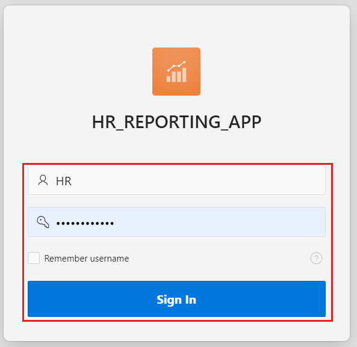

## **Task 3**: Add work anniversaries in dashboard page

1. Here is the sample HR application we created for you. We want you to click on the **Dashboard** at which you will see three charts in there.

    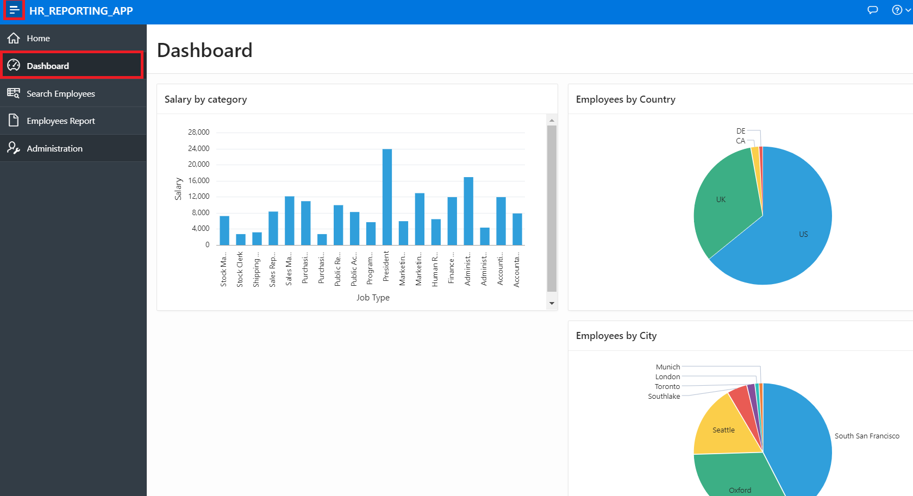

    Oracle APEX has integrated charting based on Oracle JavaScript Extension Toolkit (JET) Data Visualizations. For more information on Oracle JET and the Data Visualizations components, please refer to the Oracle JET Get Started documentation and ojChart API guide.

2. Now there are three charts and let's add one more chart which shows work anniversary. Go to the previous APEX application installation page (tab) and click the **Edit Application** button.

    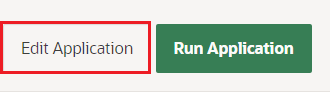

3. Take a moment to look at what options and pages are available on the application home page. This is the main container, collection of pages, menus, tabs, buttons etc, the building block of our database application. **2 - Dashboard** is the page that contains our charts. Click on it.

    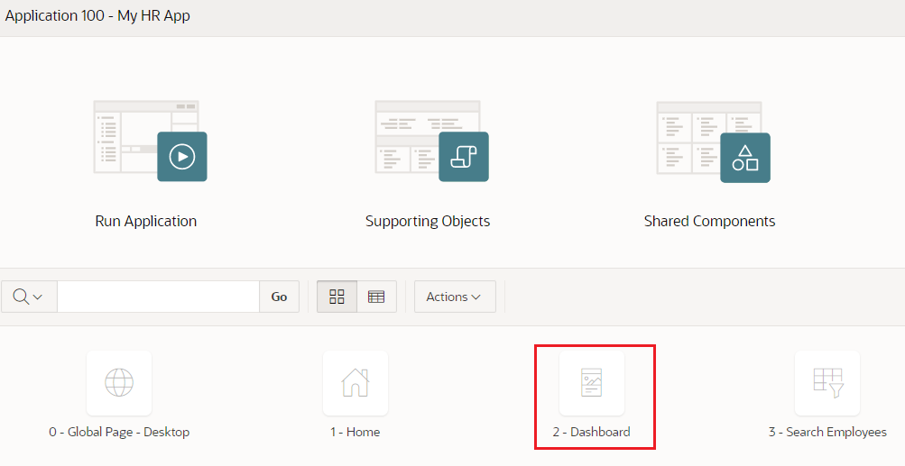

3. The dashboard page will be opened by the page designer. This is a full-featured Integrated Development Environment (IDE) that includes a toolbar and multiple panes. There are multiple tabs in the left pane. Select the rendering tab and find the Content Body area. This is the area which contains our 3 charts.

    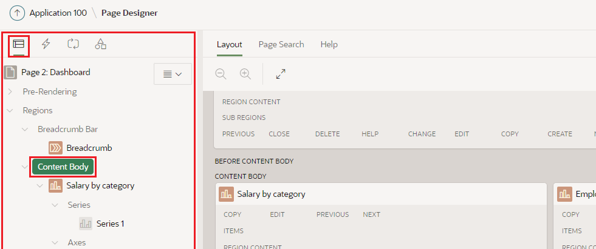

4. Under the central pane, there are APEX components. Click on the **Cards** component and drag to the empty area next to **Employees by City**. More precisely in the darker orange area as shown in the below image.

    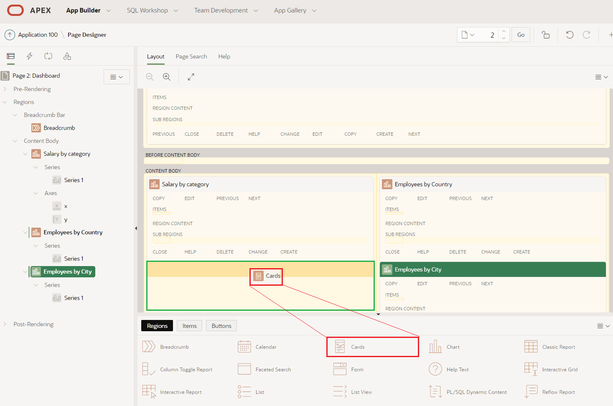

5. This will bring a new empty cards component to the dashboard page. We need to configure it to our needs. Click on this new **Cards** component.

    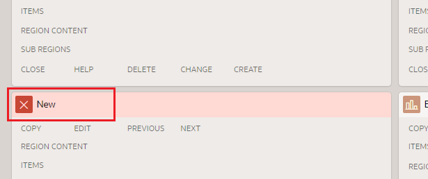

6. After you selected the cards, in the right pane, you will see the Property Editor. The **Region** tab displays the attributes and attributes are organized in groups. Let's change the title to **Anniversaries** in Identification, then change the type to **SQL Query** in Source. Paste the below code in the **SQL Query** field:

     ```
    <copy>
    SELECT first_name, last_name, job_id, employee_id, ceil(months_between(sysdate, hire_date) /12) as anniversary, hire_date, extract(day from hire_date)
    FROM hr.employees
    WHERE EXTRACT(month FROM (hire_date)) = extract(month from (sysdate)) and EXTRACT(year FROM (hire_date)) != extract(year from (sysdate))
    ORDER BY 7;
    </copy>
    ```

    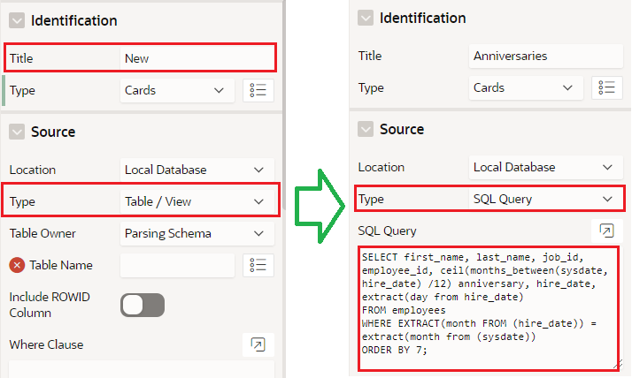

7. Then now, click on the **Attributes** tab, to modify how the cards would look on the Dashboard page. Find the appropriate attributes and change them like the below image:

    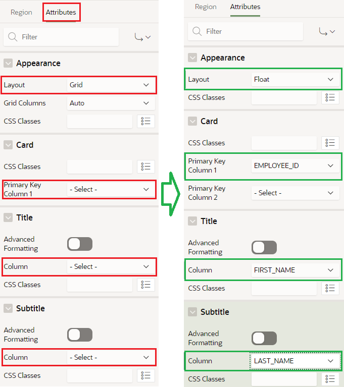

8. Attributes tab has many properties, scroll down and change more fields as the below image:

    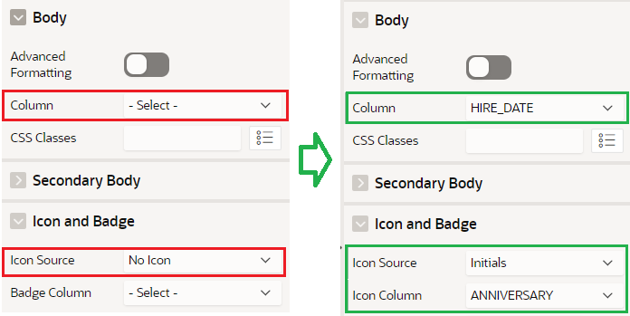

9. After you finish editing, click **Save** and hit the green **play** button.

    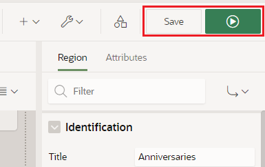

10. My HR application will reload the changes we've made. There you go, now we will never miss our colleagues' anniversaries.

    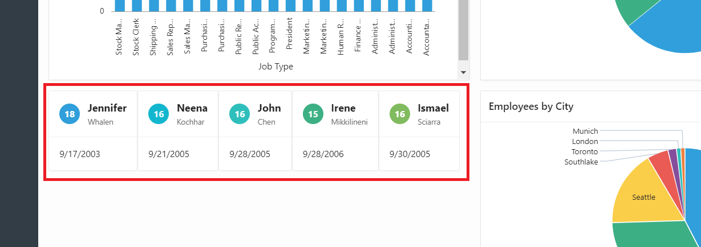

## **Task 4**: Create an employee maintenance page

1. Probably you have noticed that there is no page to edit employee details or add a new employee in our application. So let's create a page. Go to your APEX application home page. Find the **Create Page** button.

    

2. The Create Page Wizard includes two types of pages components and features. We will choose the **Report** component and click the next button.

    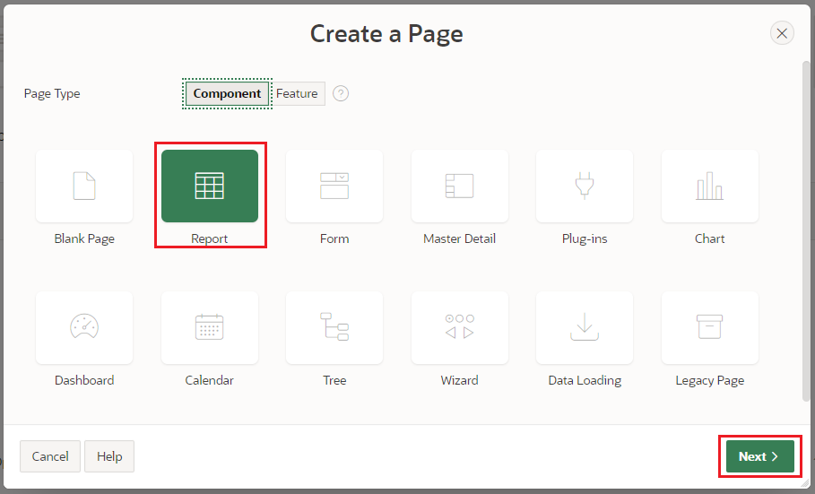

3. Then choose **Report and Form on Table**

    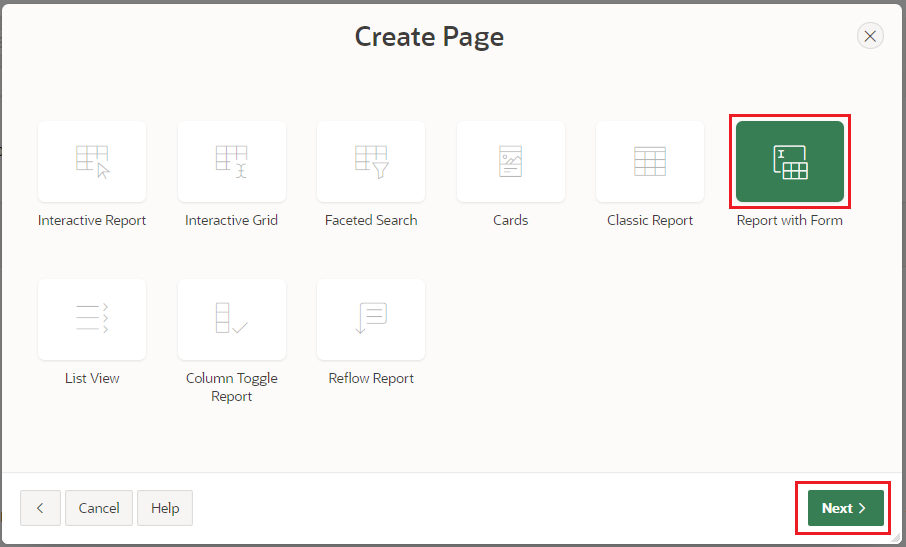

4. We will choose **Interactive Report** then name the main report list as **Employee list**.  Form page name as **Employee Maintenance**. Also, set the form page mode to **Modal Dialog**.  This option will make it look nice pop-up type page when you select a record to edit.

    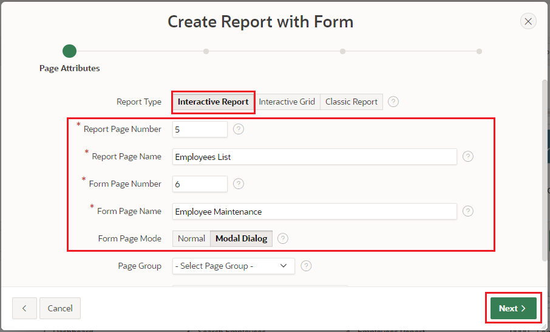

5. Let's add this page to the navigation menu of our application. Choose the **Create a new navigation menu entry** option.

    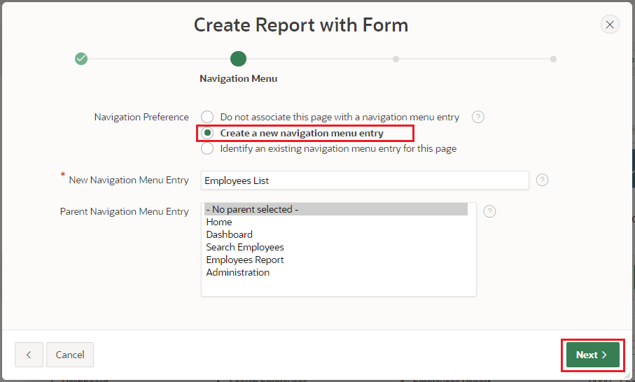

6. This interactive report is a formatted result of a SQL query, and you need to choose a table from the database on which to build a report or provide a custom SQL SELECT statement. Choose **Table** as the source type and choose table name **Employees**.  End users can customize both report layout and control how the data that displays. The wizard added all available columns automatically to the report be shown. Click **Next** button.

    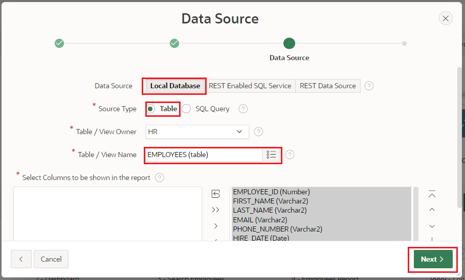

7. Now let's check how the form page, in our case **Employees Maintenance** page, will find the record. Choose the **Select Primary Key Column(s)** option and select **EMPLOYEE_ID** as the primary key column. Then click the **Create** button.

    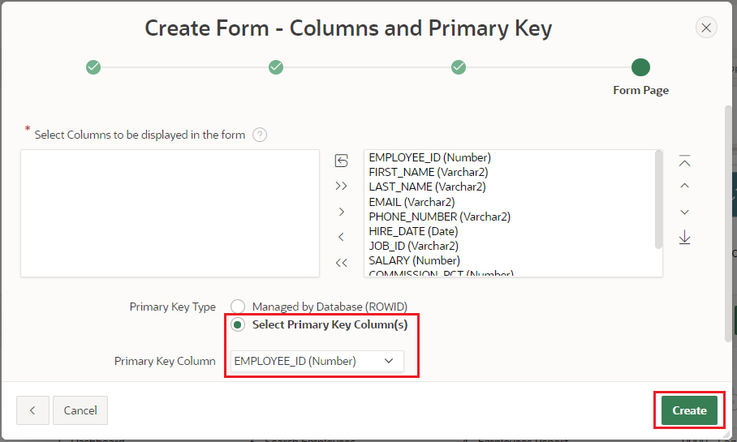

8. Page Designer page will open the newly created report. Click the green **play** button on the right top of the property editor to see how it looks.

    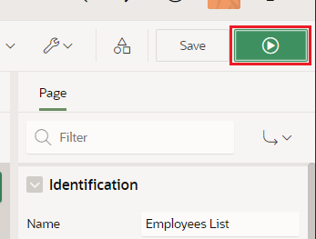

9. You can now edit a record by clicking on blue icons in front of the rows.

    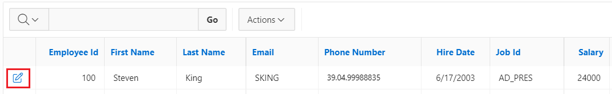

10. Let's update Steven King's salary to 25000 and click **Apply Changes**

    

11. You will see a small notification appear on the top-right corner.

    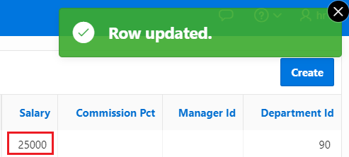

    > **Note:** You may see different information than this illustration due to our sample database update.

## **Task 5**: Modify employee id

1. Our Employees table doesn't have an automatic identity column to maintain *`employee_id`*. So this means, if you create a new employee in the application, it will insert a record without an employee ID. Let's fix this. Go to the application home page and click on **6 - Employee Maintenance** page.

    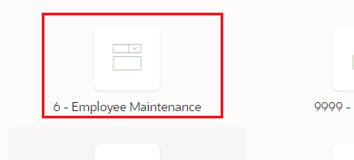

2. First, let's re-arrange items as it will make the maintenance page look better when you run it. Click on each items and move them as shown in the below image.

    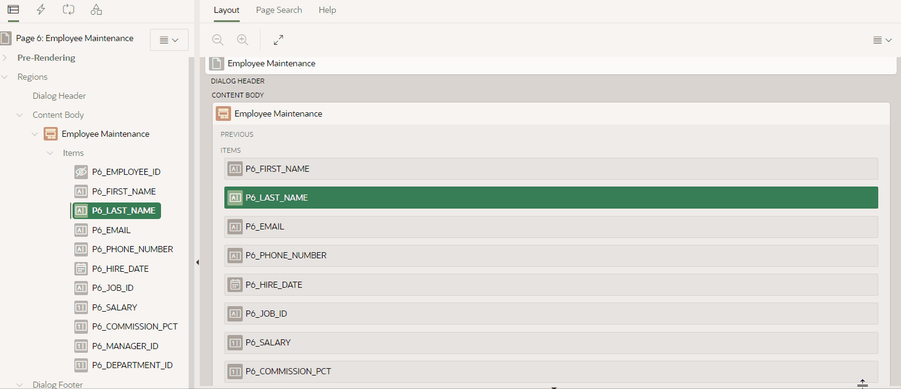

3. Now select **`P6_EMPLOYEE_ID`** column from the left pane, then edit its attribute type from Hidden to **Select List**.

    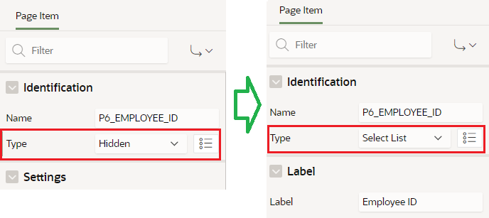

4. Scroll down to find **List of values** and choose type **Shared Component**. Select our pre-created **`EMP_ID`** for **List of Values**. Unset **Display Extra Values** and **Display Null Value**, then save the page.

    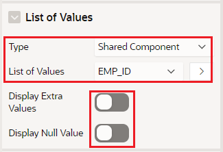

## **Task 6**: Duplicate the employee maintenance page

1. Our **Employee Maintenance** page is for two purposes, _edit_ a record and _create_ a new employee, which is a pretty okay and recommended approach.
But, let's add a new page whose sole purpose is to add new employees only. The idea to have a dedicated page is to delegate the tasks separately. Click on the **+** button and **Page as Copy** as shown in the below image.

    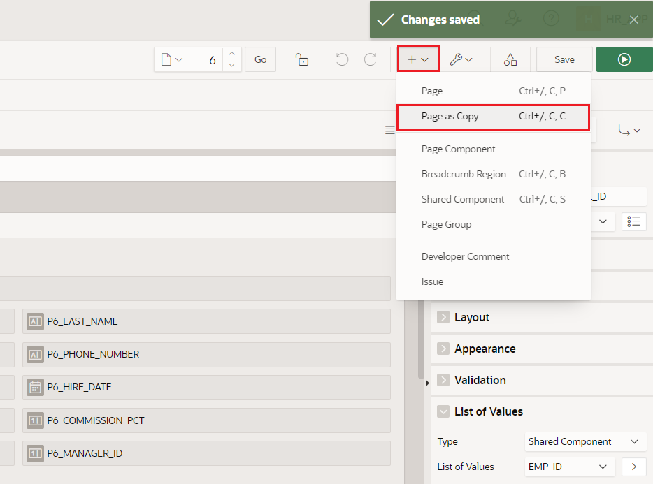

2. Select **Page in this application** option and click next.

    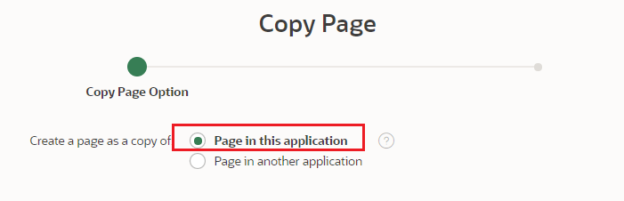

3. The new page number should be **7**. However, it can be different in your case, and name this page **Create new employee**.

    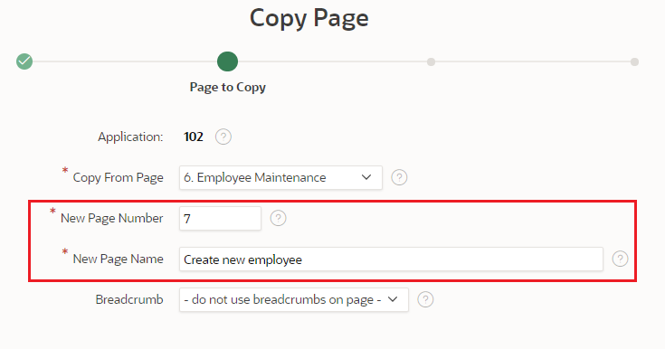

4. We don't want this page to be accessible from the navigation menu. Choose the **Do not associate** option.

    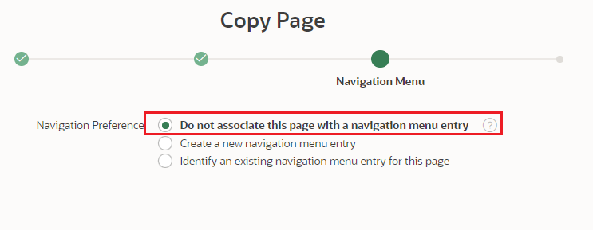

5. APEX will ask you what items do you need to inherit from the parent page. Let's scroll down and give a new name **Create new employee** and click the **Copy** button.

    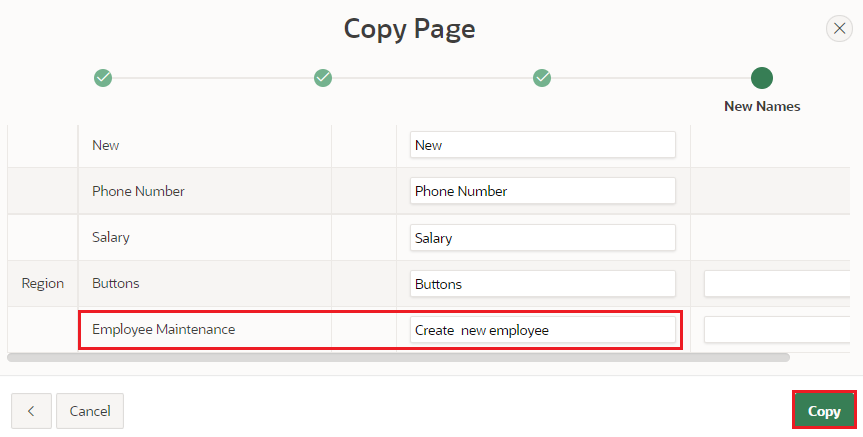

6. The page editor will open the newly created page. However, I'd like to remind you that this new page has not been associated with the **Create** button in your report. It means whenever you click on the **Create** button will open the previous **Employee Maintenance** page, not our newly created **Create new employee** page. Let's fix this issue before you run the application. Click the page finder, and choose the **5 Employee List** page to find our **Create** button.

    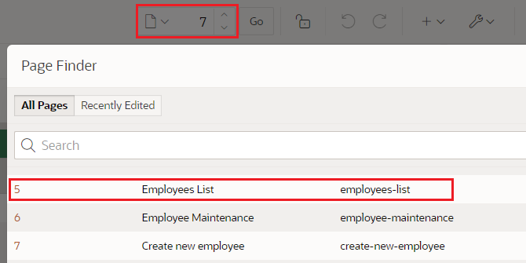

7. Click the region button **CREATE** in the left pane and find **Behaviour** in the property editor located at the right pane.

    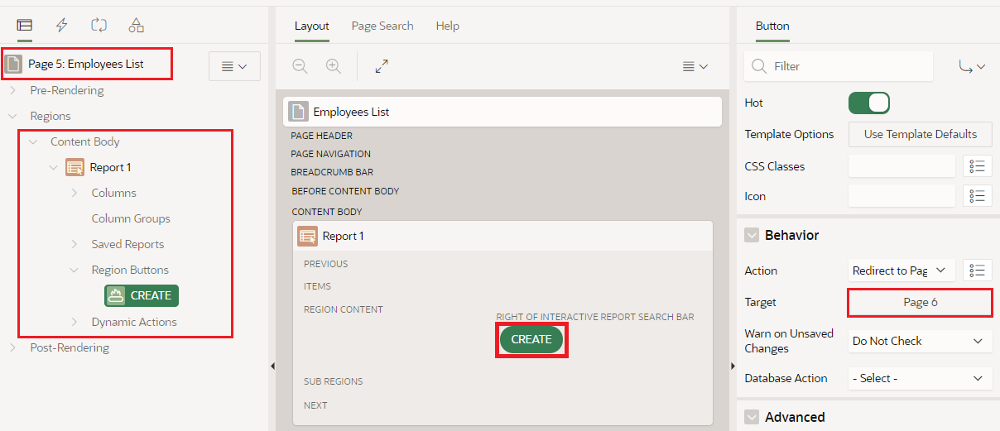

8. You can see that the target link of this button is currently **6** but we want you to change this to **7** (Create new employee page). Don't forget to save the page!

    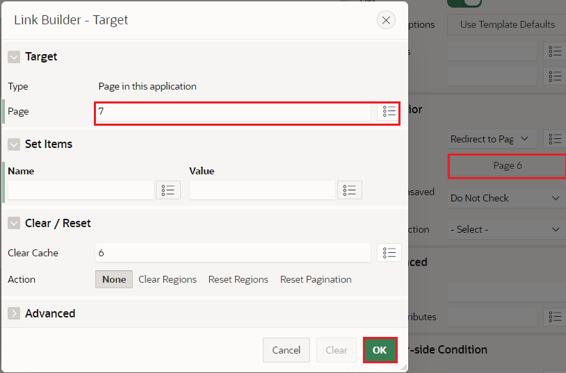

9. Let's go back to the **Employee Maintenance** page once again. Click the page finder again and choose **6 Employee Maintenance** page. I want you to change **`P6_EMPLOYEE_ID`** field type back to **HIDDEN**. Because to be able to edit the ID field in the **Employee Maintenance** page is not practical.

    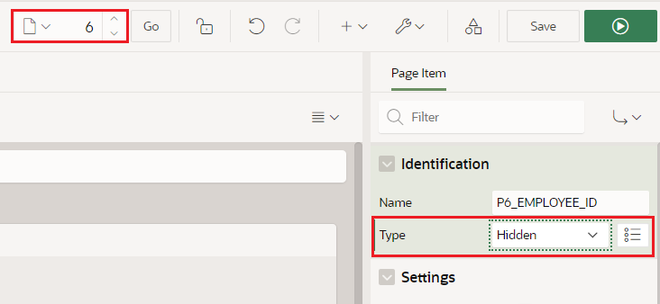

10. Now run your application and test out the changes you've made. If you click on the **Create** button, **Create new employee** page will pop up open.

    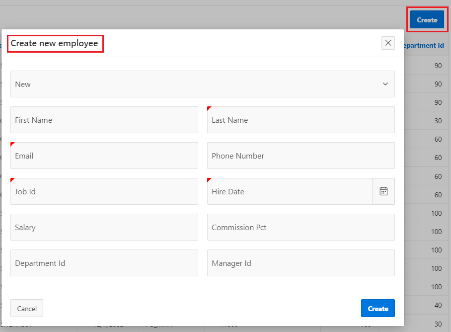

    Also, if you'd click on the edit button in front of a record, the **Employee Maintenance** page will pop up.

    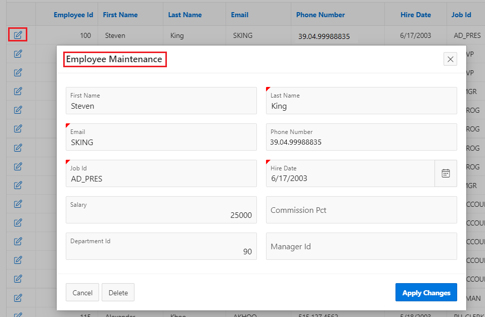

    Did you notice that some fields don't look meaningful? For example, **Job id**, **Manager id**, and **Department id**.  Let's change them to list names instead of IDs in the next step.

## **Task 7**: List of Values

1. Go back to APEX editor and let's edit **7 - Create new employee** page.

    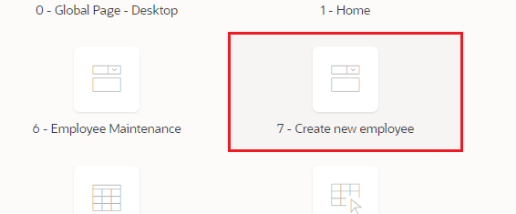

2. Select **`P7_DEPARTMENT_ID`** in the page editor, then edit properties. Choose **Popup LOV** type, change the label to **Department Name**. Then scroll down to **List of Values**, choose **Shared Component** type and **DEPT_LIST** as LOV.

    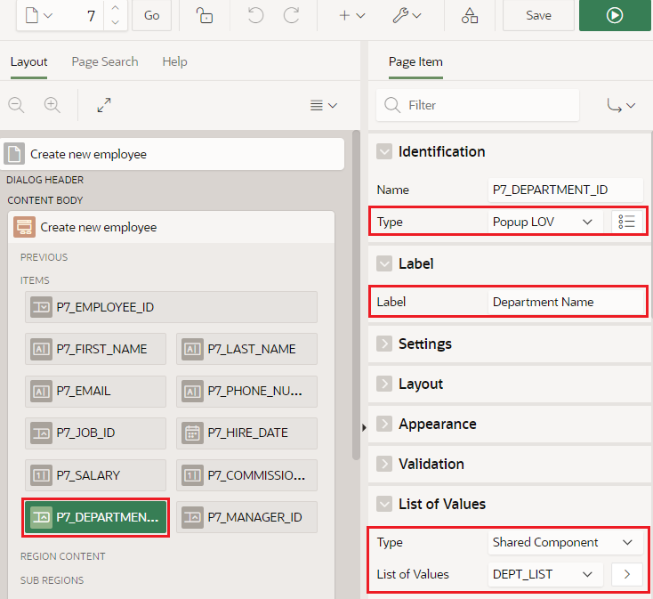

3. Next, select **`P7_MANAGER_ID`** then edit properties. Choose **Popup LOV** type, change the label to **Manager Name**. Then scroll down to **List of Values**, choose **Shared Component** type and **MGR_NAME** as LOV.

    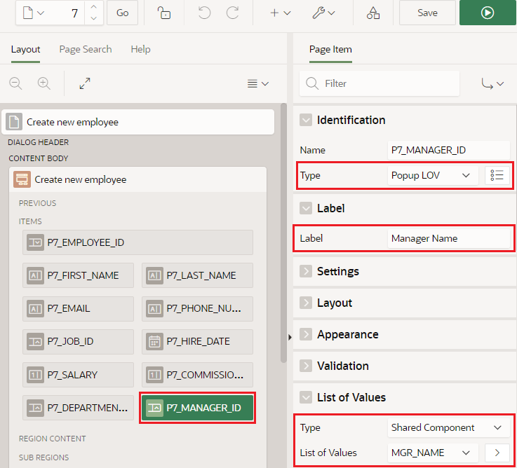

4. As you noticed, you selected our pre-created list of values. However, it can be a custom query too. Select **`P7_JOB_ID`** and edit properties. Choose **Popup LOV** type, change the label to **Job Title**. Then scroll down to **List of Values**, choose **SQL Query** as type and insert the below query:

	```
	<copy>
    SELECT JOB_TITLE, JOB_ID FROM JOBS
    </copy>
	```
    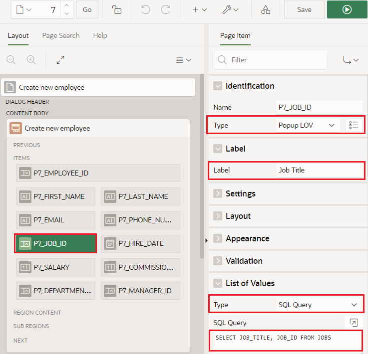

5. Now save and run the application. Click on the **Create** button again, and check that **Job id**, **Manager id**, and **Department id** changed to meaningful fields. You can insert a sample record as shown in the below image.

    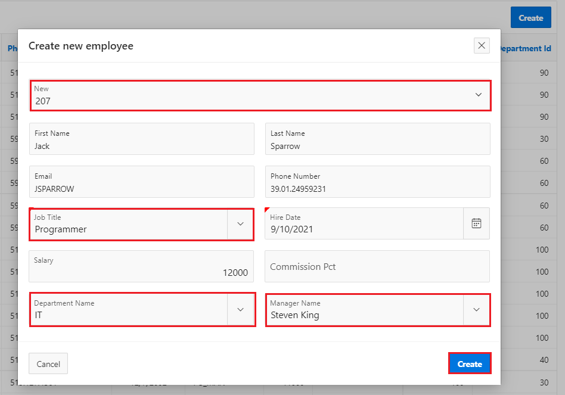

6. Repeat these sub-steps 2, 3, 4 on the **Employee Maintenance** page also! Because the employee maintenance page also needs this. Make sure you save it. After finish editing the **Employee Maintenance** page, run the application. Try to edit a record. The Employee Maintenance page will be looking like the one below.

    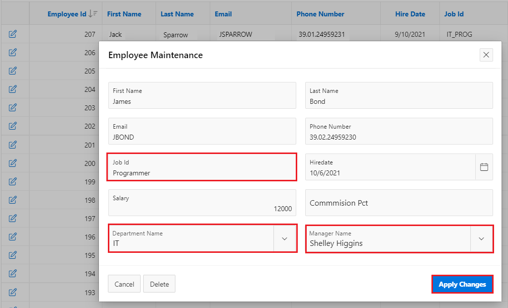

    Congratulations, you have completed this workshop!

    You successfully migrated the source 12c database to Autonomous Database in Oracle Cloud Infrastructure, also sample HR application. We hope you enjoyed it!

    If you would like to download and compare with the final version of HR application, please get it **[from here](./files/f102.sql)**.

    After you finish the workshop, you may wish to delete the all resources. Type the below command in cloud shell:

	```
	<copy>
    cd ~/oci_gg_cloud_service
	terraform destroy --auto-approve
	</copy>
	```

    > **Note:** This will destroy the all resources and there is no way to restore them back. Make sure you make some backups if necessary.

**This concludes the workshop. Please scroll down and visit the summary**

## **Summary**

Here is a summary of resources we created and used in our workshop.

1. Virtual Cloud Network

    - Public Subnet, Internet Gateway
    - Private Subnet, NAT Gateway, Service gateway

2. Compute Virtual Machines and Shapes, OS Images

    - Source 12c database instance using Oracle Database Marketplace image

3. Autonomous database

    - Target ATP instance

4. Oracle Application Express

    - APEX 20.2 version application

## Acknowledgements

I would like to thank Vahidin and Tsengel, experienced APEX and GenO lift implementation engineers respectively. These gentlemen have shown their dedication and hard work to support my workshop.

* **Author** - Bilegt Bat-Ochir - Senior Technology Solution Engineer
* **Contributors** - Vahidin Qerimi - Principal Technology Solution Engineer, Tsengel Ikhbayar - GenO lift implementation
* **Last Updated By/Date** - Bilegt Bat-Ochir 18/09/2021
