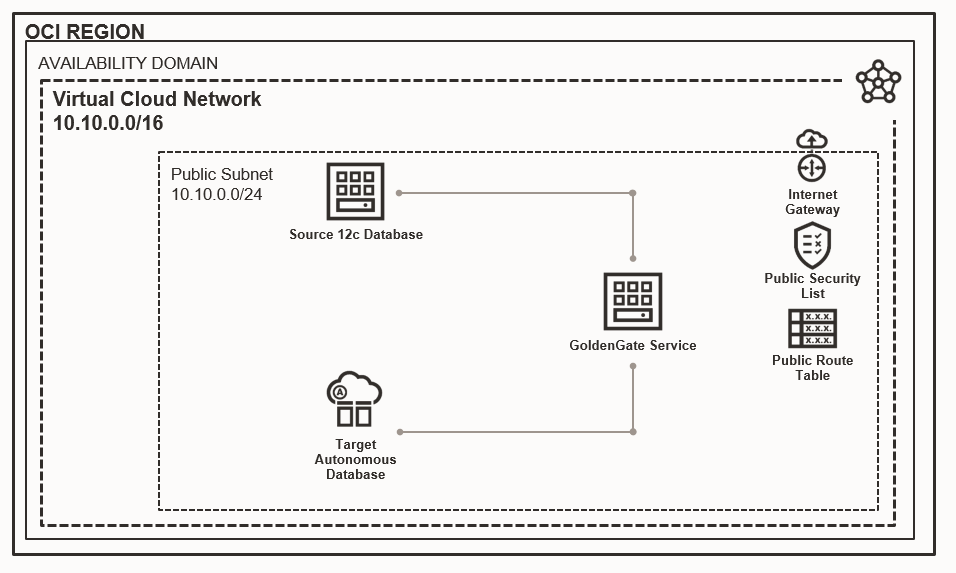

# Welcome to Migrate HR database workshop

## Introduction

In this workshop, we will migrate a sample HR database application to an Autonomous Database in Oracle Cloud Infrastructure using the new cloud-native OCI GoldenGate. The purpose of this workshop is to show the simple and yet efficient way to migrate a database to Oracle Cloud Infrastructure. This workshop consists of four labs.

In the first three labs, we will use the OCI GoldenGate  for the database migration to designated resources which are in Oracle Cloud Infrastructure. In the last lab, we will migrate an HR application to the built-in APEX environment of the Oracle Autonomous Database. Bonus lab also will unfold some additional tasks for you to explore some of the latest APEX features.

*Estimated Time*: 1.5 hours

### About Oracle Cloud Infrastructure GoldenGate

Oracle Cloud Infrastructure GoldenGate is a managed service providing a real-time data mesh platform, which uses replication to keep data highly available, and enabling real-time analysis. You can design, execute and monitor their data replication and stream data processing solutions without the need to allocate or manage compute environments, it is a fully managed service. Today we will explore its capabilities and migrate our source database to target.

### About HR schema

We are about to migrate Oracle's famous sample schema HR to the Oracle Autonomous Database. This sample database schema will represent our on-premises source database and consists of multiple tables.

### About Autonomous Database

This is self-driving, converged, multimodel database and machine learning-based automation takes care of its operational lifecycle management. Auto-provisioning and auto-tuning to simplify the creation and optimization of all data stores in the cloud. You can start with the lowest cost and commitment, and autoscale as the business grows. Today we will use this 19c database as our target database.

### About Application Express (APEX)

First of all Oracle Application Express (APEX) is a low-code development platform that enables you to build scalable, secure enterprise apps, with world-class features, that can be deployed anywhere. Also, APEX is a built-in tool of the Autonomous Database and we will explore the best capabilities in the bonus step.

### About Terraform

Terraform is an open-source tool that allows you to manage programmatically, version, and persist infrastructure through the "infrastructure-as-code" model.
The Oracle Cloud Infrastructure (OCI) Terraform provider is a component that connects Terraform to the OCI services that you want to manage. We will use it as our infrastructure orchestration to deploy all necessary resources.

### Objectives

In this workshop you will :
* Explore Cloud-Shell, web-based terminal
* Benefit from OCI terraform provider
* Explore OCI compute service
* Understand the migration flow of GoldenGate
* Explore Autonomous Database and its capabilities
* Dive into APEX low-code application development

**Architecture Overview**

- Virtual Cloud Network: we will create a VCN with a public sub-network and internet access to avoid complexity.
- Source Oracle database: we will create a source database in a Virtual Machine with sample schema, which acts as our source on-premise database. Multiple preparations yet mandatory steps are automated by Terraform and bash script, such as creating GGADMIN schema, granting accesses, enabling supplemental logs etc.
- Target Autonomous database: we will provision Oracle Autonomous Database to act as our target database.
- GoldenGate database registration: while our databases are being provisioned and configured, we will register them. Database registration is a critical part of GoldenGate deployment. There is no way to connect databases from GoldenGate deployment without active registered databases.
- GoldenGate deployment: we will create a Microservices environment for an Autonomous Database that applies trails from source to target autonomous database.

	

All of the above resources are going to be deployed in Oracle Cloud Infrastructure using Terraform. It is not necessary to have prior knowledge of Terraform scripting. All you need to do is follow every step exactly as described.

### Prerequisites

* Make sure you have OCI account, please proceed to Task 1.

## **Task 1**: Create your OCI account

* The following workshop requires an Oracle Public Cloud Account that will either be supplied by your instructor or can be obtained through **Getting Started** steps.
* A Cloud tenancy where you have the available quotas to provision what mentioned in Architecture Overview.
* Oracle Cloud Infrastructure supports the following browsers and versions: Google Chrome 69 or later, Safari 12.1 or later, Firefox 62 or later.

> **Note:** If you have a **Free Trial** account, when your Free Trial expires your account will be converted to an **Always Free** account. You will not be able to conduct Free Tier workshops unless the Always Free environment is available. **[Click here for the Free Tier FAQ page.](https://www.oracle.com/cloud/free/faq.html)**

## Learn More

* [Terraform OCI](https://docs.oracle.com/en-us/iaas/Content/API/SDKDocs/terraform.htm)
* [Oracle GoldenGate](https://docs.oracle.com/en/middleware/goldengate/core/19.1/oggmp/using-oracle-goldengate-microservices-oracle-cloud-marketplace.html)
* [Oracle Autonomous Database](https://docs.oracle.com/solutions/?q=autonomous&cType=reference-architectures&sort=date-desc&lang=en)

## Acknowledgements

I would like to thank Vahidin and Tsengel, experienced APEX and GenO lift implementation engineers respectively. These gentlemen have shown their dedication and hard work to support my workshop.

* **Author** - Bilegt Bat-Ochir - Senior Technology Solution Engineer
* **Contributors** - Vahidin Qerimi - Principal Technology Solution Engineer, Tsengel Ikhbayar - GenO lift implementation
* **Last Updated By/Date** - Bilegt Bat-Ochir 11/09/2021
