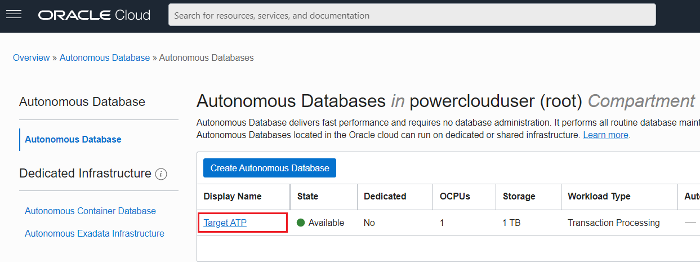
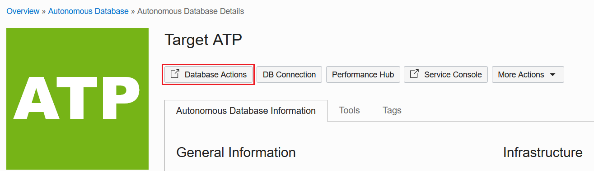
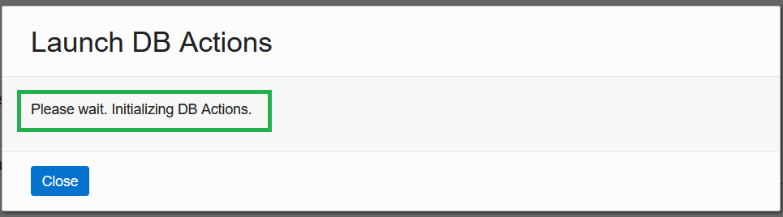
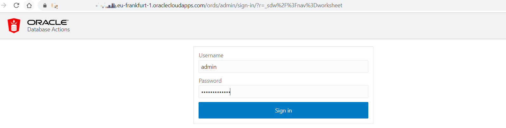
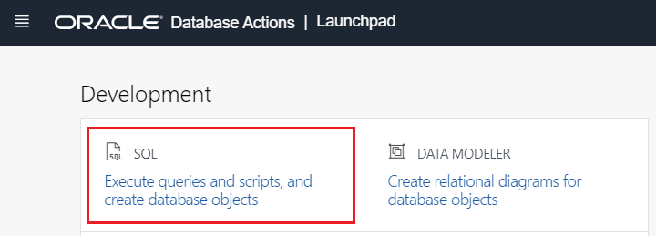
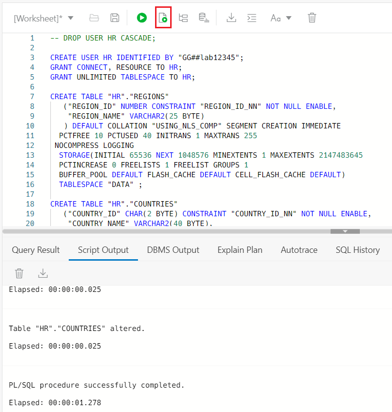
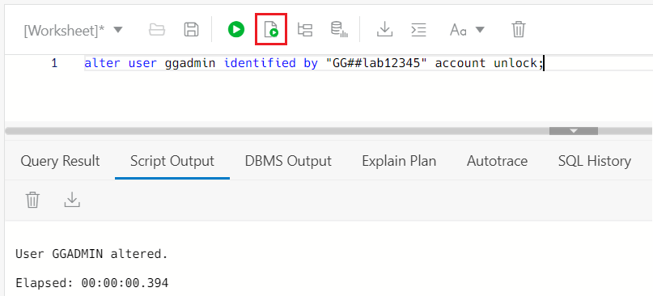

# Prepare Target ATP

## Introduction

Up to now we have created all of the necessary resources using Terraform in OCI. It is now time to prepare the Target Database, the Autonomous database.

*Estimated time*: 10 minutes

### Objectives

We need to create our target tables for our GoldenGate migration and enable GGADMIN for replication to the Autonomous Database.

### Prerequisites

* This lab assumes that you completed all preceding labs.

## **Task 1**: Open SQL Developer Web

1. Go to the top-left hamburger icon, navigate to **Oracle Database** and choose **Autonomous Transaction Processing**. It will show you all available ATP workload type databases. Click on **Target ATP** database.

	

2. You will see **Database Actions**, please click on it. It would redirect you to the SQL web developer.

	

	**Option A**: You will see a small notification saying that **Please wait. Initializing DB Actions**. This will only take few seconds, please do not press any button until it opens the SQL web developer in a new tab.

	

	**Option B**: If a sign-in page opens and asks you to provide username, please enter **ADMIN** and press next. Then it will ask you to enter a password, which is in your terraform output. Go and copy, then paste here.

	

3. In the **DEVELOPMENT** section, click on **SQL**.

	

## **Task 2**: Create Target Tables

1. Let's create our target tables for migration. Please download the target table creation script **[from here](./files/create-tables.sql)**. Make sure to save these with the correct extension **.sql** not txt!

2. SQL Developer Web opens a worksheet tab, where you execute queries. Drag your downloaded **create-tables.sql** file and drop it in the worksheet area. Then run create statements.

	

	There should have **7** tables created after script execution.

## **Task 3**: Enable GGADMIN

1. Now let's continue to unlock and change the password for Oracle GoldenGate user (ggadmin) in the Autonomous Database. Enable GGADMIN by running the following query.

	```
	<copy>
	alter user ggadmin identified by "GG##lab12345" account unlock;
	</copy>
	```

	

2. Let's check whether the parameter `enable_goldengate_replicaton` is set to true.

	```
	<copy>
	select * from v$parameter where name = 'enable_goldengate_replication';
	</copy>
	```

	

	We successfully enabled GGADMIN in our target Autonomous Database and created target HR database table structures.

## Acknowledgements

* **Author** - Bilegt Bat-Ochir - Senior Solution Engineer
* **Contributors** - Tsengel Ikhbayar - GenO Lift Implementation
* **Last Updated By/Date** - Bilegt Bat-Ochir 18/09/2021
