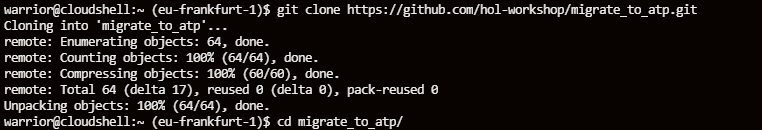
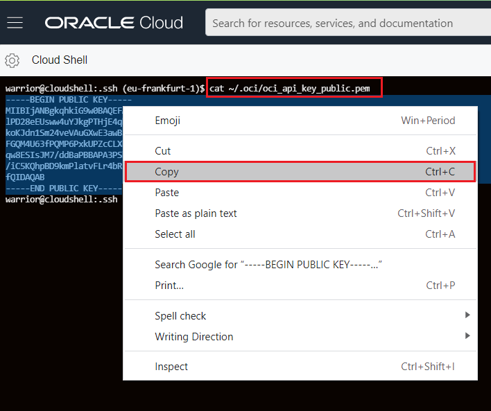
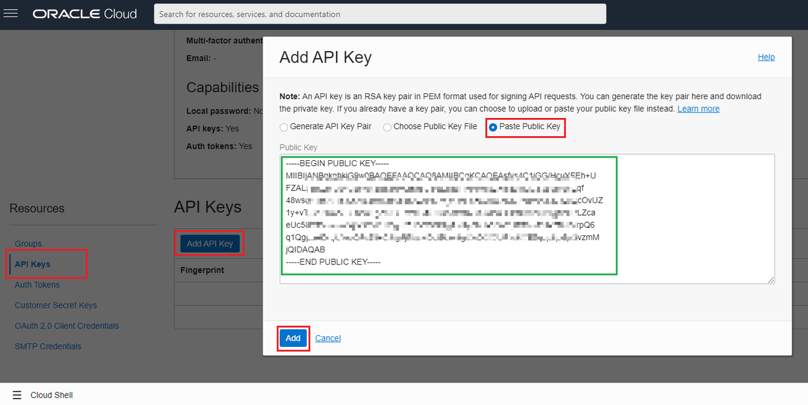
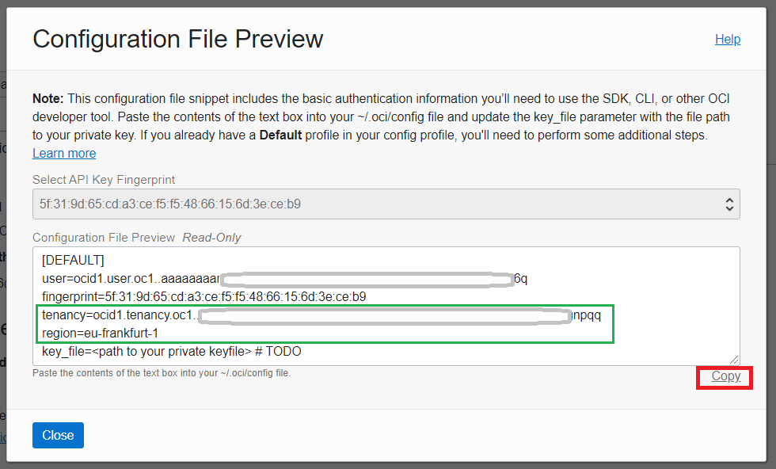

# Environment Setup

## Introduction

In this lab, we will show you how to prepare your work environment in Oracle Cloud Infrastructure. We will use cloud-shell which is a web-based terminal built into OCI console. To use the Cloud Shell machine, your tenancy administrator must grant your the required IAM (Identity and Access Management) policy.

This lab is very important and we will create following resources:

- Virtual Cloud Network
- Source PostgreSQL Database
- Target Oracle Autonomous Database
- GoldenGate for non-Oracle deployment for source database
- GoldenGate Microservices deployment for target database

**Make sure** you have the following compute quotas and resources available to use:

1. ATP for Target database - 1 OCPU, 1 TB storage
2. Virtual Machine for Source Database - VM.Standard.E4.Flex
3. Virtual Machine for GoldenGate Postgresql - VM.Standard2.1  
4. Virtual Machine for GoldenGate Microservices - VM.Standard2.1

*Estimated lab time*: 10 minutes

### Objectives

In this first lab, we will prepare our work environment and create our lab resources using a Terraform script.

-   Create SSH keys in a cloud-shell environment.
-	Modify a terraform variables file to interact with script.
-   Prepare our work environment and create our lab resources using a Terraform script.

	

For a technical overview of this lab step, please watch the following video:

[Video showing technical overview](youtube:LWcwzXPw9ZU)

### Prerequisites

* The following workshop requires an Oracle Public Cloud Account that will either be supplied by your instructor or can be obtained through **Getting Started** steps.
* A Cloud tenancy where you have the resources available to provision what is listed in the Architecture Overview.
* Oracle Cloud Infrastructure supports the following browsers and versions: Google Chrome 69 or later, Safari 12.1 or later, Firefox 62 or later.
* Your cloud account user must have the required IAM (Identity and Access Management) policy or admin user.
* Successfully logged in to your cloud tenancy, if not please [login](https://www.oracle.com/cloud/sign-in.html) to your cloud account.

## **Task 1**: Open Cloud-Shell

1. Let's prepare our work directory. We will use Cloud Shell, it is located at the top right corner of the OCI web console

	

## **Task 2**: Clone Lab Repository

1. Let's begin our lab. First, we'll make a copy of the lab repository and go to the cloned directory. In your cloud-shell web terminal, issue the below commands.

	```
	<copy>
	git clone https://github.com/hol-workshop/migrate_to_atp.git

	cd migrate_to_atp
	</copy>
	```

	

## **Task 3**: Generate SSH keys

1. Once the cloud shell environment is ready, issue the below 4 lines of commands. This will create the ssh key files and the api signing keys:

	```
	<copy>
	chmod +x generate_pemkey.sh

	./generate_pemkey.sh

	</copy>
	```

2. Copy your public _**pem**_ file content:

	```
	<copy>
	cat ~/.ssh/oci_api_key_public.pem
	</copy>
	```

	

## **Task 4**: Add Public API keys and Modify Terraform variables

1. Click on the top right corner of your OCI web console and click on your **profile**. Then navigate to the **API Keys** from the left pane and click on the **Add API Key** button. A small pop-up will appear and you need to choose the "Paste Public Key" radio button. Paste your **copied public pem key** there and click on the **Add** button.

	

2. A small confirmation will show after you added an API key. **Copy** these values and open a notepad to keep these for a later use.

	

3. Now we need to create a file to help terraform understand your environment. In the cloud-shell, type the below command and modify **terraform.tfvars** file.

	```
	<copy>
	vi terraform.tfvars
	</copy>
	```

	_**NOTE:** This will create a new file, you have to press **i** key to enable editing, then "shift+insert" to paste copied parameter. When you are done editing press **esc** button and press **:wq** keys, then hit enter for save & quit.*_

4. Let's replace the following values in double quotes the previously copied values in your notepad.

	```
	<copy>
	tenancy_ocid  = "replace_your_tenancy_value_here"
	region = "replace-your-region-value here"
	compartment_ocid = "replace-your-tenancy-value_here"
	</copy>
	```

	_**NOTE:** if you are an experienced OCI user, I'd highly suggest you use your own compartment to isolate all resources. To do so, provide your preferred compartment OCID in `compartment_ocid`. If you are new to OCI cloud, just enter your Tenancy value as compartment OCID._

## **Task 5**: Terraforming

1. It is time to initialize terraform. Run the below command to download necessary terraform files from the OCI provider.

	```
	<copy>
	chmod +x update.sh
	
	terraform init
	</copy>
	```

2. Plan and apply steps should not ask for any input from you. If it asks you to provide, for example; _**`compartment_ocid`**_ , then check previous steps.

	```
	<copy>
	terraform plan

	terraform apply --auto-approve
	</copy>
	```
	After you ran the apply command, terraform will start installation of several virtual machines and an autonomous database. Be patient, it will take some time. But, if you see an error **Service limits exceeded** in output, please visit the Appendix section for instructions to correct the issue.
	
3. Make a copy of your output results in your notepad for later use.

	

**This concludes this lab. You may now [proceed to the next lab](#next).**

## **Appendix**: Troubleshooting

###	Issue #1 Service Limits Exceeded
	
If you see **Service Limits Exceeded** issues when running _**terraform apply**_ command, follow the steps below to resolve them.
When creating a stack, you must have the available quotas for your tenancy and your compartment. 

Depending on the quota limit you have in your tenancy you can choose from any VM Standard Compute shapes, AMD shapes or Flex Shapes. 

This lab uses the following compute types but not limited to:

- Virtual Machine for Source Database - **VM.Standard.E4.Flex**
- Virtual Machine for GoldenGate Postgresql - **VM.Standard2.1** or more
- Virtual Machine for GoldenGate Microservices - **VM.Standard2.1** or more

#### Fix for Issue #1

1. Click on the Hamburger menu, go to **Governance** -> **Limits, Quotas and Usage**
2. Select Compute
3. Click Scope to change Availability Domain
4. Look for "Standard2 based VM" and "Standard.E4.Flex based VM", then check **Available** column numbers and sum  them up. All you need to have is at least **3** or more. If you have found correct available capacity, please continue to the next step.
5. Go to `migrate_to_atp` folder in your cloud-shell and modify variables file with: **`vi vars.tf`**

	

6. Fix above accordingly to your **Available** resources.
7. Go to **Step 5: Terraform**, and continue from substep **2**.
	
However, if you are unable to resolve it using above fix, please skip to the **Need Help** section to submit your issue via our support forum.

## Acknowledgements

* **Author** - Bilegt Bat-Ochir - Senior Solution Engineer
* **Contributors** - John Craig - Technology Strategy Program Manager, Patrick Agreiter - Senior Cloud Engineer
* **Last Updated By/Date** - Bilegt Bat-Ochir 24/06/2022