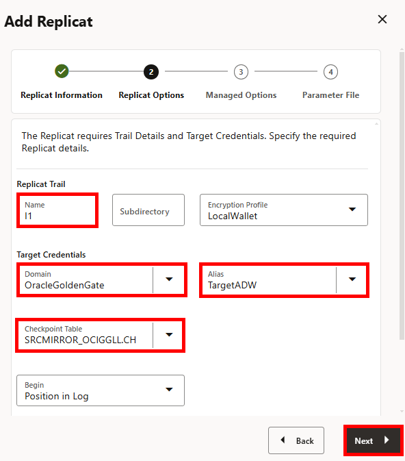

# Create the Autonomous Data Warehouse Replicats

## Introduction

In the previous lab, you created Extracts and Distribution Paths to perform an initial load and capture change data. This lab walks you through the steps to create Replicats on the target ADW deployment to deliver the data sent from the source MySQL deployment.

Estimated time: 15 minutes

### About Replicats

A Replicat is a process that delivers data to the target.

### Objectives

In this lab, you will:
* Add a checkpoint table
* Create a Replicat for Initial Load
* Create a Replicat for Change Data Capture

### Prerequisites

This lab assumes you completed all preceding labs successfully.

## Task 1: Add a checkpoint table

1.  In the target ADW OCI GoldenGate deployment console (**adw_instance**), click **Administration Server**.

2.  Open the navigation menu, and then click **Configuration**.

    

3.  For the TargetADW database, click **Connect to database TargetADW**.

    

4.  For Checkpoint, click **Add Checkpoint** (plus icon).

    

6.  For Checkpoint table, enter `SRCMIRROR_OCIGGLL.CHECKTABLE`, and then click **Submit**. The checkpoint table is added to the list.

7.  In the navigation menu, click **Overview** to return to the Administration Service Overview page.

## Task 2: Create a Replicat for Initial Load

1.  On the Administration Service Overview page, click **Add Replicat** (plus icon).

    

2.  On the Add Replicat screen, for Replicat Type, select **Nonintegrated Replicat**, and then click **Next**.

    

3.  On the Replicat Options page, complete the fields as follows, and then click **Next**:
    * For **Process Name**, enter a name for this process. For example, `RIL`.
    * For **Credential Domain**, select the domain for the Autonomous Database connection.
    * For **Credential Alias**, select the alias for the Autonomous Database connection.
    * For **Trail Name**, enter the name of the trail from the previous lab, Task 4 (`I1`).
    * For **Checkpoint Table**, select the checkpoint table created in Task 1.

    

4.  On the Parameter Files page, replace `MAP *.*, TARGET *.*;` with the following mapping, and then click **Create and Run**:

    ```
    <copy>MAP SRC_OCIGGLL.*, TARGET SRCMIRROR_OCIGGLL.*;</copy>
    ```

    

    You're returned to the Overview page where you can review the Replicat details.

5.  Select the RIL Replicat and view its details.

6.  Click **Statistics**. Review the number of inserts, then refresh the page.
    * If the number of Inserts doesn't change, then all the records from the Initial Load have been loaded and you can stop the Replicat (RIL)
    * If the number of Inserts continues to increase, then keep refreshing the page until the Initial Load records are all loaded before continuing.

Click **Administration Service** to return to the Overview page.

## Task 2: Create a Replicat for Change Data Capture

1.  On the Administration Service Overview page, click **Add Replicat** (plus icon).

2.  On the Add Replicat screen, for Replicat Type, select **Nonintegrated Replicat**, and then click **Next**.

3.  On the Replicat Options page, complete the fields as follows, and then click **Next**:
    * For **Process Name**, enter a name for this process. For example, `RCDC`.
    * For **Credential Domain**, select the domain for the Autonomous Database connection.
    * For **Credential Alias**, select the alias for the Autonomous Database connection.
    * For **Trail Name**, enter the name of the trail from the previous lab, Task 4 (`C1`).
    * For **Checkpoint Table**, select the checkpoint table created in Task 1.

4.  On the Parameter Files page, add the following mapping:

    ```
    <copy>MAP SRC_OCIGGLL.*, TARGET SRCMIRROR_OCIGGLL.*;</copy>
    ```

5.  Click **Create**. Don't run the Replicat just yet.

6.  On the Administration Service Overview page, select the Replicat for Initial Load (RIL) and view its Details.

7.  Click **Statistics**. Review the number of inserts, then refresh the page.
    * If the number of Inserts doesn't change, then all the records from the Initial Load have been loaded and you can stop the Replicat (RIL)
    * If the number of Inserts continues to increase, then keep refreshing the page until the Initial Load records are all loaded before continuing.

8.  Return to the Administration Service Overview page and select **Start** from the Change Data Capture Replicat (RCDC) **Action** menu.

9.  After the Change Data Capture Replicat (RCDC) starts successfully, select it, and then click **Statistics**.

## Learn more

* [Add a Replicat](https://docs.oracle.com/en/cloud/paas/goldengate-service/cress/index.html)

## Acknowledgements
* **Author** - Jenny Chan, Consulting User Assistance Developer, Database User Assistance
* **Contributors** -  Julien Testut, Database Product Management
* **Last Updated By/Date** - Jenny Chan, July 2022
