# Create the Oracle Cloud Infrastructure GoldenGate resources

## Introduction

This lab walks you through the steps to create Oracle Cloud Infrastructure (OCI) GoldenGate resources that you'll need to complete this workshop.

Estimated time: 30 minutes

### About Oracle Cloud Infrastructure GoldenGate resources

An Oracle Cloud Infrastructure GoldenGate deployment manages the resources it requires to function. You can create different deployments types such as, Oracle Database, MySQL, SQL Server, PostgreSQL, or Big Data. The GoldenGate deployment also lets you access the GoldenGate deployment console, where you can access the OCI GoldenGate deployment console to create and manage processes such as Extracts and Replicats.

Connections capture source and target credential information. A connection also enables networking between the Oracle Cloud Infrastructure (OCI) GoldenGate service tenancy virtual cloud network (VCN) and your tenancy VCN using a private endpoint.

### Objectives

In this lab, you will:
* Locate Oracle Cloud Infrastructure GoldenGate in the Console
* Create an OCI GoldenGate deployment for MySQL Heatwave
* Create an OCI GoldenGate deployment for Autonomous Data Warehouse
* Create connections for the source MySQL Heatwave and target Autonomous Data Warehouse
* Assign connections to deployments

### Prerequisites

This lab assumes you completed the environment set up lab, if you're running this workshop on your own tenancy.

To successfully complete this lab in your own tenancy:
* For IAM-enabled tenancies, ensure that you [configure Identity domains for OCI GoldenGate](https://docs.oracle.com/en/cloud/paas/goldengate-service/mkmbs/#GUID-DD9C1BF8-69FE-4C9A-A2D1-74C73550ED65).
* For non-IAM enabled tenancies, ensure that you ensure that you first [set up your Vault](https://docs.oracle.com/en-us/iaas/Content/KeyManagement/Tasks/managingvaults_topic-To_create_a_new_vault.htm#createnewvault). [Learn more about Vault service](https://docs.oracle.com/en-us/iaas/Content/KeyManagement/Concepts/keyoverview.htm).
* Add an API key in your profile settings to be used in Task 3:

1.  Oracle Cloud console global navigation bar, click **Profile** (user icon), and then select **User settings**.

    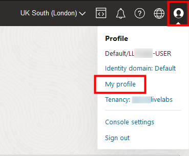

2.  On the user details page, click **Tokens and keys**.

3.  Click **Add API Key**.

    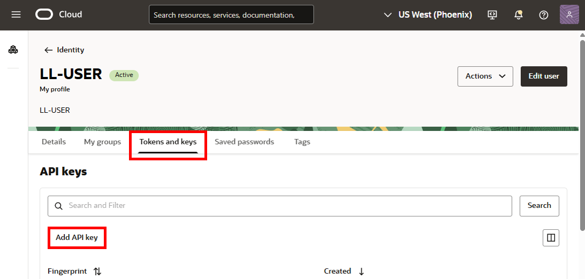

4.  In the Add API Key dialog, select **Generate API key pair**, click **Download Private Key** to download the key, and then click **Add**.

    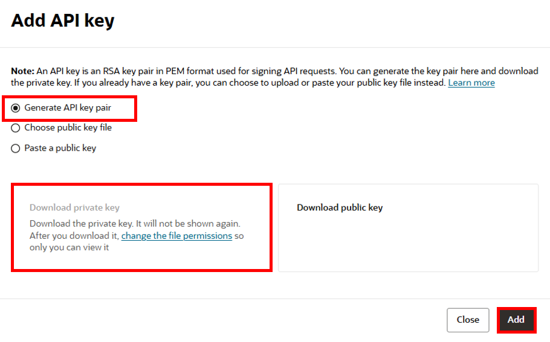

5.  In the Configuration File Preview dialog, copy the fingerprint to a text editor, and then click **Close**.

> **Note:** Compartment names in the screenshots may differ from values that appear in your environment.

## Task 1: Create a deployment for MySQL Heatwave

1.  Open the Oracle Cloud console navigation menu, click **Oracle Database**, and then click **GoldenGate**.

    

2.  On the GoldenGate **Overview** page, click **Deployments**.

    

3.  You may need to select a compartment.

    > **Note:** If you're running this workshop in a LiveLabs sandbox, then under List Scope, from the Compartment dropdown, expand the root compartment, and select the compartment associated with your username. For example, if your LiveLab username is LL1234-user, expand root, and then select the compartment **LL1234-COMPARTMENT**.

4.  On the Deployments page, click **Create Deployment**.

    

5.  In the Create Deployment panel, enter `MySQLDeployment` for **Name**.

6.  From the Compartment dropdown, select **&lt;USER&gt;-COMPARTMENT**.

7. For Choose a deployment type, select **Data replication**.

8. For Select a technology dropdown, select **MySQL**.

    

9.  Select **Development or testing**. OCPU Count updates based on your selection.

    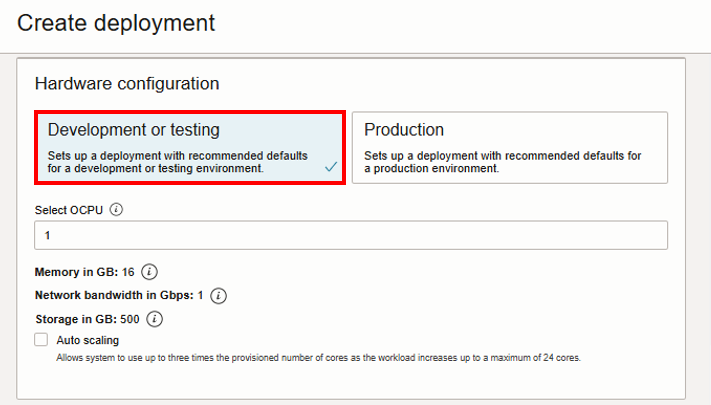

10. Select a **Compartment** from the dropdown. For **Subnet**, select a subnet. If you're using the workshop environment, select **&lt;USER&gt;-SUBNET-PRIVATE**.

11.  For License type, select **Bring Your Own License (BYOL)**.

12. For GoldenGate Instance Name, enter **ggsinstance**

13. For Administrator Username, enter **oggadmin**.

14. Select a **Compartment** from the dropdown. For **Password secret**, select a password secret from the dropdown.

  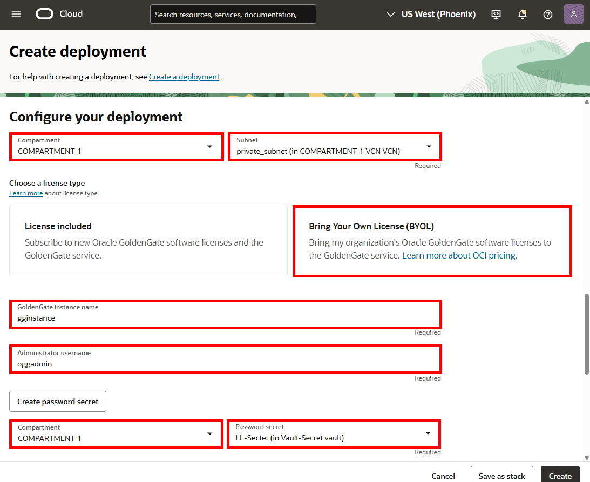

15. Click **Show advanced options**, and then select **Enable GoldenGate console public access**.

16. For Load balancer subnet, select a subnet. If you're using the workshop environment, select **&lt;USER&gt;-SUBNET-PUBLIC**.

17. Click **Create**.

  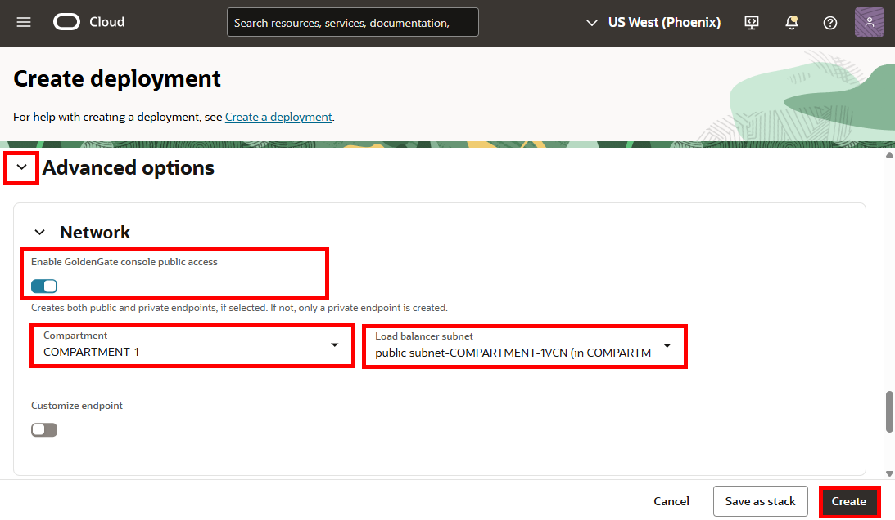

You're brought to the Deployment Details page. It takes a few minutes for the deployment to be created. Its status changes from CREATING to ACTIVE when it's ready for you to use. You can continue with Tasks 2, 3, and 4 while you wait for the deployment creation to complete.

## Task 2: Create a deployment for Autonomous Data Warehouse

1.  On the Deployments page, click **Create Deployment**.

2.  In the Create Deployment panel, enter `ADWDeployment` for **Name**.

3.  From the Compartment dropdown, select **&lt;USER&gt;-COMPARTMENT**.

4. For Choose a deployment type, select **Data replication**.

5. For Select a technology dropdown, select **Oracle Database**.

  

6.  Select **Development or testing**. OCPU Count updates based on your selection.

    

7. For **Subnet**, select a subnet. If you're using the workshop environment, select **&lt;USER&gt;-SUBNET-PRIVATE**.

8.  For License type, select **Bring Your Own License (BYOL)**.

9. For GoldenGate Instance Name, enter **ggsinstance**

11. For Administrator Username, enter **oggadmin**.

12. Select a **Compartment** from the dropdown. For Password secret select **LLSecret** from the dropdown.

  

13. Click **Show advanced options**, and then select **Enable GoldenGate console public access**.

14. For Load balancer subnet, select a subnet. If you're using the workshop environment, select **&lt;USER&gt;-SUBNET-PUBLIC**.

15. Click **Create**.

  

You're brought to the deployment details page. It takes a few minutes for the deployment to be created. Its status will change from CREATING to ACTIVE when it is ready for you to use.

## Task 3: Create a connection to the source MySQL database

1.  Use the Oracle Cloud Console breadcrumb to navigate back to the Deployments page.

2.  In the GoldenGate menu, click **Connections**.

3.  Click **Create Connection**.

    

4.  In the Create Connection panel, for Name, enter `SourceMySQL`.

5. From the Compartment dropdown, select **&lt;USER&gt;-COMPARTMENT**.

6. From the Type dropdown, select **Heatwave on OCI**.

    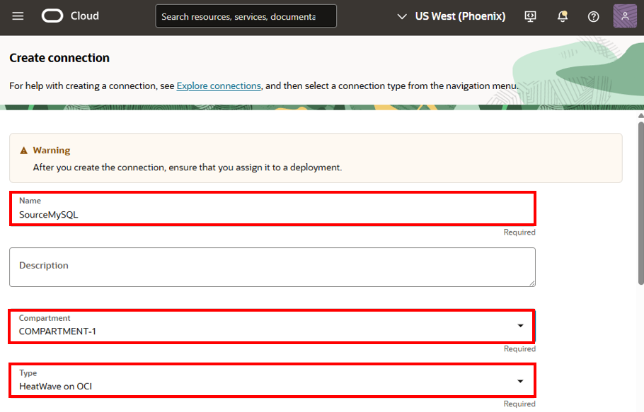

7. Under **Database details**, choose **Select MySQL database system**.

8. Select a **Compartment** from the dropdown. Select the source MySQL Database system (SourceMySQL) from the Database system dropdown.

9.  For Database name, enter `SRC_OCIGGLL`.

    >**Note:** If running this lab on your own tenancy using the sample scripts provided, this is the name of the database table created in the environment setup lab.

10.  For Database username, enter `ggadmin`.

11. Select a **Compartment** from the dropdown. For Database user password secret select **LLSecret** from the dropdown.

12. For **Security protocol**, select **Plain** from the dropdown.

13. Click **Create**.

    

The connection becomes Active after a few minutes. Return to the Connections page.

## Task 4: Create a connection to the target Autonomous Data Warehouse

1.  On the Connections page, click **Create Connection**

2. The Create connection panel appears. For Name, enter **TargetADW** and optionally, a description.

3.  From the **Compartment** dropdown, select a compartment.

4.  From the a Type dropdown, select **Oracle Autonomous Database**.

5.  For Database details, select **Select database**.

    

6. Select a **Compartment** from the dropdown. For **Database in &lt;compartment-name&gt;**, select **TargetADW-&lt;numbers&gt;** from the dropdown. 

7. For Database username, enter `ggadmin`.

8. Select a **Compartment** from the dropdown. For Database user password secret select **LLSecret** from the dropdown.

9. Click **Create**.

    

The connection becomes Active after a few minutes.

## Task 5: Assign connections to deployments

After your deployments and connections are active, you can assign the connections to the appropriate deployments.

1.  In the GoldenGate menu, click **Deployments**.

2.  Select **MySQLDeployment** to view its details.

3.  On the MySQLDeployment details page, click **Assigned connections**.

4.  Under Assigned connections, click **Assign connection**.

    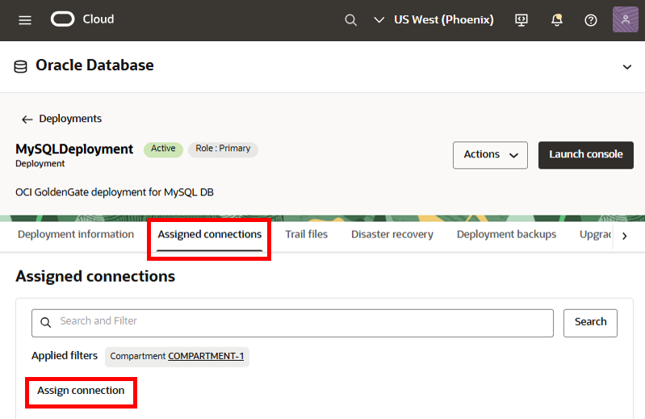

5.  In the Assign connection dialog, from the **Connection** dropdown, select **SourceMySQL**, and then click **Assign connection**.

    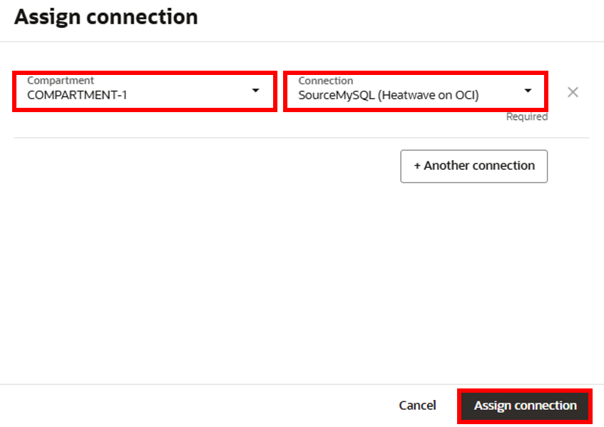

    The connection appears in the Assigned Connections list.

6.  Return to the Deployments page.

7.  Repeat steps 2 to 6 to assign the **TargetADW** connection to the **ADWDeployment**.

    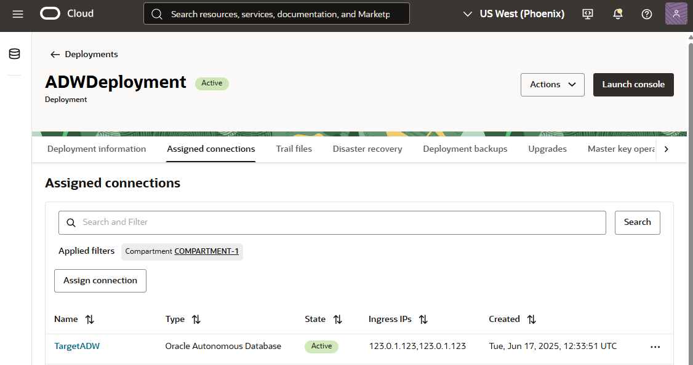

## Task 6: (Optional) Create a GoldenGate connection

Create a GoldenGate connection if your ADW deployment doesn't have a public endpoint, then assign it to the source MySQL deployment.

1.  On the Connections page, click **Create Connection**.

2.  In the Create connection panel, enter a **Name** and **Description**.

3.  For **Compartment**, select the compartment in which to create this connection.

4.  For **Type**, select **GoldenGate**.

5.  Under **GoldenGate deployment**, choose **Select GoldenGate deployment**.

6.  For Deployment, select **ADWDeployment**.

7.  For Database username, enter `ggadmin`.

8.  For Database user password secret, select the same password secret used earlier.

9. Click **Create**.

    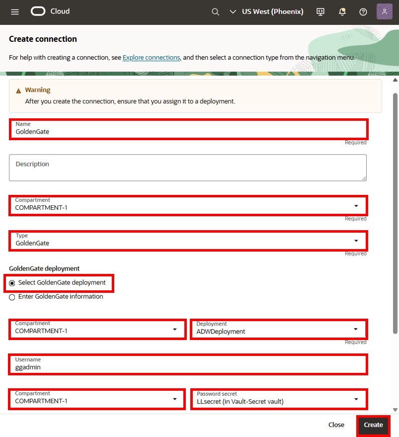

10. After the connection is active, on its details page, under **Resources**, click **Assigned deployments**.

11. Click **Assign deployment**.

12. In the Assign deployment dialog, select the source **MySQLDeployment**, and then click **Assign deployment**.

**Proceed to the next lab**.

## Learn more

* [Create a deployments](https://docs.oracle.com/en/cloud/paas/goldengate-service/llyhq/index.html)
* [Create a connection to Autonomous Database](https://docs.oracle.com/en/cloud/paas/goldengate-service/tqrlh/index.html)
* [Create a connection to OCI Object Storage](https://docs.oracle.com/en/cloud/paas/goldengate-service/sjsrj/index.html)
* [Assign connections to a deployment](https://docs.oracle.com/en/cloud/paas/goldengate-service/qsqts/index.html)

## Acknowledgements
* **Author** - Jenny Chan, Consulting User Assistance Developer, Database User Assistance
* **Contributors** -  Julien Testut, Database Product Management
* **Last Updated By/Date** - Katherine Wardhana, June 2025
* **PAR Expiration** - February 2030
