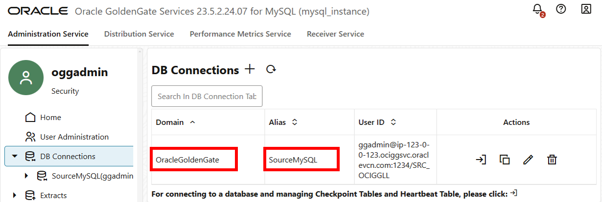
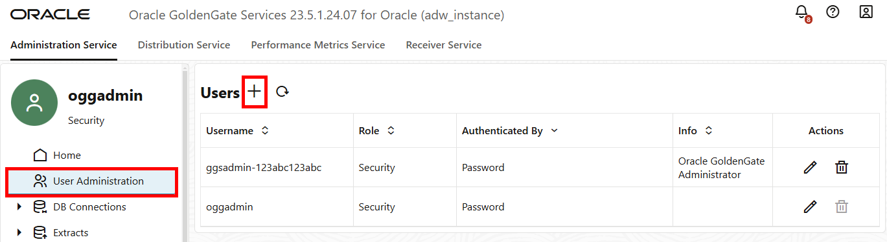

# Create MySQL Extracts

## Introduction

This lab walks you through the steps to create Extracts and Distribution Paths on the source MySQL deployment.

Estimated time: 30 minutes

### About Extracts and Distribution Paths

An Extract is a process that extracts, or captures, data from a source database. A Distribution Path is a source-to-destination configuration that uses the Distribution Server to send data to a target deployment in a distributed environment.

### Objectives

In this lab, you will:
* Create an Initial Load Extract
* Create a Distribution Path for the Initial Load Extract
* Create a Change Data Capture Extract
* Create a Distribution Path for the Change Data Capture Extract

### Prerequisites

To successfully complete this lab, you need:
* Both the source and target deployments are in the Active state
* The oggadmin password for the source MySQL OCI GoldenGate deployment (Lab 1, Task 1, Step 15)
* The oggadmin password for the target ADW OCI GoldenGate deployment (Lab 1, Task 2, Step 11)

## Task 1: Create the Initial Load Extract

1.  On the Deployments page, select the source MySQL deployment to view its details.

2.  On the Deployment details page, click **Launch console**.

    

3.  On the OCI GoldenGate deployment console sign in page, enter `oggadmin` for User Name, enter the password, and then click **Sign In**.

    

4.  Open the navigation menu, and then click **Configuration**.

    

5.  On the Credentials page, locate **SourceMySQL**, and then take note of its **Domain** and **Alias**.

    

6.  In the navigation menu, click **Overview**.

7.  On the Overview page, click **Add Extract** (plus icon)

    

8.  On the Add Extract page, for Extract type, select **Initial Load Extract**, and then click **Next**.

    

9.  On the Extract Options page, complete the fields as follows, and then click **Next**:
    * For **Process Name**, enter `ILEXT`.
    * For **Credential Domain**, select the domain from Step 5.
    * For **Credential Alias**, select the alias from Step 5.
    * For Trail Name, enter `I1`.

    

13. On the Parameter File page, in the text area, replace `TABLE *.*` with the following:

    ```
    <copy>TABLE SRC_OCIGGLL.*;</copy>
    ```

14. Click **Create and Run**. You return to the Administration Service Overview page where you can observe the ILEXT process starting. The ILEXT icon changes from a yellow question mark to a green checkmark if it starts successfully.

    

## Task 2: Create the Change Data Capture Extract

1.  On the Overview page, click **Add Extract** (plus icon)

2.  On the Add Extract page, for Extract type, select **Change Data Capture Extract**, and then click **Next**.

    

3.  On the Extract Options page, for **Process Name**, enter `CDCEXT`.

4.  For **Credential Domain**, select the domain from Task 1 Step 5.

5.  For **Credential Alias**, select the alias from Task 1 Step 5.

6.  For **Trail Name**, enter `C1`.

7.  Enable **Remote**.

8.  Click **Next**.

9.  On the Parameter File page, in the text area, confirm that `TRANLOGOPTIONS ALTLOGDEST REMOTE` appears in the parameter list, and then add the following:

    ```
    <copy>TABLE SRC_OCIGGLL.*;</copy>
    ```

10. Click **Create and Run**.

You return to the Administration Service Overview page where you can observe the CDCEXT process starting. The CDCEXT icon changes from a yellow question mark to a green checkmark if it starts successfully.

## Task 3: Create an OCI GoldenGate user
In this task, you create a user in the target deployment for the Distribution Paths to use to send data.

1.  In the Oracle Cloud console, on the **Deployments** page, select the target Autonomous Data Warehouse deployment to view its details.

2.  On the deployment details page, click **Launch console**.

3.  On the OCI GoldenGate deployment console sign in page, enter `oggadmin` for User Name, enter the password, and then click **Sign In**.

    

4.  Open the navigation menu, and then click **Administrator**.

    

5.  Click **Add New User** (plus icon).

    

6.  Complete the fields as follows, and then click **Submit**:
    * For **Username**, enter `ggsnet`.
    * For **Role**, select **Administartor**.
    * Enter a password for this user, and then enter it again for verification.

    

    The ggsnet user appears in the Users list.

7.  In the source MySQL OCI GoldenGate deployment console, open the navigation menu and then click **Configuration**.

8.  On the Credentials page, click **Add Credential**.

9.  Complete the fields as follows, and then click Submit:
    * For **Credential Domain**, enter `GGSNetwork`.
    * For **Credential Alias**, enter `dpuser`.
    * For **User ID**, enter `ggsnet`.
    * For **Password**, enter the password from Step 6.

    The credential appears in the Credentials list.

## Task 4: Create the Distribution Path for the Initial Load Extract

1.  In the source MySQL OCI GoldenGate deployment console, click **Distribution Service**.

2.  On the Distribution Service Overview page, click **Add Path** (plus icon).

3.  Complete the following fields, and then click **Create and Run**:
    * For **Path Name**, enter a name for this path. For example, `ILDP`.
    * For **Source Trail**, leave blank.
    * For **Trail Name**, enter the Initial Load Extract Trail name (`I1`).
    * For **Target Authentication Method**, select **UserID Alias**.
    * For **Target**, select **wss**.
    * For **Target Host**, enter the target ADW OCI GoldenGate deployment console URL, without the https:// or any trailing slashes. You can copy the console URL from the ADWDeployment details page.
    * For **Port Number**, enter `443`.
    * For **Trail Name**, enter `I1`.
    * For **Domain**, enter the domain name from Task 3, Step 9. For example, `GGSNetwork`.
    * For **Alias**, enter the alias from Task 3, Step 9. For example, `dpuser`.

    You return to the Distribution Service Overview page where you can review the path created.

4.  In the target ADW OCI GoldenGate deployment console, click Receiver Service to review the Receiver Path created as a result of creating the `ILDP` Distribution Path.

## Task 5: Create the Distribution Path for the Change Data Capture Extract

1.  In the source MySQL OCI GoldenGate deployment console, click **Distribution Service**.

2.  On the Distribution Service Overview page, click **Add Path** (plus icon).

3.  Complete the following fields, and then click **Create and Run**:
    * For **Path Name**, enter a name for this path. For example, `CDCDP`.
    * For **Source Extract**, select the Change Data Capture Extract (`CDCEXT`).
    * For **Trail Name**, enter the Change Data Capture Extract Trail name (`C1`).
    * For **Target Authentication Method**, select **UserID Alias**.
    * For **Target**, select **wss**.
    * For **Target Host**, enter the target ADW OCI GoldenGate deployment console URL, without the https:// or any trailing slashes. You can copy the console URL from the ADWDeployment details page.
    * For **Port Number**, enter `443`.
    * For **Trail Name**, enter `C1`.
    * For **Domain**, enter the domain name from Task 3, Step 9. For example, `GGSNetwork`.
    * For **Alias**, enter the alias from Task 3, Step 9. For example, `dpuser`.

    You return to the Distribution Service Overview page where you can review the path created.

4.  In the target ADW OCI GoldenGate deployment console, click Receiver Service to review the Receiver Path created as a result of creating the `CDCDP` Distribution Path.

## Learn more

* [Explore the OCI GoldenGate deployment console](https://docs.oracle.com/en/cloud/paas/goldengate-service/jbkyg/index.html)
* [Add an Extract for MySQL](https://docs.oracle.com/en/cloud/paas/goldengate-service/ufidx/index.html)
* [Add a Distribution Path](https://docs.oracle.com/en/cloud/paas/goldengate-service/adpen/index.html)

## Acknowledgements
* **Author** - Jenny Chan, Consulting User Assistance Developer, Database User Assistance
* **Contributors** -  Julien Testut, Database Product Management
* **Last Updated By/Date** - Jenny Chan, July 2022
