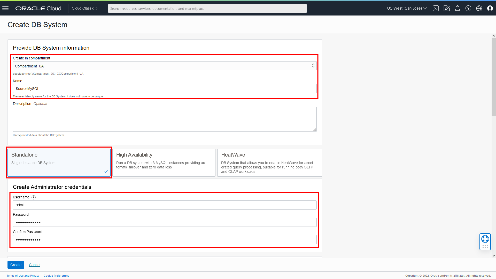
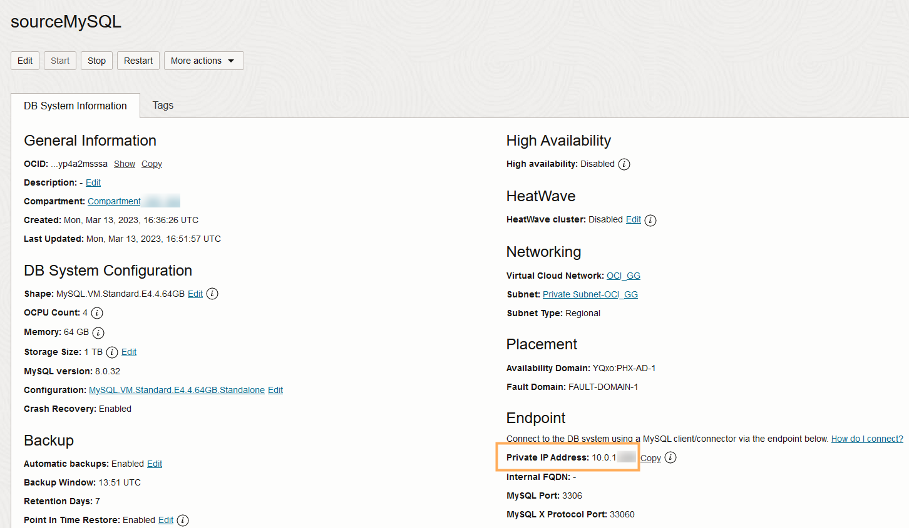
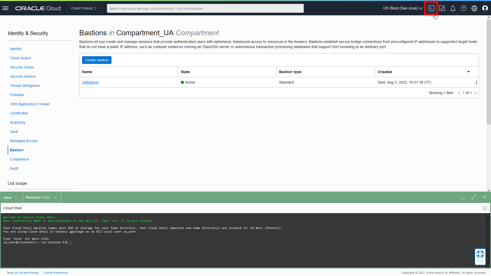
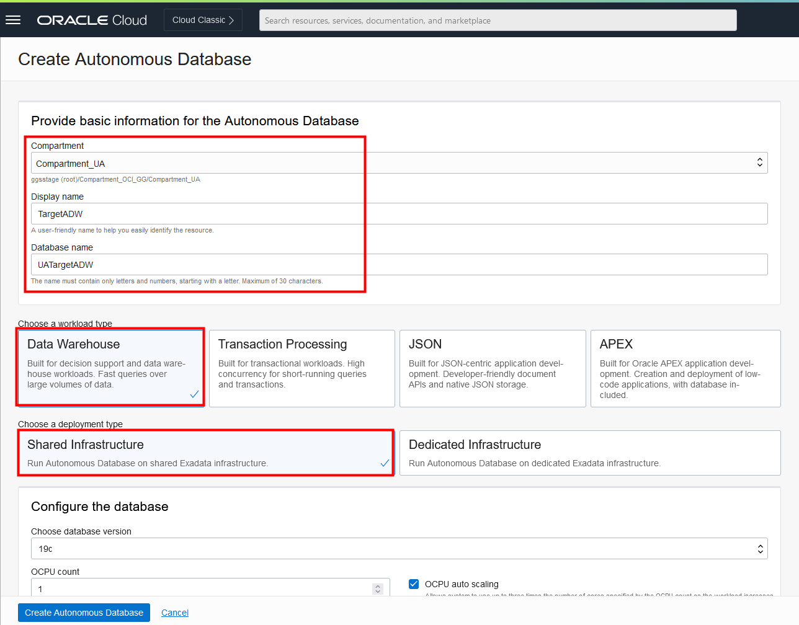
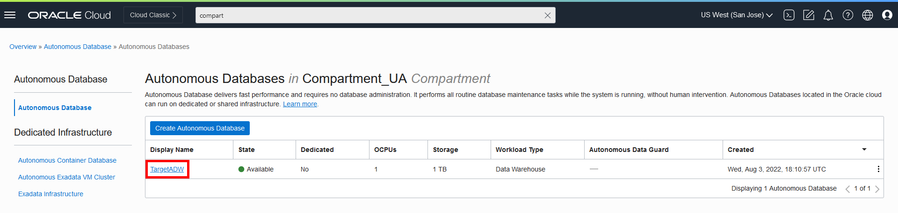

# Set up the environment

## Introduction

This lab walks you through the steps to create the resources required to complete this workshop. We'll show you how to create a VCN and subnet, a bastion, provision OCI MySQL Database and autonomous database instances, and load data into the databases.

Estimated time: 30 mins

### Objectives

-  Provision a VCN and subnet
-  Create a bastion
-  Provision, connect, and load data into an OCI MySQL Database system
-  Provision, connect, load target schemas in to an Autonomous Data Warehouse (ADW) instance

### Prerequisites

This lab assumes you have completed the following labs:
* Sign Up for Free Tier/Login to Oracle Cloud

> **Note:** *You may see differences in account details (eg: Compartment Name is different in different places) as you work through the labs. This is because the workshop was developed using different accounts over time.*

In this section, you will provision a VCN and subnet, ATP and ADW instances, and load data to use with OCI GoldenGate.

> **Note:** *This workshop was designed to use Oracle Autonomous Databases as the source and target. If you plan to use Oracle Database, ensure that you use the CDB user to capture data from the PDBs.*

## Task 1: Create a VCN and subnet

1.  Open the **Navigation Menu**, navigate to **Networking**, and select **Virtual Cloud Networks**.

	

2.  On the **Virtual Cloud Networks in &lt;compartment-name&gt;** page, click **Start VCN Wizard**.

	

3.  In the Start VCN Wizard dialog, select **VCN with Internet Connectivity**, and then click **Start VCN Wizard.**

    

4.  Enter a name for the VCN, select a compartment, and then click **Next**.

    

5.  Verify the configuration, and then click **Create**.

    

You can click **View VCN Details** and see both a Public and Private subnet were created.

## Task 2: Create an OCI MySQL Database System

1.  In the Oracle Cloud console navigation menu, click **Databases**, and then click **MySQL**.

 	

2.  On the MySQL DB Systems page, click **Create DB System**.

	

3.  On the Create DB system page, under **Provide DB System** information, select a compartment in which to create the MySQL DB system.

4.  For **Name**, leave the default, or replace the default with a name of your choice. For example, `SourceMySQL`.

5.  (Optional) For Description, enter a description for the MySQL DB system.

6.  Select **Standalone**.

7.  Under **Create Administrator credentials**, for Username, enter `admin`, and then enter a password for the ggadmin user. Take note of this password.

	

8.  Under **Configure networking**, select the **VCN** and **Subnet** created in Task 1.

9.  Under **Configure placement**, select an Availability Domain.

10. Click **Create**.

11. On the DB System details page, copy the Private IP Address.

	

You're returned to the DB Systems page where the MySQL DB System you created appears. It will take a few minutes for the system to become Active.

## Task 3: Create a bastion and session

1.  In the Oracle Cloud console navigation menu, click **Identity & Security**, and then click **Bastion**.

	

2.  On the Bastions page, click **Create bastion**.

	

3.  In the Create bastion panel, for **Name**, leave the default or replace the default with the name of your choice.

4.  Under **Configure networking**, select the VCN and subnet in which your MySQL DB system resides.

5.  For **CIDR block allowlist**, enter `0.0.0.0/0` and then select **0.0.0.0/0 (New)** in the dropdown menu to add it.

	

6.  Click **Create bastion**. The bastion appears in the Bastion list and takes a few minutes to become Active.

7.  After the bastion is Active, select it to view its details.

8.  On the bastion details page, click **Create session**.

	

9.  In the Create session panel, for **Session type**, select **SSH port forwarding session**.

	

10. For IP address, paste the private IP address copied from the SourceMySQL database details page in Task 2 Step 11.

11. For port, enter `3306`.

12. Under Add SSH Key, you can upload an existing key or generate a new SSH key pair.

	>**Note:** *If you select **Generate SSH key pair**, ensure that you download and save the private key.*

13. Click **Create session**. The session takes a few minutes to become Active.

14. After the session is Active, select **Copy SSH command** from the session's Action (three dots) menu.

	

## Task 4: Load data into the MySQL DB System

1.  In the Oracle Cloud console global header, click **Cloud Shell**. Cloud Shell opens in a panel at the bottom of the console.

	

2.  Open the Cloud Shell menu (gear icon) and then select **Upload**.

	

3.  In the Upload dialog window, upload the private key associated with the SSH key used to create the bastion in Task 3 Step 12.

	>**Note:** *You can Hide the upload window after the upload completes.*

4.  Paste the SSH command copied from the bastion session in Task 3 Step 14. Replace `<privateKey>` with the name if the private you uploaded to Cloud Shell and `<localPort>` with any valid port number.

5.  Run the command.

	>**Note:** *If you're warned that your private key is too open, run `chmod 600 <privateKey>` and then try again. After the host is added to the list of known hosts, you can add an ampersand (&) to the end of the command to have it run in the background.*

6.  Run `mysqlsh admin@localhost:3306 --sql` and then enter the MySQL database admin password from Task 2 Step 7.

2.  Download and run the sample data script.

	 [seedSRCOCIGGL_MySQL.sql](https://objectstorage.us-ashburn-1.oraclecloud.com/p/VEKec7t0mGwBkJX92Jn0nMptuXIlEpJ5XJA-A6C9PymRgY2LhKbjWqHeB5rVBbaV/n/c4u04/b/livelabsfiles/o/data-management-library-files/seedSRCOCIGGL_MySQL.sql)

3.  Create the ggadmin user using the following script. Ensure that you replace `<ggadmin-password>` with a valid password.

		<copy>CREATE USER 'ggadmin' IDENTIFIED BY '<ggadmin-password>';
		GRANT SELECT, REPLICATION SLAVE, REPLICATION CLIENT, CREATE,CREATE VIEW, EVENT, INSERT, UPDATE, DROP,EXECUTE, DELETE ON *.* TO 'ggadmin';</copy>

4.  Close Cloud Shell.

## Task 5: Create an ADW Instance

1.  Open the **Navigation Menu**, navigate to **Oracle Database**, and select **Autonomous Data Warehouse**.

	

2.  Click **Create Autonomous Database**.

  

3.  On the Create Autonomous Database page, select a **Compartment** from the dropdown. (Note that yours will be different - do not select **ManagedCompartmentforPaaS**).

4.  Enter **TargetADW** for **Display Name** and **Database Name**.

5.  Under **Choose a workload type**, select **Data Warehouse**.

6.  Under **Choose a deployment type**, select **Shared Infrastructure**.

	

7.  Under Create administrator credentials, enter a password and confirm the password. Note the password down in a notepad, you will need it later.

8.  Under **Choose a license type**, select **License Included**.

9.  Click **Create Autonomous Database**.

The Autonomous Data Warehouse instance appears in the list of databases. It becomes active in a few minutes.

## Task 6: Load the ADW schema

1.  After the instance becomes Active, select it to view its details and access tools.

    

2.  Click **Database Actions**.

3.  If prompted, log in with the ADMIN user and password provided when you created the ADW instance.

    

4.  From the Database Actions menu, under **Development**, select **SQL**.

    

5.  Download the sample database schema:

	[Archive.zip](https://objectstorage.us-ashburn-1.oraclecloud.com/p/VEKec7t0mGwBkJX92Jn0nMptuXIlEpJ5XJA-A6C9PymRgY2LhKbjWqHeB5rVBbaV/n/c4u04/b/livelabsfiles/o/data-management-library-files/Archive.zip)

6.  Copy the SQL script from **OCIGGLL\_OCIGGS\_SETUP\_USERS\_ADW.sql** paste it into the SQL Worksheet.

    

7.  Click **Run Script**. The Script Output tab displays confirmation messages.

8.  Copy the SQL scripts from **OCIGGLL\_OCIGGS\_SRC\_MIRROR\_USER\_SEED\_DATA.sql** and paste it into a new SQL Worksheet.

    

		>**Note:** *If you find that running the entire script does not create the tables, then try running each block of table creation and insert statements one at a time until all the tables are created. You may also need to relaunch SQL to continue running the scripts until all tables are created and populated.*

9.  Click **Run Script**. The Script Output tab displays confirmation messages.

10. In the Navigator tab, look for the SRCMIRROR\_OCIGGLL schema and then select tables from their respective dropdowns to verify the schema and tables created. You may need to log out and log back in if you can't locate SRCMIRROR\_OCIGGLL.

**Proceed to the next lab.**

## Acknowledgements

- **Author** - Jenny Chan, Consulting User Assistance Developer
- **Contributor** - Julien Testut, Database Product Management
- **Last Updated by** - Jenny Chan, July 2022
- **PAR Expiration date** - February 2024
