# Set up the environment

## Introduction

This lab walks you through the steps to create the resources required to complete this workshop. You'll learn to create a VCN and subnet, a bastion, provision MySQL HeatWave and Autonomous Database instances, and load data into the databases.

Estimated time: 30 mins

### Objectives

-  Provision a VCN and subnet
-  Create a bastion
-  Provision, connect, and load data into a MySQL Heatwave system
-  Provision, connect, load target schemas into an Autonomous Data Warehouse (ADW) instance

### Prerequisites

This lab assumes you have completed the Get started lab.

> **Note:** You may see differences in account details (eg: Compartment Name is different in different places) as you work through the labs. This is because the workshop was developed using different accounts over time.

In this section, you will provision a VCN and subnet, ATP and ADW instances, and load data to use with OCI GoldenGate.

## Task 1: Create a VCN and subnet

1.  Open the **Navigation Menu**, navigate to **Networking**, and select **Virtual Cloud Networks**.

	

2.  On the **Virtual Cloud Networks in &lt;compartment-name&gt;** page, from the **Actions** menu, select **Start VCN Wizard**.

	

3.  In the Start VCN Wizard dialog, select **Create VCN with Internet Connectivity**, and then click **Start VCN Wizard.**

    

4.  Enter a name for the VCN, select a compartment, and then click **Next**.

    

5.  Verify the configuration, and then click **Create**.

    

6.  Click **View VCN Details** and see both a Public and Private subnet were created.

7.  Select the **Public** subnet, and then on the navigation menu, click **Security**.

8.  Click **Add Security List**.

	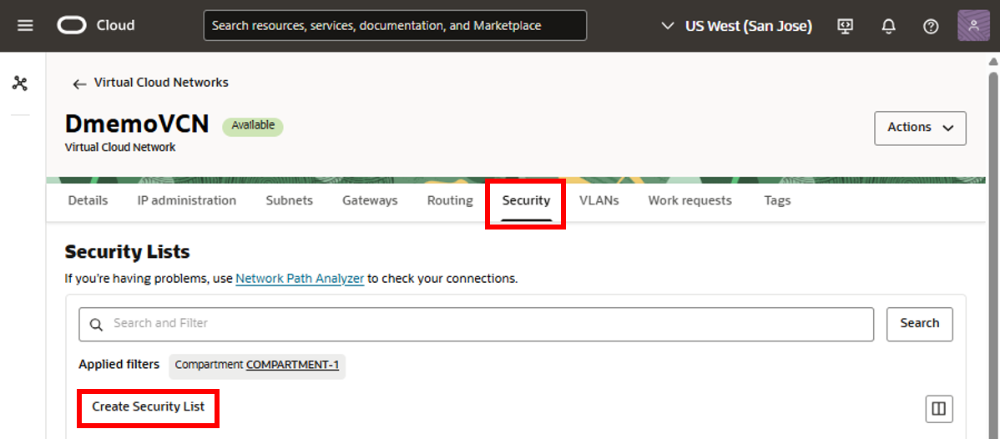

9.  In the **Create Security List** panel, enter a name.

10. For **Create in Compartment**, select a compartment.

11. Click **+ Another Ingress Rule**.

	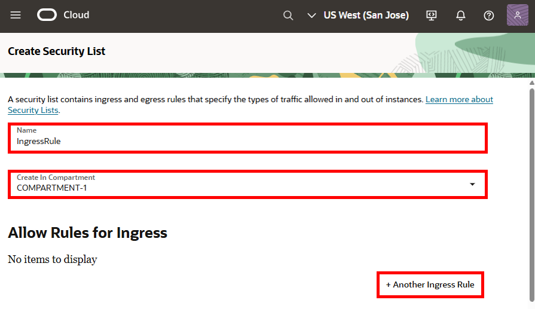

12. For **Source Type**, select **CIDR**.

10. For **Source CIDR**, enter `0.0.0.0/0`.

11. For IP Protocol, select **TCP**.

12. For Destination Port Range, enter `3306`.

13. For Description, enter `For MySQL access`, and then click **Create Security List**.

	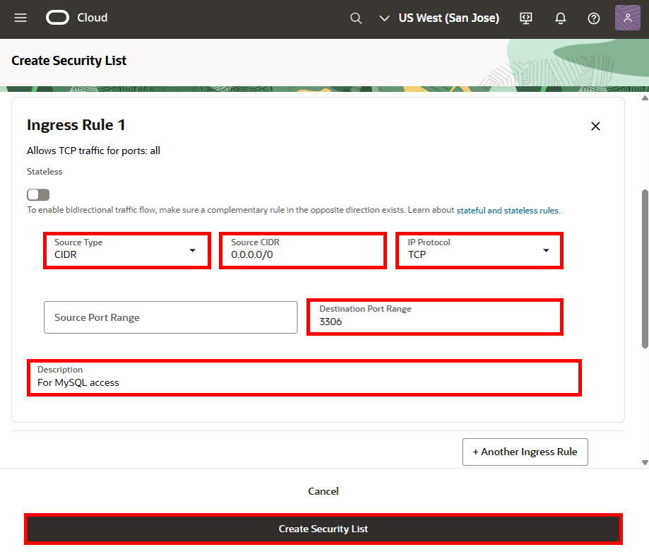

## Task 2: Create a MySQL Heatwave System

1.  In the Oracle Cloud console navigation menu, click **Databases**, and then under HeatWave MySQL, select **DB Systems**.

	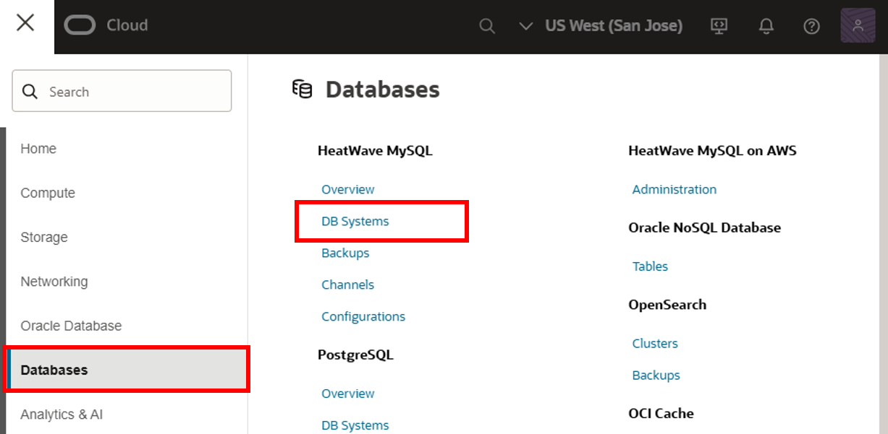

2.  On the MySQL DB Systems page, click **Create DB System**.

	

3. On the Create DB system page, select **Development or testing**

4.  For **Create in Compartment**, select a compartment in which to create the MySQL DB system.

5.  For **Name**, leave the default, or replace the default with a name of your choice. For example, `SourceMySQL`.

6.  (Optional) For Description, enter a description for the MySQL DB system.

	

7.  Under **Create administrator credentials**, for Username, enter `ggadmin`, and then enter a password for the admin user. Take note of this password.

8.  Select **Standalone**.

9.  Under **Configure networking**, select the **VCN** and **Subnet** created in Task 1.

10.  Click **Create**.

	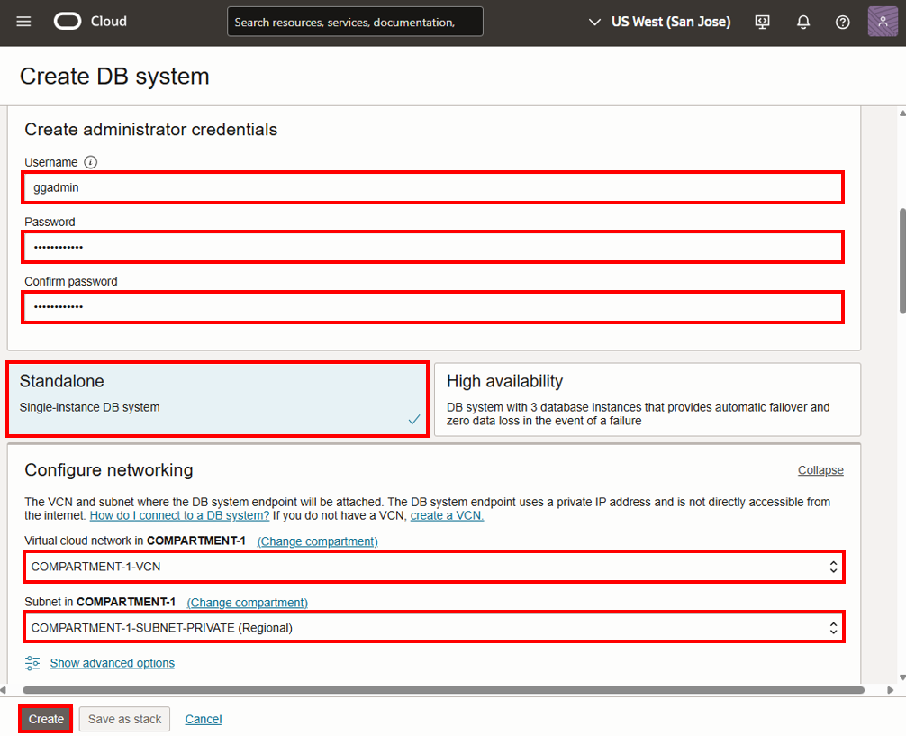

	You're returned to the DB Systems page where the MySQL DB System you created appears. It will take a few minutes for the system to become Active.

11. On the DB System details page, under Resources, select **Endpoints**. 

12. In the Endpoints section, select the listed endpoint.

	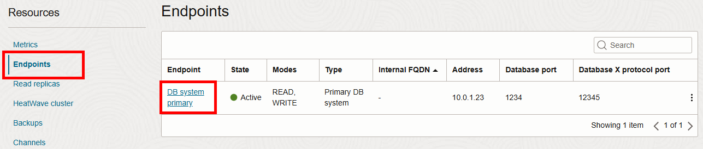

13. On the DB system details endpoint page, under **Primary DB system endpoint information**, copy the **Private IP Address** onto an external document.

	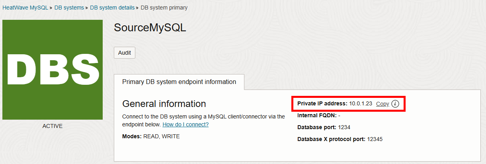

## Task 3A: Create a bastion and session

> **Note:** Create a bastion and session only if your OCI GoldenGate deployment and MySQL Heatwave system are **not** located in the same region. If they're in the same Home region, skip to Task 3B.

1.  In the Oracle Cloud console navigation menu, click **Identity & Security**, and then click **Bastion**.

	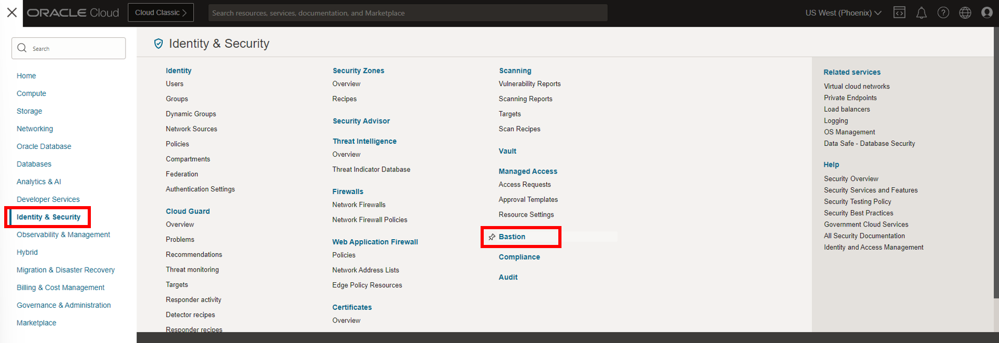

2.  On the Bastions page, click **Create bastion**.

	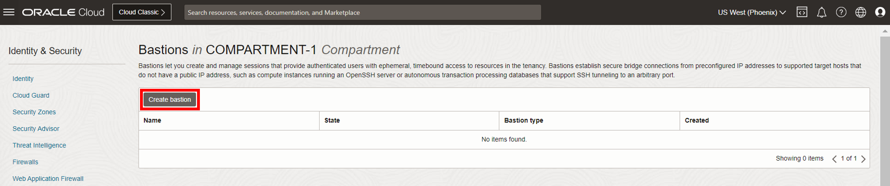

3.  In the Create bastion panel, for **Name**, leave the default or replace the default with the name of your choice.

4.  Under **Configure networking**, select the VCN and subnet in which your MySQL DB system resides.

5.  For **CIDR block allowlist**, enter `0.0.0.0/0` and then select **Add to list** in the dropdown menu to add it.

6.  Click **Create bastion**. The bastion appears in the Bastion list and takes a few minutes to become Active.

	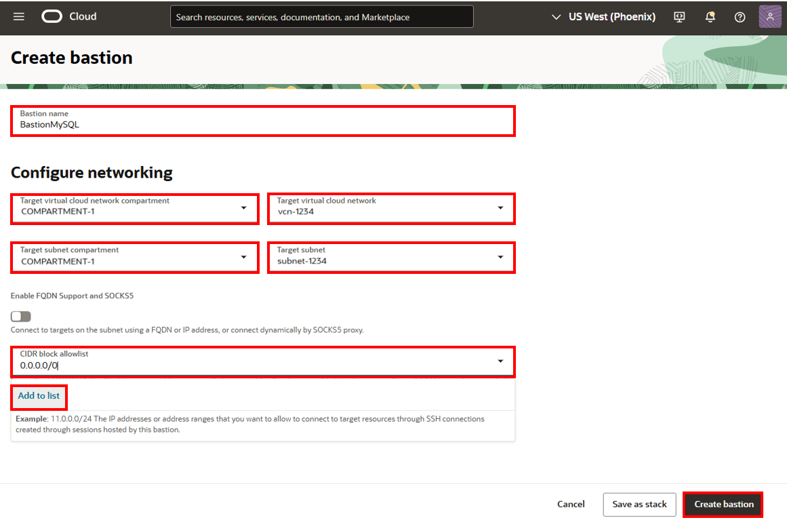

7.  After the bastion is Active, select it to view its details.

8.  On the bastion details page, click **Create session**.

	

9.  In the Create session panel, for **Session type**, select **SSH port forwarding session**

10. For IP address, paste the private IP address copied from the SourceMySQL database details page in Task 2 Step 11.

11. For port, enter `3306`.

12. Under Add SSH Key, you can upload an existing key or generate a new SSH key pair.

	>**Note:** If you select **Generate SSH key pair**, ensure that you download and save the private key.

13. Click **Create session**. The session takes a few minutes to become Active.

	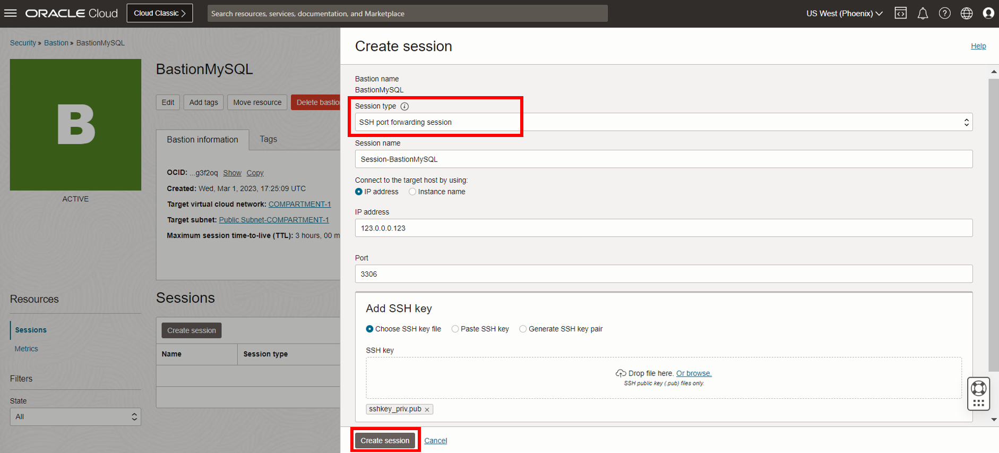

14. After the session is Active, select **Copy SSH command** from the session's Action (three dots) menu.

	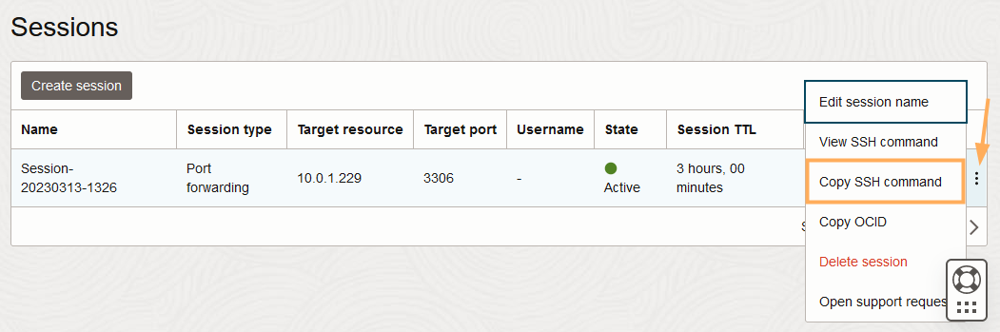

## Task 3B: Using CloudShell to connect to the private network

If working within the same Home region for OCI GoldenGate and MySQL Heatwave, then you can use CloudShell to connect to the private network.

1.  After your HeatWave DB system becomes active, click **Developer tools** in the Oracle Cloud console global header, and then select **Cloud Shell**.

	

2.  After CloudShell opens and initializes, click **Network: Public**, and then select **Ephemeral Private Network Setup**.

	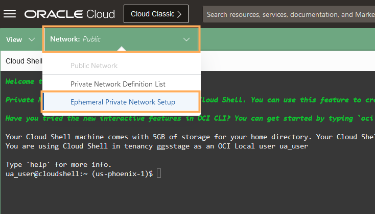

3.  Select the VCN and Subnet your HeatWave DB system uses, and then click **Use as active network**.

4.  After CloudShell is connected to the private network, enter the following command to connect to the MySQL database:

	> **Note:** Ensure that you replace `<mysql-db-privateIP>` with the private IP of your MySQL database.

		<copy>mysqlsh admin@<mysql-db-privateIP>:3306 --sql</copy>

5.  Proceed to Task 4, Step 7.

## Task 4: Load data into the HeatWave DB system

1.  In the Oracle Cloud console global header, click **Developer tools**, and then select **Cloud Shell**. Cloud Shell opens in a panel at the bottom of the console.

	

2.  Open the Cloud Shell menu (gear icon) and then select **Upload**.

	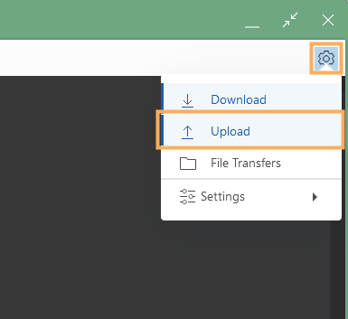

3.  In the Upload dialog window, upload the private key associated with the SSH key used to create the bastion in Task 3 Step 12.

	>**Note:** You can Hide the upload window after the upload completes.

4.  Paste the SSH command copied from the bastion session in Task 3 Step 14. Replace `<privateKey>` with the name if the private you uploaded to Cloud Shell and `<localPort>` with any valid port number.

5.  Run the command.

	>**Note:** If you're warned that your private key is too open, run `chmod 600 <privateKey>` and then try again. After the host is added to the list of known hosts, you can add an ampersand (&) to the end of the command to have it run in the background.

6.  Run the following command and then enter the MySQL database admin password from Task 2 Step 7.

		<copy>mysqlsh admin@localhost:3306 --sql</copy>

7.  Download and run the sample data script.

	 [seedSRCOCIGGL_MySQL.sql](https://c4u04.objectstorage.us-ashburn-1.oci.customer-oci.com/p/EcTjWk2IuZPZeNnD_fYMcgUhdNDIDA6rt9gaFj_WZMiL7VvxPBNMY60837hu5hga/n/c4u04/b/livelabsfiles/o/data-management-library-files/seedSRCOCIGGL_MySQL.sql)

8.  Create the ggadmin user using the following script. Ensure that you replace `<ggadmin-password>` with a valid password.

		<copy>CREATE USER 'ggadmin' IDENTIFIED BY '<ggadmin-password>';
		GRANT SELECT, REPLICATION SLAVE, REPLICATION CLIENT, CREATE,CREATE VIEW, EVENT, INSERT, UPDATE, DROP,EXECUTE, DELETE ON *.* TO 'ggadmin';</copy>

9.  Close Cloud Shell.

## Task 5: Create an ADW instance

1.  Open the **Navigation Menu**, navigate to **Oracle Database**, and select **Autonomous Database**.

	

2.  Click **Create Autonomous Database**.

  

3.  On the Create Autonomous Database page, enter **TargetADW** for **Display Name** and **Database Name**.

4.  Select a **Compartment** from the dropdown.

5.  Under **Choose a workload type**, select **Data Warehouse**.

	

6.  Under **Configure the database**, leave **Choose database version** and **Storage (TB)** and **OCPU Count** as they are.

7.  Add a password. Take note of the password, you will need it later in this lab.

8. Under **Access type**, select **Secure access from everywhere**.

9.  Select **Require mutual TLS (mTLS) authentication**.

10.  Click **Create**. Once it finishes provisioning, you can click on the instance name to see details of it.

	

## Task 6: Unlock the GGADMIN user and load the sample schema

1.  After the instance becomes Active, select it to view its details and access tools.

    

2.  Click **Database Actions**, then select **Database Users**.

	

3.  If you're prompted to log in, enter the Autonomous Data Warehouse admin username and password from Task 5, Step 7.

	

4.  On the Database Users page, locate GGADMIN, and then select **Edit** from its ellipsis (three dots) menu.

	

5.  In the Edit User panel, deselect **Account is Locked**, enter a password for `ggadmin` and confirm it, and then click **Apply Changes**.

	

6.  From the Database Actions menu, under **Development**, select **SQL**.

    

7.  Download the sample database schema:

	[Archive.zip](https://c4u04.objectstorage.us-ashburn-1.oci.customer-oci.com/p/EcTjWk2IuZPZeNnD_fYMcgUhdNDIDA6rt9gaFj_WZMiL7VvxPBNMY60837hu5hga/n/c4u04/b/livelabsfiles/o/data-management-library-files/Archive.zip)

8.  Copy the script from **OCIGGLL\_OCIGGS\_SETUP\_USERS\_ADW.sql** paste it into the SQL Worksheet.

9. Click **Run Script**. The Script Output tab displays confirmation messages.

    

10.  Copy only the CREATE TABLE scripts (the first 123 lines) from **OCIGGLL\_OCIGGS\_SRC\_MIRROR\_USER\_SEED\_DATA.sql** and paste it into a new SQL Worksheet.

    

11.  Click **Run Script**. The Script Output tab displays confirmation messages.

12. In the Navigator tab, look for the SRCMIRROR\_OCIGGLL schema and then select tables from their respective dropdowns to verify the schema and tables created. You may need to log out and log back in if you can't locate SRCMIRROR\_OCIGGLL.

**Proceed to the next lab.**

## Acknowledgements

- **Author** - Jenny Chan, Consulting User Assistance Developer
- **Contributor** - Julien Testut, Database Product Management
- **Last Updated by** - Katherine Wardhana, June 2025
- **PAR Expiration date** - February 2030
