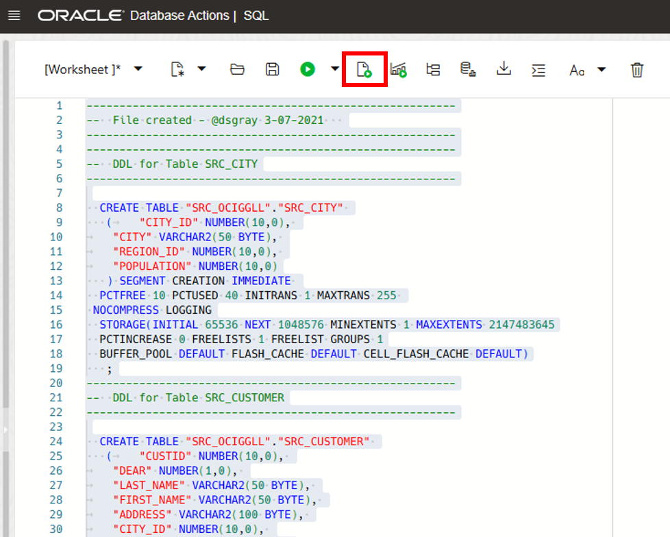
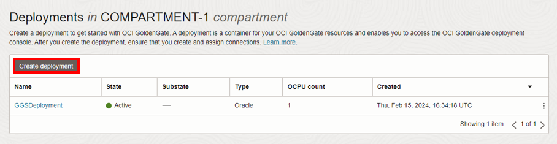
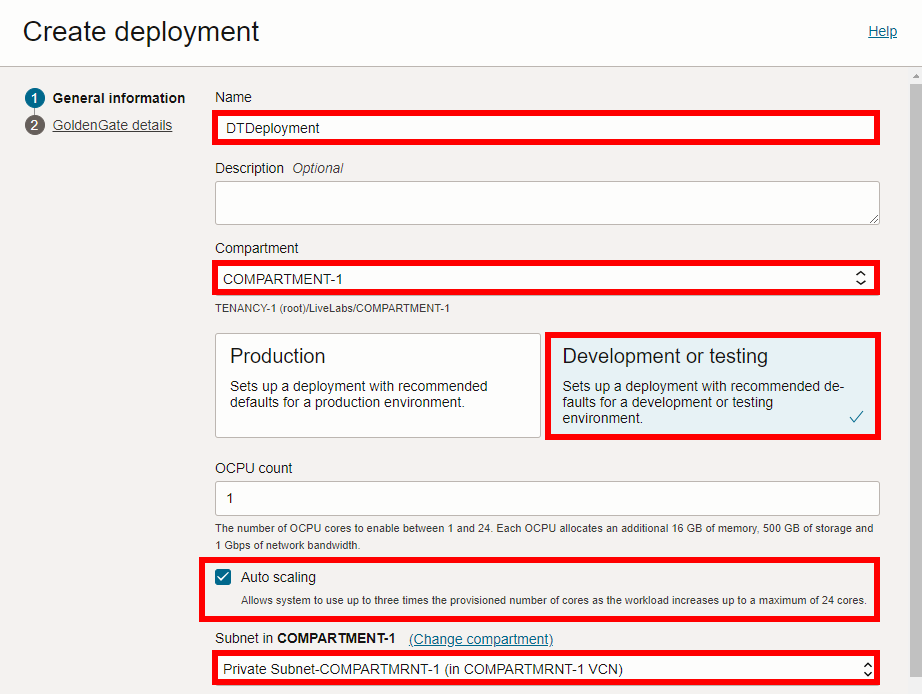
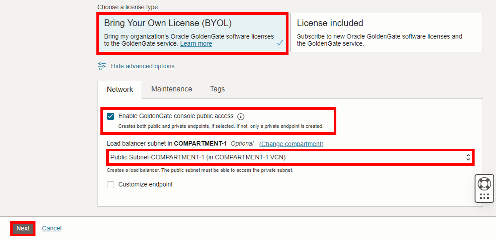
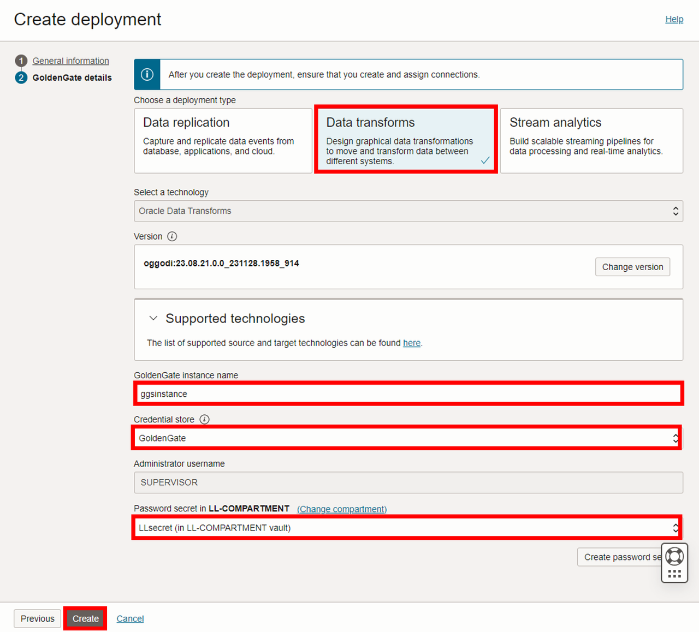

# Set up the environment

## Introduction

In this lab, you learn to create the required resources you'll use for Oracle Cloud Infrastructure (OCI) GoldenGate. We'll show you how to create a VCN and subnet, provision autonomous database instances, and load data into the databases.

Estimated time: 20 minutes

### Objectives

-  Provision a VCN and subnet
-  Provision, connect, and load data into an Autonomous Transaction Processing (ATP) instance
-  Provision, connect, and load data into an Autonomous Data Warehouse (ADW) instance
-  Create deployments

### Prerequisites

To successfully complete this lab, you must:
* Have completed the Get Started lab and sign up for Free Tier/Log in to Oracle Cloud.
* For IAM-enabled tenancies, ensure that you [configure Identity domains for OCI GoldenGate](https://docs.oracle.com/en/cloud/paas/goldengate-service/mkmbs/#GUID-DD9C1BF8-69FE-4C9A-A2D1-74C73550ED65).
* For non-IAM enabled tenancies, and for Data Transforms, ensure that you first [set up your Vault](https://docs.oracle.com/en-us/iaas/Content/KeyManagement/Tasks/managingvaults_topic-To_create_a_new_vault.htm#createnewvault). [Learn more about Vault service](https://docs.oracle.com/en-us/iaas/Content/KeyManagement/Concepts/keyoverview.htm).
* If you enable public deployment console access when creating the deployment, OCI GoldenGate creates a load balancer in your tenancy VCN on your behalf. To ensure successful creation of the deployment and load balancer, you must have the appropriate policies, quotas, and limits in place.

> **Notes:** 

> * You may see differences in account details (eg: Compartment Name is different in different places) as you work through the labs. This is because the workshop was developed using different accounts over time.
> * This workshop was designed to use Oracle Autonomous Databases as the source and target. If you plan to use Oracle Database, ensure that you use the CDB user to capture data from the PDBs.

## Task 1: Create a VCN and subnet

[](include:01-create-vcn-subnet.md)

## Task 2: Create an ATP instance

[](include:02-create-atp-instance.md)

## Task 3: Load the ATP schema and enable supplemental logging

1.  Download the database schema:

    [scripts.zip](https://c4u04.objectstorage.us-ashburn-1.oci.customer-oci.com/p/EcTjWk2IuZPZeNnD_fYMcgUhdNDIDA6rt9gaFj_WZMiL7VvxPBNMY60837hu5hga/n/c4u04/b/livelabsfiles/o/goldengate-library/scripts.zip)

2.  Save `scripts.zip` to a download directory, and then unzip the file.

3.  Back in the Oracle Cloud console, select your ATP instance from the Autonomous Databases page to view its details and access tools.

    

4.  On the SourceATP Database Details page, click **Database actions**, and then select **SQL** from the dropdown. If the Database actions menu takes too long to load, you can click **View all database actions** directly, and then select **SQL** from the Database actions page.

    

5.  If prompted, log in with the ADMIN user and password provided when you created the ATP instance.

    

6.  (Optional) Close the Help dialog.

7.  Copy and paste the SQL script from **OCIGGLL\_OCIGGS\_SETUP\_USERS\_ATP.sql** into the SQL Worksheet

8.  Click **Run Script**. The Script Output tab displays confirmation messages.

    

9. Copy and paste the SQL script from **OCIGGLL\_OCIGGS\_SRC\_USER\_SEED\_DATA.sql** a new SQL Worksheet.

    

10. Click **Run Script**. The Script Output tab displays confirmation messages.

	> **Note:** If you find that running the entire script does not create the tables, then try running each table creation and insert statements one at a time until all the tables are created. You may also need to relaunch SQL to continue running the scripts until all tables are created and populated.

11. Close the SQL window and then reopen it from Database Actions again.

12. In the Navigator tab, look for the SRC\_OCIGGLL schema and then select tables from their respective dropdowns to verify the schema and tables were created. You may need to log out and log back in if you can't locate SRC\_OCIGGLL.

    

13. To enable supplemental logging, run the following command:

    ```
    <copy>ALTER PLUGGABLE DATABASE ADD SUPPLEMENTAL LOG DATA;</copy>
    ```

## Task 4: Create an ADW instance and user 

[](include:04-create-adw-instance.md)

12. On the TargetADW Database Details page, click **Database actions**, and then select **SQL** from the dropdown. If the Database actions menu takes too long to load, you can click **View all database actions**, and then select **SQL** from the Database actions page. 

13. If prompted, log in using the ADMIN username and password set in step 7.

14. Copy and paste the script from **OCIGGLL\_OCIGGS\_SETUP\_USERS\_ADW.sql** into the SQL worksheet, and then click **Run Script**.

	

15. Log out of Database actions.

## Task 5: Create a data replication deployment

[](include:05-create-deployment.md)

## Task 6: Create a data transforms deployment

> **Note:** Compartment names in the screenshots may differ from values that appear in your environment.

1.  Use the breadcrumb to navigate back to the **Deployments** page.

2.  On the Deployments page, click **Create deployment**.

    

3.  In the Create Deployment panel, enter **DTDeployment** for Name.

4.  From the Compartment dropdown, select **&lt;USER&gt;-COMPARTMENT**.

5.  Select **Development or testing**. The OCPU count is autopopulated based on your selection.

6. Select **Auto scaling**.

7.  For Subnet, select a subnet. If you're using the workshop environment, select **&lt;USER&gt;-SUBNET-PRIVATE**.

    

8.  For License type, select **Bring Your Own License (BYOL)**.

9. Click **Show advanced options**, and then select **Enable GoldenGate console public access**.

10. For Load balancer subnet, select a subnet. If you're using the workshop environment, select **&lt;USER&gt;-SUBNET-PUBLIC**.

11. Click **Next**.

    

12. For Select a deployment type, select **Data transforms**.

13. For Select a technology dropdown, select **Oracle Data Transforms**.

14. For GoldenGate Instance Name, enter **ggsinstance**.

15. For Administrator Username, enter **SUPERVISOR**.

16. For Password secret in &lt;USER&gt;-COMPARTMENT, select a password from the dropdown.

17. Click **Create**.

    

You're brought to the Deployment Details page. It takes a few minutes for the deployment to be created. Its status changes from CREATING to ACTIVE when it's ready for you to use. You can continue with Lab 2 while you wait for the deployment creation to complete.

You may now **proceed to the next lab.**

## Acknowledgements

- **Author** - Katherine Wardhana, User Assistance Developer
* **Contributors** -  Jenny Chan, Consulting User Assistance Developer, Database 
- **Last Updated by** - Katherine Wardhana, February 2025
- **PAR Expiration date** - February 2030
