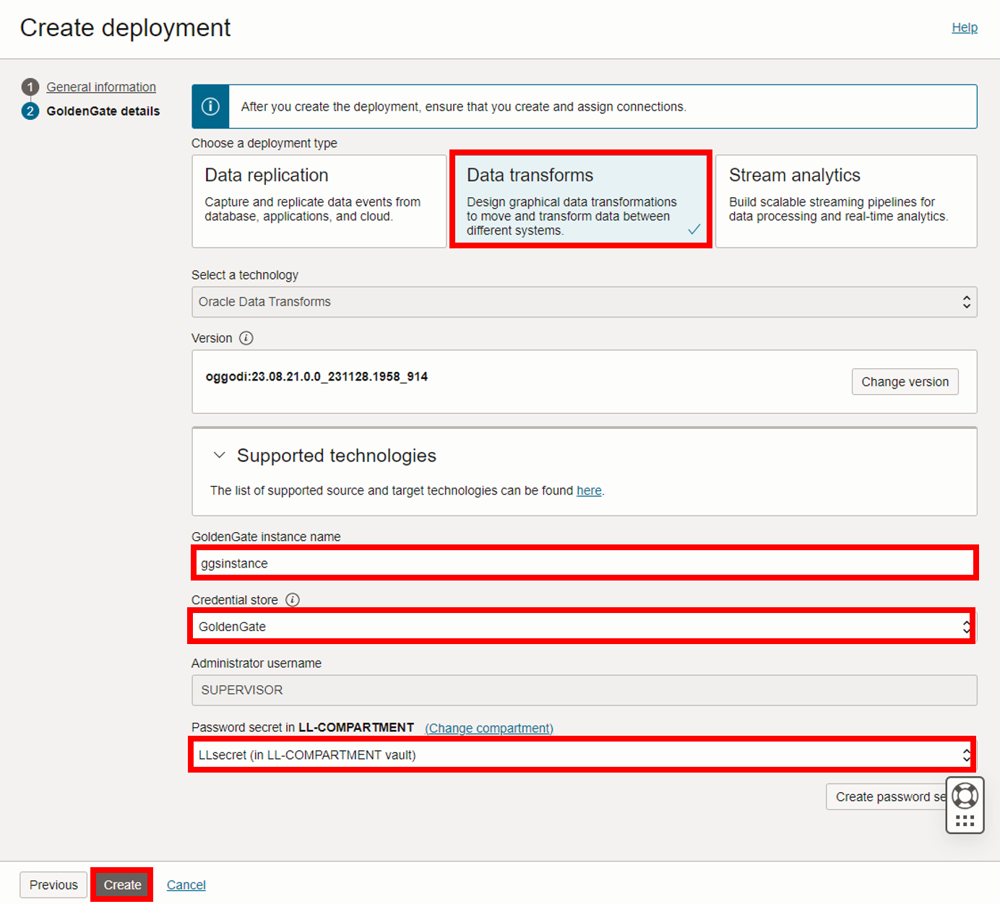
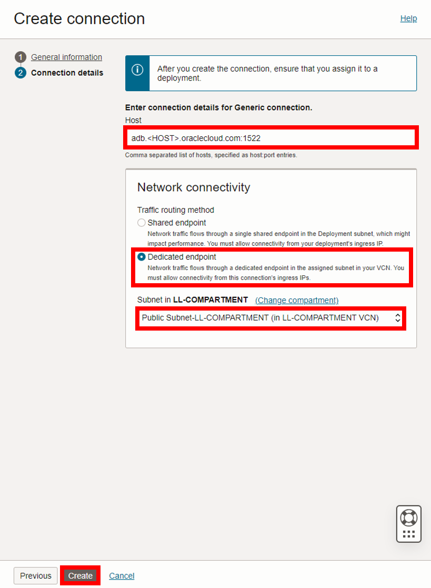
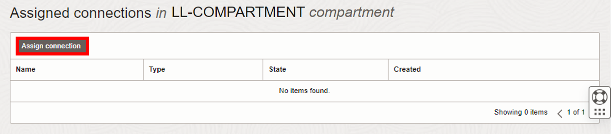
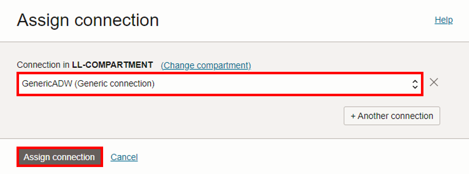
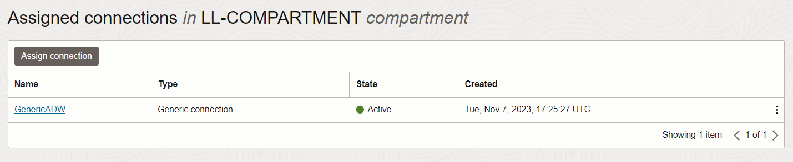

# Create the Data Transforms resources

## Introduction

In this lab, you learn to create a Data Transforms deployment and a generic connection.

Estimated time: 20 minutes

### About Data Transforms deployments and generic connection 

A Data Transforms deployment manages the resources it requires to function. The Data Transforms deployment also lets you access the Data Transforms deployment console, where you can create data loads, data flows, and workflows to move and transform data between systems.

Connections help you to connect Data Transforms to various technologies reachable from your OCI network.

### Objectives

In this lab, you will:
* Locate Oracle Cloud Infrastructure GoldenGate in the Console
* Create a Data Transforms deployment
* Create a generic connection

## Task 1: Create a Data transforms deployment

> **Note:** Compartment names in the screenshots may differ from values that appear in your environment.

1.  Use the Oracle Cloud Console navigation menu to navigate back to **GoldenGate**.

2.  On the Deployments page, click **Create deployment**.

    

3.  In the Create Deployment panel, enter **DTDeployment** for Name.

4.  From the Compartment dropdown, select **&lt;USER&gt;-COMPARTMENT**.

5.  Select **Development or testing**. The OCPU count is autopopulated based on your selection.

6. Select **Auto scaling**.

7.  For Subnet, select a subnet. If you're using the workshop environment, select **&lt;USER&gt;-SUBNET-PRIVATE**.

    

8.  For License type, select **Bring Your Own License (BYOL)**.

9. Click **Show advanced options**, and then select **Enable GoldenGate console public access**.

10. For Load balancer subnet, select a subnet. If you're using the workshop environment, select **&lt;USER&gt;-SUBNET-PUBLIC**.

11. Click **Next**.

    

12. For Select a deployment type, select **Data transforms**.

13. For Select a technology dropdown, select **Oracle Data Transforms**.

14. For GoldenGate Instance Name, enter **ggsinstance**.

15. In an IAM-enabled tenancy, select a Credential store. 

    * If you select **OCI Identity and Access Management (OCI IAM)**, click **Create**, and then proceed to the next lab (skip the following steps).
    * If you select GoldenGate, complete the following steps.

16. For Administrator Username, enter **SUPERVISOR**.

17. For Password secret in &lt;USER&gt;-COMPARTMENT, select a password from the dropdown.

18. Click **Create**.

    

You're brought to the Deployment Details page. It takes a few minutes for the deployment to be created. Its status changes from CREATING to ACTIVE when it's ready for you to use. You can continue with Task 2 while you wait for the deployment creation to complete.

## Task 2: Create the Generic connection

Follow the steps below to connect the target Generic connection to Autonomous Data Warehouse (ADW).

1.  Use the Oracle Cloud Console navigation menu to navigate back to **GoldenGate**.

2.  Click **Connections** and then **Create Connection**.

    

3.  The Create connection panel consists of two pages. On the General information page, for Name, enter **GenericADW** and optionally, a description.

4.  From the **Compartment** dropdown, select a compartment.

5.  From the a Type dropdown, select **Generic connection**.

    

6.  Click **Next**.

7. On the Connection details page, under Host, enter **adb.&lt;host&gt;.oraclecloud.com:1522**.

8. For Traffic routing method, select **Dedicated endpoint**.

9. Under Network connectivity, for Subnet, select a subnet. If you're using the workshop environment, select **&lt;USER&gt;-SUBNET-PRIVATE**.

10. Click **Create**.

    

    The connection becomes Active after a few minutes.

## Task 3: Assign the connection to the deployment

After the deployment becomes Active, you can assign connections on the deployment details page.

1. Click **Assigned connections**.

    

2. Click **Assign connection**.

    

3. In the Assign connection dialog, from the Connection in &lt;compartment-number&gt;-COMPARTMENT dropdown, select **SourceATP**. Click **Assign connection**.

     

     

You may now **proceed to the next lab.**

## Learn more

* [Managing deployments](https://docs.oracle.com/en/cloud/paas/goldengate-service/ebbpf/index.html)
* [Managing connections](https://docs.oracle.com/en/cloud/paas/goldengate-service/mcjzr/index.html)

## Acknowledgements
* **Author** - Katherine Wardhana, User Assistance Developer
* **Contributors** -  Jenny Chan, Consulting User Assistance Developer, Database User Assistance; Julien Testut, Database Product Management
* **Last Updated By/Date** - Katherine Wardhana, March 2024