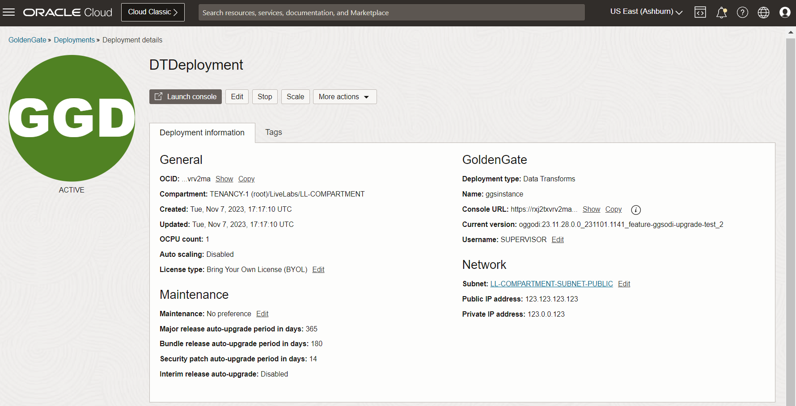

# Create the Data Transforms resources

## Introduction

In this lab, you learn to create an Oracle Cloud Infrastructure (OCI) GoldenGate deployment.

Estimated time: 20 minutes

Watch the video below for a quick walk through of the lab.
[Watch the video](videohub:1_hz7gsiin)

### About Oracle Cloud Infrastructure GoldenGate deployments and connections

A Oracle Cloud Infrastructure GoldenGate deployment manages the resources it requires to function. The GoldenGate deployment also lets you access the GoldenGate deployment console, where you can access the OCI GoldenGate deployment console to create and manage processes such as Extracts and Replicats.

Connections store the source and target credential information for OCI GoldenGate. A connection also enables networking between the Oracle Cloud Infrastructure (OCI) GoldenGate service tenancy virtual cloud network (VCN) and your tenancy VCN using a private endpoint.

### Objectives

In this lab, you will:
* Locate Oracle Cloud Infrastructure GoldenGate in the Console
* Create a OCI GoldenGate deployment
* Create the source and target connections

## Task 1: Create a Data transforms deployment

> **Note:** Compartment names in the screenshots may differ from values that appear in your environment.

1.  In the Oracle Cloud console, open the **navigation menu**, navigate to **Oracle Database**, and then select **GoldenGate**.

    

2.  On the GoldenGate **Overview** page, click **Deployments**.

    

3.  You may need to select a compartment. Under List Scope, from the Compartment dropdown, expand the root compartment, and then select the compartment associated with your username. For example, if your LiveLab username is LL1234-user, expand root, expand LiveLabs, and then select the compartment **LL1234-COMPARTMENT**.

    > **Tip:** You can find your Username in the Workshop instruction's **View Login Info**.

4.  On the Deployments page, click **Create deployment**.

    

5.  In the Create Deployment panel, enter **DTDeployment** for Name.

6.  From the Compartment dropdown, select **&lt;USER&gt;-COMPARTMENT**.

7.  Select **Development or testing**. The OCPU count is autopopulated based on your selection.

8.  For Subnet, select a subnet. If you're using the workshop environment, select **&lt;USER&gt;-SUBNET-PRIVATE**.

    

9.  For License type, select **Bring Your Own License (BYOL)**.

10. Click **Show advanced options**, and then select **Enable GoldenGate console public access**.

11. For Load balancer subnet, select a subnet. If you're using the workshop environment, select **&lt;USER&gt;-SUBNET-PUBLIC**.

12. Click **Next**.

    

13. For Select a deployment type, select **Data transforms**.

14. For Select a technology dropdown, select **Oracle Data Transforms**.

15. For GoldenGate Instance Name, enter **ggsinstance**.

16. In an IAM-enabled tenancy, select a Credential store. 

    * If you select **OCI Identity and Access Management (OCI IAM)**, click **Create**, and then proceed to the next lab (skip the following steps).
    * If you select GoldenGate, complete the following steps.

17. For Administrator Username, enter **SUPERVISOR**.

18. For Password secret in &lt;USER&gt;-COMPARTMENT, select a password from the dropdown.

19. Click **Create**.

    

You're brought to the Deployment Details page. It takes a few minutes for the deployment to be created. Its status changes from CREATING to ACTIVE when it's ready for you to use. You can continue with Task 2 while you wait for the deployment creation to complete.

## Task 2: Create the Generic connection

Follow the steps below to connect the target Autonomous Data Warehouse \(ADW\) instance.

1.  Use the Oracle Cloud Console navigation menu to navigate back to **GoldenGate**.

2.  Click **Connections** and then **Create Connection**.

    

3.  The Create connection panel consists of two pages. On the General information page, for Name, enter **GenericADW** and optionally, a description.

4.  From the **Compartment** dropdown, select a compartment.

5.  From the a Type dropdown, select **Generic connection**.

    

6.  Click **Next**.

7. On the Connection details page, under Host, enter **adb.&lt;host&gt;.oraclecloud.com:1522**.

8. For Traffic routing method, select **Dedicated endpoint**.

9. Under Network connectivity, for Subnet, select a subnet. If you're using the workshop environment, select **&lt;USER&gt;-SUBNET-PRIVATE**.

10. Click **Create**.

    

    The connection becomes Active after a few minutes.

## Task 3: Review the deployment details

After the deployment is created and active, you can perform the following actions on the deployment details page:

* Review the deployment's status
* Launch the GoldenGate service deployment console
* Edit the deployment's name or description
* Stop and start the deployment
* Move the deployment to a different compartment
* Review the deployment resource information
* Add tags

    

## Task 4: Assign the connection to the deployment

1. Click **Assigned connections**.

    

2. Click **Assign connection**.

    

3. In the Assign connection dialog, from the Connection in &lt;compartment-number&gt;-COMPARTMENT dropdown, select **SourceATP**. Click **Assign connection**.

     

     

You may now **proceed to the next lab.**

## Learn more

* [Managing deployments](https://docs.oracle.com/en/cloud/paas/goldengate-service/ebbpf/index.html)
* [Managing connections](https://docs.oracle.com/en/cloud/paas/goldengate-service/mcjzr/index.html)

## Acknowledgements
* **Author** - Katherine Wardhana, User Assistance Developer
* **Contributors** -  Jenny Chan, Consulting User Assistance Developer, Database User Assistance; Julien Testut, Database Product Management
* **Last Updated By/Date** - Katherine Wardhana, February 2024