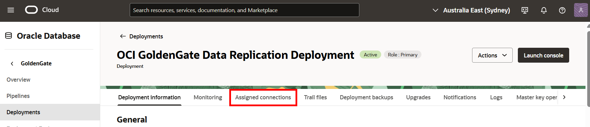
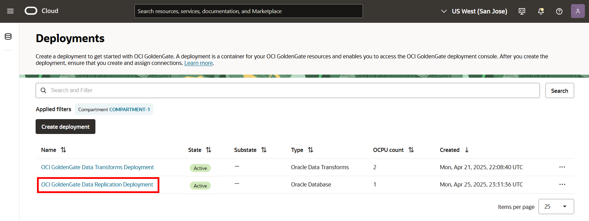

# Create the Oracle Cloud Infrastructure GoldenGate resources

## Introduction

In this lab, you learn to create an Oracle Cloud Infrastructure (OCI) GoldenGate deployment.

Estimated time: 20 minutes

### About Oracle Cloud Infrastructure GoldenGate Deployments and Connections

A Oracle Cloud Infrastructure GoldenGate deployment manages the resources it requires to function. The GoldenGate deployment also lets you access the GoldenGate deployment console, where you can access the OCI GoldenGate deployment console to create and manage processes such as Extracts and Replicats.

Connections capture source and target credential information. A connection also enables networking between the Oracle Cloud Infrastructure (OCI) GoldenGate service tenancy virtual cloud network (VCN) and your tenancy VCN using a private endpoint.

### Objectives

In this lab, you will:
* Locate Oracle Cloud Infrastructure GoldenGate in the Console
* Create the source and target connections
* Review the deployment details
* Assign connections to the deployments 

## Task 1: Review the deployment

1. In the Oracle Cloud console, open the **navigation menu**, navigate to **Oracle Database**, and then select **GoldenGate**.

    

2. You may need to select a compartment. Under List Scope, from the Compartment dropdown, expand the root compartment, and then select the compartment.

3. On the GoldenGate **Overview** page, click **Deployment** and then **DTDeployment**.

    

You can perform the following actions on the deployment details page:

* Review the deployment's status
* Launch the GoldenGate service deployment console
* Edit the deployment's name or description
* Stop and start the deployment
* Move the deployment to a different compartment
* Review the deployment resource information
* Add tags

    

## Task 2: Create the source connection

1. Use the Oracle Cloud Console breadcrumb to navigate back to the Deployments page.

    

2.  Click **Connections** and then click **Create Connection**.

    

3.  The Create connection panel consists of two pages. On the General information page, for Name, enter **SourceATP** and optionally, a description.

4.  From the Compartment dropdown, select **&lt;USER&gt;-COMPARTMENT**.

5.  From the a Type dropdown, select **Oracle Autonomous Database**.

6.  Click **Next**.

    

7. On the Connection details page, under Database details, select **Select database**.

8.  For **Database in &lt;compartment-name&gt;**, select **SourceATP-&lt;numbers&gt;** from the dropdown. 

9.  For Database username, enter `ggadmin`.

10.  Enter the database's password in the Password field. Take note of the password.

    > **NOTE:** This password will be used to unlock `GGADMIN` in a later task.

11. For Traffic routing method, select **Shared endpoint**.

12. Click **Create**.

    

    The connection becomes Active after a few minutes. You can proceed with the next task while service creates the connection.

## Task 3: Unlock the GGADMIN user and enable supplemental logging for the source database

## Task 4: Create the target connection and unlock the GGADMIN user

## Task 5: Assign connections to the deployment

1. Use the Oracle Cloud Console breadcrumb to navigate back to the Connections page.

    

2. Click **Deployments**, and then select the **GGSDeployment**.

    

3. On the deployment details page, under the Resources menu, click **Assigned connections**.

    

4. The two connections should now appear in the Assigned connections list. Click **Assign connection**.

    

5. In the Assign connection dialog, from the Connection compartment dropdown, select **SourceATP**. Click **+ Another connection**, and then select **TargetADW** from the dropdown. Click **Assign connection**.

    

6. Click **Close**.

    

    

You may now **proceed to the next lab.**

## Learn more

* [Managing deployments](https://docs.oracle.com/en/cloud/paas/goldengate-service/ebbpf/index.html)
* [Managing connections](https://docs.oracle.com/en/cloud/paas/goldengate-service/mcjzr/index.html)

## Acknowledgements
* **Author** - Katherine Wardhana, User Assistance Developer
* **Contributors** -  Jenny Chan, Consulting User Assistance Developer, Database User Assistance; Julien Testut, Database Product Management
* **Last Updated By/Date** - Katherine Wardhana, April 2024
