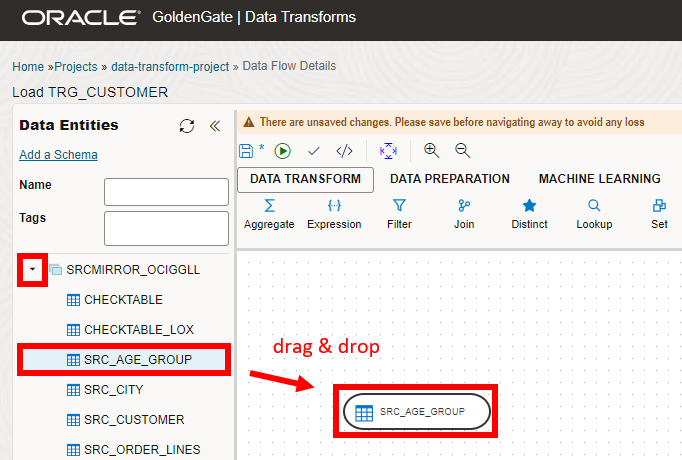
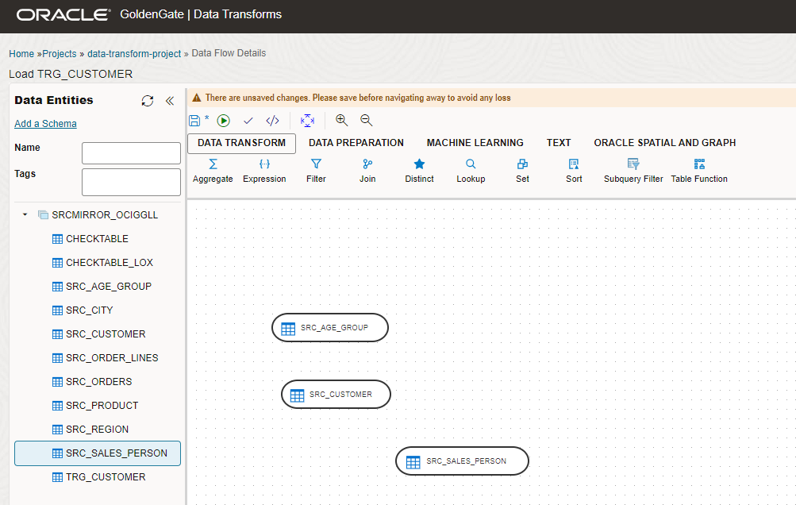
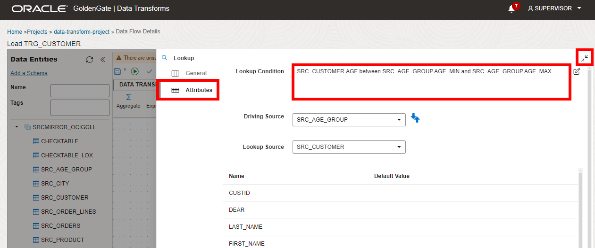
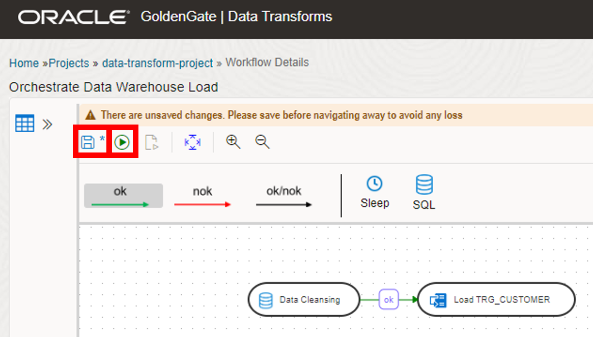

# Create and run a workflow

## Introduction

In this lab, you learn to create Purge Tasks in the Oracle Cloud Infrastructure (OCI) GoldenGate Deployment Console. Completion of this lab is optional.

Estimated time: 20 minutes

Watch the video below for a quick walk through of the lab.
[Watch the video](videohub:1_ni87slbs)

### About Purge Tasks

Purge Tasks help you to manage unused Trail files in your deployment. Trail files can add up over time and hinder the performance of your deployment.

### Objectives

In this lab, you will create and run a Purge task.

### Prerequisites

This lab assumes you completed all preceding labs.

## Task 1: Launch the Data transforms Deployment Console

1.  When the deployment is active, click **Launch Console**.

    

2.  To log in to the Data transforms deployment console, enter **SUPERVISOR** for User name and the password you provided in the previous Lab, and then click **Connect**.

    

After you log in successfully, you're brought to the Oracle Data Transforms home page. 

## Task 2: Create ADW Connection

1.  Open the navigation menu, click **Connections**, and then click **Create Connection**.

    

2.  The Create connection panel consists of two pages. On the Select Type page, under Databases select **Oracle**, and then click **Next**.

    

3.  On the Connection details page, under Database details, for Name, enter **ADW_IAD**.

4. Select **Use Credential File**.

5. For Wallet File, drag and drop your wallet file. 

> **Note:** To download your ADW wallet file, click Database Connection on the ADW details page.

6. From the Services dropdown, select **&lt;name&gt;\_low**.

7. For User, enter **GGADMIN**.

8. For Password, enter a password. The password must be the same as your ADW password.

9. Click **Create**.

    

## Task 3: Import Data Entities

1.  Open the navigation menu, click **Data Entities**, and then click **Import Data Entities**.

    

2.  From the Connection dropdown, select **ADW_IAD**.

3.  From the Schema dropdown, select **SRCMIRROR_OCIGGL**.

4. Click **Start**.

    

## Task 4: Create Project and Data Flow

1.  Open the navigation menu, select **Projects**, and then click **Create Project**.

    

2.  For Name, enter **data-transform-project**. Click **Create**.

    

3.  Select your project name, click **Data Flows** under Resources, and then select **Create Data Flow**.

    

4.  The Create Data Flow dialog appears. On the Create Data Flow page, for Name, enter **Load TRG\_CUSTOMER** and optionally, a description, and then click **Create**.

    

5. An Add a Schema dialog appears. For Connection, select **ADW\_IAD** from the dropdown.

6. For Schema, select **SRCMIRROR\_OCIGGL** from the dropdown.

7. Select **OK**.

    

8. Expand the **SRCMIRROR\_OCIGGL** schema. Drag the **SRC\_AGE\_GROUP** data entity to the design canvas.

    

9. Under the **SRCMIRROR\_OCIGGL** schema, drag the **SRC\_CUSTOMER** data entity to the design canvas.

10. Under the **SRCMIRROR\_OCIGGL** schema, drag the **SRC\_SALES\_PERSON** data entity to the design canvas.

    

11. From the Data Transform toolbar, drag the **Lookup** component to the design canvas.

12. From the Data Transform toolbar, drag the **Join** component to the design canvas.

    

13. Click on the **SRC\_AGE\_GROUP** Connector icon and drag the icon to the **Lookup** component.

14. Click on the **SRC\_CUSTOMER** Connector icon and drag the icon to tje **Lookup** component.

    

15. On the design canvas, click Lookup to open the **Lookup** panel. In the Lookup panel, switch to the **Attributes** tab and then paste the following query into the **Lookup Condition**:

    ```
    <copy>SRC_CUSTOMER.AGE between SRC_AGE_GROUP.AGE_MIN and SRC_AGE_GROUP.AGE_MAX;</copy>
    ```

    Collapse the **Lookup** panel.

    

16. In the Data Entities panel, click on the **SRC\_SALES\_PERSON** Connector icon and drag the icon to the **Join** component.

17. Click on the **Lookup** component icon and drag the icon to the **Join** component.

    

18. On the design canvas, click Join to open the **Join** panel. In the Lookup panel, switch to the **Attributes** tab and then paste the following query into the **Join Condition**:

    ```
    <copy>SRC_CUSTOMER.SALES_PERS_ID=SRC_SALES_PERSON.SALES_PERS_ID;</copy>
    ```

    Collapse the **Lookup** panel.

    

19. In the Data Entities panel, under **SRCMIRROR\_OCIGGLL**, drag the **TRG\_CUSTOMER** data entity to the design canvas.

20. Click on the **Join** Connector icon and drag the icon to the **TRG\_CUSTOMER** data entity.

    

21. On the design canvas, click TRG\_CUSTOMER to open the **TRG\_CUSTOMER** panel. In the TRG_CUSTOMER panel, switch to the **Attributes** tab and enable Key for **CUST\_ID**, and disable Update for **CRE\_DATE** and disable Insert for **UPD\_DATE**. 

    

22. In the navigation menu, click **Column Mapping** and select the edit icon besides the **CUST\_ID** name. In the Expression Editor dialog, under Expression, enter **SRC\_CUSTOMER.CUSTID**. Click **OK**.

    

    


23. For the **DEAR** name, enter **CASE WHEN SRC\_CUSTOMER.DEAR = 0 THEN 'Mr' WHEN SRC\_CUSTOMER.DEAR = 1 THEN 'Mrs' ELSE 'Ms' END** as the expression.

24. For the **CUST\_NAME** name, enter **SRC\_CUSTOMER.FIRST\_NAME || ' ' || UPPER(SRC\_CUSTOMER.LAST\_NAME)** as the expression.

25. For the **SALES\_PERS** name, enter **SRC\_SALES\_PERSON.FIRST\_NAME || ' ' ||UPPER(SRC\_SALES\_PERSON.LAST\_NAME)** as the expression.

26. For the **CRE\_DATE** name, enter **SYSDATE** as the expression.

27. For the **UPD\_DATE** name, enter **SYSDATE** as the expression. Keep the other mappings as-is.

    

28. In the navigation menu, click **Options** and for Mode, select **Incremental Update** from the dropdown.

29. Collapse the **TRG\_CUSTOMER** panel.

    

30. Select **Save Data Flow**.

    

## Task 5: Create Workflow

1.  On the project navigation menu, select **Workflows**, and then click **Create Workflow**.

    

2.  For Name, enter **Orchestrate Data Warehouse Load**. Click **Create**.

    

3.  Drag the SQL icon on the design canvas.

    

4.  Double click the SQL icon in the editor to open the properties page. On the General page, for name, enter **Data Cleansing**.

    

5. Select Attributes, and for Connection select **ADW\_IAD** from the dropdown.

6. For SQL, copy the following query:

    ```
    <copy>delete from SRCMIRROR_OCIGGLL.TRG_CUSTOMER where CITY_ID > 110</copy>
    ```
    

7. Collapse the SQL pop-up.

8. Under Data Flows, drag the Load TRG_CUSTOMER Data Flow to the design canvas.

    

9. Click on the Data Cleansing SQL workflow line and drag the ok (green arrow) icon to the Load TRG_CUSTOMER Data Flow.

    

10. Click Save Workflow, and then click Start Workflow. A pop-up appears. Click **Start**.

    

    

## Task 6: Create and manage Jobs
1.  On the project navigation menu, select **Jobs**, and then select your job.

    

2.  In the Job Details page, you can review the status of the different steps. 

    

## Learn more

* [Manage Trail Files](https://docs.oracle.com/en/cloud/paas/goldengate-service/ntzlj/index.html#articletitle)

## Acknowledgements

* **Author** - Jenny Chan, Consulting User Assistance Developer, Database User Assistance
* **Contributors** -  Denis Gray, Database Product Management, & Katherine Wardhana, User Assistance Developer
* **Last Updated By/Date** - Katherine Wardhana, February 2024
