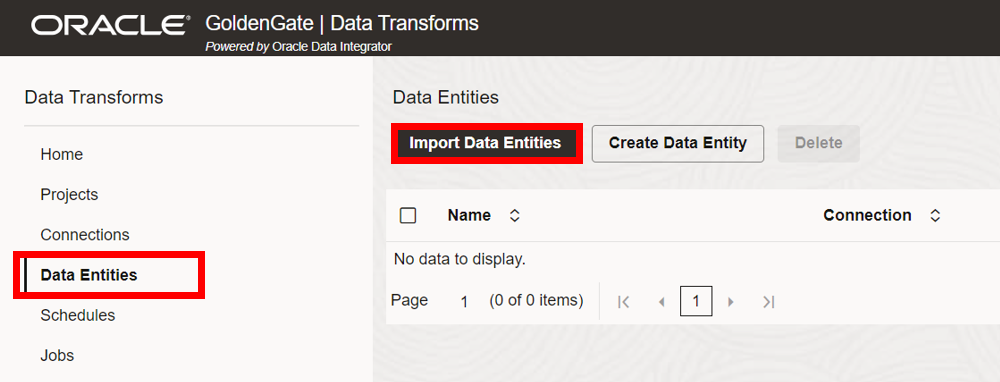
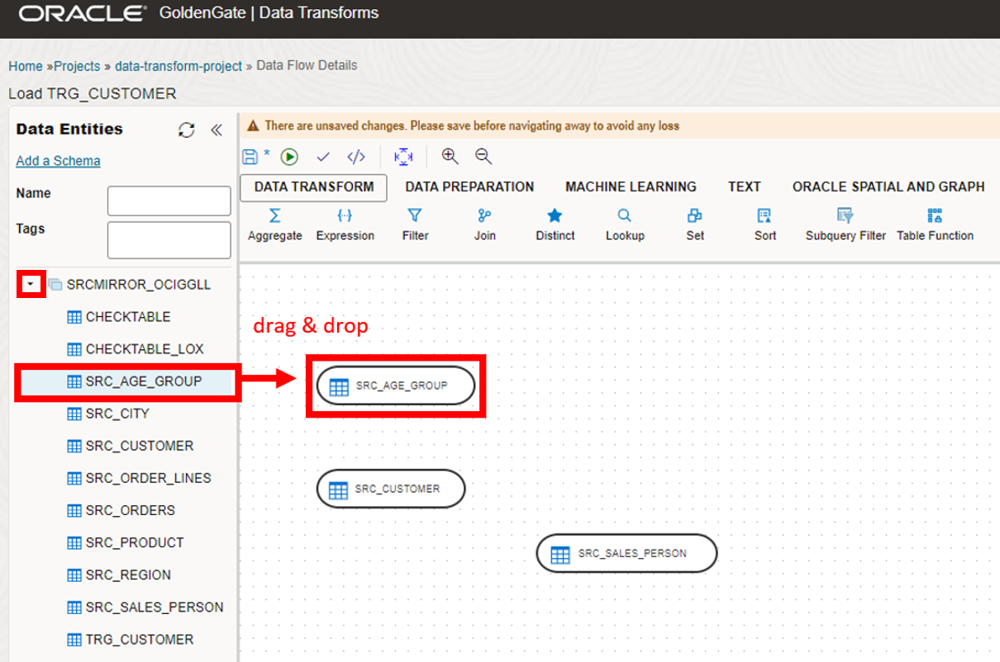
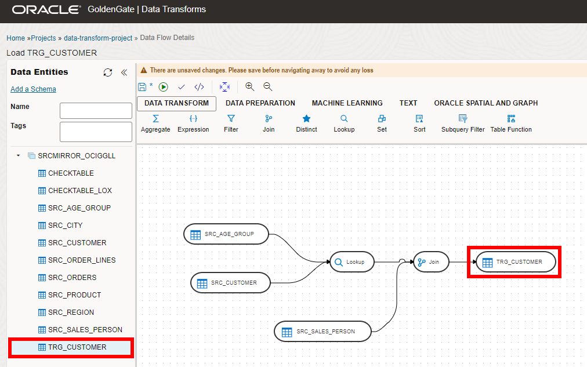

# Create and run a workflow

## Introduction

In this lab, you learn to create and run a workflow on the Data Transforms deployment console. 

Estimated time: 30 minutes

### About Workflows

A workflow is made up of multiple flows organized in a sequence in which they must be executed. Each data flow is executed as a step. You can also add workflows as well as SQL queries as steps within a workflow. When you execute a workflow, a data flow either succeeds or fails. Depending on whether the first data flow succeeds or fails, you can choose the next data flow that must be executed.

### Objectives

In this lab, you will:
* Create an ADW connection in the Data Transforms console
* Import data entities
* Create a project and data flow
* Create a workflow and use the design canvas
* Create and manage jobs

### Prerequisites

This lab assumes you completed all preceding labs.

## Task 1: Launch the Data transforms Deployment Console

1.  On the DTDeployment’s details page, click **Launch Console**.

    

2.  On the Sign in to Oracle Data Transforms page, enter **SUPERVISOR** for User name and the password you provided in the previous Lab, and then click **Connect**.

    

After you log in successfully, you're brought to the Oracle Data Transforms home page. 


## Task 2: Create an ADW Connection

1.  Open the navigation menu, click **Connections**, and then click **Create Connection**.

    

2.  The Create connection panel consists of two pages. On the Select Type page, under Databases select **Oracle**, and then click **Next**.

    

3.  On the Connection details page, under Database details, for **Connection Name**, enter `ADW_IAD`.

4. Under Connection, select **Use Credential File**.

5. For Wallet File, drag and drop your wallet file. 

    > **Note:** To download your ADW wallet file, click **Database Connection** on the ADW details page.

6. From the Services dropdown, select **<name>\_low**.

7. For User, enter **GGADMIN**.

8. For Password, enter a password. The password must be the same as your ADW password, from Lab 2, Task 3, Step 10.

9. Click **Create**.

    

## Task 3: Import Data Entities

1.  Open the navigation menu, click **Data Entities**, and then click **Import Data Entities**.

    

2.  From the Connection dropdown, select **ADW_IAD**.

3.  From the Schema dropdown, select **SRCMIRROR_OCIGGLL**.

4. Click **Start**.

    

## Task 4: Create Project and Data Flow

1.  Open the navigation menu, select **Projects**, and then click **Create Project**.

    

2.  For Name, enter **data-transform-project**. Click **Create**.

    

3.  On the Project Details page, under **Resources**, click **Data Flows**, and then click **Create Data Flow**.

    

4.  In the Create Data Flow dialog, for Name, enter **Load TRG\_CUSTOMER** and optionally, a description, and then click **Create**.

    

5. In the Add a Schema dialog, for Connection select **ADW\_IAD** from the dropdown.

6. For Schema, select **SRCMIRROR\_OCIGGLL** from the dropdown and then select **OK**.

    

7. On the Data Flow Details page, in the Data Entities panel, expand **SRCMIRROR\_OCIGGLL**.

8. Drag and drop the following data entities onto the canvas:
    * SRC\_AGE\_GROUP
    * SRC\_CUSTOMER
    * SRC\_SALES\_PERSON

    

9. From the Data Transform tool bar, drag and drop the following components to the canvas:
    * Join
    * Lookup

    

10. On the design canvas, select **SRC\_AGE\_GROUP**, and then click its connector icon and drag it to the Lookup component.

11. Repeat the previous step to connect  **SRC\_CUSTOMER** to the Lookup component.

    

12. On the design canvas, select **Lookup** to open the Lookup panel. 

13. In the Lookup panel, switch to the **Attributes**, and then paste the following query into the **Lookup Condition**:

    ```
    <copy>SRC_CUSTOMER.AGE between SRC_AGE_GROUP.AGE_MIN and SRC_AGE_GROUP.AGE_MAX;</copy>
    ```

14. Collapse the **Lookup** panel.

   

15. In the Data Entities panel, connect **SRC\_SALES\_PERSON** to the **Join** component.

16. Connect **Lookup** to **Join**.

    

17. Select **Join** to open the Join panel.

18. In the Lookup panel, switch to the **Attributes** tab and then paste the following query into the **Join Condition**:

    ```
    <copy>SRC_CUSTOMER.SALES_PERS_ID=SRC_SALES_PERSON.SALES_PERS_ID;</copy>
    ```

19. Collapse the **Join** panel.

    

20. On the Data Flow Details page, in the Data Entities panel, drag and drop **TRG\_CUSTOMER** onto the design canvas.

21. Connect **Join** to **TRG\_CUSTOMER**.

    

22. Select **TRG\_CUSTOMER** to open the TRG_CUSTOMER panel.

23. In the TRG_CUSTOMER panel, click **Attributes**.

24. On the Attributes screen,
    * For CUST_ID, select **Key**.
    * For CRE_DATE, deselect **Update**.
    * For UPD_DATE, deselect **Insert**.

    

25. Click **Column Mapping**, and then for CUST_ID, click **Edit**.

    

26. In the Expression Editor, enter `SRC_CUSTOMER.CUSTID` in the Expression field, and then click **OK**.

    

27. Repeat steps 25 and 26 for the following columns:
    * For **DEAR**, enter `CASE WHEN SRC_CUSTOMER.DEAR = 0 THEN 'Mr' WHEN SRC_CUSTOMER.DEAR = 1 THEN 'Mrs' ELSE 'Ms' END` into the expression field.
    * For **CUST\_NAME**, enter `SRC_CUSTOMER.FIRST\_NAME || ' ' || UPPER(SRC_CUSTOMER.LAST\_NAME)` into the expression field.
    * For **SALES\_PERS**, enter `SRC_SALES_PERSON.FIRST\_NAME || ' ' ||UPPER(SRC_SALES_PERSON.LAST_NAME)` into the expression field.
    * For **CRE\_DATE** name, enter `SYSDATE` into the expression field.
    * For **UPD\_DATE** name, enter `SYSDATE` into the expression field.

    

28. In the navigation menu, click **Options** and for Mode, select **Incremental Update** from the dropdown.

29. Collapse the **TRG\_CUSTOMER** panel.

    

30. Select **Save Data Flow**.

    

## Task 5: Create Workflow

1.  In the project navigation menu, select **Workflows**, and then click **Create Workflow**.

    

2.  In the Create Workflow dialog, enter **Orchestrate Data Warehouse Load** for Name, and then click **Create**.

    

3.  Drag and drop SQL from the toolbar to the design canvas.

    

4.  Double-click SQL to open its properties. 

5. In the Data Cleansing panel, on the General page, enter **Data Cleansing** for Name.

    

6. Click Attributes, and then select **ADW\_IAD** from the Connection dropdown.

7. For SQL, enter the following query, and then collapse the panel:

    ```
    <copy>delete from SRCMIRROR_OCIGGLL.TRG_CUSTOMER where CITY_ID > 110</copy>
    ```
    

8. On the Workflow Details page, under Data Flows, drag and drop Load TRG_CUSTOMER to the design canvas.

    

9. Click on the Data Cleansing workflow line and drag the ok (green arrow) icon to the Load TRG_CUSTOMER Data Flow.

    

10. Click **Save Workflow**, and then click **Start Workflow**.

    

11. In the Start Workflow dialog, click **Start**.

    

## Task 6: Create and manage Jobs
1.  In the project navigation menu, select **Jobs**, and then select your job from the Jobs list.

    

2.  On the Job Details page, you can review the different steps of the job.

    

## Learn more

* [Oracle Data Transforms](https://docs.oracle.com/en/database/data-integration/data-transforms/index.html)
* [Data Loads](https://docs-uat.us.oracle.com/en/database/data-integration/data-transforms/using/data-loads1.html)
* [Data Entities](https://docs-uat.us.oracle.com/en/database/data-integration/data-transforms/using/data-entities1.html)
* [Projects](https://docs-uat.us.oracle.com/en/database/data-integration/data-transforms/using/projects1.html)
* [Workflows](https://docs-uat.us.oracle.com/en/database/data-integration/data-transforms/using/workflows1.html)
* [Jobs](https://docs-uat.us.oracle.com/en/database/data-integration/data-transforms/using/jobs1.html)

## Acknowledgements

* **Author** - Jenny Chan, Consulting User Assistance Developer, Database User Assistance
* **Contributors** -  Denis Gray, Database Product Management, & Katherine Wardhana, User Assistance Developer
* **Last Updated By/Date** - Katherine Wardhana, February 2024
