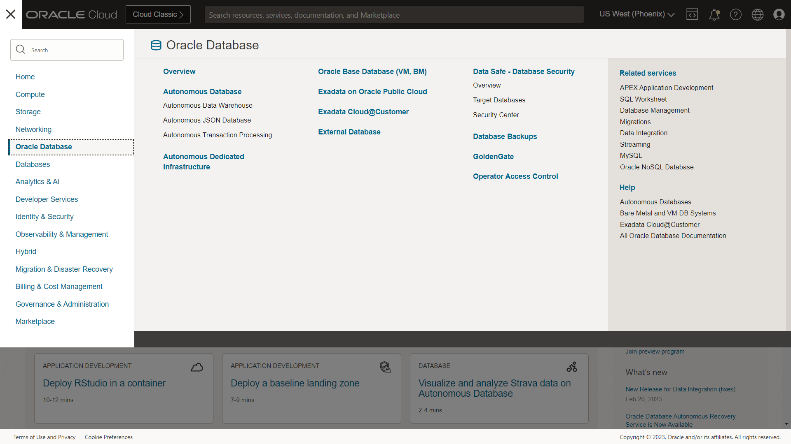
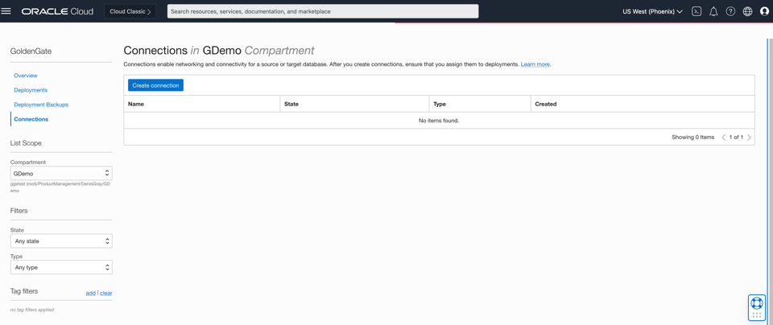
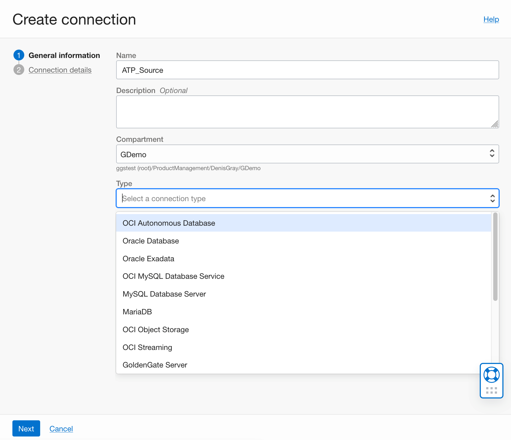
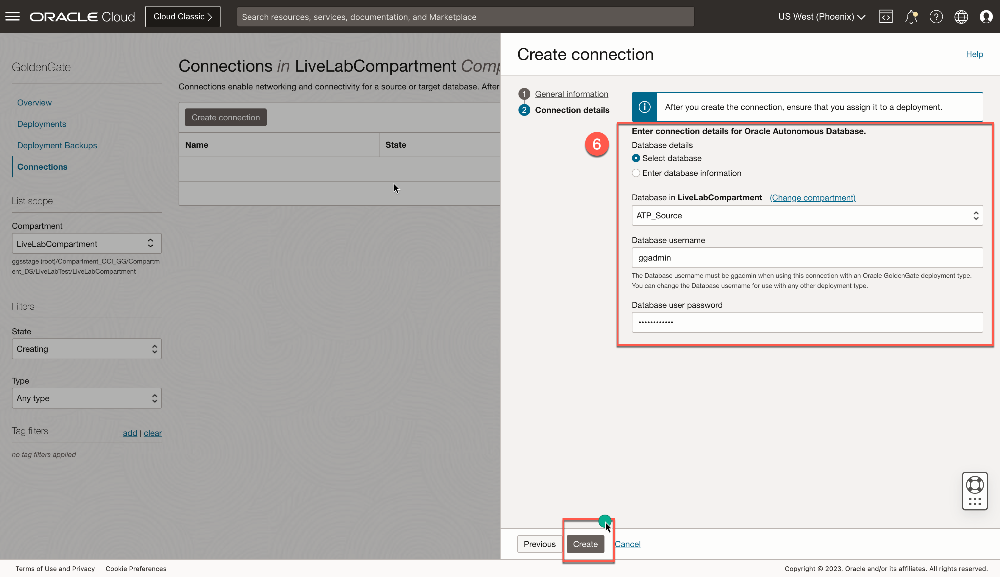
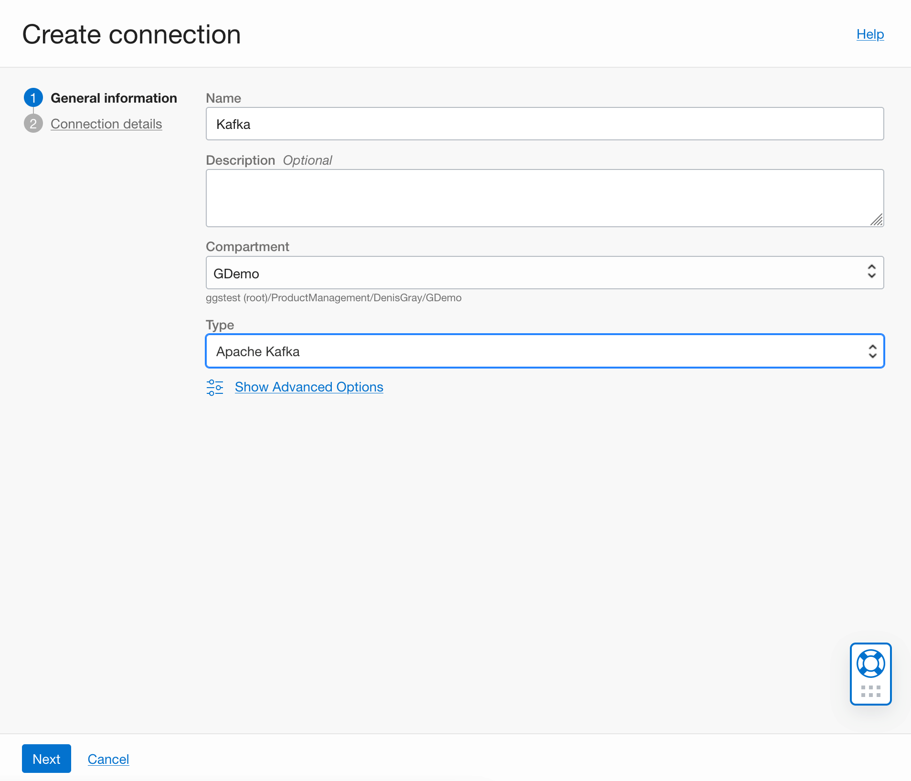
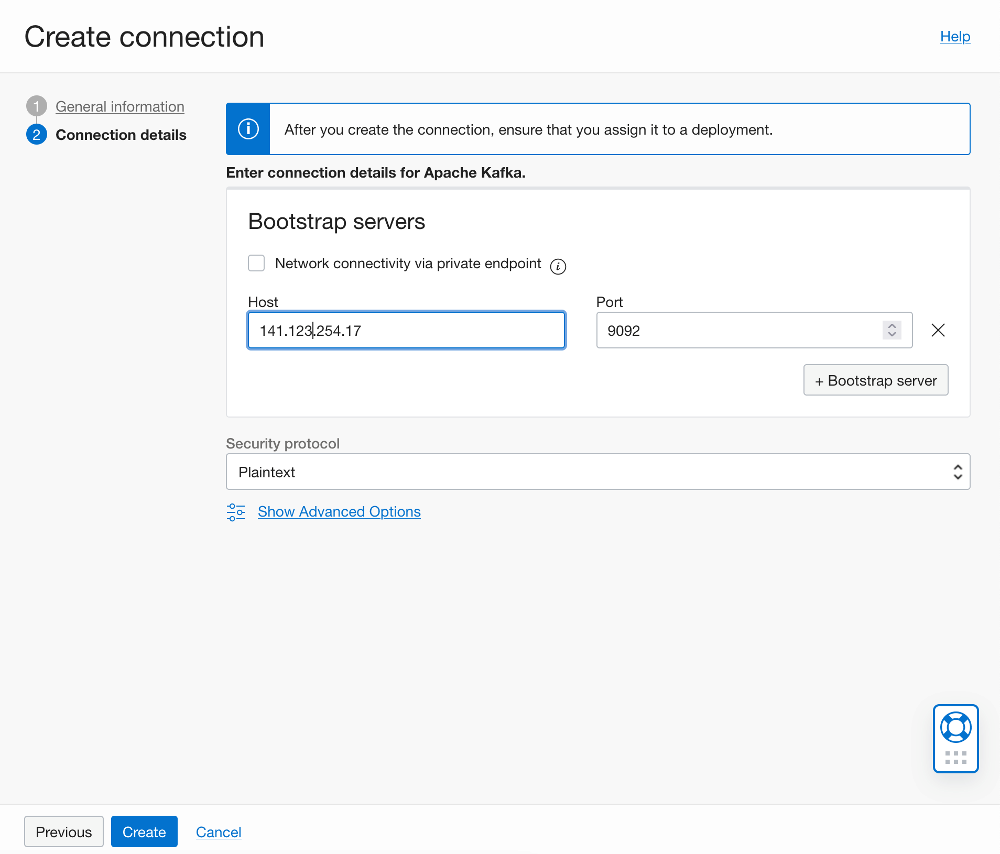
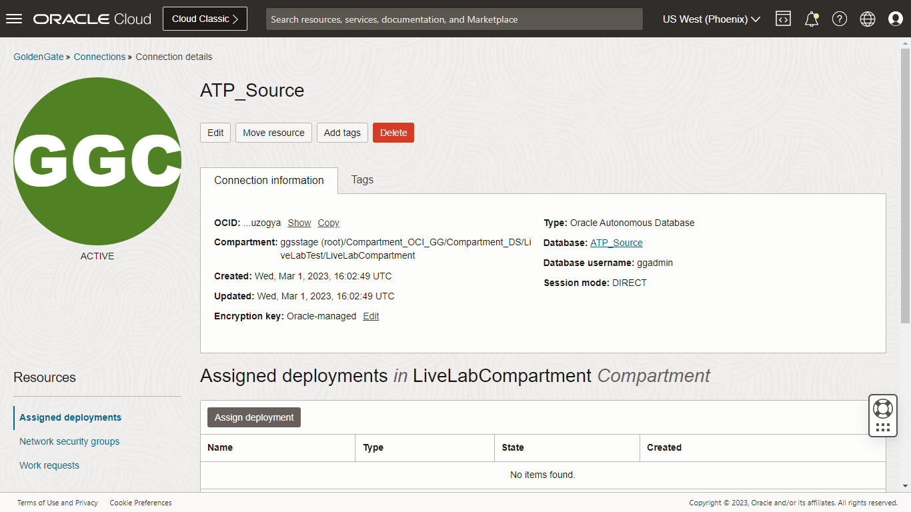
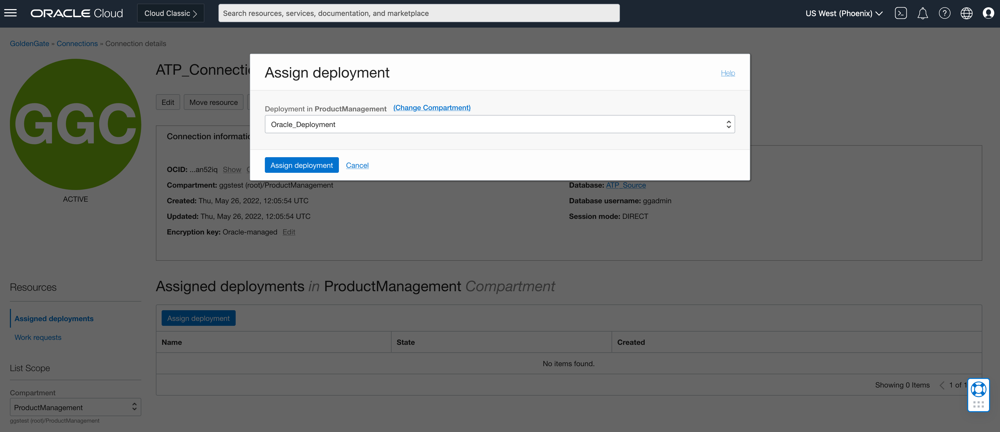
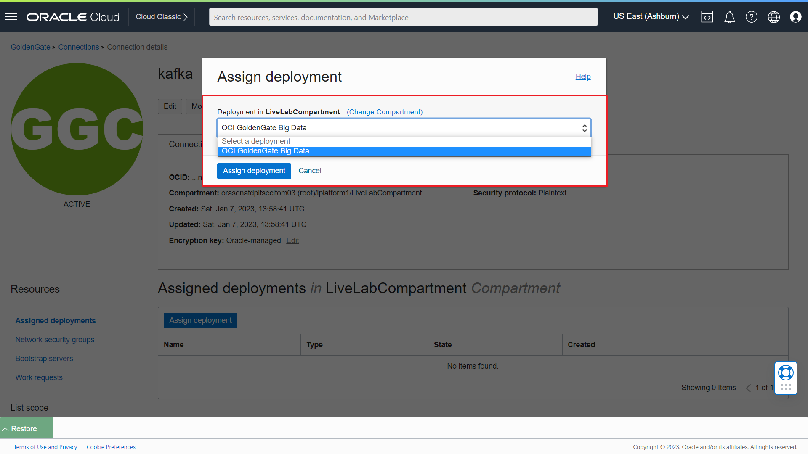
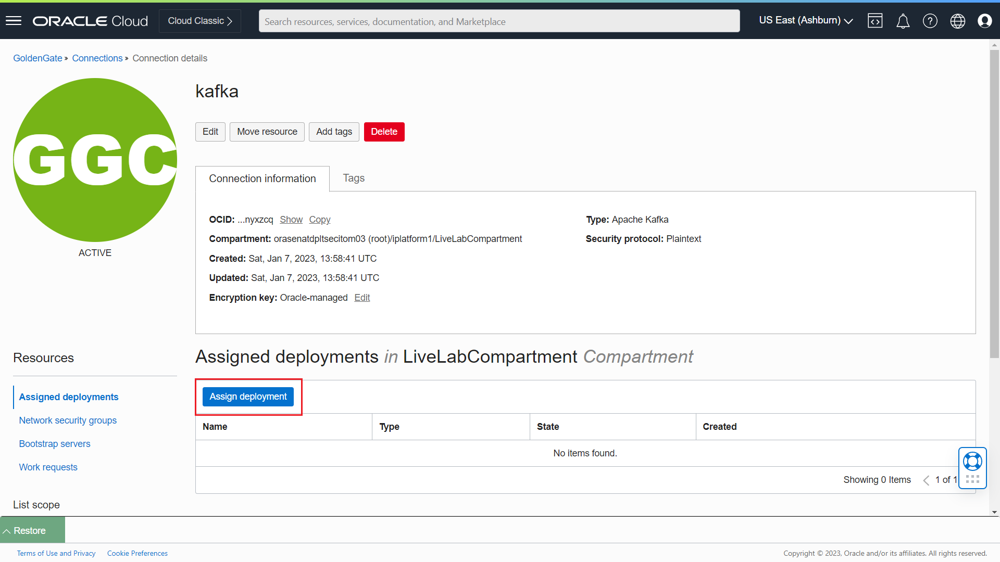

# Create the ATP and Kafka Connection

## Introduction

This lab walks you through the steps to create a connection to ***ATP*** and ***Kafka*** from an Oracle Cloud Infrastructure (OCI) GoldenGate deployment.

Estimated time: 5 minutes

### About Create the ATP and Kafka Connection

You can create and save the database login credentials ,Kafka connectivity ., and assigning the global credentails to appropiate deployments.

### Objectives

In this lab, you will:
* Locate Oracle Cloud Infrastructure GoldenGate in the Console
* Create connection to ATP and Kafka from OCI GOldenGate deployement

### Prerequisites

This lab assumes that you completed all preceding labs.

## Task 1: Create a connection to ATP

First, follow the steps below to create a connection to the source Oracle Autonomous Transaction Processing \(ATP\) Database and target Apache Kafka.

1.  Open the **Navigation Menu**, navigate to **Oracle Database**, and select **GoldenGate**.

    

2.  On the GoldenGate **Connections** page, click **Create connection**.

    

3.  In the Create connection panel, enter **ATP_Source** for Name.

4.  From the Compartment dropdown, select a compartment as **GDemo**.

5.  Select Type as **OCI Autonomous Database** and click Next.
    

6.  On the Create connection **Connection details** page,choose the radio button **Select Database** to select the ATP Database that was created in Lab 1. Provide Database username,password and click Create.
    

## Task 2: Create a connection to Apache Kafka

Follow the steps below to create a connection to the target  Apache Kafka.

1.  Open the **Navigation Menu**, navigate to **Oracle Database**, and select **GoldenGate**.

    

2.  On the GoldenGate **Connections** page, click **Create connection**.

    

3.  In the Create connection panel, enter **Kafka** for Name.

4.  From the Compartment dropdown, select a compartment as **GDemo**.

5.  Select Type as **Apache Kafka** and click Next.
    

6.  On the Create connection **Connection details** page,provide public ip of Boothstrap servers of Kafka OCI Instance that was configured in Lab 1 for **Host**. Port as **9092**. Select Security Protocol as **Plaintext** and click Create.
    

## Task 3: Assign Connections to Deployments
1. Go to Connections and click on **ATP_Connection** that was created in ***Task 1***. Click ***Assign Deployment***.

    
2. Select OCI GoldenGate deployment as ***Oracle_Deployment***  and click **Assign Deployment**.
deployment-oracle-select
    

3.	Go back to **Connections** and click on **Kafka Connection** that was created in the ***Task 2***
kafka-connection
    
4.	Select OCI GoldenGate for Big Data deployment as ***OCIGG_BigData***  and click Assign Deployment.
    
In this lab, you created a connection to source ATP and target Apache Kafka.

## Learn More

* [Manage Deployment users](https://docs.oracle.com/en/cloud/paas/goldengate-service/using/manage-user-accounts.html#GUID-56E2E146-7713-4094-8BEC-7C138064EB21)

## Acknowledgements
* **Author** - Madhu Kumar S, AppDev and Integration, Bangalore Tech Teame
* **Contributors** -  Deniz Sendil, Database Product Management; Jenny Chan, Consulting User Assistance Developer
* **Last Updated By/Date** - 
