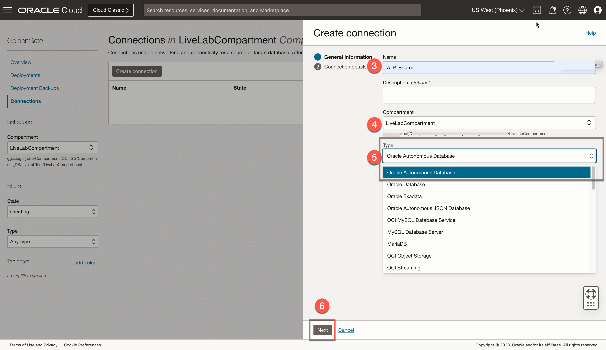
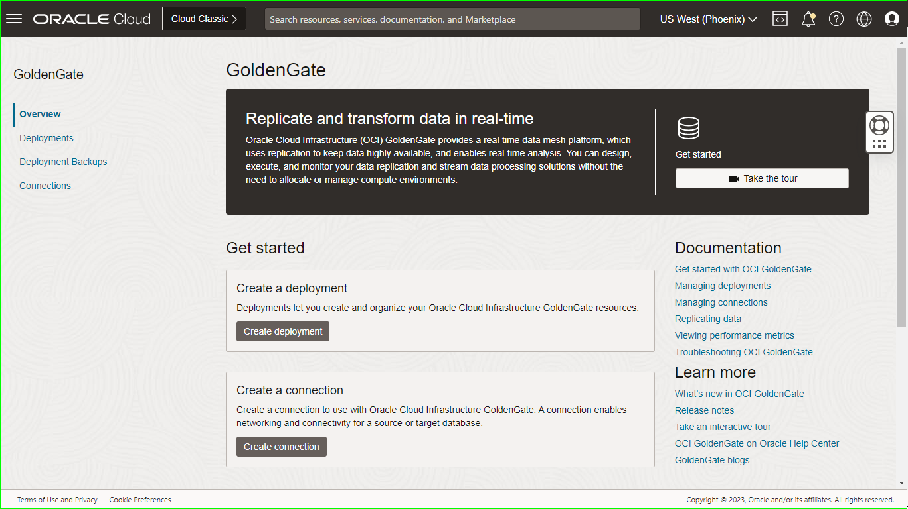
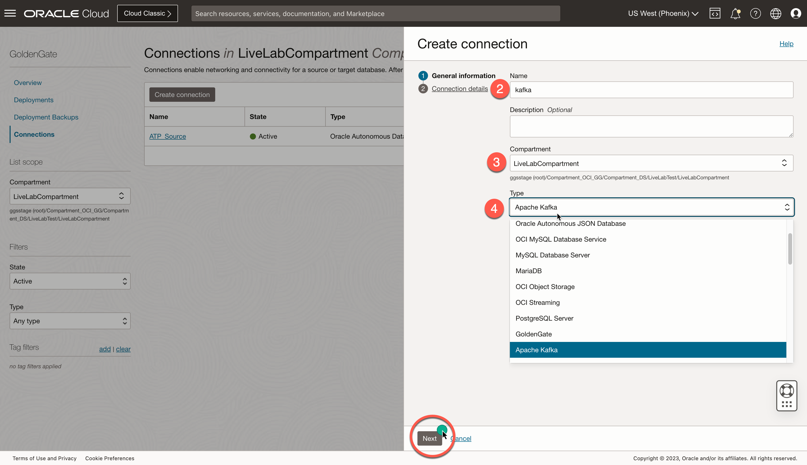
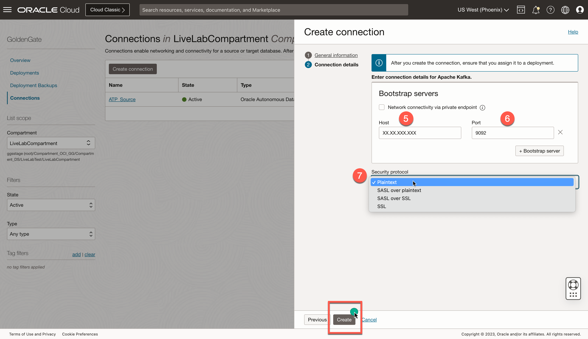
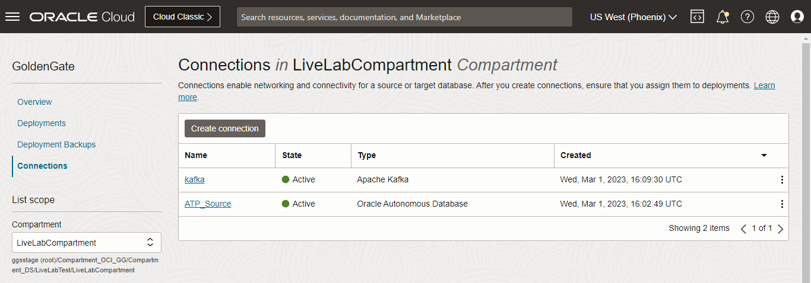

# Create and assign connections

## Introduction

In this lab, you learn to create the Autonomous Transaction Processing (ATP) and Apache Kafka connections and then assign them to OCI GoldenGate deployments.

Estimated time: 5 minutes

### About Creating the ATP and Kafka Connection

Connections store the networking connectivity details for source and target technologies for OCI GoldenGate. Connections must be assigned to deployments to be used in replication processes.

### Objectives

In this lab, you will:
* Create a connection to ATP
* Create a connection to Apache Kafka
* Assign the connections to their respective deployments

### Prerequisites

This lab assumes that you completed all preceding labs.

## Task 1: Create the ATP connection

Follow these steps to create a connection to the source Autonomous Transaction Processing (ATP) database.

1.  Open the **Navigation Menu**, navigate to **Oracle Database**, and select **GoldenGate**.

    

2.  On the GoldenGate **Connections** page, click **Create connection**.

    

3.  In the Create connection panel, enter **ATP_Source** for Name.

4.  From the Compartment dropdown, select **LiveLabCompartment**.

5.  For Type, select **Oracle Autonomous Database** and click **Next**.
    

6.  For Database details, choose **Select database**, and then select the ATP database created in Lab 1. Enter ***ggadmin*** for Database username, and , ***Or4cl3##2023*** for password, and then click  **Create**.
    

## Task 2: Create the Apache Kafka connection

Follow the steps below to create a connection to the target  Apache Kafka.

1.  On back to the GoldenGate **Connections** page, click **Create connection**.

    

2.  In the Create connection panel, enter **kafka** for Name.

3.  From the Compartment dropdown, select **LiveLabCompartment**.

4.  For Type, select **Apache Kafka**, and then click **Next**.
    

5.  For Host, enter the public IP of the Kafka Bootstrap servers configured in Lab 1.

6.  For Port, enter **9092**
    
7.  For Security protocol, select **Plaintext**, and then click **Create**.

## Task 3: Assign connections to deployments

1. On the Connections page, select **ATP_Source**.

    

2. On the Connection details page, under Resources, click **Assigned deployments**, and then click **Assign deployment**.
    

3.	In the Assign deployment dialog, select **SourceDeployment** from the dropdown, and then click **Assign deployment**.
    

4.	Repeat these steps to assign ***OCI GoldenGate Big Data*** to the Kafka connection.

In this lab, you created a connection to source ATP and target Apache Kafka.

You may now **proceed to the next lab**.

## Learn More

* [Manage deployment users](https://docs.oracle.com/en/cloud/paas/goldengate-service/using/manage-user-accounts.html#GUID-56E2E146-7713-4094-8BEC-7C138064EB21)

## Acknowledgements
* **Author** - Madhu Kumar S, Senior Solution Engineer, AppDev and Integration
* **Contributors** -  Denis Sendil, Database Product Management; Jenny Chan, Consulting User Assistance Developer, Database User Assistance
* **Last Updated By/Date** - Madhu Kumar S, Senior Solution Engineer, AppDev and Integration